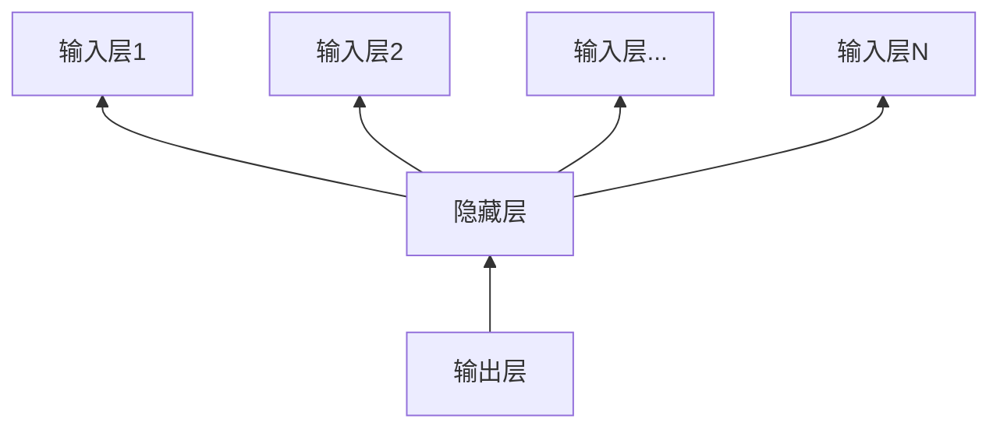

# AI人工智能代理工作流AI Agent WorkFlow：智能代理在人力资源管理系统中的应用

## 1.背景介绍
### 1.1 人工智能在企业管理中的应用现状
近年来,人工智能技术快速发展,在企业管理的各个领域得到了广泛应用。尤其是在人力资源管理方面,AI技术正在深刻改变着传统的管理模式和流程。智能招聘、员工画像、智能考勤、绩效评估等AI应用,极大提升了HR的工作效率和管理水平。

### 1.2 智能代理(AI Agent)的概念与优势
智能代理(AI Agent)是一种能够感知环境、进行推理决策并采取行动的人工智能系统。它可以根据设定的目标,自主地完成复杂任务。将智能代理引入到人力资源管理中,可以自动化、智能化很多繁琐的HR工作,优化管理流程,减少人工成本。

### 1.3 AI Agent工作流在人力资源管理中应用的意义
传统的人力资源管理流程往往较为复杂,涉及的环节和人员较多,容易产生低效和错误。引入AI Agent工作流,可以将整个流程智能化、自动化,形成一套高效运转的管理机制。这对于提升企业人力资源管理水平,增强市场竞争力具有重要意义。

## 2.核心概念与联系
### 2.1 AI Agent的核心要素
- 感知(Perception):通过传感器等感知外部环境的能力
- 推理(Inference):根据感知信息和知识库进行分析推理的能力  
- 决策(Decision):根据推理结果做出决策的能力
- 执行(Execution):根据决策采取相应行动的能力
- 学习(Learning):从经验中学习,不断优化自身的能力

### 2.2 工作流(Workflow)的定义与特点 
工作流是对工作流程及其各操作步骤之间业务规则的抽象、概括描述。它具有以下特点:
- 由一系列tasks和transitions构成
- 每个task代表一个工作步骤
- Transitions定义tasks之间的前后关系和逻辑
- 有明确的起点和终点
- 可以分支和汇合

### 2.3 AI Agent与工作流的关系
AI Agent可以作为工作流的执行主体,根据工作流定义的流程和规则,自动执行各个task。同时,AI Agent还可以在执行过程中进行感知、推理、决策和学习,对工作流进行优化改进。二者的结合,可以形成智能化的工作流机制。

下面是一个简单的AI Agent工作流示意图:

```mermaid
graph TD
    start[开始] --> task1[任务1]
    task1 --> task2[任务2]
    task2 --> decision{判断条件}
    decision -->|条件1| task3[任务3]
    decision -->|条件2| task4[任务4]
    task3 --> task5[任务5]
    task4 --> task5
    task5 --> end[结束]
```

## 3.核心算法原理与具体操作步骤
### 3.1 知识图谱构建
构建HR领域知识图谱是实现AI Agent工作流的基础。主要步骤包括:
1. 确定业务范围和目标
2. 定义本体和schema
3. 数据收集与处理
4. 实体抽取、关系抽取
5. 知识融合、知识推理
6. 知识存储

### 3.2 自然语言处理
NLP技术可以赋予AI Agent理解和处理文本信息的能力。在HR场景中的应用包括:
1. 简历解析与信息抽取
2. 面试对话理解与问答
3. 员工情感分析
4. 文本摘要生成

### 3.3 规则引擎与推理
规则引擎可以让AI Agent根据预设规则进行自动化推理决策。主要应用如下:
1. 简历筛选规则设定与执行
2. 考勤异常的规则设定与判断
3. 绩效考核规则设定与评估

### 3.4 机器学习
机器学习赋予AI Agent根据数据训练优化模型,实现智能化的关键。在HR领域的应用:
1. 招聘环节的人岗匹配模型
2. 员工画像与聚类分析
3. 员工流失预测模型
4. 薪酬预测与分析

## 4.数学模型和公式详细讲解举例说明
### 4.1 知识图谱表示学习
知识图谱通常可以表示为一个三元组$(h,r,t)$,其中$h$表示头实体,$r$表示关系,$t$表示尾实体。知识表示学习的目标是将图谱中的实体和关系映射到一个低维连续向量空间。以TransE模型为例,其Score Function定义为:

$$f_r(h,t)=\lVert \mathbf{h} + \mathbf{r} - \mathbf{t} \lVert$$

其中$\mathbf{h},\mathbf{r},\mathbf{t} \in \mathbb{R}^d$分别是头实体、关系、尾实体的embedding向量。该模型认为一个正确的三元组其 $\mathbf{h} + \mathbf{r}$应该尽量接近$\mathbf{t}$。

### 4.2 协同过滤推荐
协同过滤是常用的推荐算法,它通过分析用户或物品之间的相似性,给用户做推荐。其核心是计算用户或物品的相似度。以余弦相似度为例:

$$\text{sim}(i,j) = \cos(\vec{i},\vec{j}) = \frac{\vec{i} \cdot \vec{j}}{\lVert \vec{i} \lVert \lVert \vec{j} \lVert} = \frac{\sum_{k=1}^n{i_k \times j_k}}{\sqrt{\sum_{k=1}^n{i_k^2}} \times \sqrt{\sum_{k=1}^n{j_k^2}}}$$

其中$\vec{i}=(i_1,i_2,...,i_n)$和$\vec{j}=(j_1,j_2,...,j_n)$分别是两个物品的特征向量。将其应用到HR场景中,可以对员工或者岗位计算相似度,给出智能的人岗匹配推荐。

### 4.3 自然语言处理
自然语言处理涉及的数学模型和算法较多,这里以Word2Vec词嵌入为例。Word2Vec学习单词的向量表示,包含两个模型:CBOW和Skip-gram。以CBOW为例,模型结构如下:



CBOW模型根据上下文单词预测中心词。输入是上下文单词的one-hot向量,输出是中心词的one-hot向量。隐藏层将上下文词向量叠加平均,然后通过softmax输出概率。模型目标是最小化如下损失函数:

$$E = -\log p(w_o | w_{i-n},...,w_{i-1},w_{i+1},...,w_{i+n})$$

其中$w_o$为中心词,$w_i$为上下文单词。通过训练最小化该损失函数,可以得到每个单词的分布式表示,进而应用到下游的NLP任务中。

## 5.项目实践：代码实例和详细解释说明
下面以一个简单的基于规则的智能面试评估系统为例,给出一些核心代码实现。

### 5.1 定义评估规则
```python
# 定义评估规则
rules = {
    'education': [
        {'pattern': r'博士', 'score': 5},
        {'pattern': r'硕士', 'score': 4},
        {'pattern': r'本科', 'score': 3},
    ],
    'skill': [
        {'pattern': r'机器学习|深度学习', 'score': 5},
        {'pattern': r'数据挖掘|数据分析', 'score': 4},
        {'pattern': r'Python|Java|C\+\+', 'score': 3},
    ]
}
```
这里定义了一些简单的评估规则,包括学历和技能两个维度。每个规则由一个正则表达式和对应的分数构成。

### 5.2 简历解析与规则匹配评分
```python
import re

def extract_info(resume_text):
    """
    从简历文本中抽取关键信息,并根据规则进行评分
    """
    info = {}
    for key, rule_list in rules.items():
        for rule in rule_list:
            if re.search(rule['pattern'], resume_text):
                info[key] = rule['score']
                break
    return info

resume_text = "张三,博士,精通机器学习和Python,3年工作经验..."
print(extract_info(resume_text))
```
上面的代码对简历文本进行关键信息抽取和评分。首先遍历定义好的规则,然后用正则表达式去匹配简历文本,如果匹配到就取出对应的分数。这里只是一个最简单的实现,可以基于此进一步优化和扩展规则。

### 5.3 基于规则的面试问答评估
```python
def eval_qa(question, answer):
    """
    对面试问答进行评估打分
    """
    score = 0
    if re.search(r'数据结构|算法', question):
        if re.search(r'时间复杂度|空间复杂度|二分查找|动态规划', answer):
            score += 5
        else:
            score += 2
    elif re.search(r'机器学习', question):
        if re.search(r'监督学习|无监督学习|分类|回归|聚类', answer):
            score += 4
        else:
            score += 1
    return score

question = "请你谈谈对常见排序算法的理解"
answer = "常见的排序算法有快速排序、归并排序等,快排的平均时间复杂度是O(nlogn),空间复杂度是O(logn)"
print(eval_qa(question, answer))  # 5
```
以上代码实现了一个简单的基于规则的面试问答评估。其中定义了一些问题和答案的匹配规则,对回答的内容进行关键词匹配,然后给出相应的分数。可以看出,这种基于规则和模式匹配的方法虽然简单,但在特定场景下也可以发挥作用。

## 6.实际应用场景
AI Agent工作流可以应用到人力资源管理的方方面面,下面列举一些具体场景:
### 6.1 智能招聘
- 自动简历筛选和评估
- 人岗匹配和推荐 
- 面试问答评估
- 录用预测

### 6.2 员工画像
- 员工信息抽取与融合
- 员工聚类分析
- 员工潜力挖掘
- 组织网络分析

### 6.3 智能考勤
- 考勤数据采集
- 考勤异常智能识别
- 考勤统计报表自动生成

### 6.4 绩效评估
- 评估指标与规则设定
- 评估数据自动收集与计算
- 评估结果分析与反馈

### 6.5 员工关系管理
- 员工沟通与反馈收集
- 员工情感分析
- 员工流失预警

## 7.工具和资源推荐
### 7.1 知识图谱构建工具
- Neo4j: 图数据库,支持图的存储、查询与分析
- Protege: 本体编辑与知识获取工具
- OpenKE: 知识图谱表示学习框架

### 7.2 自然语言处理工具
- Hanlp: 中文自然语言处理工具包
- NLTK: Python自然语言处理工具包
- Gensim: NLP文本主题模型库
- Spacy: 工业级自然语言处理库

### 7.3 机器学习平台与框架
- Scikit-learn: 机器学习算法库
- TensorFlow: 深度学习框架
- PyTorch: 深度学习框架
- Spark MLlib: 大规模机器学习库

### 7.4 工作流引擎
- Airflow: 工作流管理平台
- Activiti: 工作流和业务流程管理平台
- Cadence: 微服务编排引擎

## 8.总结：未来发展趋势与挑战
人工智能正在深刻影响和重塑人力资源管理的方方面面。AI Agent工作流作为一种智能化、自动化的管理机制,必将在未来得到越来越广泛的应用。但同时我们也要看到,AI在HR领域的应用还存在一些局限和挑战:
- 机器理解与认知的局限性
- 数据安全与隐私保护问题
- 模型的可解释性问题
- 伦理道德风险问题

未来,随