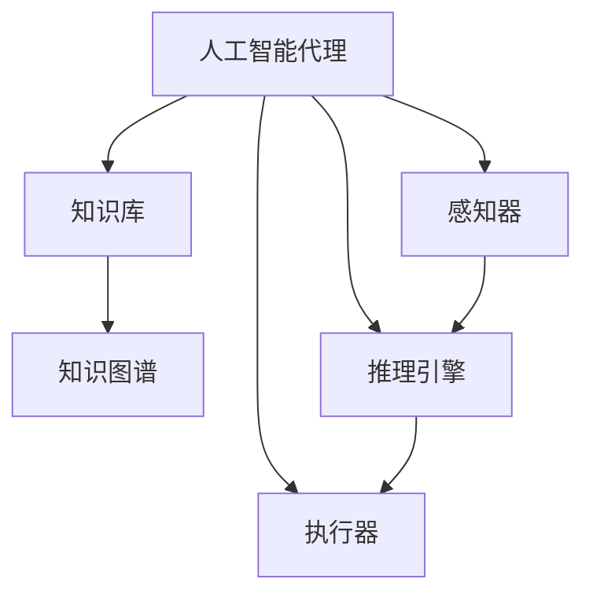

# AI人工智能代理工作流AI Agent WorkFlow：知识图谱在代理工作流中的应用

## 1.背景介绍

### 1.1 人工智能代理的兴起

随着人工智能技术的不断发展和应用场景的日益广泛,人工智能代理(AI Agent)作为一种新型智能系统应运而生。人工智能代理是指能够感知环境、处理信息、做出决策并执行行动的自主系统。它们被广泛应用于各个领域,如客户服务、个人助理、智能家居、游戏AI等。

### 1.2 工作流程管理的重要性

在现代商业环境中,高效的工作流程管理对于提高生产率、降低成本、优化资源利用至关重要。传统的工作流程管理系统通常依赖于预定义的规则和流程,缺乏灵活性和智能化。人工智能代理的引入为工作流程管理带来了新的可能性,使其能够更加智能化、个性化和自适应。

### 1.3 知识图谱在人工智能中的作用

知识图谱是一种结构化的知识表示形式,它将实体、概念及其关系以图形化的方式呈现。知识图谱在人工智能领域发挥着重要作用,为机器学习算法提供背景知识和语义信息,提高了人工智能系统的理解和推理能力。

## 2.核心概念与联系

### 2.1 人工智能代理(AI Agent)

人工智能代理是一种能够感知环境、处理信息、做出决策并执行行动的自主系统。它们通常由以下几个核心组件组成:

- 感知器(Sensors):用于从环境中获取信息和数据。
- 执行器(Actuators):用于在环境中执行行动。
- 知识库(Knowledge Base):存储代理所拥有的知识和信息。
- 推理引擎(Reasoning Engine):根据知识库和感知信息做出决策。

### 2.2 工作流程管理(Workflow Management)

工作流程管理是指对组织内部的业务流程进行设计、执行、监控和优化的过程。它通常包括以下几个关键步骤:

- 流程建模(Process Modeling):定义和描述业务流程。
- 流程执行(Process Execution):根据模型执行实际的工作流程。
- 流程监控(Process Monitoring):跟踪和监视流程执行情况。
- 流程优化(Process Optimization):根据监控数据优化流程。

### 2.3 知识图谱(Knowledge Graph)

知识图谱是一种结构化的知识表示形式,它将实体、概念及其关系以图形化的方式呈现。知识图谱通常包括以下几个核心要素:

- 实体(Entities):代表现实世界中的人物、地点、事物等概念。
- 关系(Relations):描述实体之间的语义联系。
- 属性(Attributes):描述实体的特征和属性。

知识图谱可以通过机器学习和自然语言处理技术从各种数据源(如文本、数据库、网页等)中自动构建,也可以由人工专家手动编辑。

### 2.4 人工智能代理工作流(AI Agent Workflow)

人工智能代理工作流是将人工智能代理技术应用于工作流程管理的一种新型范式。在这种范式下,人工智能代理扮演着工作流程执行和决策的核心角色。代理可以感知工作流程的当前状态,根据知识库和推理引擎做出智能决策,并通过执行器执行相应的行动。

知识图谱在人工智能代理工作流中发挥着至关重要的作用。它为代理提供了结构化的背景知识和语义信息,增强了代理的理解和推理能力,使得代理能够更好地执行复杂的工作流程。

上图展示了人工智能代理与知识图谱在工作流中的关系。代理通过感知器获取环境信息,结合知识库(包括知识图谱)中的知识,经过推理引擎的决策,最终通过执行器执行相应的行动。

## 3.核心算法原理具体操作步骤

### 3.1 知识图谱构建

构建高质量的知识图谱是应用知识图谱技术的关键前提。知识图谱的构建过程通常包括以下几个主要步骤:

1. **数据采集**:从各种数据源(如文本、数据库、网页等)中收集相关数据。
2. **实体识别与链接**:从原始数据中识别出实体mentions,并将其链接到知识库中的实体。
3. **关系抽取**:从原始数据中抽取出实体之间的语义关系。
4. **知识融合**:将来自不同数据源的知识进行融合,解决冲突和不一致性问题。
5. **知识存储**:将构建好的知识图谱存储在适当的数据结构(如图数据库)中,以便后续查询和利用。

在构建过程中,常常需要结合各种自然语言处理技术,如命名实体识别、关系抽取、实体链接等。同时,也可以利用机器学习和深度学习算法来提高构建质量。

### 3.2 知识图谱表示与查询

为了便于存储和查询,知识图谱通常需要使用适当的数据结构进行表示。常见的表示方式包括:

- **RDF三元组**:将知识图谱表示为一系列(主语,谓语,宾语)三元组。
- **属性图**:将实体表示为节点,属性和关系表示为边。
- **张量**:将知识图谱表示为高维张量,利用张量分解技术进行推理。

根据所选择的表示方式,可以使用不同的查询语言来查询和操作知识图谱,如SPARQL(用于RDF三元组)、Cypher(用于属性图)等。

### 3.3 知识图谱推理

知识图谱推理是指利用已有的知识推导出新的知识或发现隐藏的模式和规律。常见的推理技术包括:

1. **基于规则的推理**:根据预定义的规则从已知事实中推导出新的结论。
2. **基于embeddings的推理**:将实体和关系映射到低维向量空间,利用向量运算进行推理。
3. **基于图神经网络的推理**:将知识图谱表示为图结构,利用图神经网络模型进行端到端的推理。
4. **基于逻辑规则的推理**:利用一阶逻辑或描述逻辑等形式化语言对知识进行推理。

不同的推理技术各有优缺点,需要根据具体应用场景进行选择和组合使用。

### 3.4 人工智能代理工作流执行

在人工智能代理工作流中,知识图谱为代理提供了背景知识和语义信息,支持以下几个关键步骤:

1. **流程理解**:代理利用知识图谱对工作流程的语义进行理解,获取流程中涉及的实体、概念及其关系。
2. **情景建模**:根据当前的工作流程状态和知识图谱,代理构建出工作流程的情景模型。
3. **决策推理**:代理基于情景模型和知识图谱,结合推理算法做出下一步的决策。
4. **行动执行**:代理根据决策结果,通过执行器执行相应的行动,推进工作流程的执行。

在这个过程中,知识图谱为代理提供了丰富的背景知识,增强了其理解、推理和决策能力,使得代理能够更好地处理复杂的工作流程。

## 4.数学模型和公式详细讲解举例说明

在知识图谱的构建和推理过程中,常常需要借助数学模型和算法来提高效率和准确性。以下是一些常见的数学模型和公式:

### 4.1 TransE模型

TransE是一种广泛使用的知识图谱嵌入模型,它将实体和关系映射到低维向量空间,利用向量运算来进行推理。TransE模型的基本思想是,对于一个三元组$(h,r,t)$,其向量表示应当满足:

$$\vec{h} + \vec{r} \approx \vec{t}$$

其中$\vec{h}$、$\vec{r}$和$\vec{t}$分别表示头实体、关系和尾实体的向量表示。模型的目标是最小化所有三元组的损失函数:

$$L = \sum_{(h,r,t) \in S} \sum_{(h',r',t') \in S'} [\gamma + d(\vec{h} + \vec{r}, \vec{t}) - d(\vec{h'} + \vec{r'}, \vec{t'})]_+$$

其中$S$是知识图谱中的三元组集合,$S'$是负采样得到的三元组集合,$\gamma$是边距超参数,$d$是距离函数(通常使用$L_1$或$L_2$范数),$[\cdot]_+$是正值函数。

TransE模型简单高效,但存在一些局限性,如无法很好地处理一对多、多对一和复合关系等情况。

### 4.2 TransR模型

TransR模型是TransE的改进版本,它引入了关系特定的向量空间,旨在更好地处理一对多、多对一和复合关系。在TransR中,每个实体有两个向量表示:实体向量$\vec{e}$和关系特定向量$\vec{e_r}$。对于一个三元组$(h,r,t)$,其向量表示应当满足:

$$\vec{h_r} + \vec{r} \approx \vec{t_r}$$

其中$\vec{h_r} = \vec{h} \cdot \mathbf{M_r}$,$\vec{t_r} = \vec{t} \cdot \mathbf{M_r}$,$\mathbf{M_r}$是关系$r$对应的投影矩阵。TransR的损失函数与TransE类似,但需要同时学习实体向量、关系向量和投影矩阵。

TransR模型能够更好地处理一对多、多对一和复合关系,但计算开销也更大。

### 4.3 图卷积神经网络

图卷积神经网络(Graph Convolutional Network,GCN)是一种基于图结构的深度学习模型,可以直接在知识图谱上进行端到端的推理。GCN的基本思想是利用节点的邻居信息来更新节点的表示,从而捕获图结构中的模式和规律。

对于一个节点$v$,其在第$k$层的表示$\vec{h}_v^{(k)}$可以通过以下公式计算:

$$\vec{h}_v^{(k)} = \sigma\left(\sum_{u \in \mathcal{N}(v)} \frac{1}{c_{v,u}} \vec{W}^{(k)} \vec{h}_u^{(k-1)}\right)$$

其中$\mathcal{N}(v)$是节点$v$的邻居集合,$c_{v,u}$是归一化常数,$\vec{W}^{(k)}$是第$k$层的权重矩阵,$\sigma$是非线性激活函数。

GCN可以在知识图谱上进行各种任务,如链接预测、节点分类、图嵌入等,并取得了优异的性能。但是,GCN也存在一些局限性,如无法很好地处理高阶邻居信息和动态图结构。

### 4.4 张量分解模型

张量分解模型将知识图谱表示为高维张量,利用张量分解技术进行推理。这种方法的优点是能够自然地捕获高阶关系和模式。

设$\mathcal{X}$是一个$n$阶张量,其中每个元素$x_{i_1,i_2,\dots,i_n}$表示一个事实或三元组。我们可以将$\mathcal{X}$分解为$n$个向量的外积:

$$\mathcal{X} \approx \sum_{r=1}^R \vec{a}_r^{(1)} \circ \vec{a}_r^{(2)} \circ \dots \circ \vec{a}_r^{(n)}$$

其中$R$是张量的阶数,$\vec{a}_r^{(i)}$是第$i$个模式的第$r$个向量分量,$\circ$表示外积运算。

通过学习这些向量分量,我们可以重构原始的张量,并利用重构误差作为损失函数进行优化。张量分解模型能够捕获高阶关系,但计算复杂度较高,并且需要大量的训练数据。

上述数学模型和公式只是知识图谱领域中