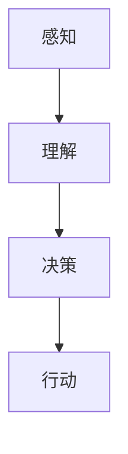

## 1. 背景介绍

人工智能（Artificial Intelligence，简称AI）是指通过模拟人类智能的方式来构建计算机程序，以实现人类智能的某些功能。人工智能代理（AI Agent）是一种特殊类型的人工智能，它可以根据环境、任务和目标进行自主决策和行动。

自主行为（Autonomous Behavior）是指AI Agent能够独立地执行任务，并且能够适应环境变化。在AI中，自主行为通常涉及到规划策略（Planning Strategy），它是一种用于确定如何达到目标的方法。

本篇博客将探讨AI Agent WorkFlow中自主行为与规划策略的运用，以及它们在实际应用场景中的表现。

## 2. 核心概念与联系

### 2.1 自主行为

自主行为是AI Agent的核心特征之一，它使得AI Agent能够在不依赖外部干预的情况下，独立地完成任务。自主行为包括：

- 感知：AI Agent通过感官接收来自环境的信息。
- 理解：AI Agent对感知到的信息进行处理和分析，以生成理解。
- 决策：AI Agent根据环境、任务和目标生成决策。
- 行动：AI Agent执行决策，并产生新的状态。

### 2.2 规划策略

规划策略是AI Agent实现自主行为的一个关键组成部分。它涉及到选择合适的行动序列，以达到预定的目标。规划策略可以分为以下几类：

- 搜索策略：搜索所有可能的行动序列，并选择最佳的一种。
- 优化策略：基于数学模型和公式，找到最优的行动序列。
- 学习策略：通过经验积累，逐渐提高AI Agent的决策能力。

## 3. 核心算法原理具体操作步骤

在实际应用中，AI Agent WorkFlow需要遵循一定的算法原理和操作步骤。以下是一个典型的自主行为与规划策略的流程图：



1. **感知**：AI Agent从环境中收集信息，如传感器数据、用户输入等。
2. **理解**：AI Agent对感知到的信息进行处理，如过滤噪声、归一化等，然后生成一个内部表示。
3. **决策**：AI Agent根据内部表示和预设目标，选择合适的行动序列。
4. **行动**：AI Agent执行选定的行动，并产生新的状态。

## 4. 数学模型和公式详细讲解举例说明

在AI Agent WorkFlow中，数学模型和公式起着关键作用。以下是一个简单的数学模型示例：

假设我们有一个目标是让AI Agent在一个二维空间中找到一个指定值（如最大值或最小值）。我们可以使用A*算法来实现这一目标。

A*算法的核心思想是：通过计算每个节点到目标节点的实际成本和估计成本，从而确定下一步的行动方向。

公式如下：

$$
f(n) = g(n) + h(n)
$$

其中：

- $$g(n)$$：从起始节点到当前节点的实际成本。
- $$h(n)$$：从当前节点到目标节点的估计成本。

通过不断更新$$f(n)$$值，我们可以确定下一步的行动方向。

## 5. 项目实践：代码实例和详细解释说明

为了帮助读者更好地理解AI Agent WorkFlow，我们将提供一个具体的代码示例。以下是一个简单的Python代码，演示了如何使用A*算法实现自主行为与规划策略。

```python
import heapq

def heuristic(a, b):
    (x1, y1) = a
    (x2, y2) = b
    return abs(x1 - x2) + abs(y1 - y2)

def astar(start, goal, neighbors):
    frontier = []
    heapq.heappush(frontier, (0, start))
    came_from = {start: None}
    cost_so_far = {start: 0}

    while frontier:
        current = heapq.heappop(frontier)[1]

        if current == goal:
            break

        for next in neighbors(current):
            new_cost = cost_so_far[current] + 1
            if next not in cost_so_far or new_cost < cost_so_far[next]:
                cost_so_far[next] = new_cost
                priority = new_cost + heuristic(goal, next)
                heapq.heappush(frontier, (priority, next))
                came_from[next] = current

    return came_from, cost_so_far

came_from, cost_so_far = astar((0, 0), (3, 3), lambda node: [(node[0] + 1, node[1]), (node[0], node[1] + 1)])
```

## 6. 实际应用场景

AI Agent WorkFlow在许多实际应用场景中得到了广泛的应用，如：

- 智能家居：通过自主行为和规划策略，实现智能家居系统的自动化管理。
- 自动驾驶：利用AI Agent WorkFlow来实现自动驾驶汽车的路径规划和决策。
- 机器人控制：为工业机器人提供自主行为和规划策略，以实现高效的生产线操作。

## 7. 工具和资源推荐

为了学习和实践AI Agent WorkFlow，我们推荐以下工具和资源：

- Python编程语言：Python是学习AI Agent WorkFlow的理想语言，有丰富的库和框架支持。
- TensorFlow：TensorFlow是一个流行的深度学习框架，可以用于构建复杂的人工智能代理。
- OpenAI Gym：OpenAI Gym是一个开源的游戏平台，可以用于测试和评估AI Agent的性能。

## 8. 总结：未来发展趋势与挑战

随着技术的不断发展，AI Agent WorkFlow在未来将面临更多的应用场景和挑战。我们需要继续探索新的算法原理和数学模型，以提高AI Agent的决策能力和适应性。此外，数据安全和隐私保护也是我们需要关注的问题。

## 9. 附录：常见问题与解答

Q1：什么是自主行为？

A1：自主行为是指AI Agent能够独立地执行任务，并且能够适应环境变化。在AI中，自主行为通常涉及到规划策略。

Q2：如何选择合适的规划策略？

A2：规划策略的选择取决于具体的应用场景和目标。我们可以根据实际情况选择搜索策略、优化策略或学习策略。

作者：禅与计算机程序设计艺术 / Zen and the Art of Computer Programming
        