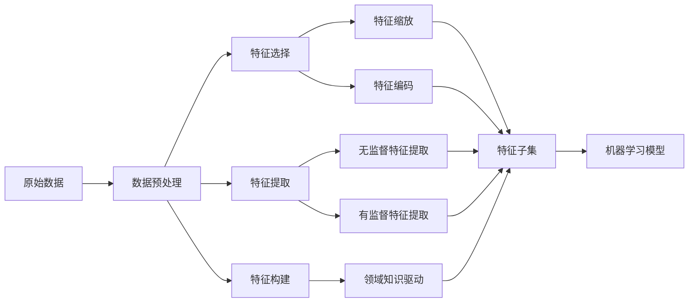

# AI人工智能核心算法原理与代码实例讲解：特征工程

## 1. 背景介绍
### 1.1 人工智能的发展历程
### 1.2 特征工程在AI中的重要性
### 1.3 特征工程面临的挑战

## 2. 核心概念与联系
### 2.1 特征的定义与分类
#### 2.1.1 数值型特征
#### 2.1.2 类别型特征
#### 2.1.3 文本型特征
#### 2.1.4 图像型特征
### 2.2 特征选择的目的与方法
#### 2.2.1 过滤式特征选择
#### 2.2.2 包裹式特征选择  
#### 2.2.3 嵌入式特征选择
### 2.3 特征提取与特征构建
#### 2.3.1 无监督特征提取
#### 2.3.2 有监督特征提取
#### 2.3.3 领域知识驱动的特征构建

## 3. 核心算法原理具体操作步骤
### 3.1 数据预处理
#### 3.1.1 数据清洗
#### 3.1.2 数据集成
#### 3.1.3 数据变换
### 3.2 特征缩放
#### 3.2.1 最小-最大归一化
#### 3.2.2 Z-score标准化 
#### 3.2.3 L2范数归一化
### 3.3 特征编码
#### 3.3.1 One-Hot编码
#### 3.3.2 序号编码
#### 3.3.3 二进制编码
### 3.4 特征选择算法
#### 3.4.1 方差阈值法
#### 3.4.2 皮尔逊相关系数法
#### 3.4.3 互信息与最大信息系数
#### 3.4.4 递归特征消除法
### 3.5 降维算法
#### 3.5.1 主成分分析（PCA）
#### 3.5.2 线性判别分析（LDA）
#### 3.5.3 局部线性嵌入（LLE）
#### 3.5.4 t-SNE

## 4. 数学模型和公式详细讲解举例说明
### 4.1 信息论基础
#### 4.1.1 信息熵
#### 4.1.2 条件熵
#### 4.1.3 互信息 
### 4.2 统计学知识
#### 4.2.1 方差
#### 4.2.2 协方差
#### 4.2.3 相关系数
### 4.3 矩阵分解
#### 4.3.1 特征值与特征向量
#### 4.3.2 奇异值分解（SVD）
### 4.4 流形学习
#### 4.4.1 流形的概念
#### 4.4.2 测地线距离

## 5. 项目实践：代码实例和详细解释说明
### 5.1 使用Scikit-learn进行特征工程
#### 5.1.1 数据预处理
#### 5.1.2 特征选择
#### 5.1.3 降维
### 5.2 使用XGBoost进行特征重要性评估
### 5.3 使用深度学习自动提取特征
#### 5.3.1 卷积神经网络（CNN）
#### 5.3.2 自编码器（AutoEncoder）

## 6. 实际应用场景
### 6.1 计算广告中的特征工程 
### 6.2 推荐系统中的特征工程
### 6.3 金融风控中的特征工程
### 6.4 医疗诊断中的特征工程

## 7. 工具和资源推荐
### 7.1 Python数据科学工具
#### 7.1.1 Pandas
#### 7.1.2 Scikit-learn
#### 7.1.3 Numpy
### 7.2 特征工程实用工具
#### 7.2.1 Featuretools
#### 7.2.2 Tsfresh
### 7.3 特征可视化工具
#### 7.3.1 Matplotlib
#### 7.3.2 Seaborn
### 7.4 特征工程学习资源
#### 7.4.1 相关书籍推荐
#### 7.4.2 在线课程学习

## 8. 总结：未来发展趋势与挑战
### 8.1 自动化特征工程
### 8.2 多模态特征融合
### 8.3 隐私保护与联邦学习
### 8.4 可解释性与稳定性

## 9. 附录：常见问题与解答
### 9.1 如何选择特征工程方法？
### 9.2 特征工程的评估指标有哪些？
### 9.3 如何处理高维数据？
### 9.4 如何平衡特征工程与模型复杂度？

特征工程是人工智能和机器学习中的关键一环，它直接影响了模型的性能表现。随着AI技术的不断发展，原始数据呈现出多样性和高维度的特点，如何从海量数据中挖掘出有价值的特征成为了一大挑战。

特征工程主要包括数据预处理、特征选择、特征提取和特征构建几个步骤。在数据预处理阶段，我们需要对原始数据进行清洗、集成和变换，以消除噪声和冗余，提高数据质量。常用的数据变换方法有特征缩放和特征编码，前者将特征映射到相同的尺度，后者将非数值型特征转换为数值型表示。

特征选择旨在从原有特征中选择出相关性最强、冗余性最小的特征子集。根据特征选择准则的不同，可分为过滤式、包裹式和嵌入式三类方法。过滤式方法基于特征本身的统计指标进行筛选，如方差阈值法、相关系数法等；包裹式方法将特征选择看作一个子集搜索问题，用模型预测性能来评估特征子集的优劣；嵌入式方法将特征选择与模型训练融为一体，如L1正则化和决策树算法。

当原始特征不足以有效表示样本特性时，我们需要进行特征提取和特征构建。特征提取算法可分为无监督和有监督两大类，前者通过数据本身的结构信息学习新的特征表示，如PCA和AutoEncoder；后者利用标签信息引导特征提取过程，如LDA和度量学习。特征构建则需要充分利用领域知识，基于对问题的理解人工设计新的组合特征。

在数学层面上，特征工程涉及到统计学、信息论、矩阵分解、流形学习等多个分支。以互信息为例，它衡量了两个随机变量之间的相互依赖性，可用于刻画特征与标签的相关程度。再如流形学习，它假设高维数据存在一个低维流形结构，通过保持局部邻域关系将数据映射到低维空间，如LLE和t-SNE算法。

在实践中，我们可以使用Scikit-learn、XGBoost等机器学习库提供的API快速实现特征工程的常见操作，并利用Pandas和Numpy进行数据处理。对于文本和图像等非结构化数据，深度学习方法如CNN和AutoEncoder能够自动学习层次化的特征表示。当然，可视化工具如Matplotlib和Seaborn也是特征分析和调试中不可或缺的利器。

展望未来，自动化特征工程和多模态特征融合将成为主要发展方向。前者致力于研究自动搜索数据预处理和特征变换的最优工作流，减少人工设计和调参的成本；后者则探索不同模态数据的协同表示，挖掘它们之间的互补信息。此外，随着数据隐私和安全意识的提高，联邦学习和差分隐私等技术将与特征工程结合，在保护用户隐私的同时实现数据价值最大化。

最后，特征工程不是一蹴而就的，它需要我们在实践中不断总结和迭代。通过分析特征的可解释性和稳定性，权衡特征工程的复杂度和模型性能，因地制宜地选择合适的方法，才能真正发挥特征工程的威力，让数据驱动的智能时代加速到来。

作者：禅与计算机程序设计艺术 / Zen and the Art of Computer Programming