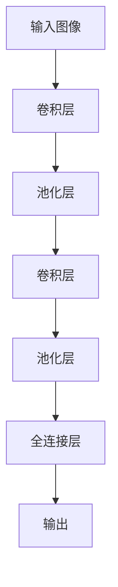

# AI人工智能深度学习算法：卷积神经网络的可视化技术

## 1.背景介绍

### 1.1 深度学习的兴起

在过去的几年里,深度学习技术在计算机视觉、自然语言处理、语音识别等领域取得了令人瞩目的成就。作为深度学习的核心算法之一,卷积神经网络(Convolutional Neural Network,CNN)在图像识别、目标检测等计算机视觉任务中发挥着关键作用。

### 1.2 可解释性的重要性

尽管卷积神经网络展现出了强大的性能,但它们通常被视为"黑箱"模型,其内部工作机理对人类来说并不透明。这种缺乏可解释性不仅影响了我们对模型的信任度,也阻碍了我们深入理解模型的行为,进而限制了模型的进一步优化和改进。

### 1.3 可视化技术的作用

为了提高深度学习模型的可解释性,研究人员提出了各种可视化技术,旨在揭示卷积神经网络内部的工作原理。通过可视化,我们可以更好地理解模型在学习什么样的特征表示,以及这些特征是如何组合在一起产生最终输出的。这不仅有助于我们构建更加可靠和鲁棒的模型,也为模型的优化和调试提供了有力支持。

## 2.核心概念与联系

### 2.1 卷积神经网络的基本结构

卷积神经网络是一种专门用于处理网格结构数据(如图像)的深度神经网络。它主要由卷积层、池化层和全连接层组成。



1. **卷积层**负责从输入数据中提取局部特征,通过滤波器(也称为卷积核)在输入数据上滑动,捕获不同的特征模式。
2. **池化层**用于降低特征图的分辨率,减少计算量和过拟合风险。
3. **全连接层**将前面层的特征映射到最终的输出空间,用于执行分类或回归任务。

### 2.2 特征可视化

特征可视化技术旨在揭示卷积神经网络在不同层次上学习到的特征表示。通过可视化,我们可以直观地观察到模型在不同层次上捕获了什么样的视觉模式,从而更好地理解模型的行为。

常见的特征可视化方法包括:

1. **特征映射可视化**:直接显示卷积层输出的特征映射,观察模型对输入图像的响应。
2. **反卷积可视化**:通过反向传播的方式,重构出能够最大化特定特征映射响应的输入图像。
3. **最大激活投影**:将多个特征映射叠加,显示出最能激活特定神经元的输入模式。

### 2.3 决策可视化

决策可视化技术旨在解释模型是如何从输入数据得出最终预测的。这些技术通常关注于模型对输入的敏感性,揭示了哪些输入区域对模型的决策起到了关键作用。

常见的决策可视化方法包括:

1. **梯度加权类激活映射**(Grad-CAM):通过梯度信息反向传播,生成一个热力图,显示出对模型预测贡献最大的输入区域。
2. **积分梯度**:通过对输入进行扰动,并积分扰动对输出的影响,估计出每个输入维度对输出的贡献。
3. **Shapley值**:借鉴了合作游戏理论中的Shapley值概念,量化每个输入特征对模型输出的贡献。

### 2.4 概念可视化

概念可视化技术旨在发现模型学习到的高层次概念表示。通过这些技术,我们可以生成最能激活特定概念神经元的合成图像,从而揭示模型对这些概念的理解。

常见的概念可视化方法包括:

1. **概念激活向量**(CAV):通过优化输入,生成能够最大化特定神经元激活值的合成图像,从而揭示该神经元所对应的概念。
2. **网络解旋**(Network Dissection):通过量化神经元对人工标注的概念数据集的响应,自动发现模型学习到的概念表示。

## 3.核心算法原理具体操作步骤

在本节中,我们将详细介绍三种广泛使用的卷积神经网络可视化技术:特征映射可视化、Grad-CAM和概念激活向量(CAV)。

### 3.1 特征映射可视化

特征映射可视化是最直观的可视化方法之一。它直接显示卷积层输出的特征映射,让我们能够观察到模型在不同层次上对输入图像的响应。

具体操作步骤如下:

1. **选择待可视化的卷积层**:根据需求选择感兴趣的卷积层,通常选择较浅层以观察低级特征,或较深层以观察高级语义特征。
2. **前向传播获取特征映射**:将输入图像传递到选定的卷积层,获取该层的特征映射输出。
3. **可视化特征映射**:将特征映射可视化,通常使用热力图或投影到RGB空间的方式进行显示。
4. **分析和解释**:观察特征映射,分析模型在该层次上捕获了哪些视觉模式,并与预期的特征进行对比和解释。

需要注意的是,由于卷积层通常包含多个卷积核,因此每个卷积层会输出多个特征映射。可视化时,我们可以选择性地显示部分特征映射,或将它们进行合并以获得整体视图。

### 3.2 Grad-CAM

Grad-CAM是一种广泛使用的决策可视化技术,它能够生成一个热力图,显示出对模型预测贡献最大的输入区域。

Grad-CAM的具体操作步骤如下:

1. **选择待可视化的目标类别**:确定要解释的目标类别,通常是模型预测的类别或感兴趣的特定类别。
2. **计算目标类别的梯度**:对目标类别的输出进行反向传播,计算最后一个卷积层特征映射相对于该类别输出的梯度。
3. **计算通道重要性权重**:将上一步计算的梯度在通道维度上进行全局平均池化,得到每个通道的重要性权重。
4. **生成热力图**:将重要性权重与最后一个卷积层的特征映射相乘,并在空间维度上进行加和,生成一个热力图。
5. **可视化热力图**:将生成的热力图投影到原始输入图像上,以直观显示对模型决策贡献最大的区域。

Grad-CAM的优点在于它不需要修改原始模型,可以应用于任何CNN架构。此外,它还能够捕捉到模型对输入的空间敏感性,有助于我们理解模型的决策过程。

### 3.3 概念激活向量(CAV)

概念激活向量(CAV)是一种概念可视化技术,它通过优化输入,生成能够最大化特定神经元激活值的合成图像,从而揭示该神经元所对应的概念。

CAV的具体操作步骤如下:

1. **选择待可视化的神经元**:根据需求选择感兴趣的神经元,通常选择位于较深层的神经元以观察高层次概念。
2. **构建优化目标函数**:定义一个目标函数,包括最大化选定神经元的激活值,以及一些正则化项(如总变化正则化)以保持生成图像的自然性。
3. **初始化合成图像**:从随机噪声或平坦图像开始,作为优化的初始输入。
4. **优化合成图像**:使用优化算法(如梯度下降)迭代优化合成图像,使目标函数达到最大值。
5. **可视化和分析**:观察生成的合成图像,分析它所对应的视觉概念,并与预期的概念进行对比和解释。

通过CAV,我们可以发现模型学习到的高层次概念表示,从而更好地理解模型的内部工作机理。同时,这也为模型的调试和改进提供了有价值的线索。

## 4.数学模型和公式详细讲解举例说明

在本节中,我们将详细介绍卷积神经网络中的一些关键数学模型和公式,并通过具体示例加深理解。

### 4.1 卷积运算

卷积运算是卷积神经网络的核心操作,它通过滤波器(卷积核)在输入数据上滑动,捕获局部特征模式。

对于二维输入数据(如图像),卷积运算可以表示为:

$$
S(i, j) = (I * K)(i, j) = \sum_{m}\sum_{n}I(i+m, j+n)K(m, n)
$$

其中:

- $I$表示输入数据(如图像)
- $K$表示卷积核(滤波器)
- $S$表示输出特征映射
- $m$和$n$是卷积核的索引

通过将卷积核在输入数据上滑动,我们可以获得一个新的特征映射,其中每个元素都是输入数据在对应位置的局部区域与卷积核的内积。

例如,对于一个3x3的卷积核和一个5x5的输入图像,卷积运算的过程如下:

```
输入图像:
[[1, 2, 3, 4, 5],
 [6, 7, 8, 9, 10],
 [11, 12, 13, 14, 15],
 [16, 17, 18, 19, 20],
 [21, 22, 23, 24, 25]]

卷积核:
[[1, 0, 1],
 [0, 1, 0],
 [1, 0, 1]]

输出特征映射:
[[12, 16, 22, 28, 28],
 [27, 33, 45, 57, 51],
 [54, 63, 81, 99, 87],
 [81, 93, 117, 141, 123],
 [84, 96, 120, 144, 126]]
```

在上面的示例中,输出特征映射的每个元素都是通过将卷积核在对应位置的局部区域上滑动,并计算局部区域与卷积核的内积得到的。

### 4.2 池化运算

池化运算是另一个重要的操作,它用于降低特征映射的分辨率,减少计算量和过拟合风险。

常见的池化方法包括最大池化和平均池化。最大池化取池化窗口内的最大值作为输出,而平均池化则取平均值作为输出。

最大池化运算可以表示为:

$$
S(i, j) = \max_{(m, n) \in R_{ij}}I(i+m, j+n)
$$

其中:

- $I$表示输入特征映射
- $S$表示输出特征映射
- $R_{ij}$表示以$(i, j)$为中心的池化窗口区域

例如,对于一个2x2的最大池化窗口和一个4x4的输入特征映射,最大池化运算的过程如下:

```
输入特征映射:
[[1, 2, 3, 4],
 [5, 6, 7, 8],
 [9, 10, 11, 12],
 [13, 14, 15, 16]]

输出特征映射:
[[6, 8],
 [14, 16]]
```

在上面的示例中,输出特征映射的每个元素都是通过在对应位置的2x2池化窗口内取最大值得到的。

### 4.3 激活函数

激活函数是神经网络中的另一个关键组成部分,它引入了非线性,使得神经网络能够学习复杂的映射关系。

常见的激活函数包括ReLU(整流线性单元)、Sigmoid和Tanh等。

ReLU激活函数可以表示为:

$$
f(x) = \max(0, x)
$$

它将负值截断为0,正值保持不变。ReLU的优点在于它可以有效缓解梯度消失问题,并且计算效率较高。

Sigmoid激活函数可以表示为:

$$
f(x) = \frac{1}{1 + e^{-x}}
$$

它将输入值映射到(0, 1)范围内,常用于二分类任务的输出层。

Tanh激活函数可以表示为:

$$
f(x) = \tanh(x) =