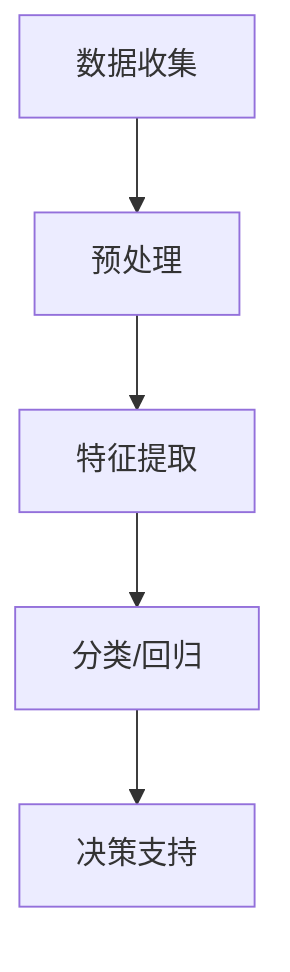

## 背景介绍

随着技术的不断进步，无人驾驶汽车（Autonomous Vehicles）已经成为现实。这些车辆依赖于复杂的传感器网络、计算机视觉、机器学习和深度学习算法来识别道路、检测障碍物并进行决策。

本文将探讨AI人工智能深度学习算法在无人驾驶汽车中的应用，包括核心概念、原理、数学模型、项目实践、实际应用场景等方面。

## 核心概念与联系

1. **深度学习**：深度学习是一种基于神经网络的机器学习方法，它可以自动从大量数据中学习特征表示和函数映射。这使得深度学习特别适合处理复杂的输入数据，如图像、音频和文本。
2. **无人驾驶汽车**：无人驾驶汽车是一种自动化驾驶的汽车，它可以根据环境、路况和其他车辆进行决策和操作，而不需要人类干预。这些汽车通常依赖于多种传感技术，如雷达、激光雷达和摄像头，以获取周围环境的信息。

## 核心算法原理具体操作步骤

深度学习算法在无人驾驶汽车中的主要作用是计算机视觉和决策支持。以下是一个简化的流程图，展示了深度学习算法在无人驾驶汽车中的基本工作原理：



1. **数据收集**：无人驾驶汽车通过传感器网络收集周围环境的数据，如图像、雷达数据等。
2. **预处理**：收集到的数据需要进行预处理，如归一化、去噪等，以确保输入数据质量。
3. **特征提取**：深度学习模型将预处理后的数据转换为有意义的特征表示，这些特征可以用于后续的决策支持。
4. **分类/回归**：根据需要，无人驾驶汽车可以使用深度学习模型进行分类（如识别交通标志）或回归（如估计距离）。
5. **决策支持**：基于深度学习模型的输出，无人驾驶汽车可以做出相应的决策，如变道、加速或刹车。

## 数学模型和公式详细讲解举例说明

在本节中，我们将介绍一个常见的深度学习模型——卷积神经网络（Convolutional Neural Networks，CNN），并解释其在无人驾驶汽车中的应用。

### CNN简介

CNN是一种特殊类型的神经网络，它通过卷积层、池化层和全连接层来学习输入数据的局部特征。CNN通常用于图像处理任务，如图像分类、目标检测等。

### CNN在无人驾驶汽车中的应用

在无人驾驶汽车中，CNN可以用于计算机视觉任务，如道路线检测、交通标志识别等。以下是一个简单的CNN架构示例：

```latex
\\begin{equation}
f(x; \\theta) = \\frac{1}{m} \\sum_{i=1}^{m} L(y_i, f_\\theta(x_i))
\\end{equation}
```

其中，\\(f(x; \\theta)\\)表示CNN模型，对于给定的输入\\(x\\)和参数\\(\\theta\\)，输出预测值；\\(L(y_i, f_\\theta(x_i))\\)表示损失函数，用于衡量预测值与实际值之间的差异。

## 项目实践：代码实例和详细解释说明

在本节中，我们将使用Python和TensorFlow来实现一个简单的CNN模型，以进行道路线检测。这将帮助我们更好地理解深度学习算法在无人驾驶汽车中的应用。

### 数据准备

首先，我们需要准备一个包含道路线图像的数据集。以下是一个简化的数据准备过程：

```python
import tensorflow as tf
from tensorflow.keras import layers, models

# 加载数据集
(train_images, train_labels), (test_images, test_labels) = tf.keras.datasets.cifar10.load_data()

# 预处理数据
train_images, test_images = train_images / 255.0, test_images / 255.0

# 构建CNN模型
model = models.Sequential([
    layers.Conv2D(32, (3, 3), activation='relu', input_shape=(32, 32, 3)),
    layers.MaxPooling2D((2, 2)),
    layers.Conv2D(64, (3, 3), activation='relu'),
    layers.MaxPooling2D((2, 2)),
    layers.Conv2D(64, (3, 3), activation='relu'),
    layers.Flatten(),
    layers.Dense(64, activation='relu'),
    layers.Dense(10)
])

# 编译模型
model.compile(optimizer='adam',
              loss=tf.keras.losses.SparseCategoricalCrossentropy(from_logits=True),
              metrics=['accuracy'])

# 训练模型
history = model.fit(train_images, train_labels, epochs=10, 
                    validation_data=(test_images, test_labels))
```

### 模型训练与评估

在本例中，我们使用了CIFAR-10数据集，包含50000张图像和10000张标签。我们构建了一个简单的CNN模型，并对其进行训练。训练完成后，我们可以对模型进行评估，以确定其在测试集上的表现。

## 实际应用场景

深度学习算法在无人驾驶汽车中的实际应用场景有很多，如道路检测、交通标志识别、车辆识别等。以下是一些具体的应用示例：

1. **道路线检测**：通过分析摄像头捕捉到的图像，无人驾驶汽车可以自动识别道路线并保持在道路内。
2. **交通标志识别**：无人驾驶汽车需要能够识别交通标志以便做出正确的决策，如停车、变道等。
3. **车辆识别**：无人驾驶汽车可以通过识别其他车辆来避免碰撞和调整速度。

## 工具和资源推荐

对于想要了解更多关于AI人工智能深度学习算法在无人驾驶汽车中的应用的人，以下是一些建议的工具和资源：

1. **TensorFlow官方文档**：[https://www.tensorflow.org/](https://www.tensorflow.org/)
2. **Keras官方文档**：[https://keras.io/](https://keras.io/)
3. **OpenCV官方文档**：[https://docs.opencv.org/master/](https://docs.opencv.org/master/)
4. **Autopilot: An Introduction to Autonomous Vehicles**：[https://www.udacity.com/course/autonomous-vehicles--ud612](https://www.udacity.com/course/autonomous-vehicles--ud612)

## 总结：未来发展趋势与挑战

虽然无人驾驶汽车已经取得了显著进步，但仍然面临许多挑战，如技术成熟度、安全性、法律法规等。然而，随着AI人工智能深度学习算法的不断发展，无人驾驶汽车将在未来几十年内逐渐成为现实。

## 附录：常见问题与解答

1. **如何选择合适的深度学习模型？**
选择合适的深度学习模型需要根据具体任务和数据特点进行评估。通常情况下，我们可以尝试多种模型并对比其性能，以确定最佳模型。
2. **深度学习模型训练过程中可能遇到的主要问题有哪些？**
深度学习模型训练过程中可能遇到的主要问题包括过拟合、欠拟合、梯度消失等。这些问题可以通过调整模型结构、正则化、批量归一化等方法来解决。
3. **无人驾驶汽车的安全性如何？**
虽然无人驾驶汽车已经取得了显著进步，但仍然面临许多挑战，如技术成熟度、安全性、法律法规等。在未来，随着技术的不断发展，无人驾驶汽车将逐渐成为现实，并且其安全性也将得到进一步提高。

作者：禅与计算机程序设计艺术 / Zen and the Art of Computer Programming

以上就是我们关于AI人工智能深度学习算法在无人驾驶汽车中的应用的一篇博客文章。希望这篇文章能帮助读者更好地了解深度学习算法在无人驾驶汽车中的应用，以及如何利用这些技术来解决实际问题。如果您有任何疑问或建议，请随时留言，我们会尽力提供帮助。