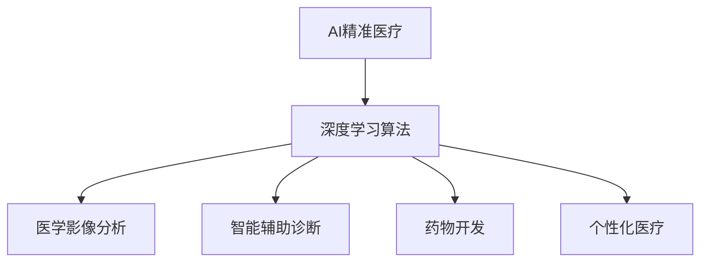

# AI人工智能深度学习算法：在精准医疗中的应用

## 1.背景介绍

### 1.1 医疗健康行业的挑战

当今社会,医疗健康行业面临着诸多挑战。随着人口老龄化加剧和慢性病患病率上升,医疗资源的供需矛盾日益突出。同时,医疗数据的爆炸式增长,传统的医疗诊断和治疗方式已难以满足临床需求。此外,医疗资源在不同地区的分布不均衡,导致优质医疗资源的可及性较低。

### 1.2 人工智能在医疗领域的应用前景

人工智能(AI)技术在医疗健康领域具有广阔的应用前景,可以帮助解决上述挑战。深度学习作为人工智能的一个重要分支,已在图像识别、自然语言处理等领域取得了突破性进展,为其在医疗领域的应用奠定了基础。

### 1.3 AI精准医疗的概念

AI精准医疗是指利用人工智能算法和技术,结合患者的基因组信息、生理生化数据、生活方式等多维度数据,实现对疾病的精准预测、精准诊断和精准治疗,从而提高医疗服务的精准度和个体化水平。

## 2.核心概念与联系

### 2.1 深度学习

深度学习(Deep Learning)是机器学习的一个新的领域,它模仿人脑的机制来解释数据,通过对数据的特征自动学习和模式识别,从而实现智能化决策和预测。深度学习算法主要包括卷积神经网络(CNN)、循环神经网络(RNN)、生成对抗网络(GAN)等。

### 2.2 医学影像分析

医学影像分析是AI精准医疗的一个重要应用领域。通过对CT、MRI、X射线等医学影像数据进行深度学习,可以实现疾病的智能检测和诊断,如肺癌筛查、脑肿瘤分割等。

### 2.3 智能辅助诊断

智能辅助诊断系统利用自然语言处理、知识图谱等技术,结合患者的电子病历、检查报告等非结构化数据,为医生提供辅助诊断建议,提高诊断的准确性和效率。

### 2.4 药物开发

深度学习可以加速新药物的发现和开发过程。通过对生物大分子结构数据进行建模和分析,可以预测新分子与靶点蛋白的相互作用,从而加快新药物的筛选和优化。

### 2.5 个性化医疗

个性化医疗是AI精准医疗的核心目标。通过整合患者的基因组数据、生理生化数据、生活方式等多维度信息,深度学习算法可以为每位患者量身定制个性化的治疗方案,提高治疗的精准度和有效性。

### 2.6 概念关联图



## 3.核心算法原理具体操作步骤

### 3.1 卷积神经网络(CNN)

卷积神经网络是深度学习在计算机视觉领域的核心算法,广泛应用于医学影像分析任务。CNN的工作原理可概括为以下几个步骤:

1. **输入层**: 将医学影像数据(如CT、MRI等)输入到网络中。

2. **卷积层**: 通过卷积核(滤波器)对输入数据进行特征提取,获得特征映射。卷积层可以自动学习图像的低级特征(如边缘、纹理等)。

3. **池化层**: 对卷积层的输出进行下采样,减小数据量,提取主要特征,实现空间不变性。常用的池化方法有最大池化和平均池化。

4. **全连接层**: 将前面层的特征映射展平,并通过全连接层对特征进行高级组合和分类。

5. **输出层**: 根据任务需求(如分类、分割等),输出相应的结果。

CNN通过多层次的特征提取和组合,可以自动学习输入数据的层次化表示,从而实现对复杂医学影像的智能分析和识别。

### 3.2 循环神经网络(RNN)

循环神经网络常用于处理序列数据,如自然语言处理、时间序列预测等。在医疗领域,RNN可以应用于电子病历分析、基因序列分析等任务。RNN的工作原理如下:

1. **输入层**: 将序列数据(如病历文本、基因序列等)逐个输入到网络中。

2. **隐藏层**: 隐藏层包含循环连接,可以捕获序列数据中的长期依赖关系。每个时间步的隐藏状态不仅取决于当前输入,还取决于前一时间步的隐藏状态。

3. **输出层**: 根据任务需求(如分类、预测等),输出相应的结果。

RNN通过内部循环连接,能够有效地处理序列数据,捕获长期依赖关系,因此在医疗领域具有广泛的应用前景。

### 3.3 生成对抗网络(GAN)

生成对抗网络是一种无监督学习算法,可以从随机噪声中生成逼真的数据样本。在医疗领域,GAN可以应用于医学影像增强、合成数据生成等任务。GAN的工作原理如下:

1. **生成器(Generator)**: 生成器从随机噪声中生成假样本(如合成医学影像)。

2. **判别器(Discriminator)**: 判别器试图区分生成器生成的假样本和真实样本。

3. **对抗训练**: 生成器和判别器进行对抗训练,生成器试图生成足以欺骗判别器的假样本,而判别器则努力区分真伪样本。

4. **收敛**: 当生成器生成的假样本无法被判别器区分时,训练达到收敛。

GAN可以学习真实数据的分布,从而生成逼真的合成数据,为医疗数据的增强和扩充提供了有效方法。

## 4.数学模型和公式详细讲解举例说明

### 4.1 卷积神经网络数学模型

卷积神经网络的核心运算是卷积操作,其数学表达式如下:

$$
(I * K)(i, j) = \sum_{m} \sum_{n} I(i+m, j+n)K(m, n)
$$

其中,
- $I$表示输入图像
- $K$表示卷积核(滤波器)
- $i, j$表示输出特征映射的位置
- $m, n$表示卷积核的位置

卷积操作通过滤波器在输入图像上滑动,计算局部区域的加权和,从而提取特征。

另一个重要的操作是池化,常用的最大池化可表示为:

$$
\operatorname{max\_pool}(X)_{i, j} = \max_{(i^{\prime}, j^{\prime}) \in R_{i, j}} X_{i^{\prime}, j^{\prime}}
$$

其中,
- $X$表示输入特征映射
- $R_{i, j}$表示以$(i, j)$为中心的池化区域
- $\operatorname{max\_pool}(X)_{i, j}$表示该池化区域内的最大值

池化操作可以减小特征映射的空间维度,提取主要特征,增强空间不变性。

### 4.2 循环神经网络数学模型

循环神经网络的核心思想是通过隐藏状态捕获序列数据中的长期依赖关系。简单循环神经网络(Simple RNN)的数学表达式如下:

$$
h_t = \tanh(W_{hh}h_{t-1} + W_{xh}x_t + b_h)
$$
$$
y_t = W_{hy}h_t + b_y
$$

其中,
- $x_t$表示时间步$t$的输入
- $h_t$表示时间步$t$的隐藏状态
- $y_t$表示时间步$t$的输出
- $W$表示权重矩阵
- $b$表示偏置向量

隐藏状态$h_t$不仅取决于当前输入$x_t$,还取决于前一时间步的隐藏状态$h_{t-1}$,从而捕获了序列数据的长期依赖关系。

### 4.3 生成对抗网络数学模型

生成对抗网络由生成器$G$和判别器$D$组成,它们的目标函数可表示为:

$$
\begin{aligned}
\min_G \max_D V(D, G) &= \mathbb{E}_{x \sim p_{\text{data}}(x)}[\log D(x)] \\
&+ \mathbb{E}_{z \sim p_z(z)}[\log(1 - D(G(z)))]
\end{aligned}
$$

其中,
- $p_{\text{data}}(x)$表示真实数据分布
- $p_z(z)$表示随机噪声分布
- $G(z)$表示生成器从噪声$z$生成的假样本
- $D(x)$表示判别器判断$x$为真实样本的概率

生成器$G$试图最小化$\log(1 - D(G(z)))$,即生成足以欺骗判别器的假样本;而判别器$D$则试图最大化$\log D(x) + \log(1 - D(G(z)))$,即正确区分真伪样本。通过对抗训练,生成器和判别器相互提升,最终达到生成器生成的假样本无法被判别器区分的状态。

### 4.4 实例说明

以医学影像分析为例,我们可以使用卷积神经网络对CT影像进行肺癌筛查。假设输入是一个$512 \times 512$的CT影像,我们可以设计如下网络结构:

1. 卷积层1: 使用$32$个$5 \times 5$的卷积核,步长为$1$,输出$32$个$508 \times 508$的特征映射。
2. 最大池化层1: 使用$2 \times 2$的池化窗口,步长为$2$,输出$32$个$254 \times 254$的特征映射。
3. 卷积层2: 使用$64$个$3 \times 3$的卷积核,步长为$1$,输出$64$个$252 \times 252$的特征映射。
4. 最大池化层2: 使用$2 \times 2$的池化窗口,步长为$2$,输出$64$个$126 \times 126$的特征映射。
5. 全连接层1: 将特征映射展平,输入维度为$126 \times 126 \times 64 = 1,002,048$,输出维度为$128$。
6. 全连接层2: 输入维度为$128$,输出维度为$2$(二分类:肺癌或正常)。

通过上述网络结构,我们可以自动从CT影像中提取层次化的特征,并进行肺癌分类。在训练过程中,我们需要使用标注好的CT影像数据集,并采用适当的优化算法(如随机梯度下降)和损失函数(如交叉熵损失)来训练模型参数。

## 5.项目实践:代码实例和详细解释说明

为了更好地理解深度学习在医疗领域的应用,我们将使用Python和PyTorch框架,构建一个简单的卷积神经网络模型,对肺部CT影像进行肺癌筛查。

### 5.1 导入必要的库

```python
import torch
import torch.nn as nn
import torch.optim as optim
from torchvision import datasets, transforms
```

### 5.2 定义卷积神经网络模型

```python
class LungCancerNet(nn.Module):
    def __init__(self):
        super(LungCancerNet, self).__init__()
        self.conv1 = nn.Conv2d(1, 32, kernel_size=5, stride=1, padding=2)
        self.pool1 = nn.MaxPool2d(kernel_size=2, stride=2)
        self.conv2 = nn.Conv2d(32, 64, kernel_size=3, stride=1, padding=1)
        self.pool2 = nn.MaxPool2d(kernel_size=2, stride=2)
        self.fc1 = nn.Linear(64 * 7 * 7, 128)
        self.fc2 = nn.Linear(128, 2)
        self.relu = nn.ReLU()

    def forward(self, x):
        x = self.relu(self.conv1(x))
        x = self.pool1(x)
        x = self.relu(self.conv2(x))
        x = self.pool2(x)
        x = x.view(-1, 64 * 7 * 7)
        x = self.relu