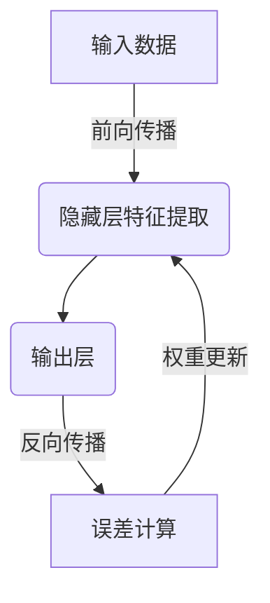
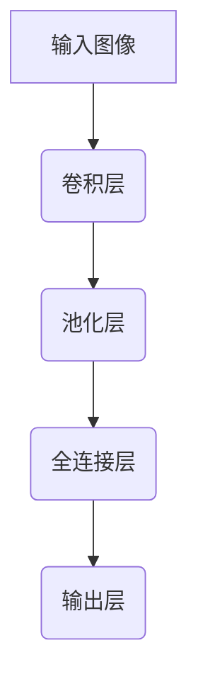

# AI人工智能深度学习算法：在航空航天中的应用

## 1.背景介绍

航空航天领域一直是人类科技发展的前沿阵地,对先进技术的需求也与日俱增。近年来,人工智能(AI)和深度学习(Deep Learning)技术的飞速发展为航空航天领域带来了全新的机遇和挑战。深度学习作为人工智能的一个重要分支,通过对大量数据的学习,能够自主获取特征表示,并对复杂模式进行建模和预测,展现出强大的数据处理和决策能力。

在航空航天领域,深度学习技术可以广泛应用于飞行器设计、制造、测试、维护等多个环节,提高生产效率、降低成本、确保安全性。同时,在航天器在轨运行、航线规划、目标识别与跟踪等方面,深度学习也可以发挥重要作用,提升航天器的自主性和智能化水平。

## 2.核心概念与联系

### 2.1 深度学习概述

深度学习是机器学习的一个新的领域,其灵感来源于人脑的结构和功能。它是一种基于对数据的表征学习,对由参数关于网络多层组成的复杂函数机器学习的方法。与传统的机器学习方法不同,深度学习可以通过神经网络自动从数据中学习特征表示,无需人工设计特征。



上图展示了深度学习的基本工作原理。在训练过程中,输入数据通过网络层层传递,每层对输入进行特征提取和转换,最终在输出层产生预测结果。将预测结果与真实值进行比较,计算误差,并通过反向传播算法更新网络权重,使得网络在训练数据上的预测性能不断提高。

### 2.2 深度学习在航空航天中的应用

在航空航天领域,深度学习技术可以广泛应用于以下几个方面:

- **飞行器设计与优化**: 利用深度学习对复杂的空气动力学数据建模,辅助设计师优化飞行器的气动外形、推进系统等,提高飞行器的燃油效率和飞行性能。

- **制造与测试**: 通过对制造数据的分析,深度学习可以预测部件缺陷、优化工艺参数、监控装配质量,提高生产效率和产品一致性。

- **健康监测与预测性维护**: 基于深度学习对飞行器各种传感器数据进行分析,及时发现故障征兆,预测残余寿命,实现精准的预测性维护。

- **航线规划与优化**: 利用深度学习对历史数据建模,综合考虑天气、空域等因素,为飞机确定最优航线,提高燃油利用率。

- **目标检测与跟踪**: 在航天遥感、航线监视等领域,深度学习可以高效、准确地从图像或视频中检测并跟踪感兴趣的目标。

- **自主导航与控制**: 通过端到端的深度学习,航天器可以直接从传感器数据学习控制策略,实现自主导航、着陆等高级功能。

## 3.核心算法原理具体操作步骤  

深度学习算法主要可以分为以下几类:监督学习、非监督学习、强化学习和对抗生成网络等。其中,在航空航天领域应用最广泛的是监督学习,包括卷积神经网络(CNN)、循环神经网络(RNN)等。下面以CNN为例,介绍其在目标检测任务中的应用原理和具体步骤。

### 3.1 卷积神经网络原理

卷积神经网络是一种专门用于处理网格结构数据(如图像)的神经网络。它的关键创新是卷积层(Convolution Layer),通过滑动卷积核在局部区域内提取特征,保留了输入数据的空间结构信息。



如上图所示,CNN一般由以下几个主要部分组成:

- 卷积层(Convolution Layer): 使用滑动卷积核提取局部特征
- 池化层(Pooling Layer): 对特征图进行下采样,减少数据量
- 全连接层(Fully-Connected Layer): 将特征映射到样本标签空间
- 输出层(Output Layer): 产生最终的预测结果,如分类或回归输出

### 3.2 目标检测算法步骤

CNN在目标检测任务中的应用步骤如下:

1. **数据预处理**:将原始图像数据归一化、调整大小等,以满足网络输入要求。

2. **网络设计**:根据任务复杂度设计合适的CNN网络结构,如VGG、ResNet等。

3. **网络训练**:
   - 准备标注好的训练数据集
   - 定义损失函数(如交叉熵损失)和优化算法(如SGD)
   - 前向传播计算损失,反向传播更新网络权重
   - 根据验证集上的性能决定是否继续训练或调整超参数

4. **目标检测**:
   - 对新的输入图像,通过滑动窗口或区域建议网络生成候选框
   - 将候选框输入到CNN中,预测每个框内是否存在目标及其类别
   - 应用非极大值抑制(NMS)去除重叠的冗余检测框

5. **模型评估**:在测试集上计算模型的精度、召回率等指标,分析错误案例。

通过上述步骤训练的CNN模型,可以高效、准确地从复杂场景中检测出感兴趣的目标,如飞机、导弹、地面设施等,为后续的目标识别、跟踪及决策提供支持。

## 4.数学模型和公式详细讲解举例说明

深度学习算法中有许多重要的数学概念和模型,下面将详细介绍其中的卷积运算、池化运算和反向传播算法。

### 4.1 卷积运算

卷积运算是CNN中最关键的运算,用于提取输入数据(如图像)的局部特征。设输入数据为$I$,卷积核为$K$,卷积运算可以表示为:

$$
S(i,j) = (I*K)(i,j) = \sum_{m}\sum_{n}I(i+m,j+n)K(m,n)
$$

其中,$S(i,j)$表示输出特征图在$(i,j)$位置的值。卷积核$K$在输入数据$I$上滑动,对每个位置的局部区域计算加权和,得到输出特征图。

例如,对于一个$5\times 5$的输入图像$I$和一个$3\times 3$的卷积核$K$,卷积运算的过程如下:

$$
I = \begin{bmatrix}
1 & 0 & 2 & 1 & 0\\
1 & 1 & 0 & 2 & 1\\
0 & 2 & 1 & 0 & 1\\
1 & 0 & 1 & 1 & 2\\
0 & 1 & 2 & 0 & 0
\end{bmatrix} \quad
K = \begin{bmatrix}
1 & 0 & 1\\
0 & 1 & 0\\
1 & 0 & 1
\end{bmatrix}
$$

$$
S(1,1) = 1\times 1 + 0\times 1 + 2\times 1 + 1\times 0 + 1\times 1 + 0\times 0 + 0\times 1 + 2\times 0 + 1\times 1 = 6
$$

通过在输入图像上滑动卷积核,可以得到一个$3\times 3$的输出特征图$S$。

### 4.2 池化运算

池化运算通常跟随卷积层,对特征图进行下采样,降低数据量和计算复杂度。常用的池化方式有最大池化(Max Pooling)和平均池化(Average Pooling)。

以$2\times 2$的最大池化为例,在一个$4\times 4$的输入特征图$X$上的运算过程如下:

$$
X = \begin{bmatrix}
1 & 3 & 2 & 0\\
0 & 2 & 0 & 1\\
3 & 1 & 2 & 3\\
0 & 0 & 1 & 2
\end{bmatrix} \quad
\text{Max Pooling} \quad
Y = \begin{bmatrix}
3 & 2\\
3 & 3
\end{bmatrix}
$$

可以看到,输出$Y$保留了每个$2\times 2$区域内的最大值,特征图的尺寸减小为原来的1/4。

### 4.3 反向传播算法

反向传播算法(Back Propagation)是训练深度神经网络的核心,用于计算损失函数关于网络权重的梯度,并通过梯度下降法更新权重,从而不断减小损失函数值,提高网络在训练数据上的预测性能。

设第$l$层的输入为$a^{(l-1)}$,权重为$W^{(l)}$,偏置为$b^{(l)}$,激活函数为$g(\cdot)$,则该层的前向传播计算为:

$$
z^{(l)} = W^{(l)}a^{(l-1)} + b^{(l)}\\
a^{(l)} = g(z^{(l)})
$$

其中,$z^{(l)}$为加权输入,通过激活函数$g(\cdot)$得到该层的输出$a^{(l)}$。

假设损失函数为$J(W,b)$,在反向传播中,我们需要计算损失函数关于每层权重和偏置的梯度:

$$
\frac{\partial J}{\partial W^{(l)}} = \frac{\partial J}{\partial z^{(l)}}\frac{\partial z^{(l)}}{\partial W^{(l)}} = \delta^{(l)}(a^{(l-1)})^T\\
\frac{\partial J}{\partial b^{(l)}} = \sum_i\frac{\partial J}{\partial z_i^{(l)}} = \sum_i\delta_i^{(l)}
$$

其中,$\delta^{(l)}$为该层的误差项,可以通过链式法则自后向前递推计算:

$$
\delta^{(L)} = \nabla_aJ(W,b)\odot g'(z^{(L)})\\
\delta^{(l)} = ((W^{(l+1)})^T\delta^{(l+1)})\odot g'(z^{(l)})
$$

这里,$\odot$表示按位相乘,上式给出了从输出层开始,逐层计算每层误差项的方法。有了误差项,即可根据梯度下降法更新该层的权重和偏置:

$$
W^{(l)} \leftarrow W^{(l)} - \alpha\frac{\partial J}{\partial W^{(l)}}\\
b^{(l)} \leftarrow b^{(l)} - \alpha\frac{\partial J}{\partial b^{(l)}}
$$

其中,$\alpha$为学习率。通过多次迭代,网络权重不断朝着减小损失函数值的方向更新,从而提高了模型在训练数据上的性能。

## 5.项目实践:代码实例和详细解释说明

为了更好地理解深度学习在航空航天领域的应用,我们以航天器在轨目标检测为例,使用Python和PyTorch框架,实现一个基于CNN的目标检测模型。

### 5.1 数据准备

我们使用NASA的"Spacecraft Pose Estimation Datasets",其中包含了国际空间站(ISS)、火星车等航天器在不同姿态和光照条件下拍摄的图像,并给出了目标的位置和类别标注。

```python
import torch
from torchvision import transforms, datasets

# 定义数据预处理
data_transform = transforms.Compose([
    transforms.Resize((224, 224)),
    transforms.ToTensor(),
    transforms.Normalize(mean=[0.485, 0.456, 0.406], std=[0.229, 0.224, 0.225])
])

# 加载训练集和测试集
train_dataset = datasets.ImageFolder('data/train', transform=data_transform)
test_dataset = datasets.ImageFolder('data/test', transform=data_transform)

# 构建数据加载器
train_loader = torch.utils.data.DataLoader(train_dataset, batch_size=32, shuffle=True)
test_loader = torch.utils.data.DataLoader(test_dataset, batch_size=32, shuffle=False)
```

上述代码加载了训练集和测试集数据,并对图像进行了缩放、标准化等预处理操作。

### 5.2 模型定义