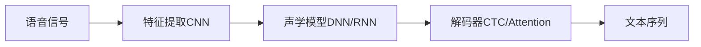

# AI人工智能深度学习算法：在语音识别的应用

## 1. 背景介绍

### 1.1 语音识别的重要性

在当今快速发展的信息时代,语音识别技术已经成为人机交互领域中不可或缺的一部分。语音识别允许计算机系统将人类的语音转化为文本或命令,从而实现更加自然和便捷的人机交互方式。随着人工智能技术的不断进步,特别是深度学习算法的兴起,语音识别的准确性和实用性得到了显著提升。

### 1.2 深度学习在语音识别中的应用

深度学习是一种基于人工神经网络的机器学习方法,通过构建多层次的神经网络模型,可以自动学习和提取输入数据的高层次特征表示。在语音识别领域,深度学习算法已经成为主流的技术手段,相比传统的基于高斯混合模型(GMM)和隐马尔可夫模型(HMM)的方法,深度学习能够更好地捕捉语音信号的时间和频率特征,从而提高识别的准确性和鲁棒性。

### 1.3 本文的目的和结构

本文旨在深入探讨深度学习算法在语音识别中的应用,重点介绍几种主流的深度学习模型,如卷积神经网络(CNN)、循环神经网络(RNN)和注意力机制等,并结合实际项目经验,分享如何利用这些算法构建高效的语音识别系统。同时,本文还将讨论语音识别面临的挑战和未来的发展方向。

全文结构如下:

- 背景介绍  
- 核心概念与联系
  - 语音识别的基本流程
  - 深度学习的基本原理
  - 深度学习与语音识别的结合
- 核心算法原理与步骤
  - 卷积神经网络(CNN)
  - 循环神经网络(RNN)
  - 注意力机制
  - Connectionist Temporal Classification (CTC) 
- 数学模型和公式详解
  - 卷积运算
  - 循环神经网络的前向传播和反向传播
  - 注意力机制的数学表示  
- 项目实践:代码实例与详解
  - 数据预处理
  - 声学模型训练
  - 解码与后处理
- 实际应用场景
  - 智能语音助手
  - 会议语音转录
  - 语音搜索与问答
- 工具和资源推荐
  - 开源工具包
  - 语音数据集
  - 学习资源
- 总结:未来发展趋势与挑战
  - 端到端语音识别
  - 多语种与方言识别
  - 低资源语音识别
  - 语音合成与识别的结合
- 附录:常见问题与解答

## 2. 核心概念与联系

### 2.1 语音识别的基本流程

语音识别的目标是将语音信号转化为相应的文本序列。传统的语音识别系统通常包括以下几个关键步骤:

1. 语音信号预处理:对原始语音信号进行降噪、端点检测、预加重等操作,提取有效的语音片段。
2. 特征提取:将语音信号转化为一系列的特征向量,常用的特征包括Mel频率倒谱系数(MFCC)、Perceptual Linear Predictive (PLP)等。
3. 声学模型:利用特征向量训练声学模型,建立语音单元(如音素、音节)与特征向量之间的对应关系。常用的声学模型包括高斯混合模型(GMM)、隐马尔可夫模型(HMM)等。
4. 语言模型:利用大量的文本语料,建立词与词之间的转移概率,用于约束声学模型的输出,提高识别的准确性。
5. 解码:利用声学模型和语言模型,对输入的语音特征进行解码,得到最优的文本序列。

### 2.2 深度学习的基本原理

深度学习是一种基于人工神经网络的机器学习方法,通过构建多层次的神经网络模型,可以自动学习和提取输入数据的高层次特征表示。深度学习模型通常包括以下几个关键组件:

1. 神经元:神经网络的基本单元,接收输入,通过激活函数产生输出。常用的激活函数包括Sigmoid、Tanh、ReLU等。
2. 前向传播:将输入数据通过神经网络的各个层次进行传递,得到输出结果。
3. 损失函数:衡量模型预测结果与真实标签之间的差异,常用的损失函数包括均方误差(MSE)、交叉熵(Cross-Entropy)等。
4. 反向传播:根据损失函数的梯度,利用链式法则将误差从输出层传递到输入层,调整神经网络的权重参数。
5. 优化算法:根据反向传播得到的梯度信息,更新神经网络的权重参数,常用的优化算法包括随机梯度下降(SGD)、Adam等。

通过不断迭代前向传播、反向传播和参数更新的过程,深度学习模型可以从大量的训练数据中学习到有效的特征表示,从而完成各种复杂的任务,如分类、回归、生成等。

### 2.3 深度学习与语音识别的结合

深度学习在语音识别领域的应用主要体现在以下几个方面:

1. 特征提取:利用卷积神经网络(CNN)等模型,直接从原始语音信号中学习高层次的特征表示,取代传统的手工设计特征。
2. 声学模型:利用深度神经网络(DNN)、循环神经网络(RNN)等模型,建立语音单元与特征向量之间的复杂非线性映射关系,提高声学模型的表达能力。
3. 语言模型:利用循环神经网络(RNN)、Transformer等模型,建立词与词之间的长距离依赖关系,提高语言模型的预测能力。
4. 端到端模型:将特征提取、声学模型和语言模型整合到一个统一的深度学习框架中,实现从语音信号到文本序列的直接映射,简化系统的设计和训练过程。

下图展示了一个基于深度学习的语音识别系统的整体架构:

## 3. 核心算法原理与步骤

### 3.1 卷积神经网络CNN

卷积神经网络(CNN)是一种常用于图像识别和语音识别的深度学习模型,其核心思想是利用卷积运算和池化操作,提取输入数据的局部特征。在语音识别中,CNN通常用于从原始语音信号中提取高层次的特征表示。

CNN的基本结构包括以下几个层次:

1. 卷积层:利用卷积核对输入数据进行卷积运算,提取局部特征。
2. 激活函数:对卷积层的输出进行非线性变换,增加模型的表达能力。常用的激活函数包括ReLU、Tanh等。
3. 池化层:对卷积层的输出进行下采样,减小特征图的尺寸,提高特征的鲁棒性。常用的池化操作包括最大池化、平均池化等。
4. 全连接层:将池化层的输出展平为一维向量,并通过全连接的方式进行分类或回归预测。

CNN在语音识别中的应用步骤如下:

1. 将原始语音信号转化为时频图或声谱图等二维表示。
2. 利用卷积层对时频图进行卷积运算,提取局部的时频特征。
3. 通过多个卷积层和池化层的堆叠,逐步提取更加抽象和高层次的特征表示。
4. 将最后一个池化层的输出展平,并通过全连接层进行分类或回归预测。
5. 利用反向传播算法和优化器,不断调整CNN的权重参数,最小化预测误差。

### 3.2 循环神经网络RNN

循环神经网络(RNN)是一种常用于处理序列数据的深度学习模型,其核心思想是在神经网络中引入循环连接,使得模型能够捕捉序列数据中的长距离依赖关系。在语音识别中,RNN通常用于建立声学模型和语言模型。

RNN的基本结构包括以下几个组件:

1. 输入层:接收当前时刻的输入数据。
2. 隐藏层:接收当前时刻的输入和上一时刻的隐藏状态,并通过非线性变换产生当前时刻的隐藏状态。
3. 输出层:根据当前时刻的隐藏状态,产生当前时刻的输出。
4. 循环连接:将上一时刻的隐藏状态传递给当前时刻,实现信息的持久化和长距离依赖的捕捉。

常见的RNN变体包括长短时记忆网络(LSTM)和门控循环单元(GRU),它们通过引入门控机制,缓解了传统RNN中的梯度消失和梯度爆炸问题,提高了模型的学习能力。

RNN在语音识别中的应用步骤如下:

1. 将语音特征序列作为RNN的输入,每个时刻对应一个特征向量。
2. 通过RNN的循环连接,将上一时刻的隐藏状态传递给当前时刻,捕捉语音序列中的长距离依赖关系。
3. 在每个时刻,根据当前的输入和隐藏状态,预测当前时刻的语音单元或词的概率分布。
4. 利用反向传播算法和优化器,不断调整RNN的权重参数,最小化预测误差。
5. 在解码阶段,利用训练好的RNN模型,对输入的语音特征序列进行逐帧预测,得到最优的文本序列。

### 3.3 注意力机制

注意力机制是一种常用于增强神经网络表达能力的技术,其核心思想是在生成输出时,动态地关注输入序列中的不同部分,从而捕捉到更加重要和相关的信息。在语音识别中,注意力机制通常用于改进声学模型和语言模型的性能。

常见的注意力机制包括以下几种:

1. 软注意力(Soft Attention):通过一个可学习的注意力权重向量,对输入序列中的所有位置进行加权求和,得到一个上下文向量。
2. 硬注意力(Hard Attention):通过一个离散的注意力分布,从输入序列中选择一个特定的位置,作为当前时刻的关注点。
3. 自注意力(Self-Attention):通过计算输入序列中不同位置之间的相似度,得到一个注意力权重矩阵,用于对输入序列进行加权求和。

注意力机制在语音识别中的应用步骤如下:

1. 将语音特征序列作为注意力机制的输入,每个时刻对应一个特征向量。
2. 通过一个注意力权重计算模块,根据当前时刻的隐藏状态和输入序列,计算注意力权重向量或矩阵。
3. 利用注意力权重对输入序列进行加权求和,得到一个上下文向量,作为当前时刻的附加输入。
4. 将上下文向量与当前时刻的隐藏状态进行拼接或融合,作为下一层神经网络的输入。
5. 重复步骤2-4,直到生成完整的输出序列。

### 3.4 Connectionist Temporal Classification CTC

Connectionist Temporal Classification(CTC)是一种常用于解决语音识别中时间对齐问题的算法,其核心思想是在输出序列中引入一个特殊的空白标签,允许模型在不需要显式对齐的情况下,直接预测输出序列。

CTC的基本原理如下:

1. 定义一个包含空白标签的扩展输出字母表,用于表示输入序列和输出序列之间的对齐关系。
2. 在模型的输出层,预测每个时刻属于不同标签的概率分布。
3. 利用动态规划算法,计算所有可能的对齐路径的概率之和,作为输出序列的概率。
4. 在训练阶段,最大化正确输出序列的对数似然函数,利用反向传播算法更新模型参数。
5. 在解码阶段,利用贪心搜索或束搜索