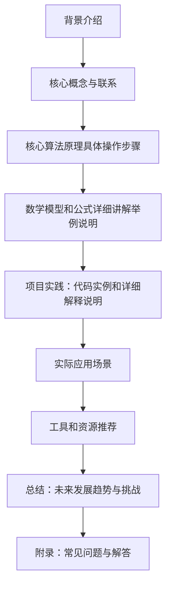

## 背景介绍 Introduction

随着人工智能技术的不断发展，深度学习算法已经成为计算机科学领域中最热门的话题之一。深度学习算法可以帮助我们解决许多复杂的问题，如图像识别、自然语言处理等。在本篇博客文章中，我们将探讨一种特殊的深度学习算法，即智能深度学习代理（Intelligent Deep Learning Agent, IDLA）在档案管理中的应用。

## 核心概念与联系 Core Concepts and Connections

首先，让我们来了解一下智能深度学习代理（IDLA）的核心概念。IDLA是一种基于深度学习的智能代理，它能够自主地学习和优化其行为策略，以实现特定的目标。这种代理具有强大的学习能力，可以根据环境变化自动调整自身行为，从而提高系统性能和效率。

在档案管理领域，IDLA可以用于自动化文件分类、检索和管理等任务。通过学习和优化其行为策略，IDLA可以更有效地处理大量的档案数据，降低人工干预的成本，并提高档案查询和管理的准确性。

## 核心算法原理具体操作步骤 Core Algorithm Principles and Operation Steps

IDLA的核心算法原理主要包括以下几个方面：

1. **神经网络架构设计**：IDLA使用一种特殊的神经网络架构，即卷积神经网络（Convolutional Neural Network, CNN），来处理图像数据。CNN具有较高的识别能力，可以有效地提取图像中的特征信息。
2. **监督式学习**：IDLA采用监督式学习方法，以训练样本为基础学习目标函数。在训练过程中，IDLA会根据训练样本调整自身参数，以最小化误差函数。
3. **强化学习**：IDLA还采用强化学习方法，通过与环境互动学习行为策略。在强化学习过程中，IDLA会根据环境反馈调整自身行为策略，以实现最佳效果。

## 数学模型和公式详细讲解举例说明 Mathematical Models and Formulas Detailed Explanation with Examples

在本节中，我们将详细介绍IDLA的数学模型及其相关公式。我们将从以下几个方面进行讨论：

1. **卷积神经网络的数学模型**：卷积神经网络是一种特殊的深度学习模型，它使用卷积操作来处理图像数据。卷积神经网络的主要组成部分包括卷积层、激活函数层和全连接层等。
2. **监督式学习的数学模型**：监督式学习是一种基于训练样本的学习方法。在监督式学习中，模型需要根据训练样本学习目标函数。在本节中，我们将详细讨论如何构建监督式学习的数学模型，以及如何计算误差函数。
3. **强化学习的数学模型**：强化学习是一种基于环境互动的学习方法。在强化学习过程中，代理需要根据环境反馈调整自身行为策略。在本节中，我们将详细讨论强化学习的数学模型，以及如何计算奖励函数。

## 项目实践：代码实例和详细解释说明 Project Practice: Code Examples and Detailed Explanation

在本节中，我们将通过一个具体的案例来展示IDLA在档案管理中的应用。我们将使用Python编程语言和TensorFlow深度学习框架实现一个简单的IDLA系统，以处理文件分类任务。

1. **数据预处理**：首先，我们需要对档案数据进行预处理，将其转换为适合卷积神经网络处理的格式。
2. **神经网络架构设计**：接下来，我们将设计一个卷积神经网络架构，以处理文件分类任务。
3. **训练与测试**：最后，我们将使用监督式学习方法训练IDLA，并评估其性能。

## 实际应用场景 Practical Application Scenarios

智能深度学习代理（IDLA）在档案管理领域具有广泛的应用前景。以下是一些实际应用场景：

1. **自动化文件分类**：IDLA可以根据文件内容和结构自主地进行分类，提高文件检索效率。
2. **档案查询优化**：通过学习和优化行为策略，IDLA可以更准确地回答用户的问题，降低查询成本。
3. **档案管理自动化**：IDLA可以帮助企业自动化档案管理流程，减轻人工干预负担。

## 工具和资源推荐 Tool and Resource Recommendations

对于想要了解和学习智能深度学习代理（IDLA）的人来说，有一些工具和资源值得一提：

1. **TensorFlow**：TensorFlow是一个开源的深度学习框架，可以用于实现卷积神经网络等复杂模型。
2. **Keras**：Keras是一个高级的神经网络API，可以简化深度学习模型的构建和训练过程。
3. **Scikit-learn**：Scikit-learn是一个Python机器学习库，可以提供许多常用的算法和工具。

## 总结：未来发展趋势与挑战 Conclusion: Future Trends and Challenges

随着深度学习技术的不断发展，智能深度学习代理（IDLA）在档案管理领域的应用将得到进一步拓展。然而，在实际应用中仍然面临诸多挑战，如数据质量问题、计算资源限制等。在未来的发展趋势中，我们可以期待IDLA在档案管理领域取得更多的进步，并为企业和个人带来更大的价值。

## 附录：常见问题与解答 Appendix: Frequently Asked Questions and Answers

在本篇博客文章中，我们探讨了智能深度学习代理（IDLA）在档案管理中的应用。以下是一些关于IDLA的常见问题及其解答：

1. **Q：什么是智能深度学习代理？**
A：智能深度学习代理（IDLA）是一种基于深度学习的智能代理，它能够自主地学习和优化其行为策略，以实现特定的目标。
2. **Q：IDLA如何处理文件分类任务？**
A：通过使用卷积神经网络，IDLA可以根据文件内容和结构自主地进行分类，提高文件检索效率。
3. **Q：IDLA在实际应用中有什么优势？**
A：IDLA具有较高的准确性和效率，可以帮助企业自动化档案管理流程，降低人工干预负担。

以上就是我们今天关于AI人工智能深度学习算法：智能深度学习代理在档案管理中的应用的全部内容。在本篇博客文章中，我们探讨了智能深度学习代理（IDLA）的核心概念、算法原理、数学模型等方面，并提供了一些具体的代码实例和实际应用场景。希望这篇博客文章能为您提供一些有用的参考和启示。感谢您的阅读！

作者：禅与计算机程序设计艺术 / Zen and the Art of Computer Programming

---

**Mermaid 流程图**

