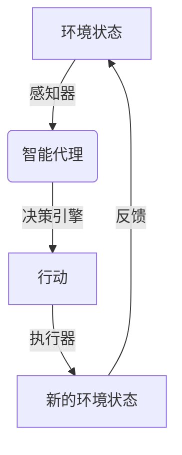
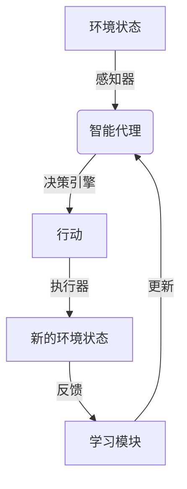
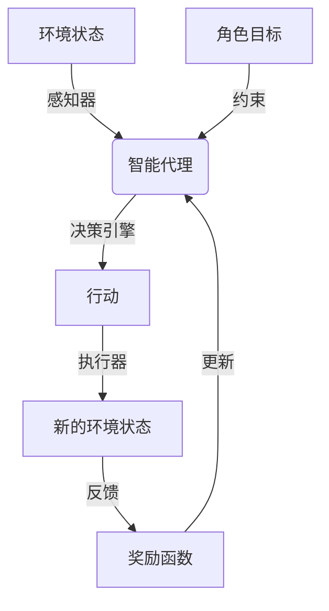

# AI人工智能深度学习算法：智能深度学习代理的互动学习与角色方法

## 1.背景介绍

### 1.1 人工智能的发展历程

人工智能(Artificial Intelligence, AI)是当代最具革命性和颠覆性的技术之一,已经渗透到我们生活的方方面面。从最初的专家系统和机器学习算法,到近年来的深度学习和强化学习等先进技术,AI的发展一直在推动着科技的进步和社会的变革。

### 1.2 深度学习的崛起

深度学习(Deep Learning)作为机器学习的一个新兴热点领域,凭借其在图像识别、语音识别、自然语言处理等领域的卓越表现,成为了AI研究的核心技术之一。深度学习模型通过对大量数据的训练,能够自动学习数据的特征表示,并对复杂的模式进行建模和预测。

### 1.3 智能代理与互动学习的重要性

在现实世界中,智能系统不仅需要具备强大的学习能力,还需要能够与人类或环境进行有效的交互和协作。因此,智能代理(Intelligent Agent)和互动学习(Interactive Learning)的概念应运而生。智能代理是指能够感知环境、作出决策并采取行动的自主系统,而互动学习则是指代理在与环境或用户的交互过程中不断学习和优化自身的能力。

### 1.4 角色方法在互动学习中的应用

角色方法(Role Method)是一种新兴的互动学习范式,它将智能代理视为扮演特定角色的行为体。通过明确定义代理的角色和目标,并设计合理的奖惩机制,可以有效地指导代理在与环境或用户的互动中学习合适的行为策略。这种方法不仅有助于提高代理的学习效率和性能,还能增强代理行为的可解释性和可控性。

## 2.核心概念与联系

### 2.1 智能代理

智能代理是一种能够感知环境、作出决策并采取行动的自主系统。它通常由以下几个核心组件组成:

1. **感知器(Sensor)**: 用于获取环境状态的信息。
2. **执行器(Actuator)**: 用于对环境进行操作或采取行动。
3. **决策引擎(Decision Engine)**: 根据感知到的环境状态和代理的目标,决定采取何种行动。

智能代理可以被视为一个映射函数,将环境状态映射到相应的行动上。这个映射函数通常由机器学习算法实现,代理通过与环境的交互来不断优化这个映射函数,从而提高其决策和行动的质量。

### 2.2 互动学习

互动学习是一种机器学习范式,强调智能系统需要通过与环境或用户的交互来获取反馈信息,并基于这些反馈不断优化自身的学习模型和决策策略。

在互动学习过程中,智能代理会根据当前的环境状态采取一定的行动,然后观察这些行动对环境产生的影响,并从中获取反馈信号。根据这些反馈信号,代理可以调整其决策模型,以期在未来做出更好的决策和行动。

互动学习的核心思想是将学习过程视为一个持续的循环,代理通过不断与环境交互、获取反馈并更新自身,来逐步提高其性能和适应性。这种学习方式更加贴近现实世界的复杂环境,有助于培养出更加鲁棒和通用的智能系统。

### 2.3 角色方法

角色方法是一种新兴的互动学习范式,它将智能代理视为扮演特定角色的行为体。每个角色都有明确的目标和约束条件,代理需要在这些约束下学习合适的行为策略,以完成相应的任务。

在角色方法中,代理的学习过程可以被形式化为一个马尔可夫决策过程(Markov Decision Process, MDP),其中:

- **状态(State)**: 描述代理当前所处的环境状态。
- **行动(Action)**: 代理可以采取的行动集合。
- **转移函数(Transition Function)**: 描述代理采取某个行动后,环境状态如何转移的概率分布。
- **奖励函数(Reward Function)**: 定义了代理采取某个行动后获得的即时奖励。

代理的目标是学习一个最优策略(Optimal Policy),使得在给定的角色约束下,能够最大化其预期的累积奖励。

通过合理设计角色的目标和奖惩机制,角色方法能够有效地指导代理学习出符合预期的行为策略,同时也增强了代理行为的可解释性和可控性。

## 3.核心算法原理具体操作步骤

### 3.1 马尔可夫决策过程

马尔可夫决策过程(Markov Decision Process, MDP)是一种广泛应用于强化学习和决策理论的数学框架。它描述了一个智能代理在特定环境中进行序列决策的过程。

一个标准的MDP可以用一个五元组 $(S, A, P, R, \gamma)$ 来表示,其中:

- $S$ 是有限的状态集合,表示代理可能处于的环境状态。
- $A$ 是有限的行动集合,表示代理可以采取的行动。
- $P(s'|s,a)$ 是状态转移概率函数,描述了当代理在状态 $s$ 采取行动 $a$ 后,转移到状态 $s'$ 的概率。
- $R(s,a)$ 是奖励函数,定义了代理在状态 $s$ 采取行动 $a$ 后获得的即时奖励。
- $\gamma \in [0,1)$ 是折现因子,用于权衡即时奖励和未来奖励的重要性。

代理的目标是学习一个最优策略 $\pi^*(s)$,使得在任意初始状态 $s_0$ 下,其预期的累积折现奖励最大化:

$$
\max_\pi \mathbb{E}\left[\sum_{t=0}^\infty \gamma^t R(s_t, \pi(s_t)) \mid s_0\right]
$$

其中 $\pi(s)$ 表示在状态 $s$ 下采取的行动。

### 3.2 Q-Learning算法

Q-Learning是一种常用的强化学习算法,它可以用于解决MDP问题,并学习出最优策略。Q-Learning的核心思想是估计一个行动价值函数 $Q(s,a)$,表示在状态 $s$ 下采取行动 $a$ 后,能够获得的预期累积折现奖励。

算法的具体步骤如下:

1. 初始化 $Q(s,a)$ 为任意值(通常为0)。
2. 对于每个episode:
    a. 初始化状态 $s$。
    b. 对于每个时间步:
        i. 根据当前的 $Q$ 值,选择一个行动 $a$ (可以使用 $\epsilon$-greedy 或其他策略)。
        ii. 执行行动 $a$,观察到新的状态 $s'$ 和即时奖励 $r$。
        iii. 更新 $Q(s,a)$ 值:
        
        $$
        Q(s,a) \leftarrow Q(s,a) + \alpha \left[r + \gamma \max_{a'} Q(s',a') - Q(s,a)\right]
        $$
        
        其中 $\alpha$ 是学习率,控制着新信息对 $Q$ 值的影响程度。
        iv. 将 $s$ 更新为 $s'$。
    c. 直到episode结束。
3. 重复步骤2,直到 $Q$ 值收敛。

在学习过程结束后,可以根据 $Q$ 值构建最优策略 $\pi^*(s)$,即在每个状态 $s$ 下选择具有最大 $Q$ 值的行动:

$$
\pi^*(s) = \arg\max_a Q(s,a)
$$

Q-Learning算法的优点在于它不需要事先知道环境的转移概率和奖励函数,只需要通过与环境的交互来学习 $Q$ 值。同时,它也具有一定的离线学习能力,可以利用已有的经验数据进行训练。

### 3.3 深度Q网络

传统的Q-Learning算法存在一个主要缺陷,即它需要维护一个巨大的 $Q$ 表,其大小随着状态空间和行动空间的增长而指数级增长。这使得该算法在处理大规模或连续状态空间的问题时效率低下。

深度Q网络(Deep Q-Network, DQN)是一种结合深度学习和Q-Learning的强化学习算法,它使用神经网络来近似 $Q$ 函数,从而克服了传统Q-Learning算法的局限性。

DQN算法的核心思想是使用一个神经网络 $Q(s,a;\theta)$ 来近似 $Q$ 函数,其中 $\theta$ 表示网络的参数。在训练过程中,我们通过minimizing以下损失函数来更新网络参数:

$$
L(\theta) = \mathbb{E}_{(s,a,r,s')\sim D}\left[\left(r + \gamma \max_{a'} Q(s',a';\theta^-) - Q(s,a;\theta)\right)^2\right]
$$

其中 $D$ 是经验回放池(Experience Replay Buffer),用于存储代理与环境交互过程中收集的 $(s,a,r,s')$ 样本;$\theta^-$ 表示目标网络(Target Network)的参数,它是 $Q$ 网络的一个滞后副本,用于提高训练的稳定性。

在每个训练步骤中,我们从经验回放池中采样一批样本,计算损失函数的梯度,并使用优化算法(如随机梯度下降)更新 $Q$ 网络的参数。同时,我们也会不时将 $Q$ 网络的参数复制到目标网络中,以保持目标网络的稳定性。

通过使用深度神经网络来近似 $Q$ 函数,DQN算法可以有效地处理大规模或连续的状态空间,并展现出优秀的泛化能力。它在许多复杂的强化学习任务中取得了卓越的成绩,如Atari游戏等。

## 4.数学模型和公式详细讲解举例说明

### 4.1 马尔可夫决策过程的数学模型

马尔可夫决策过程(Markov Decision Process, MDP)是一种描述序列决策过程的数学框架。它可以用一个五元组 $(S, A, P, R, \gamma)$ 来表示:

- $S$ 是有限的状态集合,表示代理可能处于的环境状态。
- $A$ 是有限的行动集合,表示代理可以采取的行动。
- $P(s'|s,a)$ 是状态转移概率函数,描述了当代理在状态 $s$ 采取行动 $a$ 后,转移到状态 $s'$ 的概率。具体地,对于任意 $s,a,s'$,我们有:

$$
P(s'|s,a) = \Pr\{s_{t+1} = s' \mid s_t = s, a_t = a\}
$$

- $R(s,a)$ 是奖励函数,定义了代理在状态 $s$ 采取行动 $a$ 后获得的即时奖励。
- $\gamma \in [0,1)$ 是折现因子,用于权衡即时奖励和未来奖励的重要性。

代理的目标是学习一个最优策略 $\pi^*(s)$,使得在任意初始状态 $s_0$ 下,其预期的累积折现奖励最大化:

$$
\pi^* = \arg\max_\pi \mathbb{E}\left[\sum_{t=0}^\infty \gamma^t R(s_t, \pi(s_t)) \mid s_0\right]
$$

其中 $\pi(s)$ 表示在状态 $s$ 下采取的行动。