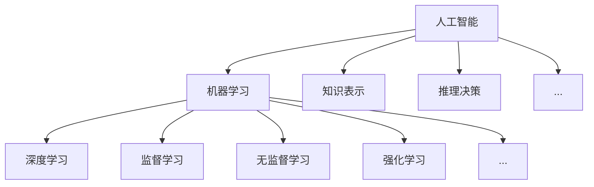
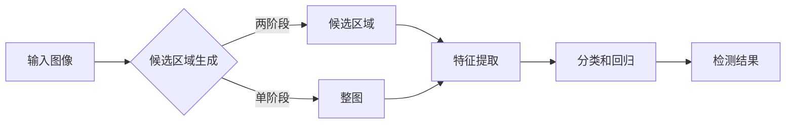

# AI人工智能深度学习算法：智能深度学习代理的计算机视觉运用

## 1.背景介绍

### 1.1 人工智能的发展历程

人工智能(Artificial Intelligence,AI)作为计算机科学的一个分支,旨在研究如何让计算机模拟人类的智能行为。从1956年达特茅斯会议首次提出"人工智能"的概念,到如今AI已经广泛应用于各个领域,人工智能经历了几次起起伏伏的发展历程。

20世纪50-70年代是人工智能的萌芽阶段,这一时期的主要特点是探索用计算机模拟人类智能的可能性,取得了一些初步成果,如机器定理证明、专家系统等。但由于当时计算机硬件和算法的限制,人工智能遇到了瓶颈。

20世纪80年代到21世纪初,人工智能进入了低谷期。尽管这一时期神经网络、进化算法等方法不断发展,但在实际应用中遇到了很大困难,人工智能研究遭遇了"AI寒冬"。

2006年以来,得益于互联网的发展和数据量的积累,以及计算机硬件性能的飞速提升,深度学习开始崭露头角,并在计算机视觉、语音识别等领域取得了突破性进展,人工智能迎来了新的春天。如今,人工智能已经成为了推动科技发展和社会进步的重要力量。

### 1.2 深度学习的兴起

深度学习(Deep Learning,DL)是机器学习的一个分支,其本质是通过构建具有多个隐藏层的人工神经网络,并利用大量数据训练网络,使其能够自动学习数据的内在特征和规律。

深度学习的概念最早由Hinton等人在2006年提出 [1],他们利用多层神经网络实现了高效的特征学习,在MNIST手写数字识别任务上取得了突破性进展。此后,深度学习在学术界和工业界掀起了研究热潮。

2012年,Krizhevsky等人提出的AlexNet [2]在ImageNet图像分类竞赛中以显著优势夺冠,证明了深度卷积神经网络(CNN)在大规模图像识别任务中的有效性,成为了深度学习发展的里程碑。此后,各种更深、更复杂的CNN网络结构如VGGNet [3]、GoogLeNet [4]、ResNet [5]等不断被提出,使得深度学习模型的性能不断刷新纪录。

除了CNN,循环神经网络(RNN)、长短时记忆网络(LSTM) [6]等适合处理序列数据的网络结构也得到了广泛应用,在语音识别、自然语言处理等领域取得了瞩目成绩。

近年来,生成对抗网络(GAN) [7]、强化学习(RL) [8]、图神经网络(GNN) [9]等新的深度学习范式也不断涌现,极大拓展了深度学习的应用边界。深度学习已经成为了人工智能的核心驱动力,推动着AI在各个领域不断取得新的突破。

### 1.3 计算机视觉的应用现状

计算机视觉(Computer Vision,CV)是人工智能的一个重要分支,旨在让计算机能够像人一样感知和理解视觉世界。随着深度学习的发展,计算机视觉取得了长足的进步,在工业、医疗、安防、交通、娱乐等诸多领域得到了广泛应用。

在工业领域,CV被用于工业产品的缺陷检测、质量分析等,大幅提升了生产效率和产品质量。例如,利用深度学习算法可以快速、准确地检测PCB板、液晶面板等产品的表面缺陷。

在医疗领域,CV算法可以辅助医生进行医学影像分析,如肿瘤检测、病变区域分割等,提高诊断的准确率和效率。一些先进的算法甚至在特定任务上达到了超过人类医生的水平。

在安防领域,人脸识别、行为分析等CV技术被用于智能监控、刑侦破案等,极大提升了公共安全水平。在交通领域,自动驾驶汽车离不开CV算法对道路环境的实时感知和决策。

在娱乐领域,CV让人脸特效、AR/VR等应用成为可能,给人们带来了更加身临其境的交互体验。

可以预见,随着技术的不断发展,计算机视觉将在更多领域大放异彩,成为AI造福人类的重要力量。

## 2.核心概念与联系

### 2.1 人工智能、机器学习和深度学习

人工智能、机器学习和深度学习是当前科技领域最热门的话题,它们之间存在着递进和包含的关系。

人工智能是一个大的概念,泛指研究如何让机器模拟人的智能行为,其中包括知识表示、推理决策、机器学习等多个方向。图灵测试常被用来衡量一个AI系统是否具有智能。

机器学习是实现人工智能的一种方法,其核心思想是通过学习算法,让机器从数据中自动分析获得规律,从而具备对新数据进行预测和决策的能力。机器学习包括监督学习、无监督学习、半监督学习、强化学习等范式。

深度学习是机器学习的一个分支,是一种基于人工神经网络的机器学习方法。相比传统的机器学习方法,深度学习具有更强大的表示学习能力,能够从原始数据中自动提取多层次的特征表示,因此在感知类任务如计算机视觉、语音识别等领域取得了突破性进展。

深度学习是当前人工智能的核心驱动力,但并非所有的机器学习都是深度学习,机器学习也并非实现人工智能的唯一途径。三者的关系如下图所示：

### 2.2 神经网络的基本原理

人工神经网络(Artificial Neural Network,ANN)是深度学习的基础,它从生物神经网络获得启发,由大量的人工神经元相互连接而成。每个神经元可以看作一个处理单元,接收来自其他神经元或外界的输入信号,经过非线性变换产生输出。

一个典型的前馈神经网络由输入层、隐藏层和输出层组成,每层由多个神经元构成,层与层之间通过权重矩阵完全连接。网络的前向传播过程可以表示为：

$$h_i = f(\sum_j w_{ij}x_j + b_i)$$

其中,$x_j$为上一层第$j$个神经元的输出,$w_{ij}$为连接权重,$b_i$为偏置项,$f$为激活函数,如sigmoid、tanh、ReLU等。

网络的训练过程即是通过优化算法(如梯度下降)来最小化损失函数,从而学习得到最优的权重和偏置参数。反向传播算法(BackPropagation,BP)是训练神经网络的核心算法,其通过链式法则计算损失函数对每个参数的梯度,并根据梯度更新参数。

一个简单的三层神经网络结构如下图所示：

### 2.3 卷积神经网络的特点

卷积神经网络(Convolutional Neural Network,CNN)是一种专门用于处理网格拓扑结构数据(如图像)的神经网络,它在图像分类、目标检测、语义分割等计算机视觉任务中表现出色。

CNN的核心思想是利用卷积和池化操作提取空间特征。卷积层通过滑动窗口对输入进行局部感受,并通过卷积核(一组可学习的参数)提取特征,一个卷积层通常包含多个卷积核以提取不同的特征。池化层通过对相邻区域取最大值或平均值进行下采样,减小特征图尺寸。卷积和池化的堆叠使得CNN能够提取层次化的特征表示。

相比全连接网络,CNN具有以下优点：

1. 局部连接:每个神经元只与前一层的一个局部区域连接,减少了参数数量和计算量。

2. 权重共享:同一个卷积核在整个图像上滑动,大大减少了参数数量。

3. 平移不变性:卷积操作对平移具有不变性,有利于提取图像的平移不变特征。

4. 层次化特征表示:通过卷积和池化的堆叠,CNN能够自动学习从低级到高级的层次化特征。

一个典型的CNN网络结构如下图所示：

### 2.4 目标检测的主要方法

目标检测是计算机视觉的一个核心任务,旨在从图像中定位和识别出感兴趣的目标物体。近年来,深度学习尤其是CNN极大地推动了目标检测的发展,主流的目标检测方法可以分为两类:两阶段检测器和单阶段检测器。

两阶段检测器如R-CNN系列 [10],其基本思路是先通过启发式方法(如选择性搜索)或区域建议网络(RPN)产生一系列候选区域,然后对每个候选区域进行分类和回归。R-CNN系列的代表工作有Fast R-CNN [11]、Faster R-CNN [12]等,它们在准确率上一度保持领先,但速度相对较慢。

单阶段检测器如YOLO [13]、SSD [14]等,其特点是略去了候选区域生成步骤,直接在网格化的图像上进行分类和回归,速度更快但准确率通常略低于两阶段方法。近年来,一些先进的单阶段模型如RetinaNet [15]、FCOS [16]等通过引入新的损失函数、特征金字塔等技术,在保持速度优势的同时大幅提升了准确率,缩小了与两阶段方法的差距。

目标检测管线的一般流程如下图所示：

### 2.5 语义分割的常用架构

语义分割是对图像中每个像素进行类别标注,是一个像素级的分类问题。与目标检测生成物体的边界框不同,语义分割需要生成与输入分辨率相同的类别标注图。

早期的语义分割方法多是基于手工设计的特征如SIFT [17]、HOG [18]等,然后在像素或超像素级别进行分类。深度学习兴起后,CNN开始在语义分割任务上崭露头角。

FCN [19]是最早将CNN应用到语义分割的工作,其采用全卷积网络对图像逐像素分类,并使用反卷积对分割结果上采样到输入分辨率。此后,语义分割网络主要围绕编码器-解码器架构展开,编码器负责提取图像特征,解码器负责恢复空间细节。

以FCN为代表的早期工作存在空间细节丢失、物体边界不清晰等问题。为了获得更精细的分割结果,一些工作如U-Net [20]、SegNet [21]等引入了跳跃连接,将编码器浅层的高分辨率特征传递给解码器,以恢复空间细节。

多尺度特征融合是另一种常用策略,如PSPNet [22]通过空间金字塔池化聚合多尺度上下文信息,DeepLab系列 [23,24]中的ASPP模块通过不同膨胀率的空洞卷积捕获多尺度特征。

为了提高边界定位精度,一些工作如Gated-SCNN [25]引入了显式的边界学习分支。另外,将分割问题建模为像素亲和度预测的思路也得到了广泛探索,代表工作如Affinity