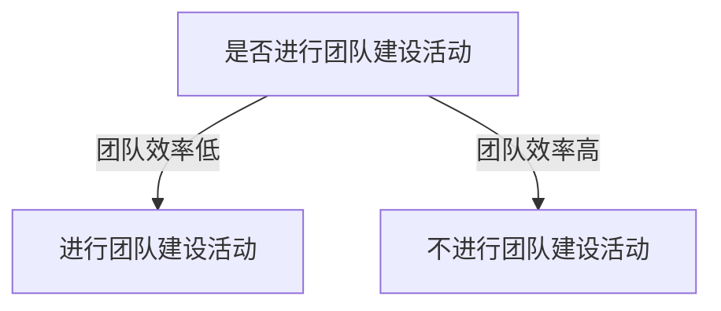

## 1.背景介绍

在当今这个以信息为基础的社会，AI技术的发展已经成为了驱动社会进步的重要力量。无论是在商业领域，还是在科研领域，AI都在起到越来越重要的作用。然而，AI的发展离不开一支强大的技术团队。如何招聘到合适的AI人才，如何建设一支高效的AI团队，这成为了每一个组织面临的重要问题。

## 2.核心概念与联系

在AI人才招聘与团队建设中，有几个核心的概念需要我们理解：

- **AI人才**：AI人才是指具备AI相关知识和技能的人才，包括但不限于机器学习、深度学习、自然语言处理、计算机视觉等领域的专家。

- **招聘**：招聘是指通过一系列的流程和方法，从外部或内部获取具有所需能力和素质的人才。

- **团队建设**：团队建设是指通过一系列的活动和方法，提升团队成员之间的沟通和协作能力，以提高团队的整体效能。

这三个概念之间的联系在于，通过有效的招聘，我们可以获得AI人才；通过有效的团队建设，我们可以提高AI人才的工作效率，从而提高整个组织的效能。

## 3.核心算法原理具体操作步骤

在AI人才招聘与团队建设的过程中，我们可以遵循以下的步骤：

1. **确定招聘需求**：首先，我们需要明确我们需要什么样的AI人才。这需要我们对AI领域有深入的了解，知道哪些技能是我们需要的。

2. **发布招聘信息**：确定了招聘需求后，我们需要将这些信息发布出去，让AI人才知道我们在招聘。

3. **筛选简历**：收到简历后，我们需要对简历进行筛选，挑选出符合我们需求的人才。

4. **面试**：通过筛选出的简历，我们会对候选人进行面试，以进一步了解他们的技能和性格。

5. **录用**：面试后，我们会对候选人进行评估，选择最合适的人才录用。

6. **团队建设**：录用后，我们需要进行团队建设，以提高团队的效率。

## 4.数学模型和公式详细讲解举例说明

在AI人才招聘与团队建设中，我们可以使用一些数学模型和公式来帮助我们进行决策。例如，我们可以使用预测模型来预测一个候选人的潜力，或者使用决策树来帮助我们做出录用决策。

假设我们有一个候选人的数据集，其中包含了候选人的各种特征（如教育背景、工作经验等）和他们的表现（如工作效率）。我们可以使用以下的预测模型来预测一个新的候选人的表现：

$$
y = \beta_0 + \beta_1x_1 + \beta_2x_2 + \ldots + \beta_nx_n
$$

其中，$y$是我们要预测的表现，$x_1, x_2, \ldots, x_n$是候选人的特征，$\beta_0, \beta_1, \ldots, \beta_n$是模型的参数，我们可以通过数据集来学习这些参数。

在团队建设中，我们可以使用决策树来帮助我们做出决策。例如，我们可以使用以下的决策树来决定是否进行团队建设活动：



## 5.项目实践：代码实例和详细解释说明

在实际的项目中，我们可以使用Python的scikit-learn库来实现上述的预测模型。以下是一个简单的例子：

```python
from sklearn.linear_model import LinearRegression
from sklearn.model_selection import train_test_split

# 假设我们有一个数据集df，其中包含了候选人的特征和表现
X = df.drop('performance', axis=1)
y = df['performance']

# 我们将数据集分为训练集和测试集
X_train, X_test, y_train, y_test = train_test_split(X, y, test_size=0.2, random_state=42)

# 我们使用线性回归模型
model = LinearRegression()

# 使用训练集训练模型
model.fit(X_train, y_train)

# 使用测试集评估模型
print(model.score(X_test, y_test))
```

在这个例子中，我们首先从数据集中提取出特征和表现，然后将数据集分为训练集和测试集。接着，我们使用线性回归模型，并使用训练集来训练这个模型。最后，我们使用测试集来评估模型的性能。

## 6.实际应用场景

AI人才招聘与团队建设在许多领域都有应用。例如，在IT公司，人力资源部门可以使用这些方法来招聘AI人才，并通过团队建设来提高团队的效率。在科研机构，研究团队可以使用这些方法来招聘研究人员，并通过团队建设来提高研究的效率。

## 7.工具和资源推荐

在AI人才招聘与团队建设中，有许多工具和资源可以帮助我们。例如，LinkedIn可以帮助我们找到AI人才；Python的scikit-learn库可以帮助我们实现预测模型；Trello可以帮助我们管理团队的工作。

## 8.总结：未来发展趋势与挑战

随着AI的发展，AI人才的需求也在不断增加。然而，AI人才的供应并不能满足需求，这使得AI人才招聘变得越来越困难。同时，由于AI领域的知识更新速度很快，团队建设也面临着很大的挑战。

未来，我们需要找到更有效的方法来招聘AI人才，并通过持续的学习和改进，提高团队的效率。同时，我们也需要关注AI的最新发展，以便及时更新我们的知识和技能。

## 9.附录：常见问题与解答

**Q: 如何确定招聘需求？**

A: 确定招聘需求需要我们对AI领域有深入的了解，知道哪些技能是我们需要的。同时，我们也需要考虑到我们的业务需求，以便找到最合适的人才。

**Q: 如何提高团队的效率？**

A: 提高团队的效率需要我们进行有效的团队建设，提升团队成员之间的沟通和协作能力。同时，我们也需要提供一个良好的工作环境，以便团队成员可以专注于他们的工作。

作者：禅与计算机程序设计艺术 / Zen and the Art of Computer Programming