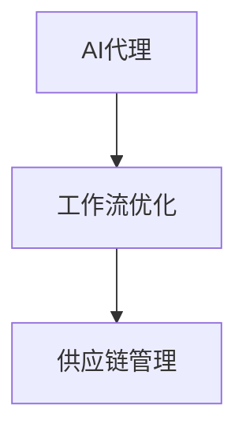

## 1.背景介绍

供应链管理（SCM）是一个复杂的过程，需要处理众多的交互和决策。在过去的几年中，人工智能（AI）在供应链管理中的应用已经引起了广泛的关注。特别是，AI代理在供应链中的工作流优化实践已经取得了显著的成果。

## 2.核心概念与联系

AI代理是一种能够自主进行决策和执行任务的智能系统。在供应链管理中，AI代理可以通过学习和优化工作流程，提高供应链的效率和效果。

工作流优化是指通过改进工作流程，以提高效率和效果。在供应链管理中，工作流优化可能包括改进物流、库存管理、需求预测等方面的过程。

AI代理和工作流优化在供应链管理中的关系可以用以下的 Mermaid 流程图来表示：



## 3.核心算法原理具体操作步骤

AI代理在供应链管理中的工作流优化主要依赖于机器学习算法。以下是一个基本的操作步骤：

1. 数据收集：首先，需要收集供应链管理的相关数据，如历史销售数据、库存数据、物流数据等。

2. 数据预处理：对收集的数据进行预处理，包括数据清洗、特征选择等。

3. 模型训练：使用机器学习算法对预处理后的数据进行训练，生成AI代理。

4. 工作流优化：AI代理根据训练得到的模型，对供应链管理中的工作流程进行优化。

5. 结果评估：对AI代理的优化结果进行评估，如计算准确率、召回率等。

## 4.数学模型和公式详细讲解举例说明

在AI代理的训练过程中，通常会使用一种称为梯度下降的优化算法。梯度下降的基本思想是通过迭代更新模型的参数，使得目标函数（如损失函数）的值逐渐减小。

假设我们的目标函数为$f(\theta)$，其中$\theta$是模型的参数。梯度下降的更新公式为：

$$\theta = \theta - \eta \nabla f(\theta)$$

其中，$\eta$是学习率，$\nabla f(\theta)$是目标函数$f(\theta)$关于参数$\theta$的梯度。

## 5.项目实践：代码实例和详细解释说明

以下是一个使用Python和scikit-learn库进行AI代理训练的简单示例：

```python
from sklearn.ensemble import RandomForestRegressor
from sklearn.model_selection import train_test_split

# 数据预处理
# 假设X是特征数据，y是目标数据
X_train, X_test, y_train, y_test = train_test_split(X, y, test_size=0.2, random_state=42)

# 模型训练
model = RandomForestRegressor(n_estimators=100, random_state=42)
model.fit(X_train, y_train)

# 工作流优化
# 假设new_data是新的特征数据
predictions = model.predict(new_data)
```

在这个示例中，我们首先对数据进行预处理，然后使用随机森林算法对数据进行训练，最后根据训练得到的模型对新的数据进行预测，以优化工作流。

## 6.实际应用场景

AI代理在供应链管理中的工作流优化实践已经被广泛应用于各种场景，如：

- 物流优化：AI代理可以通过预测货物的需求和供应，优化物流路径，降低运输成本。

- 库存管理：AI代理可以通过预测销售量，优化库存，减少库存成本。

- 需求预测：AI代理可以通过分析历史销售数据，预测未来的需求，帮助企业做出更好的决策。

## 7.工具和资源推荐

以下是一些在AI代理在供应链管理中的工作流优化实践中常用的工具和资源：

- Python：一种广泛用于数据分析和机器学习的编程语言。

- scikit-learn：一个提供大量机器学习算法的Python库。

- TensorFlow：一个强大的深度学习框架。

- Keras：一个基于TensorFlow的高级深度学习框架。

- Jupyter Notebook：一个方便进行交互式编程和数据分析的工具。

## 8.总结：未来发展趋势与挑战

随着技术的发展，AI代理在供应链管理中的工作流优化实践将会越来越普遍。然而，这也带来了一些挑战，如数据安全问题、模型的可解释性问题等。因此，我们需要继续努力，解决这些问题，以实现AI代理在供应链管理中的更广泛应用。

## 9.附录：常见问题与解答

1. 问题：AI代理在供应链管理中的工作流优化实践需要什么样的数据？

   答：通常需要历史销售数据、库存数据、物流数据等。

2. 问题：如何评估AI代理的优化结果？

   答：可以通过计算准确率、召回率等指标来评估AI代理的优化结果。

3. 问题：AI代理在供应链管理中的工作流优化实践有哪些挑战？

   答：主要的挑战包括数据安全问题、模型的可解释性问题等。

作者：禅与计算机程序设计艺术 / Zen and the Art of Computer Programming