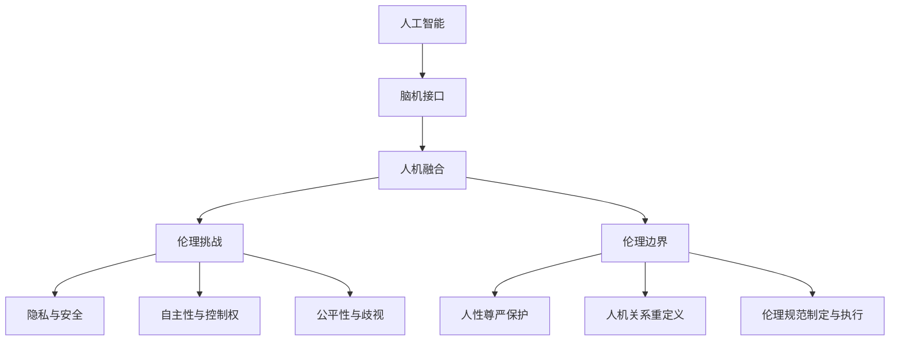

# AI伦理与脑机接口：人机融合的伦理边界

## 1. 背景介绍
### 1.1 人工智能的飞速发展
#### 1.1.1 人工智能的定义与分类
#### 1.1.2 人工智能的发展历程
#### 1.1.3 人工智能的应用现状

### 1.2 脑机接口技术的兴起
#### 1.2.1 脑机接口的概念与原理
#### 1.2.2 脑机接口的研究进展
#### 1.2.3 脑机接口的潜在应用

### 1.3 AI伦理的重要性
#### 1.3.1 AI伦理的内涵与外延
#### 1.3.2 AI伦理的现实意义
#### 1.3.3 AI伦理的研究现状

## 2. 核心概念与联系
### 2.1 人工智能与脑机接口的关系
#### 2.1.1 人工智能在脑机接口中的应用
#### 2.1.2 脑机接口促进人工智能的发展
#### 2.1.3 人机融合：人工智能与脑机接口的结合

### 2.2 人机融合带来的伦理挑战
#### 2.2.1 隐私与安全问题
#### 2.2.2 自主性与控制权问题
#### 2.2.3 公平性与歧视问题

### 2.3 人机融合的伦理边界
#### 2.3.1 人性尊严的保护
#### 2.3.2 人机关系的重新定义
#### 2.3.3 伦理规范的制定与执行

## 3. 核心算法原理具体操作步骤
### 3.1 脑机接口的信号采集与处理
#### 3.1.1 脑电信号的采集方法
#### 3.1.2 信号预处理与降噪
#### 3.1.3 特征提取与选择

### 3.2 人工智能算法在脑机接口中的应用
#### 3.2.1 机器学习算法
#### 3.2.2 深度学习算法
#### 3.2.3 强化学习算法

### 3.3 人机交互的实现步骤
#### 3.3.1 意图识别与解码
#### 3.3.2 命令生成与执行
#### 3.3.3 反馈与适应

## 4. 数学模型和公式详细讲解举例说明
### 4.1 脑电信号的数学建模
#### 4.1.1 时域分析
#### 4.1.2 频域分析
#### 4.1.3 时频分析

### 4.2 机器学习算法的数学原理
#### 4.2.1 支持向量机(SVM)
#### 4.2.2 随机森林(Random Forest)
#### 4.2.3 k-近邻(kNN)

### 4.3 深度学习算法的数学原理 
#### 4.3.1 卷积神经网络(CNN)
#### 4.3.2 循环神经网络(RNN)
#### 4.3.3 长短期记忆网络(LSTM)

## 5. 项目实践：代码实例和详细解释说明
### 5.1 脑电信号采集与预处理
#### 5.1.1 使用OpenBCI采集脑电数据
#### 5.1.2 Python实现信号滤波与降噪
#### 5.1.3 提取脑电信号的时域与频域特征

### 5.2 基于机器学习的意图识别
#### 5.2.1 使用scikit-learn构建SVM分类器
#### 5.2.2 Random Forest实现运动想象分类
#### 5.2.3 kNN算法进行情绪识别

### 5.3 基于深度学习的脑机接口
#### 5.3.1 基于CNN的视觉刺激识别
#### 5.3.2 使用RNN实现语音想象识别
#### 5.3.3 LSTM网络预测用户意图

## 6. 实际应用场景
### 6.1 医疗领域
#### 6.1.1 辅助瘫痪患者恢复运动能力
#### 6.1.2 帮助失语症患者恢复语言能力
#### 6.1.3 治疗神经退行性疾病

### 6.2 教育领域
#### 6.2.1 提高学习效率与注意力
#### 6.2.2 个性化学习与智能辅导
#### 6.2.3 特殊儿童教育

### 6.3 娱乐领域
#### 6.3.1 脑控游戏与虚拟现实
#### 6.3.2 情绪识别与调节
#### 6.3.3 社交互动与沟通

## 7. 工具和资源推荐
### 7.1 开源软件与库
#### 7.1.1 OpenBCI：开源脑机接口平台
#### 7.1.2 MNE：脑电信号处理的Python库
#### 7.1.3 TensorFlow与PyTorch：深度学习框架

### 7.2 数据集与挑战赛
#### 7.2.1 BCI Competition：脑机接口竞赛
#### 7.2.2 EEG Motor Movement/Imagery Dataset：运动想象数据集
#### 7.2.3 DEAP Dataset：情绪识别数据集

### 7.3 学习资源与社区
#### 7.3.1 NeuroTechX：全球脑机接口社区
#### 7.3.2 《Brain-Computer Interfacing》：脑机接口入门书籍
#### 7.3.3 Coursera与edX：在线学习平台

## 8. 总结：未来发展趋势与挑战
### 8.1 人机融合的未来愿景
#### 8.1.1 增强人类认知与体验
#### 8.1.2 促进人机协作与共生
#### 8.1.3 推动科技进步与社会发展

### 8.2 技术挑战与突破方向
#### 8.2.1 提高脑机接口的精度与可靠性
#### 8.2.2 实现长期稳定的脑机交互
#### 8.2.3 探索新型脑机接口方案

### 8.3 伦理挑战与应对策略
#### 8.3.1 加强伦理意识与教育
#### 8.3.2 建立伦理审查与监管机制
#### 8.3.3 促进跨学科交流与合作

## 9. 附录：常见问题与解答
### 9.1 脑机接口会不会侵犯隐私？
### 9.2 人机融合会导致失控吗？
### 9.3 如何防止脑机接口技术被滥用？
### 9.4 普通人能使用脑机接口吗？
### 9.5 脑机接口对健康有害吗？

人工智能与脑机接口技术的快速发展，正在推动人机融合的进程。人机融合为人类社会带来了前所未有的机遇，但同时也引发了一系列亟待解决的伦理问题。隐私与安全、自主性与控制权、公平性与歧视等问题，无不考验着人类的伦理底线。

面对人机融合带来的伦理挑战，我们必须重新审视人机关系，明确人机融合的伦理边界。保护人性尊严，重新定义人机关系，制定并执行相应的伦理规范，是人机融合时代的必然要求。只有在坚守伦理底线的前提下，人机融合才能真正造福人类，推动社会的进步与发展。

技术的进步从来都是一把双刃剑，关键在于如何使用和管控。人工智能和脑机接口技术也不例外。我们要充分发挥其积极作用，造福人类社会；但同时也要警惕其潜在的负面影响，确保技术发展不会偏离伦理轨道。这需要科技工作者、伦理学者、立法者、政府、企业、公众等各方共同努力，在促进技术创新的同时，加强伦理意识，建立健全的法律法规和监管机制，共同构建人机融合的美好未来。

放眼未来，人机融合必将进一步推动人工智能和脑机接口技术的发展，为人类认知和体验带来革命性的变化。但与此同时，伦理问题也将日益凸显。我们要以开放、包容、审慎的态度，积极应对人机融合带来的伦理挑战，在人文关怀与科技进步之间找到平衡点，开创人机和谐共生的崭新时代。

作者：禅与计算机程序设计艺术 / Zen and the Art of Computer Programming