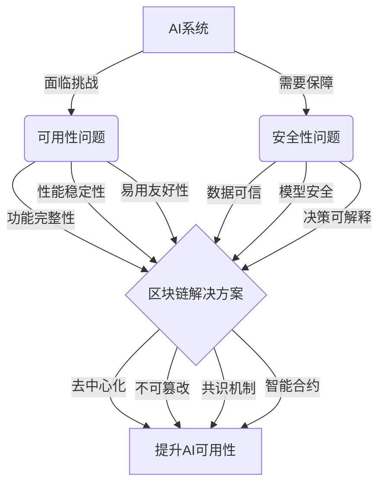

# AI可用性与区块链：安全可靠，透明可信

## 1. 背景介绍

### 1.1 人工智能的发展现状

人工智能(Artificial Intelligence, AI)技术近年来取得了突飞猛进的发展。从语音识别、图像识别到自然语言处理等领域,AI正在深刻改变着我们的生活和工作方式。然而,在AI技术大规模应用的同时,其可用性和安全性问题也日益凸显。

### 1.2 区块链技术的兴起

区块链(Blockchain)作为一种去中心化、不可篡改的分布式账本技术,为解决AI可用性和安全性问题提供了新的思路。区块链通过密码学原理构建信任,保证数据的真实性和一致性,有望成为AI系统的可靠基础设施。

### 1.3 AI与区块链融合的意义

AI与区块链的融合,不仅能提升AI系统的安全性和可靠性,还能促进数据共享、模型训练等环节的透明和可信。本文将深入探讨AI可用性面临的挑战,阐述区块链的核心原理,并提出将二者结合的解决方案和应用场景。

## 2. 核心概念与联系

### 2.1 AI可用性的内涵

- 2.1.1 功能完整性
- 2.1.2 性能稳定性
- 2.1.3 易用友好性
- 2.1.4 安全可控性

### 2.2 区块链的核心特征

- 2.2.1 去中心化
- 2.2.2 不可篡改
- 2.2.3 共识机制
- 2.2.4 智能合约

### 2.3 AI与区块链的关联

- 2.3.1 区块链为AI提供可信数据
- 2.3.2 区块链保障AI模型安全
- 2.3.3 区块链促进AI决策可解释
- 2.3.4 AI优化区块链性能



## 3. 核心算法原理具体操作步骤

### 3.1 区块链的数据结构

- 3.1.1 区块的组成
- 3.1.2 链式结构
- 3.1.3 Merkle树

### 3.2 区块链的共识算法

- 3.2.1 工作量证明(PoW)
- 3.2.2 权益证明(PoS)
- 3.2.3 授权证明(DPoS)
- 3.2.4 实用拜占庭容错(PBFT)

### 3.3 区块链与AI结合的操作步骤

- 3.3.1 在区块链上存储AI数据
- 3.3.2 利用智能合约控制AI模型使用
- 3.3.3 基于区块链的AI模型训练
- 3.3.4 区块链上的AI决策记录与追溯

## 4. 数学模型和公式详细讲解举例说明

### 4.1 区块链的密码学基础

- 4.1.1 哈希函数
- 4.1.2 非对称加密
- 4.1.3 数字签名

### 4.2 共识算法的数学原理

- 4.2.1 PoW的数学难题
- 4.2.2 PoS的权益计算
- 4.2.3 PBFT的投票机制

### 4.3 AI模型的数学表示

- 4.3.1 神经网络的数学描述
- 4.3.2 损失函数与优化算法
- 4.3.3 模型评估指标

举例说明:
假设在区块链上部署了一个用于图像识别的卷积神经网络(CNN)模型,其损失函数为交叉熵:

$$
L = -\frac{1}{N}\sum_{i=1}^N\sum_{j=1}^Cy_{ij}\log(p_{ij})
$$

其中,$y_{ij}$为第$i$个样本属于第$j$类的真实标签,$p_{ij}$为模型预测的概率。

通过智能合约控制模型的训练和调用,每次迭代的损失值和评估指标都会被记录在区块链上,保证了训练过程的透明和可信。

## 5. 项目实践：代码实例和详细解释说明

### 5.1 基于以太坊的AI数据存储

```solidity
pragma solidity ^0.8.0;

contract AIDataStorage {
    struct DataItem {
        uint256 id;
        string dataHash;
        address owner;
    }
    
    mapping(uint256 => DataItem) public dataItems;
    uint256 public dataItemCount;
    
    function addDataItem(string memory _dataHash) public {
        dataItemCount++;
        dataItems[dataItemCount] = DataItem(dataItemCount, _dataHash, msg.sender);
    }
    
    function getDataItem(uint256 _id) public view returns (uint256, string memory, address) {
        DataItem memory item = dataItems[_id];
        return (item.id, item.dataHash, item.owner);
    }
}
```

上述代码实现了一个简单的AI数据存储合约,每个数据项包含唯一标识、数据哈希值和所有者地址。通过`addDataItem`函数可以添加新的数据项,`getDataItem`函数则可以根据ID查询数据项的详细信息。

### 5.2 基于区块链的AI模型控制

```solidity
pragma solidity ^0.8.0;

contract AIModelControl {
    address public modelOwner;
    mapping(address => bool) public authorizedUsers;
    
    constructor() {
        modelOwner = msg.sender;
    }
    
    function authorizeUser(address _user) public {
        require(msg.sender == modelOwner, "Only model owner can authorize users.");
        authorizedUsers[_user] = true;
    }
    
    function useModel(string memory _input) public view returns (string memory) {
        require(authorizedUsers[msg.sender], "User not authorized to use the model.");
        // 模型推理逻辑,返回结果
        return "Model inference result";
    }
}
```

这个智能合约实现了对AI模型使用的控制。只有模型所有者可以授权其他用户使用模型,授权的用户才能调用`useModel`函数进行模型推理。实际项目中可以根据需要扩展模型控制的粒度和策略。

## 6. 实际应用场景

### 6.1 医疗领域

- 6.1.1 医疗数据安全共享
- 6.1.2 AI辅助诊断可信

### 6.2 金融领域

- 6.2.1 风控模型公平可查
- 6.2.2 智能投顾透明可控

### 6.3 自动驾驶领域

- 6.3.1 车辆数据不可篡改
- 6.3.2 决策过程可追溯

### 6.4 供应链管理

- 6.4.1 货物溯源
- 6.4.2 智能合约自动执行

## 7. 工具和资源推荐

### 7.1 以太坊开发工具

- 7.1.1 Solidity
- 7.1.2 Truffle
- 7.1.3 Web3.js

### 7.2 区块链平台

- 7.2.1 以太坊
- 7.2.2 Hyperledger Fabric
- 7.2.3 FISCO BCOS

### 7.3 AI开发框架

- 7.3.1 TensorFlow
- 7.3.2 PyTorch
- 7.3.3 Keras

### 7.4 相关学习资源

- 7.4.1 在线课程
- 7.4.2 技术博客
- 7.4.3 开源项目

## 8. 总结：未来发展趋势与挑战

### 8.1 AI与区块链深度融合

- 8.1.1 AI驱动的智能合约
- 8.1.2 区块链优化的AI训练

### 8.2 跨链互操作

- 8.2.1 不同区块链之间的数据交互
- 8.2.2 AI模型的跨链迁移

### 8.3 隐私保护与安全

- 8.3.1 联邦学习
- 8.3.2 多方安全计算
- 8.3.3 可信执行环境

### 8.4 标准化与规范化

- 8.4.1 AI模型描述标准
- 8.4.2 区块链接口规范

### 8.5 法律法规与伦理

- 8.5.1 数据所有权与使用权
- 8.5.2 AI决策的法律责任
- 8.5.3 算法公平与不歧视

## 9. 附录：常见问题与解答

### 9.1 如何选择适合的区块链平台？

需要考虑区块链的性能、安全性、智能合约支持等因素,根据具体应用场景选择合适的平台。以太坊适合通用智能合约开发,Hyperledger Fabric适合企业级应用,FISCO BCOS在金融领域有广泛实践。

### 9.2 AI模型的训练数据如何上链？

可以将训练数据的哈希值上链,以确保数据的完整性和不可篡改性。大文件可以存储在IPFS等分布式存储系统中,在区块链上记录文件哈希。

### 9.3 如何保护隐私数据？

可以使用联邦学习、多方安全计算等技术,在不泄露原始数据的情况下进行建模。同态加密可以实现加密数据的直接计算。也可以使用可信执行环境(如Intel SGX)保护数据和模型。

### 9.4 区块链的性能瓶颈如何解决？

可以采用分片、侧链、跨链等扩容方案提升区块链性能。针对AI应用,可以设计性能友好的共识机制和智能合约。离线计算、状态通道等方法也能缓解性能压力。

### 9.5 AI系统的决策可解释性如何实现？

利用区块链不可篡改、可追溯的特性,将AI决策过程的关键节点数据和参数上链存证。必要时可以通过智能合约触发决策重演和审计,实现可解释性。可解释性强的AI模型(如决策树)也可以直接部署在区块链上。

---

作者：禅与计算机程序设计艺术 / Zen and the Art of Computer Programming