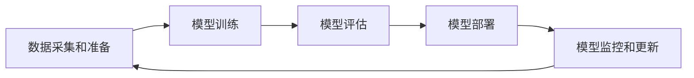

# AI工程最佳实践原理与代码实战案例讲解

## 1.背景介绍

### 1.1 人工智能的崛起

人工智能(AI)已经成为当今科技领域最热门、最具革命性的技术之一。从语音助手到自动驾驶汽车,从医疗诊断到金融分析,AI系统正在渗透到我们生活的方方面面。随着算力的不断提升、海量数据的积累以及算法的创新,AI技术的应用前景是无限广阔的。

### 1.2 AI工程的重要性

然而,要将AI技术从实验室成功转化为可扩展的产品和服务,需要高度专业化的AI工程实践。AI工程是一门跨学科的领域,融合了机器学习、软件工程、系统架构等多方面的知识,旨在构建高质量、可靠和高效的AI系统。

### 1.3 AI工程挑战

AI工程面临诸多挑战,例如:

- 数据质量和隐私
- 模型复杂性和可解释性
- 系统鲁棒性和安全性
- 部署和运维的复杂性
- 伦理和公平性考量

只有通过最佳实践和严格的工程方法,才能应对这些挑战,确保AI系统的高效、可靠和负责任的运行。

## 2.核心概念与联系

### 2.1 机器学习生命周期

AI工程的核心是机器学习模型的开发和部署。机器学习生命周期包括以下关键阶段:



每个阶段都需要精心设计和实施,以确保模型的质量和性能。

### 2.2 数据管理

高质量的数据是训练高效AI模型的基础。数据管理包括数据采集、清洗、标注、版本控制和隐私保护等方面。建立健全的数据管理流程对于AI工程至关重要。

### 2.3 模型开发

模型开发包括特征工程、算法选择、模型训练和优化等步骤。选择合适的机器学习算法、调整超参数、处理过拟合和欠拟合等都是模型开发的重点。

### 2.4 模型评估

在将模型投入生产之前,必须对其进行全面的评估,包括准确性、鲁棒性、公平性和可解释性等方面。建立标准的评估流程对于确保模型质量至关重要。

### 2.5 模型部署

将训练好的模型部署到生产环境中是AI工程的关键一步。这需要考虑模型服务化、资源管理、监控和自动伸缩等问题。

### 2.6 模型监控和更新

在生产环境中,需要持续监控模型的性能,并根据新数据和新需求及时更新模型。建立自动化的模型更新流水线可以提高效率和质量。

### 2.7 AI工程最佳实践

AI工程最佳实践贯穿于整个生命周期,包括:

- 可重复性和版本控制
- 自动化和持续集成/持续交付(CI/CD)
- 测试和质量保证
- 文档和协作
- 安全性和隐私保护
- 伦理和公平性考量

遵循这些最佳实践可以提高AI系统的质量、可靠性和可维护性。

## 3.核心算法原理具体操作步骤

AI工程涉及多种核心算法,例如监督学习、非监督学习、强化学习、迁移学习等。本节将重点介绍监督学习算法的原理和实现步骤。

### 3.1 监督学习概述

监督学习是机器学习中最常见的一种范式。它的目标是从带标签的训练数据中学习一个模型,并将其应用于新的未标记数据。常见的监督学习任务包括分类和回归。

### 3.2 线性回归

线性回归是最简单的监督学习算法之一,用于解决回归问题。其核心思想是找到一条最佳拟合直线,使预测值与实际值之间的均方误差最小化。

1. **数据准备**:收集带有输入特征(X)和目标值(y)的数据集。
2. **定义模型**:线性回归模型可以表示为 $y = \theta_0 + \theta_1x_1 + \theta_2x_2 + ... + \theta_nx_n$,其中$\theta$是需要学习的参数。
3. **代价函数**:定义代价函数(均方误差)$J(\theta) = \frac{1}{2m}\sum_{i=1}^m(h_\theta(x^{(i)}) - y^{(i)})^2$,其中$m$是训练样本数量。
4. **优化算法**:使用梯度下降等优化算法找到最小化代价函数的参数$\theta$。
5. **预测**:对新的输入数据$x^{(new)}$,使用学习到的参数$\theta$进行预测$y^{(new)} = h_\theta(x^{(new)})$。

### 3.3 逻辑回归

逻辑回归是一种用于解决二分类问题的监督学习算法。它通过学习一个概率模型,预测输入数据属于某个类别的概率。

1. **数据准备**:收集带有输入特征(X)和二元标签(y=0或1)的数据集。
2. **定义模型**:逻辑回归模型可以表示为$h_\theta(x) = g(\theta^Tx) = \frac{1}{1 + e^{-\theta^Tx}}$,其中$g(z)$是sigmoid函数。
3. **代价函数**:定义交叉熵代价函数$J(\theta) = -\frac{1}{m}\sum_{i=1}^m[y^{(i)}\log h_\theta(x^{(i)}) + (1 - y^{(i)})\log(1 - h_\theta(x^{(i)}))]$。
4. **优化算法**:使用梯度下降等优化算法找到最小化代价函数的参数$\theta$。
5. **预测**:对新的输入数据$x^{(new)}$,使用学习到的参数$\theta$计算$h_\theta(x^{(new)})$,若大于0.5则预测为1,否则预测为0。

### 3.4 神经网络

神经网络是一种强大的监督学习模型,可以用于解决复杂的分类和回归问题。它由多层神经元组成,每层通过权重矩阵和激活函数进行计算。

1. **数据准备**:收集带有输入特征(X)和标签(y)的数据集。
2. **定义模型**:神经网络由输入层、隐藏层和输出层组成。每层通过权重矩阵$W$和偏置向量$b$进行线性变换,再通过激活函数(如ReLU、Sigmoid等)进行非线性变换。
3. **代价函数**:根据任务定义合适的代价函数,如交叉熵损失函数(分类)或均方误差(回归)。
4. **优化算法**:使用反向传播算法计算梯度,再通过优化算法(如随机梯度下降)更新权重和偏置。
5. **预测**:对新的输入数据$x^{(new)}$,通过前向传播计算输出层的值,作为预测结果。

神经网络的性能很大程度上取决于网络结构(层数、神经元数量)、超参数(学习率、正则化等)和训练数据的质量。

## 4.数学模型和公式详细讲解举例说明

本节将详细讲解一些核心数学模型和公式,并给出具体的例子说明。

### 4.1 线性代数

线性代数是机器学习的基础数学工具。矩阵和向量运算在许多算法中都有应用,例如:

- 数据表示:将数据表示为矩阵或向量形式,方便进行计算。
- 线性回归:$y = X\theta$,其中$X$是输入特征矩阵,$\theta$是参数向量。
- 神经网络:$z = W^Tx + b$,其中$W$是权重矩阵,$x$是输入向量,$b$是偏置向量。

```python
import numpy as np

# 矩阵乘法
X = np.array([[1, 2], [3, 4]])
W = np.array([[5, 6], [7, 8]])
Y = X.dot(W)
print(Y)  # [[19 22], [43 50]]
```

### 4.2 概率论和统计

概率论和统计学在机器学习中也扮演着重要角色,例如:

- 贝叶斯定理:用于计算条件概率,在朴素贝叶斯分类器中有应用。
- 高斯分布:常用于建模连续数据,如高斯混合模型聚类。
- 最大似然估计:用于估计概率模型的参数,如逻辑回归中的参数估计。

```python
import math

# 计算高斯分布概率密度函数
def gaussian(x, mu, sigma):
    return 1 / (math.sqrt(2 * math.pi) * sigma) * math.exp(-(x - mu)**2 / (2 * sigma**2))

mu, sigma = 0, 1  # 均值和标准差
x = 1
p = gaussian(x, mu, sigma)
print(p)  # 0.24197072451914337
```

### 4.3 优化理论

优化理论为机器学习算法提供了求解最优解的方法,例如:

- 梯度下降:用于最小化代价函数,在线性回归、逻辑回归等算法中使用。
- 凸优化:用于求解凸函数的最小值,如支持向量机中的对偶问题。
- 约束优化:在优化过程中加入约束条件,如正则化项。

```python
# 梯度下降法求解线性回归
import numpy as np

X = np.array([[1, 1], [1, 2], [2, 2], [2, 3]])
y = np.dot(X, np.array([1, 2])) + 3  # y = x0 + 2*x1 + 3

# 建立线性模型
theta = np.random.randn(2)  # 随机初始化参数

def cost(X, y, theta):
    m = len(y)
    return 1 / (2 * m) * np.sum((X.dot(theta) - y) ** 2)  # 均方误差代价函数

learning_rate = 0.01
for i in range(1000):
    theta -= learning_rate * (1 / len(y)) * X.T.dot(X.dot(theta) - y)  # 梯度下降

print(theta)  # [0.99966187 2.00067487] 
```

### 4.4 信息论

信息论为机器学习提供了量化信息的方法,例如:

- 信息熵:衡量随机变量的不确定性,在决策树算法中用于选择最优特征。
- 交叉熵:衡量两个概率分布之间的差异,常用作分类任务的损失函数。
- 互信息:衡量两个随机变量之间的相关性,在特征选择中有应用。

$$H(X) = -\sum_{i=1}^n p(x_i)\log p(x_i)$$

上式是计算离散随机变量$X$的信息熵,其中$p(x_i)$是$x_i$的概率。

## 5.项目实践:代码实例和详细解释说明

为了更好地理解AI工程的实践,本节将通过一个实际案例,介绍如何使用Python和流行的机器学习库(如scikit-learn、TensorFlow等)构建、训练和部署机器学习模型。

### 5.1 项目概述

我们将构建一个图像分类模型,用于识别手写数字。这是一个经典的机器学习问题,可以帮助读者掌握端到端的AI工程流程。

### 5.2 数据准备

我们将使用著名的MNIST数据集,它包含60,000个训练图像和10,000个测试图像,每个图像都是28x28像素的手写数字图像,标签为0-9。

```python
from tensorflow.keras.datasets import mnist
import matplotlib.pyplot as plt

# 加载MNIST数据集
(X_train, y_train), (X_test, y_test) = mnist.load_data()

# 可视化一些样本图像
plt.figure(figsize=(10, 2))
for i in range(10):
    plt.subplot(1, 10, i + 1)
    plt.imshow(X_train[i], cmap='gray')
    plt.axis('off')
plt.show()
```

### 5.3 模型构建

我们将使用TensorFlow构建一个简单的卷积神经网络(CNN)模型,包括卷积层、池化层和全连接层。

```python
import tensorflow as tf
from tensorflow.keras.models import Sequential
from tensorflow.keras.layers import Conv2D, MaxPooling2D