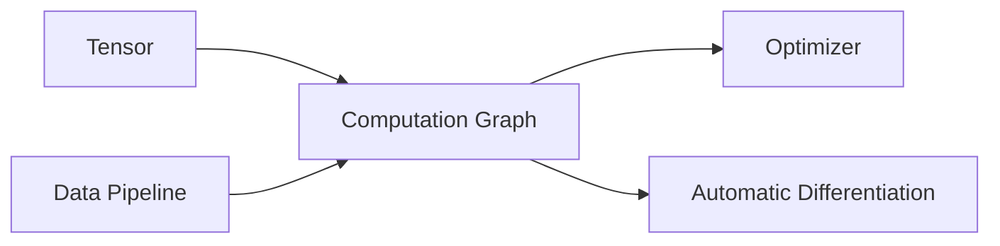

# AI开发环境搭建原理与代码实战案例讲解

## 1. 背景介绍
### 1.1 AI开发环境的重要性
在人工智能的研究和应用中,一个高效、易用、功能完备的开发环境至关重要。它能够帮助开发者快速上手,提高开发效率,降低开发成本。一个优秀的AI开发环境应该具备以下特点:
- 提供丰富的工具和库,涵盖数据处理、模型训练、模型部署等各个环节。
- 拥有活跃的社区支持,丰富的文档资料和学习资源。
- 能够支持多种编程语言,如Python、R、Java等。
- 具备良好的可扩展性,能够与其他工具和平台无缝集成。
- 部署灵活,支持本地、云端等多种部署方式。

### 1.2 主流AI开发环境概览
目前主流的AI开发环境包括:
- TensorFlow: Google开源的端到端机器学习平台,提供了一整套工具、库和社区资源。
- PyTorch: Facebook开源的深度学习框架,以其灵活性和易用性著称。
- Keras: 基于TensorFlow和Theano的高级神经网络API,旨在实现快速实验。
- Scikit-learn: 基于Python的机器学习库,涵盖分类、回归、聚类、降维等算法。
- Apache MXNet: 一个高效、灵活的深度学习框架,支持多种编程语言。
- Microsoft Cognitive Toolkit (CNTK): 微软开源的深度学习工具包。

### 1.3 本文重点
本文将重点介绍TensorFlow和PyTorch这两个主流的AI开发环境,从环境搭建、核心概念、实战案例等方面进行深入讲解,帮助读者快速掌握AI开发的基本技能。

## 2. 核心概念与联系
### 2.1 张量(Tensor)
张量是AI开发中的基本数据结构,可以看作是多维数组。一个标量可以看作0维张量,向量是1维张量,矩阵是2维张量。张量的维度也称为阶(Rank)。TensorFlow和PyTorch都以张量作为基本数据结构。

### 2.2 计算图(Computation Graph) 
计算图描述了一系列计算操作的过程,每个节点表示一个操作(Operation),边表示节点之间的依赖关系。TensorFlow通过计算图来表示模型,并在会话(Session)中执行计算图。PyTorch的计算图是动态的,可以在运行时动态构建。

### 2.3 自动微分(Automatic Differentiation)
自动微分是深度学习框架的核心特性,它能够自动计算导数,简化了模型训练过程。TensorFlow和PyTorch都支持自动微分,TensorFlow通过tf.GradientTape实现,PyTorch通过autograd包实现。

### 2.4 优化器(Optimizer)
优化器用于最小化损失函数,更新模型参数。常见的优化器包括:
- 随机梯度下降(SGD)
- 自适应矩估计(Adam)  
- 均方根传播(RMSprop)
- 带动量的SGD(Momentum)

TensorFlow和PyTorch都提供了丰富的优化器选择。

### 2.5 数据管道(Data Pipeline)
数据管道用于数据的加载、预处理和增强,是模型训练的重要环节。TensorFlow提供了tf.data模块,PyTorch提供了torch.utils.data模块,用于构建高效的数据管道。

### 2.6 核心概念之间的联系



上图展示了几个核心概念之间的联系:张量是构建计算图的基础,计算图中的操作通过自动微分来计算梯度,优化器根据梯度更新模型参数。数据管道负责提供训练数据。

## 3. 核心算法原理具体操作步骤
本节以线性回归为例,介绍使用TensorFlow和PyTorch实现的具体步骤。

### 3.1 TensorFlow实现线性回归
#### 3.1.1 准备数据

```python
import numpy as np
import tensorflow as tf

# 生成随机数据
X = np.random.rand(100, 1) 
y = 4 + 3 * X + np.random.randn(100, 1)

# 创建数据集
dataset = tf.data.Dataset.from_tensor_slices((X, y))
dataset = dataset.batch(10)
```

#### 3.1.2 定义模型

```python
class LinearRegression(tf.keras.Model):
    def __init__(self):
        super().__init__()
        self.dense = tf.keras.layers.Dense(units=1, input_shape=[1,])
        
    def call(self, x):
        y_pred = self.dense(x)
        return y_pred
    
model = LinearRegression()    
```

#### 3.1.3 定义损失函数和优化器

```python  
loss_object = tf.keras.losses.MeanSquaredError()
optimizer = tf.keras.optimizers.SGD(learning_rate=0.01)
```

#### 3.1.4 训练模型

```python
@tf.function
def train_step(x, y):
    with tf.GradientTape() as tape:
        predictions = model(x)
        loss = loss_object(y, predictions)
    gradients = tape.gradient(loss, model.trainable_variables)
    optimizer.apply_gradients(zip(gradients, model.trainable_variables))
    
    return loss

epochs = 10
for epoch in range(epochs):
    for x_batch, y_batch in dataset:
        loss = train_step(x_batch, y_batch)
    print(f'Epoch {epoch+1}, Loss: {loss.numpy()}')
```

### 3.2 PyTorch实现线性回归
#### 3.2.1 准备数据

```python
import numpy as np
import torch
from torch.utils.data import TensorDataset, DataLoader

# 生成随机数据
X = np.random.rand(100, 1)
y = 4 + 3 * X + np.random.randn(100, 1) 

# 转换为张量
X_tensor = torch.from_numpy(X).float()
y_tensor = torch.from_numpy(y).float()

# 创建数据集和数据加载器  
dataset = TensorDataset(X_tensor, y_tensor)
dataloader = DataLoader(dataset, batch_size=10)
```

#### 3.2.2 定义模型

```python
class LinearRegression(torch.nn.Module):
    def __init__(self):
        super().__init__()
        self.linear = torch.nn.Linear(1, 1)
        
    def forward(self, x):
        y_pred = self.linear(x)
        return y_pred
    
model = LinearRegression()    
```

#### 3.2.3 定义损失函数和优化器

```python
criterion = torch.nn.MSELoss()
optimizer = torch.optim.SGD(model.parameters(), lr=0.01)  
```

#### 3.2.4 训练模型

```python
epochs = 10
for epoch in range(epochs):
    for x_batch, y_batch in dataloader:
        y_pred = model(x_batch) 
        loss = criterion(y_pred, y_batch)
        
        optimizer.zero_grad()
        loss.backward()
        optimizer.step()
        
    print(f'Epoch {epoch+1}, Loss: {loss.item()}')
```

## 4. 数学模型和公式详细讲解举例说明
线性回归的数学模型如下:

$$\hat{y} = wx + b$$

其中,$\hat{y}$是预测值,$w$是权重,$x$是输入,$b$是偏置。

线性回归的目标是找到最优的$w$和$b$,使得预测值$\hat{y}$尽可能接近真实值$y$。这可以通过最小化均方误差(MSE)来实现:

$$MSE = \frac{1}{n}\sum_{i=1}^n(y_i - \hat{y}_i)^2$$

其中,$n$是样本数量,$y_i$是第$i$个样本的真实值,$\hat{y}_i$是第$i$个样本的预测值。

在训练过程中,我们通过梯度下降法来更新$w$和$b$:

$$w := w - \alpha\frac{\partial MSE}{\partial w}$$
$$b := b - \alpha\frac{\partial MSE}{\partial b}$$

其中,$\alpha$是学习率,控制每次更新的步长。$\frac{\partial MSE}{\partial w}$和$\frac{\partial MSE}{\partial b}$是MSE对$w$和$b$的偏导数,可以通过链式法则求得:

$$\frac{\partial MSE}{\partial w} = \frac{2}{n}\sum_{i=1}^n(y_i - \hat{y}_i)(-x_i)$$
$$\frac{\partial MSE}{\partial b} = \frac{2}{n}\sum_{i=1}^n(y_i - \hat{y}_i)(-1)$$

通过多次迭代,不断更新$w$和$b$,直到MSE收敛到一个较小的值,即可得到最优的模型参数。

## 5. 项目实践：代码实例和详细解释说明
本节以MNIST手写数字识别为例,演示如何使用TensorFlow和PyTorch构建卷积神经网络(CNN)模型。

### 5.1 TensorFlow实现MNIST手写数字识别
#### 5.1.1 准备数据

```python
import tensorflow as tf

(x_train, y_train), (x_test, y_test) = tf.keras.datasets.mnist.load_data()

# 归一化
x_train, x_test = x_train / 255.0, x_test / 255.0

# 增加通道维度
x_train = x_train[..., tf.newaxis]
x_test = x_test[..., tf.newaxis]

# 创建数据集
train_dataset = tf.data.Dataset.from_tensor_slices((x_train, y_train))
train_dataset = train_dataset.shuffle(10000).batch(32)

test_dataset = tf.data.Dataset.from_tensor_slices((x_test, y_test))
test_dataset = test_dataset.batch(32)
```

这里我们从Keras内置的数据集中加载MNIST数据,对图像进行归一化处理,并增加通道维度。然后使用tf.data创建训练集和测试集。

#### 5.1.2 定义模型

```python
class CNN(tf.keras.Model):
    def __init__(self):
        super().__init__()
        self.conv1 = tf.keras.layers.Conv2D(32, 3, activation='relu')
        self.pool1 = tf.keras.layers.MaxPooling2D()
        self.conv2 = tf.keras.layers.Conv2D(64, 3, activation='relu')
        self.pool2 = tf.keras.layers.MaxPooling2D()
        self.flatten = tf.keras.layers.Flatten()
        self.dense1 = tf.keras.layers.Dense(64, activation='relu')
        self.dense2 = tf.keras.layers.Dense(10)
        
    def call(self, x):
        x = self.conv1(x)
        x = self.pool1(x)
        x = self.conv2(x)
        x = self.pool2(x)
        x = self.flatten(x)
        x = self.dense1(x)
        return self.dense2(x)

model = CNN()        
```

这里定义了一个简单的CNN模型,包含两个卷积层、两个池化层和两个全连接层。

#### 5.1.3 定义损失函数和优化器

```python
loss_object = tf.keras.losses.SparseCategoricalCrossentropy(from_logits=True)
optimizer = tf.keras.optimizers.Adam()
```

这里使用SparseCategoricalCrossentropy作为损失函数,Adam作为优化器。

#### 5.1.4 定义评估指标

```python
train_loss = tf.keras.metrics.Mean(name='train_loss')
train_accuracy = tf.keras.metrics.SparseCategoricalAccuracy(name='train_accuracy')

test_loss = tf.keras.metrics.Mean(name='test_loss')  
test_accuracy = tf.keras.metrics.SparseCategoricalAccuracy(name='test_accuracy')
```

这里定义了用于评估模型的指标,包括训练集和测试集的损失和准确率。

#### 5.1.5 定义训练和测试步骤

```python
@tf.function
def train_step(images, labels):
    with tf.GradientTape() as tape:
        predictions = model(images)
        loss = loss_object(labels, predictions)
    gradients = tape.gradient(loss, model.trainable_variables)
    optimizer.apply_gradients(zip(gradients, model.trainable_variables))
    
    train_loss(loss)
    train_accuracy(labels, predictions)

@tf.function    
def test_step(images, labels):
    predictions = model(images)
    loss = loss_object(labels, predictions)
    
    test_loss(loss)
    test_accuracy(labels, predictions)
```

这里定义了训练步骤和测试步骤,分别用于更新模型参数和评估模型性能。

#### 5.1.6 训练和测试模型

```python  
epochs = 5

for epoch in range(epochs):
    for images, labels in train_dataset:
        train_step(images, labels)
        
    for images, labels in test_dataset:  
        test_step(images, labels)
        
    print(f'Epoch {epoch+1}, Loss: {train_loss.result()}, Accuracy: {train_accuracy.result()*100}, '
          f'Test Loss: {test_loss.result()}, Test Accuracy: {test_accuracy.result()*100}')
          
    train_loss.reset_states()
    