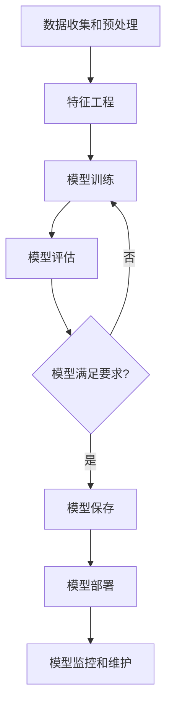

# AI模型部署到Web原理与代码实战案例讲解

## 1.背景介绍

### 1.1 人工智能时代的到来

随着计算能力的不断提高和算法的快速发展,人工智能(AI)技术正在以前所未有的速度渗透到各行各业。从语音助手到自动驾驶汽车,从医疗诊断到金融风险管理,AI已经成为推动创新和提高效率的关键驱动力。然而,要真正释放AI的潜力,仅仅训练出优秀的模型是不够的,我们还需要将这些模型高效、安全地部署到生产环境中,并将其集成到现有的软件系统和基础设施中。

### 1.2 AI模型部署的重要性

AI模型部署是指将训练好的机器学习模型集成到应用程序、系统或设备中的过程。这是将AI从实验室和研究环境转移到实际生产环境的关键步骤。成功的AI模型部署可以为企业带来巨大的价值,包括:

- 提高效率和生产力
- 优化决策过程
- 改善客户体验
- 创造新的收入来源

然而,AI模型部署也面临着诸多挑战,例如模型性能、可扩展性、安全性、监控和治理等。因此,掌握正确的原理和最佳实践对于确保AI模型的顺利部署至关重要。

### 1.3 Web部署的优势

Web应用程序是AI模型部署的理想选择,因为它们可以轻松地访问和使用,并且可以在各种设备和平台上运行。通过将AI模型部署到Web上,我们可以享受以下优势:

- **可访问性**: Web应用程序可以在任何具有互联网连接的设备上访问,无需安装特殊软件。
- **可扩展性**: Web应用程序可以轻松扩展以满足不断增长的用户需求。
- **跨平台兼容性**: Web应用程序可以在不同的操作系统和设备上运行,提供一致的用户体验。
- **集成能力**: Web应用程序可以与其他系统和服务无缝集成,扩展功能。

通过将AI模型部署到Web上,我们可以让更多用户受益于人工智能的强大功能,同时降低了部署和维护的复杂性。

## 2.核心概念与联系

### 2.1 机器学习模型

机器学习模型是AI系统的核心,它通过从数据中学习来做出预测或决策。常见的机器学习模型包括:

- **监督学习模型**: 使用标记数据进行训练,用于分类或回归任务,如图像识别、自然语言处理等。
- **无监督学习模型**: 使用未标记数据进行训练,用于发现数据中的模式和结构,如聚类和降维。
- **强化学习模型**: 通过与环境交互并获得奖励或惩罚来学习,常用于决策和控制问题。

无论是何种类型的模型,它们都需要经过训练和评估,以确保其性能和准确性。训练好的模型可以被保存为文件或二进制格式,以便于部署。

### 2.2 Web应用程序架构

Web应用程序通常采用客户端-服务器架构,其中客户端(通常是Web浏览器)发送请求,服务器处理请求并返回响应。常见的Web应用程序架构包括:

- **单页应用程序(SPA)**: 在客户端加载完整的Web应用程序,通过动态更新页面内容来提供流畅的用户体验。
- **服务器渲染应用程序**: 在服务器端生成HTML页面,然后将其发送给客户端进行渲染。
- **微服务架构**: 将应用程序划分为多个小型、独立的服务,这些服务可以独立部署和扩展。

无论采用何种架构,Web应用程序都需要一个后端服务器来处理业务逻辑和数据操作。这个后端服务器也是AI模型部署的理想位置。

### 2.3 AI模型和Web应用程序的集成

将AI模型集成到Web应用程序中需要考虑以下几个方面:

- **模型加载和初始化**: 在Web应用程序启动时,需要加载和初始化训练好的模型。
- **数据预处理**: 将用户输入或其他数据转换为模型可以理解的格式。
- **模型推理**: 使用加载的模型对输入数据进行预测或决策。
- **结果后处理**: 将模型输出转换为可读的格式,并呈现给用户。

为了实现这些功能,我们需要在Web应用程序的后端服务器上部署AI模型,并提供相应的API接口供前端调用。同时,我们还需要考虑模型的性能、可扩展性和安全性等问题。

## 3.核心算法原理具体操作步骤

在将AI模型部署到Web应用程序之前,我们需要先了解一些核心算法原理和具体操作步骤。以下是一个典型的机器学习模型训练和部署流程:

### 3.1 数据收集和预处理

机器学习模型的性能在很大程度上取决于训练数据的质量。因此,我们需要收集足够的、高质量的数据,并对其进行适当的预处理,包括:

- 数据清洗: 处理缺失值、异常值和重复数据。
- 数据转换: 将数据转换为模型可以处理的格式,如one-hot编码、标准化等。
- 数据增强: 通过各种技术(如旋转、翻转等)生成更多的训练数据。

### 3.2 特征工程

特征工程是从原始数据中提取有用特征的过程,这些特征对于模型的训练和预测至关重要。常见的特征工程技术包括:

- 特征选择: 从原始特征中选择最相关的特征。
- 特征提取: 从原始特征中构建新的、更有意义的特征。
- 特征交互: 通过组合原始特征创建新的交互特征。

### 3.3 模型训练

模型训练是机器学习的核心步骤,它使用训练数据和特征来优化模型的参数,使其能够很好地拟合数据。常见的模型训练算法包括:

- 监督学习算法: 如线性回归、逻辑回归、决策树、支持向量机等。
- 无监督学习算法: 如K-means聚类、主成分分析(PCA)等。
- 深度学习算法: 如卷积神经网络(CNN)、递归神经网络(RNN)等。

模型训练通常需要大量的计算资源,因此我们可以利用GPU加速或分布式计算等技术来提高训练效率。

### 3.4 模型评估

在将模型投入生产之前,我们需要对其进行全面的评估,以确保其性能和准确性。常见的模型评估方法包括:

- holdout验证: 将数据集划分为训练集和测试集,在测试集上评估模型性能。
- 交叉验证: 将数据集划分为多个子集,轮流使用其中一个子集作为测试集。
- 评估指标: 根据任务类型选择合适的评估指标,如准确率、精确率、召回率、F1分数等。

如果模型的性能不满足要求,我们需要返回前面的步骤进行调整,如增加训练数据、改进特征工程或调整模型超参数等。

### 3.5 模型保存

一旦模型通过评估并满足性能要求,我们就需要将其保存下来,以便后续部署和使用。常见的模型保存格式包括:

- Pickle (Python): 将模型对象序列化为二进制文件。
- ONNX: 开放式神经网络交换格式,支持多种框架和环境。
- TensorFlow SavedModel: TensorFlow框架的标准模型保存格式。
- PyTorch Script: PyTorch框架的模型保存和序列化格式。

保存模型时,我们还需要记录模型的元数据,如版本号、训练数据信息、评估指标等,以便于后续的模型管理和维护。

## 4.数学模型和公式详细讲解举例说明

在机器学习中,数学模型和公式扮演着至关重要的角色。它们不仅描述了算法的理论基础,还为模型的训练和优化提供了指导。以下是一些常见的数学模型和公式,以及它们在机器学习中的应用。

### 4.1 线性回归

线性回归是一种简单但强大的监督学习算法,它试图找到一条最佳拟合直线,使得数据点到直线的距离之和最小。线性回归的数学模型如下:

$$y = \theta_0 + \theta_1x_1 + \theta_2x_2 + ... + \theta_nx_n$$

其中:
- $y$ 是目标变量
- $x_1, x_2, ..., x_n$ 是特征变量
- $\theta_0, \theta_1, ..., \theta_n$ 是模型参数,需要通过训练来估计

线性回归通常使用最小二乘法来优化模型参数,即最小化以下代价函数:

$$J(\theta) = \frac{1}{2m}\sum_{i=1}^m(h_\theta(x^{(i)}) - y^{(i)})^2$$

其中:
- $m$ 是训练样本数
- $h_\theta(x^{(i)})$ 是模型对第 $i$ 个样本的预测值
- $y^{(i)}$ 是第 $i$ 个样本的真实值

线性回归广泛应用于回归任务,如预测房价、销量等连续值变量。

### 4.2 逻辑回归

逻辑回归是一种用于分类任务的监督学习算法。它通过将线性回归的输出值映射到 0 到 1 之间的概率值,从而实现二分类。逻辑回归的数学模型如下:

$$h_\theta(x) = \frac{1}{1 + e^{-\theta^Tx}}$$

其中:
- $h_\theta(x)$ 是模型对输入 $x$ 的预测概率
- $\theta$ 是模型参数向量
- $\theta^Tx$ 是线性回归的输出值

逻辑回归使用最大似然估计来优化模型参数,即最大化以下对数似然函数:

$$l(\theta) = \sum_{i=1}^m[y^{(i)}\log h_\theta(x^{(i)}) + (1 - y^{(i)})\log(1 - h_\theta(x^{(i)}))]$$

其中:
- $m$ 是训练样本数
- $y^{(i)}$ 是第 $i$ 个样本的真实标签 (0 或 1)

逻辑回归广泛应用于二分类任务,如垃圾邮件检测、疾病诊断等。

### 4.3 支持向量机 (SVM)

支持向量机是一种常用的监督学习算法,它可以用于分类和回归任务。SVM的基本思想是找到一个最优超平面,将不同类别的数据点分开,同时最大化两类数据点到超平面的距离。

对于线性可分的二分类问题,SVM的数学模型如下:

$$\begin{align}
\min_{\vec{w},b} \quad & \frac{1}{2}\|\vec{w}\|^2 \\
\text{s.t.} \quad & y^{(i)}(\vec{w}^T\vec{x}^{(i)} + b) \geq 1, \quad i = 1, \ldots, m
\end{align}$$

其中:
- $\vec{w}$ 是超平面的法向量
- $b$ 是超平面的偏移量
- $y^{(i)} \in \{-1, 1\}$ 是第 $i$ 个样本的标签
- $\vec{x}^{(i)}$ 是第 $i$ 个样本的特征向量
- $m$ 是训练样本数

对于线性不可分的情况,SVM引入了核技巧,将数据映射到更高维的特征空间,使其在新空间中线性可分。常用的核函数包括线性核、多项式核和高斯核等。

SVM通过求解上述优化问题来找到最优超平面,并根据新样本到超平面的距离进行分类或回归预测。SVM在许多领域都有广泛应用,如文本分类、图像识别等。

### 4.4 决策树

决策树是一种基于树形结构的监督