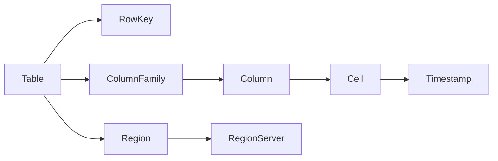

# AI系统HBase原理与代码实战案例讲解

## 1. 背景介绍

### 1.1 大数据时代的数据存储挑战

随着互联网、物联网等技术的快速发展,数据呈现爆炸式增长。传统的关系型数据库已经无法满足海量数据存储和实时查询分析的需求。面对PB级别的海量数据,亟需一种高可用、可扩展、高性能的分布式数据存储方案。

### 1.2 HBase的诞生

HBase是Apache软件基金会的顶级开源项目,诞生于2007年。它是一个构建在Hadoop分布式文件系统(HDFS)之上的分布式、面向列的NoSQL数据库。HBase借鉴了Google的BigTable论文,采用了LSM树和ColumnFamily等核心思想,并结合HDFS的特性,成为一个优秀的大数据存储解决方案。

### 1.3 HBase在人工智能领域的应用

人工智能系统需要处理海量的训练数据和实时的预测请求。HBase凭借其优秀的可扩展性、高吞吐量的随机读写能力,以及与Hadoop生态的无缝集成,成为了人工智能领域数据存储的理想选择。越来越多的AI公司开始采用HBase作为底层存储,支撑其智能业务的发展。

## 2. 核心概念与联系

### 2.1 RowKey

- RowKey是HBase表的主键,用于唯一标识一行数据。
- RowKey的设计直接影响查询性能,需要根据业务特点精心设计。
- RowKey是字节数组,支持多种数据类型。

### 2.2 Column Family 

- HBase表按Column Family组织数据,每个Column Family包含多个Column。
- 同一Column Family下的数据存储在一起,可以提高IO效率。
- Column Family需要在创建表时预先定义。

### 2.3 Column

- Column由Column Family和Column Qualifier组成,格式为"family:qualifier"。
- Column Qualifier可以动态增加,非常灵活。
- 空列不占用存储空间。

### 2.4 Timestamp

- 每个Cell都带有Timestamp,默认为写入时的系统时间。
- 可以存储同一Cell的多个版本数据。
- 可以指定数据的TTL(Time To Live)。

### 2.5 Region

- HBase表按RowKey范围划分为多个Region,实现数据分布。
- 每个Region由一个RegionServer管理,负责该Region的读写。 
- Region达到阈值后会自动分裂,避免Region过大。

### 核心概念联系



## 3. 核心算法原理具体操作步骤

### 3.1 LSM树写入

- Client将写请求发送给RegionServer。
- 数据首先写入MemStore,即内存缓存。
- 当MemStore达到阈值,触发flush操作。
- 将MemStore中的数据写入HFile,形成一个新的StoreFile。
- 数据落盘,删除MemStore,释放内存空间。

### 3.2 LSM树读取 

- Client将读请求发送给RegionServer。
- 首先在MemStore中查找数据。
- 如果未命中,再依次在BlockCache和StoreFile中查找。
- 如果StoreFile中命中,将所在的Block载入BlockCache。
- 将结果返回给Client。

### 3.3 StoreFile Compaction

- 随着不断flush,会产生多个StoreFile。
- 当StoreFile数量达到阈值,触发Compaction。  
- Minor Compaction将多个小文件合并为一个大文件。
- Major Compaction将所有文件合并,并清理过期和删除的数据。
- Compaction减少文件数量,提高读取效率。

### 3.4 Region Split

- 每个Region都有一个StartKey和EndKey。
- 当Region达到阈值(如256MB),触发split。
- 寻找合适的SplitPoint,将Region一分为二。 
- 分裂后的新Region分配给不同的RegionServer管理。
- 父Region下线,新Region对外提供服务。

## 4. 数学模型和公式详细讲解举例说明

### 4.1 Bloom Filter

HBase使用布隆过滤器(Bloom Filter)加速读取操作,快速判断一个RowKey是否存在。布隆过滤器是一种概率型数据结构,具有高效的插入和查询效率。

布隆过滤器使用k个哈希函数将元素映射到一个m位的位数组中。当查询一个元素时,如果k个哈希函数映射的位都为1,则元素可能存在;如果任意一位为0,则元素一定不存在。

假设布隆过滤器的误判率为 $\epsilon$,哈希函数个数为 $k$,位数组大小为 $m$,元素个数为 $n$,则有:

$$
\begin{aligned}
&\epsilon = (1 - e^{-\frac{kn}{m}})^k \\
&k = \frac{m}{n}\ln2 \\
&m = -\frac{n\ln\epsilon}{(\ln2)^2}
\end{aligned}
$$

例如,如果元素个数 $n=1,000,000$,期望的误判率 $\epsilon=0.01$,则可以计算出:

$$
\begin{aligned}
&m = -\frac{1,000,000\ln0.01}{(\ln2)^2} \approx 9,585,058 \\
&k = \frac{9,585,058}{1,000,000}\ln2 \approx 6.64
\end{aligned}
$$

因此,我们可以构建一个约9.6MB的位数组,使用7个哈希函数,在百万级数据规模下,误判率可以控制在1%以内。HBase在每个StoreFile中都建立了布隆过滤器索引,大大提高了随机读取的效率。

### 4.2 Memstore Flush

当Memstore的大小达到阈值(默认128MB)时,会触发flush操作,将数据持久化到HFile中。Flush阈值的设置需要权衡内存使用与IO频率。

设Memstore的flush阈值为 $T$,当前Memstore的大小为 $M$,每秒写入的数据量为 $v$,则下一次flush的时间间隔 $t$ 为:

$$
t = \frac{T-M}{v}
$$

例如,如果 $T=128MB$, $M=96MB$, $v=1MB/s$,则:

$$
t = \frac{128MB-96MB}{1MB/s} = 32s
$$

因此,当前的写入速度下,预计32秒后会进行一次flush操作。我们可以通过调整flush阈值 $T$,来控制flush的频率和每次flush的数据量。

### 4.3 Region Split

当一个Region的大小超过阈值(默认256MB)时,会触发split操作,将Region一分为二。Split后的两个子Region的大小之比近似为 $1:\phi$,其中 $\phi$ 为黄金分割比例,约为0.618。

假设原Region的StartKey为 $a$,EndKey为 $b$,SplitPoint为 $m$,则有:

$$
\frac{m-a}{b-a} \approx 0.382, \frac{b-m}{b-a} \approx 0.618
$$

这种分割比例可以使得分裂后的两个子Region大小相近,避免了分裂的不均衡。同时,选择这个比例也使得下一次分裂时,SplitPoint更可能落在稠密的区域,从而达到动态负载均衡的效果。

## 5. 项目实践：代码实例和详细解释说明

下面通过一个具体的项目实例,演示如何使用Java API操作HBase。该项目实现了一个简单的用户信息管理系统,包括用户信息的增删改查功能。

### 5.1 创建表

```java
public static void createTable(String tableName, String... columnFamilies) throws IOException {
    Configuration config = HBaseConfiguration.create();
    Connection connection = ConnectionFactory.createConnection(config);
    Admin admin = connection.getAdmin();

    if (admin.tableExists(TableName.valueOf(tableName))) {
        System.out.println("Table already exists");
    } else {
        TableDescriptorBuilder tableDescriptor = TableDescriptorBuilder.newBuilder(TableName.valueOf(tableName));
        for (String columnFamily : columnFamilies) {
            ColumnFamilyDescriptor columnFamilyDescriptor = ColumnFamilyDescriptorBuilder.newBuilder(Bytes.toBytes(columnFamily)).build();
            tableDescriptor.setColumnFamily(columnFamilyDescriptor);
        }
        admin.createTable(tableDescriptor.build());
        System.out.println("Table created successfully");
    }

    admin.close();
    connection.close();
}
```

该方法接受表名和列族名作为参数,使用HBase Java API创建一个新表。首先获取HBase连接和Admin实例,然后检查表是否已存在。如果表不存在,则创建TableDescriptor和ColumnFamilyDescriptor,并调用createTable方法创建表。

### 5.2 插入数据

```java
public static void insertData(String tableName, String rowKey, String columnFamily, String column, String value) throws IOException {
    Configuration config = HBaseConfiguration.create();
    Connection connection = ConnectionFactory.createConnection(config);
    Table table = connection.getTable(TableName.valueOf(tableName));

    Put put = new Put(Bytes.toBytes(rowKey));
    put.addColumn(Bytes.toBytes(columnFamily), Bytes.toBytes(column), Bytes.toBytes(value));
    table.put(put);
    System.out.println("Data inserted successfully");

    table.close();
    connection.close();
}
```

该方法接受表名、行键、列族、列名和值作为参数,使用HBase Java API插入一条数据。首先获取HBase连接和Table实例,然后创建一个Put对象,设置行键、列族、列名和值,最后调用put方法插入数据。

### 5.3 查询数据

```java
public static void getData(String tableName, String rowKey, String columnFamily, String column) throws IOException {
    Configuration config = HBaseConfiguration.create();
    Connection connection = ConnectionFactory.createConnection(config);
    Table table = connection.getTable(TableName.valueOf(tableName));

    Get get = new Get(Bytes.toBytes(rowKey));
    get.addColumn(Bytes.toBytes(columnFamily), Bytes.toBytes(column));
    Result result = table.get(get);
    byte[] value = result.getValue(Bytes.toBytes(columnFamily), Bytes.toBytes(column));
    System.out.println("Value: " + Bytes.toString(value));

    table.close();
    connection.close();
}
```

该方法接受表名、行键、列族和列名作为参数,使用HBase Java API查询一条数据。首先获取HBase连接和Table实例,然后创建一个Get对象,设置行键、列族和列名,调用get方法获取结果,最后从结果中解析出值并打印。

### 5.4 删除数据

```java
public static void deleteData(String tableName, String rowKey, String columnFamily, String column) throws IOException {
    Configuration config = HBaseConfiguration.create();
    Connection connection = ConnectionFactory.createConnection(config);
    Table table = connection.getTable(TableName.valueOf(tableName));

    Delete delete = new Delete(Bytes.toBytes(rowKey));
    delete.addColumn(Bytes.toBytes(columnFamily), Bytes.toBytes(column));
    table.delete(delete);
    System.out.println("Data deleted successfully");

    table.close();
    connection.close();
}
```

该方法接受表名、行键、列族和列名作为参数,使用HBase Java API删除一条数据。首先获取HBase连接和Table实例,然后创建一个Delete对象,设置行键、列族和列名,调用delete方法删除数据。

### 5.5 完整示例

```java
public class HBaseExample {

    private static final String TABLE_NAME = "user_info";
    private static final String COLUMN_FAMILY_1 = "basic";
    private static final String COLUMN_FAMILY_2 = "detail";

    public static void main(String[] args) throws IOException {
        // 创建表
        createTable(TABLE_NAME, COLUMN_FAMILY_1, COLUMN_FAMILY_2);

        // 插入数据
        insertData(TABLE_NAME, "user1", COLUMN_FAMILY_1, "name", "Tom");
        insertData(TABLE_NAME, "user1", COLUMN_FAMILY_1, "age", "25");
        insertData(TABLE_NAME, "user1", COLUMN_FAMILY_2, "address", "New York");

        insertData(TABLE_NAME, "user2", COLUMN_FAMILY_1, "name", "Jerry");
        insertData(TABLE_NAME, "user2", COLUMN_FAMILY_1, "age", "30");
        insertData(TABLE_NAME, "user2", COLUMN_FAMILY_2, "address", "Los Angeles");

        // 查询数据
        getData(TABLE_NAME, "user1", COLUMN_FAMILY_1, "name");
        getData(TABLE_NAME, "user1", COLUMN_FAMILY_2, "address");
        getData(TABLE_NAME, "user2", COLUMN_FAMILY_1, "age");

        // 删除数据
        deleteData(TABLE_NAME, "user1", COLUMN_FAMILY_1, "age");
        deleteData(TABLE_NAME, "user2", COLUMN_FAMILY_2, "address");
    }

    // 创建表
    public static void createTable(String tableName, String... columnFamilies) throws IOException {
        // ...
    }

    // 插入数据
    public static void insertData(String tableName, String rowKey, String columnFamily, String column, String value) throws IOException {
        