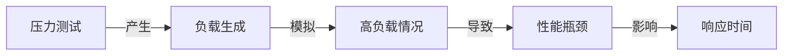

## 1.背景介绍
在我们的日常生活中，人工智能(AI)已经渗透到各个领域，从智能家居到自动驾驶，从医疗诊断到金融交易。然而，随着AI系统的复杂性和应用范围的不断扩大，如何确保AI系统的稳定性和可靠性成为了一个重要的问题。为此，对AI系统进行压力测试是一种有效的方法。

压力测试是一种评估系统在高负载或大规模用户访问下性能的测试方法。通过压力测试，可以发现系统的瓶颈，优化系统的性能，提高系统的稳定性。对于AI系统而言，压力测试不仅可以评估系统在高负载下的性能，还可以检测AI模型在大规模数据处理下的准确性和稳定性。

## 2.核心概念与联系
AI系统压力测试涉及到的核心概念包括压力测试、性能瓶颈、负载生成、响应时间等。

- 压力测试：通过模拟大规模用户访问或高负载情况，评估系统的性能和稳定性。
- 性能瓶颈：系统在处理高负载时，性能下降的关键因素。
- 负载生成：模拟用户访问或数据处理的工具或方法。
- 响应时间：系统处理请求或任务的时间。

这些概念之间的关系可以用以下的Mermaid流程图表示：



## 3.核心算法原理具体操作步骤
AI系统压力测试的核心算法主要包括负载生成和性能评估两部分。

1. 负载生成：通过模拟大规模用户访问或数据处理，产生高负载情况。这可以通过多线程、多进程或分布式计算等方法实现。

2. 性能评估：在高负载情况下，通过监控系统的CPU使用率、内存使用情况、网络带宽使用情况等指标，评估系统的性能。同时，通过比较AI模型的预测结果和实际结果，评估AI模型的准确性和稳定性。

## 4.数学模型和公式详细讲解举例说明
在AI系统压力测试中，我们通常使用以下几种数学模型和公式：

- 并发用户数：表示同时访问系统的用户数。并发用户数越高，系统的负载越大。

  $$
  并发用户数 = 总访问数 / (平均访问间隔 + 平均访问时间)
  $$

- 响应时间：表示系统处理请求或任务的时间。响应时间越短，系统的性能越好。

  $$
  响应时间 = 结束时间 - 开始时间
  $$

- 吞吐率：表示系统在单位时间内处理的任务数。吞吐率越高，系统的性能越好。

  $$
  吞吐率 = 总任务数 / 总时间
  $$

## 5.项目实践：代码实例和详细解释说明
下面，我们来看一个使用Python进行AI系统压力测试的代码实例。

```python
import time
import threading
from sklearn.datasets import load_iris
from sklearn.model_selection import train_test_split
from sklearn.ensemble import RandomForestClassifier

# 加载数据
iris = load_iris()
X_train, X_test, y_train, y_test = train_test_split(iris.data, iris.target, test_size=0.2, random_state=42)

# 训练AI模型
clf = RandomForestClassifier(n_estimators=100, random_state=42)
clf.fit(X_train, y_train)

# 定义压力测试函数
def stress_test(n):
    start_time = time.time()
    for _ in range(n):
        clf.predict(X_test)
    end_time = time.time()
    print(f"并发用户数：{n}, 响应时间：{end_time - start_time}")

# 进行压力测试
for i in range(1, 11):
    threading.Thread(target=stress_test, args=(i * 1000,)).start()
```

这段代码首先加载了鸢尾花数据集，并使用随机森林分类器训练了一个AI模型。然后，定义了一个压力测试函数，该函数通过多次调用AI模型的预测方法，模拟了高负载情况。最后，使用多线程进行了压力测试。

## 6.实际应用场景
AI系统压力测试在许多场景中都有应用，例如：

- 在AI系统上线前，进行压力测试，确保系统在高负载情况下的性能和稳定性。
- 在AI系统运行过程中，定期进行压力测试，检测系统的性能瓶颈，优化系统性能。
- 在AI模型训练过程中，通过压力测试，检测模型在大规模数据处理下的准确性和稳定性。

## 7.工具和资源推荐
在进行AI系统压力测试时，有一些工具和资源可以帮助我们：

- JMeter：一个开源的压力测试工具，可以模拟大规模用户访问，生成高负载情况。
- Locust：一个用Python编写的开源压力测试工具，可以编写复杂的测试场景。
- Prometheus：一个开源的监控系统，可以收集和存储系统的性能指标。
- Grafana：一个开源的数据可视化工具，可以展示和分析Prometheus收集的数据。

## 8.总结：未来发展趋势与挑战
随着AI系统的复杂性和应用范围的不断扩大，压力测试的重要性将进一步提升。未来的发展趋势可能包括：

- 压力测试工具和方法的进一步发展：随着AI系统的复杂性增加，我们需要更强大的工具和方法来进行压力测试。
- 压力测试与AI模型的融合：通过AI模型，我们可以更准确地模拟用户行为，生成更真实的负载。
- 压力测试的自动化：通过自动化的压力测试，我们可以更快地发现和解决问题。

同时，我们也面临一些挑战，例如：

- 如何在保证AI模型准确性的同时，提高系统的性能？
- 如何在大规模数据处理下，保证AI模型的稳定性？
- 如何在复杂的网络环境下，进行有效的压力测试？

## 9.附录：常见问题与解答
1. Q：什么是压力测试？
   A：压力测试是一种评估系统在高负载或大规模用户访问下性能的测试方法。

2. Q：为什么需要对AI系统进行压力测试？
   A：通过压力测试，可以发现系统的瓶颈，优化系统的性能，提高系统的稳定性。对于AI系统而言，压力测试不仅可以评估系统在高负载下的性能，还可以检测AI模型在大规模数据处理下的准确性和稳定性。

3. Q：如何进行AI系统压力测试？
   A：AI系统压力测试的核心算法主要包括负载生成和性能评估两部分。负载生成通过模拟大规模用户访问或数据处理，产生高负载情况。性能评估在高负载情况下，通过监控系统的CPU使用率、内存使用情况、网络带宽使用情况等指标，评估系统的性能。同时，通过比较AI模型的预测结果和实际结果，评估AI模型的准确性和稳定性。

作者：禅与计算机程序设计艺术 / Zen and the Art of Computer Programming