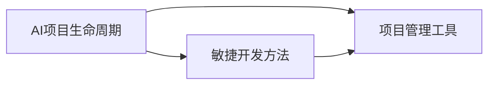

# AI项目管理原理与代码实战案例讲解

## 1. 背景介绍
### 1.1 AI项目管理的重要性
在当今快速发展的人工智能时代,AI项目管理已成为一项至关重要的技能。随着AI技术的不断进步和应用领域的不断扩大,AI项目的复杂性和规模也在不断增加。因此,有效的AI项目管理对于确保项目的成功交付、控制成本和风险,以及最大限度地发挥AI的潜力至关重要。

### 1.2 AI项目的独特挑战
与传统的软件开发项目相比,AI项目具有一些独特的挑战:
1. 数据依赖性:AI项目严重依赖高质量的数据进行模型训练和验证。数据的收集、清理和标注是一项耗时且昂贵的任务。
2. 算法选择:选择合适的AI算法和模型架构对项目成败至关重要,需要深入了解问题域和最新的研究进展。
3. 计算资源需求:训练复杂的AI模型通常需要大量的计算资源,如GPU集群,这对项目预算和进度有重大影响。
4. 不确定性:AI模型的性能和泛化能力存在不确定性,需要进行反复的实验和调优。
5. 伦理和安全考量:AI系统可能产生意想不到的行为或决策,需要充分考虑伦理和安全问题。

### 1.3 AI项目管理的目标
AI项目管理的主要目标包括:
1. 确保项目按时、按预算交付高质量的AI系统。
2. 控制项目风险,包括技术风险、数据风险、伦理风险等。
3. 优化资源配置,包括人力、计算资源和数据资源。
4. 促进团队协作和沟通,确保项目各方对目标和进度达成一致。
5. 持续监控和评估项目进展,及时调整计划和资源投入。

## 2. 核心概念与联系
### 2.1 AI项目生命周期
一个典型的AI项目生命周期包括以下几个阶段:
1. 问题定义:明确项目目标,确定AI技术的适用性。
2. 数据准备:收集、清理和标注训练数据。
3. 模型开发:选择算法,设计和实现AI模型。
4. 模型训练:在准备好的数据上训练AI模型。
5. 模型评估:使用测试数据集评估模型性能。
6. 模型部署:将训练好的模型集成到生产环境中。
7. 模型监控和维护:持续监控模型性能,进行必要的更新和重训练。

### 2.2 敏捷开发方法
敏捷开发方法,如Scrum和看板,已被广泛应用于AI项目管理中。敏捷方法强调迭代开发、快速原型、持续交付和团队协作,能够有效应对AI项目的不确定性和变化。

### 2.3 项目管理工具
常用的AI项目管理工具包括:
1. JIRA:广泛使用的项目管理和问题跟踪工具。
2. Trello:简单易用的任务管理工具,适合小型团队。
3. MLflow:专门用于管理机器学习实验和模型的开源平台。
4. TensorBoard:TensorFlow提供的可视化工具,用于监控模型训练过程。
5. Git:版本控制工具,用于管理代码和模型版本。

### 2.4 核心概念之间的联系
下图展示了AI项目管理的核心概念之间的联系:



AI项目生命周期定义了项目的整体流程,敏捷开发方法提供了灵活的项目管理框架,项目管理工具则支持项目各个阶段的具体实施。三者相互配合,共同推动AI项目的有效管理和成功交付。

## 3. 核心算法原理具体操作步骤
### 3.1 Scrum流程
Scrum是一种广泛使用的敏捷项目管理框架,特别适用于AI项目。Scrum的核心是迭代开发,每个迭代称为一个Sprint,通常持续2-4周。Scrum的具体操作步骤如下:

1. 产品待办列表(Product Backlog):产品负责人(Product Owner)维护一个优先级排序的需求列表。
2. Sprint计划会议:团队选择最高优先级的需求,制定Sprint目标和计划。
3. Sprint执行:团队在固定的时间盒(Time-box)内完成计划的工作。
4. 每日站会(Daily Scrum):团队每天举行简短会议,报告进展和障碍。
5. Sprint评审会议:团队向利益相关者展示Sprint成果,获取反馈。
6. Sprint回顾会议:团队反思Sprint过程,识别改进机会。

### 3.2 看板流程
看板(Kanban)是另一种流行的敏捷方法,强调可视化管理和工作流优化。看板的核心是看板板(Kanban Board),将工作划分为待办(To Do)、进行中(In Progress)和已完成(Done)三个状态。看板的具体操作步骤如下:

1. 可视化工作流:在看板板上建立工作项(如用户故事或任务)的流动路径。
2. 限制在制品(WIP):为每个工作状态设置WIP限制,避免过度多任务。
3. 管理流动:团队成员从待办列表中拉取工作项,在完成后移动到下一状态。
4. 持续改进:通过分析看板板的数据(如周期时间和瓶颈),识别和解决流程问题。

### 3.3 算法选择与实现
AI项目的核心是算法选择与实现。常见的AI算法包括:

1. 监督学习:如线性回归、逻辑回归、决策树、随机森林、支持向量机、神经网络等。
2. 无监督学习:如k-means聚类、层次聚类、主成分分析、自编码器等。
3. 强化学习:如Q-learning、SARSA、策略梯度等。
4. 深度学习:如卷积神经网络(CNN)、循环神经网络(RNN)、长短期记忆网络(LSTM)、生成对抗网络(GAN)等。

算法选择需要考虑问题的特点、数据的性质、计算资源的限制等因素。实现算法通常使用Python等编程语言,借助TensorFlow、PyTorch、Scikit-learn等机器学习库。

## 4. 数学模型和公式详细讲解举例说明
### 4.1 线性回归
线性回归是一种基本的监督学习算法,用于建立自变量和因变量之间的线性关系。给定训练样本 $\{(x_i, y_i)\}_{i=1}^n$,线性回归的目标是找到一个线性函数:

$$
\hat{y} = w^Tx + b
$$

使得预测值 $\hat{y}$ 与真实值 $y$ 的差异最小。这可以通过最小化均方误差(MSE)来实现:

$$
\min_{w,b} \frac{1}{n} \sum_{i=1}^n (w^Tx_i + b - y_i)^2
$$

求解上述优化问题可以使用梯度下降法,迭代更新参数 $w$ 和 $b$:

$$
w := w - \alpha \frac{1}{n} \sum_{i=1}^n (w^Tx_i + b - y_i) x_i
$$
$$
b := b - \alpha \frac{1}{n} \sum_{i=1}^n (w^Tx_i + b - y_i)
$$

其中 $\alpha$ 是学习率。

例如,考虑以下训练样本:

| 房屋面积(平方米) | 价格(万元) |
|-----------------|------------|
| 100             | 50         |
| 120             | 60         |
| 150             | 80         |
| 200             | 100        |

我们可以使用线性回归模型预测房屋价格:

```python
import numpy as np
from sklearn.linear_model import LinearRegression

X = np.array([[100], [120], [150], [200]])
y = np.array([50, 60, 80, 100])

model = LinearRegression()
model.fit(X, y)

print(f'Coefficients: {model.coef_}')
print(f'Intercept: {model.intercept_}')

new_house = np.array([[180]])
predicted_price = model.predict(new_house)
print(f'Predicted price for 180 m^2 house: {predicted_price[0]:.2f} 万元')
```

输出结果:
```
Coefficients: [0.5]
Intercept: 0.0
Predicted price for 180 m^2 house: 90.00 万元
```

可以看到,线性回归模型学习到了房屋面积和价格之间的线性关系,并可以用于预测新房屋的价格。

### 4.2 逻辑回归
逻辑回归是另一种常用的监督学习算法,用于二分类问题。给定训练样本 $\{(x_i, y_i)\}_{i=1}^n$,其中 $y_i \in \{0, 1\}$,逻辑回归的目标是找到一个逻辑函数(即sigmoid函数):

$$
\hat{y} = \frac{1}{1 + e^{-(w^Tx + b)}}
$$

使得预测值 $\hat{y}$ 接近真实标签 $y$。这可以通过最大化对数似然函数来实现:

$$
\max_{w,b} \sum_{i=1}^n [y_i \log \hat{y}_i + (1 - y_i) \log (1 - \hat{y}_i)]
$$

求解上述优化问题可以使用梯度上升法,迭代更新参数 $w$ 和 $b$:

$$
w := w + \alpha \sum_{i=1}^n (y_i - \hat{y}_i) x_i
$$
$$
b := b + \alpha \sum_{i=1}^n (y_i - \hat{y}_i)
$$

例如,考虑以下训练样本:

| 学习时间(小时) | 是否通过考试 |
|----------------|--------------|
| 10             | 0            |
| 20             | 0            |
| 50             | 1            |
| 80             | 1            |

我们可以使用逻辑回归模型预测学生是否通过考试:

```python
import numpy as np
from sklearn.linear_model import LogisticRegression

X = np.array([[10], [20], [50], [80]])
y = np.array([0, 0, 1, 1])

model = LogisticRegression()
model.fit(X, y)

print(f'Coefficients: {model.coef_}')
print(f'Intercept: {model.intercept_}')

new_student = np.array([[60]])
predicted_prob = model.predict_proba(new_student)
print(f'Predicted probability of passing for 60 hours of study: {predicted_prob[0][1]:.2f}')
```

输出结果:
```
Coefficients: [[0.0858356]]
Intercept: [-3.51820043]
Predicted probability of passing for 60 hours of study: 0.82
```

可以看到,逻辑回归模型学习到了学习时间和通过考试概率之间的非线性关系,并可以用于预测新学生通过考试的概率。

## 5. 项目实践:代码实例和详细解释说明
下面我们通过一个完整的AI项目实践,演示如何应用前面介绍的项目管理方法和算法原理。

### 5.1 项目背景
假设我们正在开发一个基于深度学习的图像分类系统,需要将输入的图像划分为猫、狗和其他三个类别。我们已经收集了一个包含5000张图像的数据集,其中猫、狗和其他类别各占1/3。

### 5.2 项目管理
我们采用Scrum框架管理这个项目,将整个项目分为三个Sprint:

1. Sprint 1:数据准备和探索性分析。
2. Sprint 2:模型开发和训练。
3. Sprint 3:模型评估和部署。

每个Sprint持续两周,团队通过每日站会和Sprint评审会议来跟踪进度和获取反馈。

### 5.3 数据准备
在Sprint 1中,我们对收集的图像数据进行清理和预处理:

1. 剔除损坏或格式不正确的图像。
2. 调整所有图像到统一的尺寸(如256x256像素)。
3. 将图像划分为训练集(80%)和测试集(20%)。
4. 对图像进行归一化处理,将像素值缩放到[0, 1]范围内。

下面是使用Python进行数据准备的示例代码:

```python
import os
import numpy as np
from PIL import Image
from sklearn.model_selection import train_test_split

def load_data(data_dir):
    categories = ['cat', 'dog', 'other']
    data = []