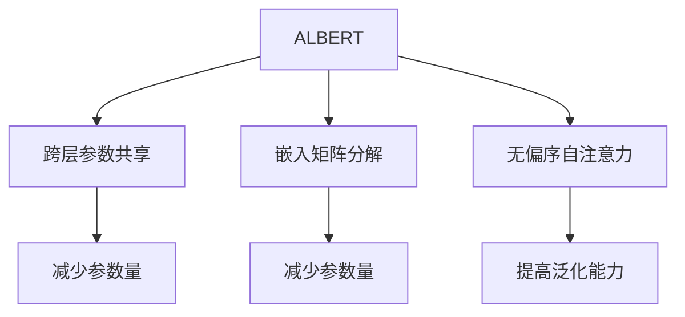
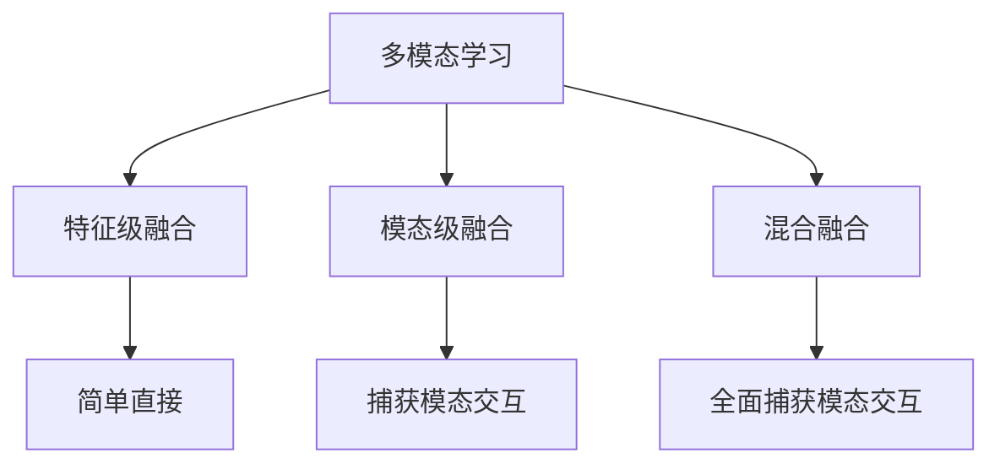

# ALBERT与多模态学习：融合文本与其他模态信息

## 1.背景介绍

### 1.1 自然语言处理的发展

自然语言处理(Natural Language Processing, NLP)是人工智能领域的一个重要分支,旨在使计算机能够理解和生成人类语言。随着深度学习技术的快速发展,NLP取得了长足的进步,语言模型在许多任务上展现出了强大的能力。

### 1.2 预训练语言模型的重要性

预训练语言模型(Pre-trained Language Model, PLM)是NLP领域的一个重要创新,通过在大规模无监督语料上预训练,模型可以学习到丰富的语义和语法知识,从而在下游任务上取得优异的表现。代表性的PLM包括BERT、GPT、XLNet等。

### 1.3 ALBERT的提出

尽管BERT等PLM取得了巨大成功,但它们存在一些缺陷,如参数冗余、训练数据单一等。ALBERT(A Lite BERT for Self-supervised Learning of Language Representations)是谷歌于2019年提出的一种更小更快的BERT变体,旨在解决BERT存在的一些问题,提高模型的参数效率和泛化能力。

### 1.4 多模态学习的重要性

现实世界中,信息通常以多种模态(如文本、图像、视频等)的形式存在。单一模态的学习往往无法全面理解这些信息。因此,多模态学习(Multimodal Learning)应运而生,旨在融合来自不同模态的信息,获得更全面的理解和表示。

## 2.核心概念与联系

### 2.1 ALBERT

ALBERT的核心创新点包括:

1. 跨层参数共享(Cross-layer Parameter Sharing)
2. 嵌入矩阵分解(Embedding Matrix Decomposition)
3. 无偏序自注意力(Unbiased Sentence-order Self-attention)

这些创新使ALBERT相比BERT在相同的性能水平下,参数量大大减少,训练和推理速度也有所提升。

### 2.2 多模态学习

多模态学习的核心思想是将来自不同模态(如文本、图像等)的信息融合起来,从而获得更丰富、更全面的表示。常见的多模态融合方法包括:

1. 特征级融合(Feature-level Fusion)
2. 模态级融合(Modality-level Fusion)
3. 混合融合(Hybrid Fusion)

### 2.3 ALBERT与多模态学习的联系

ALBERT作为一种高效的PLM,可以很好地应用于多模态学习任务中。通过将ALBERT与其他模态(如图像、视频等)的特征进行融合,我们可以获得更丰富的多模态表示,从而提高下游任务的性能。

此外,ALBERT本身的高效性也使其在多模态学习场景下具有优势,因为多模态任务通常需要处理大量的数据,高效的模型可以减少计算开销,提高训练和推理效率。

## 3.核心算法原理具体操作步骤

### 3.1 ALBERT

#### 3.1.1 跨层参数共享

BERT等transformer模型中,每一层的参数都是独立的,这导致了参数冗余。ALBERT采用了跨层参数共享的策略,将transformer的feedforward层和attention层的参数在不同层之间共享,从而大幅减少了参数量。

具体操作步骤如下:

1. 将transformer的feedforward层和attention层的参数分别划分为多个组
2. 在每一组内,不同层共享同一组参数
3. 不同组之间的参数则不共享

这种策略可以显著减少参数量,同时保持模型的性能。

#### 3.1.2 嵌入矩阵分解

BERT等模型中,词嵌入矩阵占用了大量的参数。ALBERT采用了嵌入矩阵分解的方法,将原始的大矩阵分解为两个小矩阵的乘积,从而减少参数量。

具体操作步骤如下:

1. 将原始的词嵌入矩阵$E \in \mathbb{R}^{V \times D}$分解为两个小矩阵$E_1 \in \mathbb{R}^{V \times m}$和$E_2 \in \mathbb{R}^{m \times D}$的乘积,即$E = E_1E_2$
2. 其中$V$是词表大小,$D$是嵌入维度,$m$是一个可调的超参数,通常远小于$D$

这种分解方法可以大幅减少嵌入矩阵的参数量,同时保持嵌入质量。

#### 3.1.3 无偏序自注意力

BERT等模型在预训练时,需要对输入序列进行打乱,以捕获双向上下文信息。但这种做法会导致预训练和微调阶段的输入分布不一致,影响模型的泛化能力。

ALBERT提出了无偏序自注意力(Unbiased Sentence-order Self-attention)的策略,在预训练时不对输入序列进行打乱,而是通过一个特殊的自注意力掩码,使模型能够同时捕获到上下文信息。

具体操作步骤如下:

1. 在预训练时,不对输入序列进行打乱
2. 为每个单词构建一个自注意力掩码,使其只能关注当前位置及之前的单词
3. 通过这种掩码,模型可以同时捕获到上下文信息,而不需要打乱输入序列

这种策略可以消除预训练和微调阶段的输入分布不一致问题,提高模型的泛化能力。



### 3.2 多模态学习

#### 3.2.1 特征级融合

特征级融合是最直接的多模态融合方式,将来自不同模态的特征拼接在一起,然后送入后续的模型进行处理。

具体操作步骤如下:

1. 分别提取文本、图像等不同模态的特征
2. 将这些特征拼接成一个长向量
3. 将拼接后的特征输入到后续的模型(如transformer、CNN等)中进行处理

这种方式简单直接,但可能无法很好地捕获不同模态之间的交互关系。

#### 3.2.2 模态级融合

模态级融合是一种更高级的融合方式,先分别对每种模态进行编码,再将编码后的表示进行融合。

具体操作步骤如下:

1. 使用不同的编码器(如ALBERT、CNN等)分别对每种模态进行编码,得到模态级表示
2. 将不同模态的表示通过某种融合函数(如加权求和、concat等)进行融合
3. 将融合后的表示输入到后续的模型中进行处理

这种方式可以更好地捕获不同模态之间的交互关系,但需要设计合适的融合函数。

#### 3.2.3 混合融合

混合融合是特征级融合和模态级融合的结合,在不同的层次上进行融合,以获得更丰富的表示。

具体操作步骤如下:

1. 在低层次上进行特征级融合,将不同模态的特征拼接
2. 将拼接后的特征输入到编码器中,得到初步的多模态表示
3. 在高层次上进行模态级融合,将不同模态的编码表示进行融合
4. 将融合后的表示输入到后续的模型中进行处理

这种方式结合了特征级和模态级融合的优点,可以更全面地捕获不同模态之间的交互关系。



## 4.数学模型和公式详细讲解举例说明

### 4.1 ALBERT中的注意力机制

注意力机制是transformer模型的核心部分,用于捕获输入序列中元素之间的依赖关系。ALBERT中采用了scaled dot-product attention,公式如下:

$$
\text{Attention}(Q, K, V) = \text{softmax}\left(\frac{QK^T}{\sqrt{d_k}}\right)V
$$

其中:

- $Q$是查询(Query)矩阵,$K$是键(Key)矩阵,$V$是值(Value)矩阵
- $d_k$是键的维度,用于缩放点积
- 通过计算查询和键的点积,得到注意力分数,再对分数进行softmax归一化,最后与值矩阵相乘,得到加权和的注意力表示

在ALBERT中,还引入了无偏序自注意力,通过一个特殊的掩码矩阵$M$,使每个单词只能关注当前位置及之前的单词,公式如下:

$$
M_{i,j} = \begin{cases}
0, & \text{if } i < j\\
-\infty, & \text{otherwise}
\end{cases}
$$

$$
\text{Attention}(Q, K, V) = \text{softmax}\left(\frac{QK^T + M}{\sqrt{d_k}}\right)V
$$

这种策略可以在预训练时捕获双向上下文信息,同时避免预训练和微调阶段的输入分布不一致问题。

### 4.2 多模态融合中的注意力机制

在多模态学习中,注意力机制也被广泛应用于不同模态之间的融合。以模态级融合为例,我们可以使用注意力机制对不同模态的表示进行加权求和,公式如下:

$$
h_m = \sum_{i=1}^N \alpha_i h_i^m
$$

其中:

- $h_m$是融合后的多模态表示
- $h_i^m$是第$i$种模态的表示
- $\alpha_i$是第$i$种模态的注意力权重,通过self-attention或其他机制计算得到

这种注意力融合方式可以自动学习不同模态的重要性,对于不同的输入,模型会分配不同的注意力权重。

在混合融合中,我们还可以在特征级融合的基础上,使用自注意力机制对融合后的特征进行编码,公式如下:

$$
\begin{aligned}
&Q = XW_Q, K = XW_K, V = XW_V\\
&\text{Attention}(Q, K, V) = \text{softmax}\left(\frac{QK^T}{\sqrt{d_k}}\right)V
\end{aligned}
$$

其中$X$是融合后的特征矩阵,$W_Q$、$W_K$、$W_V$是可学习的权重矩阵。通过自注意力编码,模型可以捕获融合特征中元素之间的依赖关系,获得更丰富的表示。

## 5.项目实践:代码实例和详细解释说明

为了更好地理解ALBERT和多模态学习的原理,我们可以通过一个具体的项目实践来加深理解。这里我们以一个多模态情感分析任务为例,需要根据文本和图像的信息预测情感极性(正面、中性或负面)。

### 5.1 数据准备

我们使用一个包含文本和图像的多模态数据集,例如Flickr30k或COCO-Text。数据集中每个样本包含一个图像和对应的文本描述,以及情感极性标签。我们将数据集划分为训练集、验证集和测试集。

### 5.2 文本编码

对于文本部分,我们使用ALBERT模型进行编码。具体步骤如下:

1. 加载预训练的ALBERT模型权重
2. 对文本进行分词和编码,得到输入的token ids和attention mask
3. 将token ids和attention mask输入到ALBERT模型中,得到文本的编码表示

```python
from transformers import AlbertTokenizer, AlbertModel

tokenizer = AlbertTokenizer.from_pretrained('albert-base-v2')
model = AlbertModel.from_pretrained('albert-base-v2')

text = "This is a great movie!"
inputs = tokenizer(text, return_tensors='pt')
outputs = model(**inputs)
text_embeds = outputs.last_hidden_state
```

### 5.3 图像编码

对于图像部分,我们使用一个预训练的CNN模型(如ResNet)进行编码。具体步骤如下:

1. 加载预训练的CNN模型权重
2. 将图像输入到CNN模型中,得到图像的特征表示
3. 对特征表示进行平均池化,得到图像的编码向量

```python
import torchvision.models as models

resnet = models.resnet50(pretrained=True)
image = # load image
image