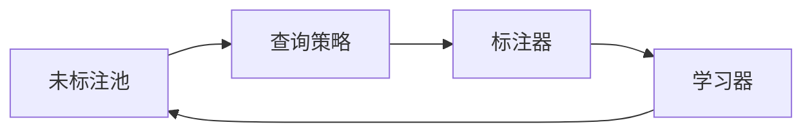

# Active Learning原理与代码实例讲解

## 1.背景介绍
### 1.1 机器学习中的标注成本问题
在许多机器学习应用中,获得大量的标注数据是一个巨大的挑战。人工标注数据不仅耗时耗力,而且成本高昂。尤其是在一些专业领域,如医学影像诊断、金融欺诈检测等,标注工作需要专业知识,难度更大。因此,如何在标注数据不足的情况下,训练出高质量的机器学习模型,成为了一个亟待解决的问题。

### 1.2 主动学习(Active Learning)的提出
主动学习(Active Learning)作为一种解决上述问题的有效方法应运而生。与传统的被动学习(Passive Learning)不同,主动学习允许学习算法主动地选择最有价值的未标注样本让人工进行标注,从而最大化标注数据的价值,用最少的标注成本获得尽可能高的模型性能。

### 1.3 主动学习的优势
主动学习具有以下优势:
1. 降低标注成本:主动学习通过选择最有价值的样本让人工标注,大幅减少了所需的标注数据量。
2. 提高模型性能:主动学习所选择的样本往往是对模型提升最大的,因此用较少的标注数据就能获得较高的模型性能。 
3. 加速模型训练:主动学习每轮选择少量样本标注,避免了大规模标注数据的训练开销,加快了模型训练和迭代的速度。
4. 适用性广:主动学习可以用于多种机器学习任务,如分类、回归、序列标注等,适用性强。

## 2.核心概念与联系
### 2.1 主动学习的定义与分类
主动学习是一种允许学习算法与人工交互,主动选择最有价值的未标注样本进行标注,从而最小化标注成本,最大化模型性能的机器学习范式。根据选择策略的不同,主动学习可分为以下三类:

1. 基于不确定度的主动学习(Uncertainty Sampling):选择模型预测最不确定的样本标注。
2. 基于委员会的主动学习(Query-By-Committee):训练多个模型,选择模型预测分歧最大的样本标注。
3. 基于预期错误率的主动学习(Expected Error Reduction):选择标注后预期模型错误率下降最多的样本。

### 2.2 主动学习的关键组件
主动学习主要包括以下关键组件:
1. 学习器(Learner):用于训练机器学习模型。
2. 未标注池(Unlabeled Pool):存储大量未标注样本供选择。  
3. 标注器(Labeler):人工标注人员,为选中的样本提供标签。
4. 查询策略(Query Strategy):根据一定的策略选择最有价值的样本。

它们之间的关系如下图所示:



### 2.3 主动学习的过程
主动学习通常以迭代的方式进行,每个迭代循环可分为以下步骤:

1. 用当前已标注数据训练机器学习模型
2. 用训练好的模型对未标注池中的样本进行预测
3. 根据查询策略选择最有价值的样本 
4. 让标注器对选中的样本进行标注
5. 将新标注的样本加入已标注集合
6. 重复步骤1-5,直到满足一定的停止条件(如达到预期性能或标注预算用尽)

## 3.核心算法原理与具体操作步骤
下面我们以最常用的基于不确定度的主动学习为例,详细介绍其核心算法原理与操作步骤。

### 3.1 基于最小置信度的不确定度采样
最小置信度(Least Confidence)是最简单直观的不确定度度量,它计算模型对样本的最大类别概率值,数值越小表示越不确定。其公式为:

$$
x^*_{LC}=\underset{x\in\mathcal{D_U}}{\arg\min}P_\theta(\hat{y}|x)
$$

其中$x^*_{LC}$表示要选择的样本,$\mathcal{D_U}$为未标注池,$\hat{y}=\underset{y}{\arg\max}P_\theta(y|x)$为模型预测的类别,$P_\theta(\hat{y}|x)$为相应的后验概率。

算法步骤如下:
1. 对未标注池中每个样本,用当前模型计算其在每个类别上的后验概率
2. 对每个样本,取其最大的后验概率值作为置信度分数
3. 选择置信度分数最小的样本进行标注

### 3.2 基于边缘采样的不确定度采样
边缘采样(Margin Sampling)通过比较样本在最可能的两个类别上的后验概率差值来衡量不确定度,差值越小表示越难区分,越不确定。其公式为:

$$
x^*_{MS}=\underset{x\in\mathcal{D_U}}{\arg\min}[P_\theta(\hat{y}_1|x)-P_\theta(\hat{y}_2|x)]
$$

其中$\hat{y}_1$和$\hat{y}_2$分别为模型预测的概率最高和次高的类别。

算法步骤如下:  
1. 对未标注池中每个样本,用当前模型计算其在每个类别上的后验概率
2. 对每个样本,取最大的两个后验概率值,并计算它们的差值
3. 选择差值最小的样本进行标注

### 3.3 基于熵的不确定度采样
信息熵(Information Entropy)通过计算样本类别分布的熵值来度量不确定性,熵值越大表示分布越均匀,越难判断,不确定性越高。其公式为:

$$
x^*_{EN}=\underset{x\in\mathcal{D_U}}{\arg\max}-\sum_{y}P_\theta(y|x)\log P_\theta(y|x)
$$

算法步骤如下:
1. 对未标注池中每个样本,用当前模型计算其在每个类别上的后验概率  
2. 对每个样本,基于类别后验概率计算熵值
3. 选择熵值最大的样本进行标注

## 4.数学模型和公式详细讲解举例说明
这里我们以二分类任务为例,详细说明上述三种不确定度采样策略的数学模型与计算过程。

假设有一个二分类数据集,类别分别为正类(用1表示)和负类(用0表示),我们已标注4个样本:$\{(x_1,1),(x_2,0),(x_3,1),(x_4,0)\}$,还有3个未标注样本$\{x_5,x_6,x_7\}$。用这4个已标注样本训练逻辑回归模型,得到模型参数$\theta$。

现在我们要从3个未标注样本中选择最有价值的1个样本让人工标注,采用三种不同的不确定度采样策略:

### 4.1 最小置信度采样
首先,用训练好的逻辑回归模型对3个未标注样本进行预测,得到它们属于正类的后验概率如下:
- $P_\theta(y=1|x_5)=0.8$  
- $P_\theta(y=1|x_6)=0.6$
- $P_\theta(y=1|x_7)=0.3$

然后计算每个样本的最大后验概率,作为置信度分数:
- $s_5=\max\{P_\theta(y=1|x_5),1-P_\theta(y=1|x_5)\}=\max\{0.8,0.2\}=0.8$
- $s_6=\max\{P_\theta(y=1|x_6),1-P_\theta(y=1|x_6)\}=\max\{0.6,0.4\}=0.6$  
- $s_7=\max\{P_\theta(y=1|x_7),1-P_\theta(y=1|x_7)\}=\max\{0.3,0.7\}=0.7$

最后选择置信度分数最小的样本$x_6$进行标注。

### 4.2 边缘采样
首先,用训练好的逻辑回归模型对3个未标注样本进行预测,得到它们属于正类和负类的后验概率如下:
- $P_\theta(y=1|x_5)=0.8,P_\theta(y=0|x_5)=0.2$
- $P_\theta(y=1|x_6)=0.6,P_\theta(y=0|x_6)=0.4$
- $P_\theta(y=1|x_7)=0.3,P_\theta(y=0|x_7)=0.7$

然后计算每个样本最可能的两个类别的后验概率之差:  
- $m_5=|P_\theta(y=1|x_5)-P_\theta(y=0|x_5)|=|0.8-0.2|=0.6$
- $m_6=|P_\theta(y=1|x_6)-P_\theta(y=0|x_6)|=|0.6-0.4|=0.2$
- $m_7=|P_\theta(y=1|x_7)-P_\theta(y=0|x_7)|=|0.3-0.7|=0.4$

最后选择边缘概率差最小的样本$x_6$进行标注。

### 4.3 熵采样
首先,用训练好的逻辑回归模型对3个未标注样本进行预测,得到它们属于正类和负类的后验概率如下(同边缘采样):
- $P_\theta(y=1|x_5)=0.8,P_\theta(y=0|x_5)=0.2$
- $P_\theta(y=1|x_6)=0.6,P_\theta(y=0|x_6)=0.4$  
- $P_\theta(y=1|x_7)=0.3,P_\theta(y=0|x_7)=0.7$

然后计算每个样本的类别分布熵:
- $H_5=-[0.8\log 0.8+0.2\log 0.2]=0.5$
- $H_6=-[0.6\log 0.6+0.4\log 0.4]=0.67$
- $H_7=-[0.3\log 0.3+0.7\log 0.7]=0.61$

最后选择熵值最大的样本$x_6$进行标注。

可以看出,上述三种不同的不确定度采样策略在这个例子中都选择了同一个最不确定的样本$x_6$进行标注。当然,在实际应用中,由于数据分布和模型性能的差异,不同采样策略的效果可能有所不同,需要根据具体情况进行选择。

## 5.项目实践:代码实例与详细解释说明
下面我们通过一个简单的文本分类任务,演示如何用Python实现基于最小置信度的主动学习。

### 5.1 数据准备
首先,我们从sklearn的20类新闻文本数据集中抽取4类(alt.atheism、sci.space、comp.graphics和rec.autos)作为我们的实验数据,并划分为训练集、测试集和未标注池三部分。

```python
from sklearn.datasets import fetch_20newsgroups
from sklearn.model_selection import train_test_split

categories = ['alt.atheism', 'sci.space', 'comp.graphics', 'rec.autos']
data = fetch_20newsgroups(subset='all', categories=categories, shuffle=True, random_state=42)

X = data.data
y = data.target

X_train, X_test, y_train, y_test = train_test_split(X, y, test_size=0.2, random_state=42)

X_train, X_unlabeled, y_train, y_unlabeled = train_test_split(X_train, y_train, test_size=0.9, random_state=42)
```

### 5.2 特征提取与模型定义
接着,我们对文本数据进行特征提取,这里使用sklearn的TfidfVectorizer进行TF-IDF特征提取。然后,定义一个逻辑回归分类器作为我们的基础模型。

```python
from sklearn.feature_extraction.text import TfidfVectorizer
from sklearn.linear_model import LogisticRegression

vectorizer = TfidfVectorizer()
X_train_vec = vectorizer.fit_transform(X_train)
X_test_vec = vectorizer.transform(X_test)
X_unlabeled_vec = vectorizer.transform(X_unlabeled)

model = LogisticRegression()
```

### 5.3 主动学习查询过程
下面是主动学习的核心代码,它实现了基于最小置信度的不确定度采样策略,每轮选择10个最不确定的样本标注,并重复训练和查询,直到标注样本数达到200。

```python
import numpy as np

labeled_indices = list(range(len(X_train)))
unlabeled_indices =