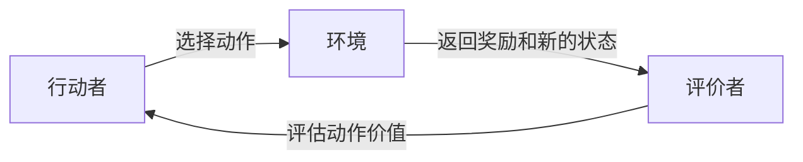

## 1.背景介绍

在强化学习领域中，Actor-Critic算法是一种重要的方法，它结合了价值迭代(Value Iteration)和策略迭代(Policy Iteration)的优点，通过引入一个评价者(Critic)来评估行动者(Actor)的动作，并据此改进行动者的策略。

## 2.核心概念与联系

Actor-Critic算法主要由两部分组成：行动者(Actor)和评价者(Critic)。行动者负责根据当前的策略选择动作，而评价者则负责评估这个动作的价值，然后反馈给行动者，以便行动者更新其策略。



## 3.核心算法原理具体操作步骤

Actor-Critic算法的操作步骤如下：

1. 初始化行动者和评价者的参数。
2. 对于每一个回合，执行以下操作：
   1. 行动者根据当前的策略选择一个动作。
   2. 将动作应用到环境中，获取奖励和新的状态。
   3. 评价者根据奖励和新的状态评估动作的价值。
   4. 行动者根据评价者的反馈更新策略。

## 4.数学模型和公式详细讲解举例说明

在Actor-Critic算法中，行动者和评价者的更新都依赖于梯度上升策略。具体来说，行动者的策略更新可以表示为：

$$\theta_{t+1} = \theta_t + \alpha \nabla_{\theta} log \pi_{\theta}(a_t|s_t) Q_w(s_t, a_t)$$

其中，$\theta$表示行动者的策略参数，$a_t$和$s_t$分别表示在时间$t$时的动作和状态，$\pi_{\theta}(a_t|s_t)$表示在状态$s_t$下采取动作$a_t$的概率，$Q_w(s_t, a_t)$表示动作$a_t$在状态$s_t$下的价值，$\alpha$是学习率。

评价者的价值更新可以表示为：

$$w_{t+1} = w_t + \beta (r_{t+1} + \gamma Q_w(s_{t+1}, a_{t+1}) - Q_w(s_t, a_t)) \nabla_w Q_w(s_t, a_t)$$

其中，$w$表示评价者的价值参数，$r_{t+1}$表示在时间$t+1$时的奖励，$\gamma$是折扣因子，$\beta$是学习率。

## 5.项目实践：代码实例和详细解释说明

以下是一个简单的Actor-Critic算法的Python实现：

```python
class ActorCritic:
    def __init__(self, actor_lr, critic_lr, gamma):
        self.actor = Actor(lr=actor_lr)
        self.critic = Critic(lr=critic_lr)
        self.gamma = gamma

    def update(self, state, action, reward, next_state, done):
        target = reward + self.gamma * self.critic.predict(next_state) * (1 - int(done))
        td_error = target - self.critic.predict(state)

        self.actor.update(state, action, td_error)
        self.critic.update(state, target)
```

在这个实现中，`Actor`和`Critic`是两个神经网络，分别用于表示行动者的策略和评价者的价值函数。`update`方法首先计算目标值和时差错误，然后用这些信息更新行动者和评价者的参数。

## 6.实际应用场景

Actor-Critic算法广泛应用于各种强化学习任务中，如游戏AI、机器人控制、资源分配等。例如，在游戏AI中，可以使用Actor-Critic算法训练一个智能体，使其能够在游戏中做出优秀的决策。在机器人控制中，可以使用Actor-Critic算法训练一个智能体，使其能够根据环境的反馈调整自己的行动策略，从而更好地完成任务。

## 7.工具和资源推荐

- [OpenAI Gym](https://gym.openai.com/): 一个用于开发和比较强化学习算法的工具包，包含了许多预定义的环境。
- [TensorFlow](https://tensorflow.org/): 一个强大的开源机器学习库，可以用于实现Actor-Critic等算法。

## 8.总结：未来发展趋势与挑战

Actor-Critic算法是强化学习中的一个重要方法，但也面临着一些挑战，如稳定性问题、样本效率低等。未来的研究将继续探索如何改进Actor-Critic算法，以解决这些问题。

## 9.附录：常见问题与解答

Q: Actor-Critic算法的主要优点是什么？

A: Actor-Critic算法的主要优点是能够同时学习策略和价值函数，这使得它能够在一定程度上克服策略迭代和价值迭代的缺点。

Q: Actor-Critic算法的主要缺点是什么？

A: Actor-Critic算法的主要缺点是可能会遇到稳定性问题，因为行动者和评价者的更新是相互依赖的，这可能会导致学习过程不稳定。

作者：禅与计算机程序设计艺术 / Zen and the Art of Computer Programming