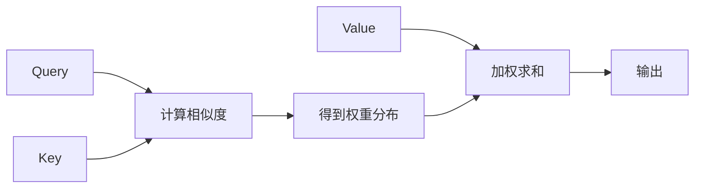

## 1.背景介绍

在人工智能的发展历程中，Attention Mechanism无疑是一种极具创新性的技术。它的出现，让我们的模型更加具有“关注力”，能够在处理大量信息时，聚焦于关键的部分，从而大大提高了模型的性能。

Attention Mechanism最初在自然语言处理领域的机器翻译任务中得到应用，后来逐渐被广泛应用于各种领域，如图像识别、语音识别等。在这个过程中，它不断地被改进和优化，形成了多种不同的版本，如Self-Attention、Multi-Head Attention等，极大地丰富了我们的工具库。

## 2.核心概念与联系

Attention Mechanism的核心概念可以用一句话概括：在处理信息时，模型应该更多地关注那些对当前任务更重要的部分。这种关注力的分配，是通过一种叫做“注意力权重”的机制来实现的。

在Attention Mechanism中，我们通常会有三个主要的部分：Query（查询）、Key（键）、Value（值）。Query是我们想要获取信息的请求，Key是我们可以获取信息的来源，Value是我们真正关心的信息。我们通过计算Query和每个Key之间的相似度，得到一个权重分布，然后用这个权重分布对Value进行加权求和，得到我们最终的输出。

这个过程可以用下面的Mermaid流程图来表示：



## 3.核心算法原理具体操作步骤

Attention Mechanism的具体操作步骤如下：

1. 计算Query和每个Key之间的相似度。这个相似度通常通过计算Query和Key的点积，然后除以一个缩放因子（通常是Key的维度的平方根）得到。

2. 将相似度通过Softmax函数转化为权重分布。

3. 用权重分布对Value进行加权求和，得到最终的输出。

这个过程可以表示为以下的公式：

$$
\text{Attention}(Q, K, V) = \text{Softmax}\left(\frac{QK^T}{\sqrt{d_k}}\right)V
$$

其中，$Q$、$K$、$V$分别代表Query、Key、Value，$d_k$是Key的维度。

## 4.数学模型和公式详细讲解举例说明

为了更好地理解Attention Mechanism，我们来看一个具体的例子。

假设我们有一个Query $Q=[1, 0]$，两个Key $K_1=[1, 1]$、$K_2=[0, 1]$，以及对应的Value $V_1=[1, 2]$、$V_2=[3, 4]$。

首先，我们计算Query和每个Key之间的相似度：

$$
s_1 = Q \cdot K_1 = 1 \cdot 1 + 0 \cdot 1 = 1
$$

$$
s_2 = Q \cdot K_2 = 1 \cdot 0 + 0 \cdot 1 = 0
$$

然后，我们将这些相似度通过Softmax函数转化为权重分布：

$$
w_1 = \frac{e^{s_1}}{e^{s_1} + e^{s_2}} = \frac{e^1}{e^1 + e^0} = \frac{e}{e + 1} \approx 0.73
$$

$$
w_2 = \frac{e^{s_2}}{e^{s_1} + e^{s_2}} = \frac{e^0}{e^1 + e^0} = \frac{1}{e + 1} \approx 0.27
$$

最后，我们用这个权重分布对Value进行加权求和，得到最终的输出：

$$
O = w_1 \cdot V_1 + w_2 \cdot V_2 = 0.73 \cdot [1, 2] + 0.27 \cdot [3, 4] = [1.54, 2.08]
$$

从这个例子中，我们可以看到，Attention Mechanism能够有效地将不同的信息进行融合，得到一个综合的输出。

## 5.项目实践：代码实例和详细解释说明

下面，我们来看一个Attention Mechanism的代码实例。在这个例子中，我们将使用PyTorch框架来实现一个简单的Attention Layer。

```python
import torch
import torch.nn as nn
import torch.nn.functional as F

class Attention(nn.Module):
    def __init__(self, hidden_size):
        super(Attention, self).__init__()
        self.hidden_size = hidden_size

    def forward(self, query, key, value):
        # 计算query和key之间的相似度
        scores = torch.matmul(query, key.transpose(-2, -1)) / self.hidden_size**0.5
        # 将相似度通过softmax函数转化为权重分布
        weights = F.softmax(scores, dim=-1)
        # 用权重分布对value进行加权求和，得到最终的输出
        output = torch.matmul(weights, value)
        return output
```

在这个代码中，我们首先定义了一个Attention类，它继承自PyTorch的Module类。在这个类的构造函数中，我们初始化了一个hidden_size变量，它代表了Key的维度。

在forward函数中，我们首先计算了Query和Key之间的相似度，然后通过Softmax函数将相似度转化为权重分布，最后用权重分布对Value进行加权求和，得到最终的输出。

## 6.实际应用场景

Attention Mechanism在自然语言处理、图像识别、语音识别等多个领域都有广泛的应用。

在自然语言处理领域，Attention Mechanism被用于机器翻译、文本分类、情感分析等任务。在机器翻译任务中，Attention Mechanism可以让模型更好地理解源语言和目标语言之间的对应关系；在文本分类和情感分析任务中，Attention Mechanism可以让模型更好地理解文本中的关键信息。

在图像识别领域，Attention Mechanism被用于目标检测、图像分割等任务。在这些任务中，Attention Mechanism可以让模型更好地聚焦于图像中的关键部分，从而提高模型的性能。

在语音识别领域，Attention Mechanism被用于语音到文本的转换任务。在这个任务中，Attention Mechanism可以让模型更好地理解语音中的关键信息，从而提高模型的性能。

## 7.工具和资源推荐

如果你想要进一步学习和实践Attention Mechanism，下面的工具和资源可能会对你有所帮助：

- TensorFlow和PyTorch：这两个是目前最流行的深度学习框架，它们都提供了丰富的API来帮助你实现Attention Mechanism。

- "Attention is All You Need"：这是Attention Mechanism的经典论文，它提出了Transformer模型，极大地推动了Attention Mechanism的发展。

- "The Illustrated Transformer"：这是一篇非常好的博客文章，它用通俗易懂的语言和丰富的插图，详细地解释了Transformer模型和Attention Mechanism的工作原理。

## 8.总结：未来发展趋势与挑战

Attention Mechanism的出现，无疑为我们的模型增添了一种新的“关注力”。然而，它仍然面临着一些挑战，如计算复杂度高、难以解释等。在未来，我们期待有更多的研究能够解决这些问题，进一步优化和改进Attention Mechanism。

同时，我们也期待Attention Mechanism能够在更多的领域得到应用，如推荐系统、强化学习等，从而让我们的模型更加强大和智能。

## 9.附录：常见问题与解答

Q: Attention Mechanism和RNN、CNN有什么区别？

A: RNN、CNN和Attention Mechanism都是处理序列数据的方法，但它们的关注点不同。RNN通过时间步的迭代来处理序列，关注的是序列的时序信息；CNN通过卷积核的滑动来处理序列，关注的是序列的局部信息；而Attention Mechanism通过权重分布的计算来处理序列，关注的是序列的全局信息。

Q: Attention Mechanism有哪些改进版本？

A: Attention Mechanism有多种改进版本，如Self-Attention、Multi-Head Attention、Scaled Dot-Product Attention等。这些版本在原有的Attention Mechanism的基础上，做了一些优化和改进，以适应不同的应用场景。

Q: Attention Mechanism可以用于图像识别吗？

A: 是的，Attention Mechanism可以用于图像识别。在图像识别任务中，Attention Mechanism可以让模型更好地聚焦于图像中的关键部分，从而提高模型的性能。

作者：禅与计算机程序设计艺术 / Zen and the Art of Computer Programming