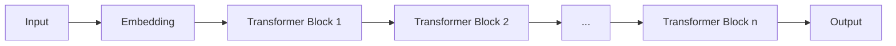

# CTRL原理与代码实例讲解

## 1.背景介绍
### 1.1 CTRL的定义与起源
CTRL（Conditional Transformer Language Model）是一种条件语言模型，由Salesforce于2019年提出。它是在GPT-2的基础上，通过引入控制码（control codes）实现对生成文本的精细控制。

### 1.2 CTRL的意义与价值
CTRL的出现，让我们可以更好地控制文本生成的方向和风格。这在诸如对话系统、内容创作等领域有着广泛的应用前景。它的可控性和灵活性，为自然语言处理技术带来了新的突破。

### 1.3 CTRL的特点与优势
- 可控性强：通过控制码指定生成文本的属性
- 灵活多变：支持多种控制码组合，生成丰富多样的文本
- 效果出色：在多个任务上取得了优异的表现

## 2.核心概念与联系
### 2.1 语言模型
语言模型是一种对语言概率分布进行建模的方法。给定一个词序列，语言模型可以预测下一个最可能出现的词。CTRL是一种条件语言模型，引入了额外的条件（控制码）来调节语言模型的行为。

### 2.2 Transformer 架构
CTRL采用了Transformer的架构。Transformer 通过 self-attention 机制实现了并行计算，大大提高了训练和推理的效率。同时 Transformer 在捕捉长距离依赖关系方面也有出色表现。

### 2.3 迁移学习
CTRL采用了迁移学习的思想，在一个超大规模的语料库上进行预训练，然后在下游任务上进行微调。这种预训练-微调范式已经成为 NLP 领域的主流做法。

### 2.4 控制码
控制码是 CTRL 的核心创新点。通过在输入序列中添加特定的控制码，我们可以指定生成文本的属性，如体裁、情感倾向、话题等。控制码赋予了 CTRL 强大的可控性。

## 3.核心算法原理具体操作步骤
### 3.1 模型结构
CTRL的整体结构可以用下面的Mermaid流程图表示：



### 3.2 训练过程
1. 准备带有控制码的大规模语料库
2. 将文本序列化，添加控制码，生成训练数据
3. 使用 Transformer 模型对语料库进行预训练
4. 在下游任务的数据集上对模型进行微调

### 3.3 生成过程
1. 给定控制码和初始文本
2. 将控制码和文本拼接并输入到模型中
3. 模型根据输入生成下一个词
4. 重复步骤3，直到生成所需长度的文本

### 3.4 控制码的设计
- 体裁控制码：指定生成文本的体裁，如新闻、诗歌、对话等
- 主题控制码：指定生成文本的主题，如体育、政治、科技等  
- 情感控制码：指定生成文本的情感倾向，如正面、负面、中性

控制码的粒度可以根据实际需求进行调整。通过控制码的组合，可以生成极其丰富多样的文本。

## 4.数学模型和公式详细讲解举例说明
### 4.1 语言模型的概率公式
给定一个词序列 $w_1, w_2, ..., w_n$，语言模型的目标是估计这个序列的概率 $P(w_1, w_2, ..., w_n)$。根据概率论的链式法则，这个概率可以分解为：

$$P(w_1, w_2, ..., w_n) = P(w_1) \cdot P(w_2|w_1) \cdot P(w_3|w_1,w_2) \cdot ... \cdot P(w_n|w_1,w_2,...,w_{n-1})$$

其中 $P(w_i|w_1,w_2,...,w_{i-1})$ 表示在给定前 $i-1$ 个词的条件下，第 $i$ 个词是 $w_i$ 的条件概率。

### 4.2 Transformer 的 Self-Attention 公式
Transformer 的核心是 Self-Attention 机制。对于一个序列 $x_1, x_2, ..., x_n$，Self-Attention 的计算公式为：

$$Attention(Q,K,V) = softmax(\frac{QK^T}{\sqrt{d_k}})V$$

其中 $Q$, $K$, $V$ 分别是 query、key、value 矩阵，$d_k$ 是 key 的维度。这个公式可以理解为：每个位置的表示先与所有位置的 key 做点积，然后经过 softmax 归一化得到权重，最后用这个权重对 value 进行加权求和。

### 4.3 控制码的数学表示
设控制码的集合为 $\mathcal{C}=\{c_1,c_2,...,c_m\}$，每个控制码 $c_i$ 可以表示为一个 one-hot 向量。给定一个控制码 $c$，CTRL 模型的条件概率可以表示为：

$$P(w_1, w_2, ..., w_n|c) = P(w_1|c) \cdot P(w_2|w_1,c) \cdot ... \cdot P(w_n|w_1,w_2,...,w_{n-1},c)$$

可以看出，控制码 $c$ 参与了每一步的条件概率计算，从而影响生成文本的属性。

## 5.项目实践：代码实例和详细解释说明
下面是一个使用 PyTorch 实现 CTRL 模型的简化版代码示例：

```python
import torch
import torch.nn as nn

class CTRL(nn.Module):
    def __init__(self, vocab_size, d_model, n_layers, n_heads, d_ff, n_codes, max_len=100):
        super().__init__()
        self.embedding = nn.Embedding(vocab_size, d_model)
        self.code_embedding = nn.Embedding(n_codes, d_model)
        self.pos_embedding = nn.Embedding(max_len, d_model)
        self.layers = nn.ModuleList([TransformerBlock(d_model, n_heads, d_ff) for _ in range(n_layers)])
        self.fc = nn.Linear(d_model, vocab_size)
        
    def forward(self, x, code):
        seq_len = x.size(1)
        pos = torch.arange(seq_len, dtype=torch.long, device=x.device)
        x = self.embedding(x) + self.code_embedding(code) + self.pos_embedding(pos)
        for layer in self.layers:
            x = layer(x)
        x = self.fc(x)
        return x
```

这个代码定义了一个简化版的 CTRL 模型，主要组件包括：

- `embedding`：将词转换为词向量
- `code_embedding`：将控制码转换为向量
- `pos_embedding`：位置编码，捕捉词的位置信息
- `layers`：多层 Transformer Block，用于提取特征
- `fc`：最后的全连接层，将特征转换为每个词的概率

模型的输入包括词序列 `x` 和控制码 `code`，输出是下一个词的概率分布。

在实际使用中，还需要定义训练循环和生成函数。训练时，将文本序列和对应的控制码输入到模型中，优化语言模型的似然概率。生成时，给定控制码和初始文本，重复地将生成的词添加到输入中，直到达到所需长度。

## 6.实际应用场景
CTRL 可以应用于多种场景，包括但不限于：

### 6.1 对话系统
在对话系统中，可以使用 CTRL 生成符合特定人设和情景的回复。通过设置合适的控制码，可以让对话更加自然和贴近人类的交流方式。

### 6.2 内容创作
CTRL 可以辅助创作各种体裁的文本内容，如新闻、小说、诗歌、剧本等。通过控制码指定文本的风格和主题，可以激发创作灵感，提高创作效率。

### 6.3 数据增强
在一些 NLP 任务中，训练数据的不足常常限制了模型的性能。使用 CTRL 可以自动生成大量符合特定属性的文本数据，从而缓解数据不足的问题。

### 6.4 个性化推荐
CTRL 可以根据用户的偏好生成个性化的文本内容，如新闻推荐、广告文案等。通过分析用户的历史行为，设置合适的控制码，可以提高内容的吸引力和转化率。

## 7.工具和资源推荐
### 7.1 官方代码仓库
Salesforce 在 GitHub 上开源了 CTRL 的官方实现，包括训练代码和预训练模型。地址：https://github.com/salesforce/ctrl

### 7.2 Hugging Face Transformers
Hugging Face 的 Transformers 库集成了多种预训练语言模型，包括 CTRL。通过简单的 API 就可以使用 CTRL 进行文本生成。地址：https://huggingface.co/transformers/model_doc/ctrl.html

### 7.3 相关论文
- CTRL: A Conditional Transformer Language Model for Controllable Generation. https://arxiv.org/abs/1909.05858
- Attention Is All You Need. https://arxiv.org/abs/1706.03762

## 8.总结：未来发展趋势与挑战
CTRL 的提出开启了可控文本生成的新纪元。未来，可控文本生成技术有望在更多领域得到应用，如智能写作助手、虚拟客服、智能教育等。同时，研究者们也在不断探索更加细粒度和灵活的控制方式，如基于句法结构、语义角色等信息的控制。

尽管 CTRL 已经展现出了强大的性能，但它仍然面临一些挑战：

- 控制码的设计需要领域知识，目前还没有一套通用的控制码体系。
- 生成的文本有时会出现不连贯、逻辑错误等问题，还需要进一步提高生成质量。
- 训练 CTRL 需要海量的数据和计算资源，对中小型团队和个人研究者来说门槛较高。

相信通过学界和业界的共同努力，这些挑战都将得到解决，可控文本生成技术也必将迎来更加广阔的应用前景。

## 9.附录：常见问题与解答
### 9.1 CTRL 和 GPT-2 有什么区别？
GPT-2 是一个无条件语言模型，只能根据上文生成下文。而 CTRL 通过引入控制码，可以根据用户的需求生成特定风格和主题的文本。

### 9.2 CTRL 支持哪些控制码？
CTRL 支持多种控制码，如体裁、主题、情感等。具体支持的控制码可以参考官方代码仓库中的说明。

### 9.3 CTRL 的训练数据来源是什么？  
CTRL 在一个超大规模的网络爬取数据上进行训练，数据涵盖了多个领域和体裁。同时，这些数据都经过了去重、清洗等预处理步骤，以保证数据质量。

### 9.4 CTRL 生成的文本质量如何？
CTRL 在多个文本生成任务上都取得了不错的效果，生成的文本在流畅度、连贯性、主题相关性等方面都有较好的表现。但是，CTRL 生成的文本偶尔也会出现语法错误、逻辑不一致等问题，还有待进一步改进。

### 9.5 如何微调 CTRL 模型？
微调 CTRL 模型的基本步骤是：准备带有控制码的目标领域数据，加载预训练的 CTRL 模型，在目标数据上进行训练。在训练时，可以选择冻结部分层的参数，以加快训练速度和防止过拟合。

作者：禅与计算机程序设计艺术 / Zen and the Art of Computer Programming