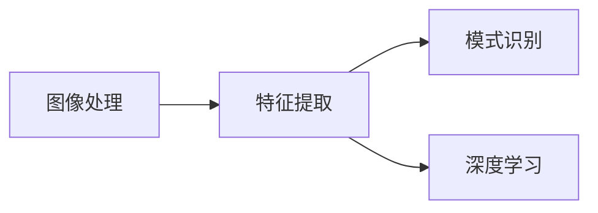

## 1.背景介绍
计算机视觉（Computer Vision）是一门研究如何使机器“看见”并理解世界的学科。在过去的几十年里，计算机视觉在许多领域都取得了显著的进步，包括图像识别、目标检测和跟踪、场景理解等。尤其是近年来，由于深度学习的快速发展，计算机视觉的应用已经深入到我们生活的方方面面，如自动驾驶、医疗影像诊断、安全监控等。

## 2.核心概念与联系
计算机视觉的核心概念主要包括图像处理、特征提取、模式识别等。图像处理是计算机视觉的基础，主要包括图像预处理（如滤波、增强等）、图像分割、图像描述等。特征提取是从原始图像中提取有用信息的过程，这些信息可以是颜色、纹理、形状等。模式识别则是基于提取的特征进行分类或识别。

在计算机视觉中，还有一个重要的概念是深度学习。深度学习是一种特殊的机器学习方法，它可以自动学习和抽取数据的特征，从而实现对数据的分类或识别。在计算机视觉中，深度学习已经成为最主流的方法，尤其是卷积神经网络（Convolutional Neural Network，CNN）在图像识别、目标检测等任务中取得了显著的效果。



## 3.核心算法原理具体操作步骤
在计算机视觉中，一般的处理流程包括：图像预处理、特征提取、模式识别。

1. 图像预处理：包括图像增强（如对比度增强、噪声滤波等）、图像分割（如阈值分割、边缘检测等）等，目的是去除图像中的噪声和不相关信息，突出图像中的目标。
2. 特征提取：从预处理后的图像中提取有用的特征，这些特征可以是颜色、纹理、形状等。特征提取的方法有很多，如SIFT、SURF、HOG等。
3. 模式识别：基于提取的特征，使用机器学习或深度学习方法对图像进行分类或识别。


## 4.数学模型和公式详细讲解举例说明
在计算机视觉中，我们经常使用一些数学模型和公式来描述和解决问题。例如，对于图像增强，我们可以使用直方图均衡化来提高图像的对比度。直方图均衡化的基本思想是将原始图像的灰度直方图变换为均匀分布的直方图，从而达到增强图像对比度的效果。其数学公式为：

$$
P_r(r) = \frac{n_r}{N}
$$

其中，$P_r(r)$是像素值r的概率，$n_r$是像素值r的数量，$N$是图像中的总像素数量。

对于特征提取，我们可以使用SIFT算法来提取图像的关键点。SIFT算法的基本思想是在不同的尺度空间中检测极值点，这些极值点就是图像的关键点。其数学公式为：

$$
L(x,y,\sigma) = G(x,y,\sigma) * I(x,y)
$$

其中，$L(x,y,\sigma)$是尺度空间函数，$G(x,y,\sigma)$是高斯函数，$I(x,y)$是原始图像，$*$表示卷积运算。

## 5.项目实践：代码实例和详细解释说明
下面我们来看一个使用Python和OpenCV库进行图像处理的简单例子。这个例子中，我们将对一张图像进行灰度化和直方图均衡化处理。

```python
import cv2
import numpy as np

# 读取图像
img = cv2.imread('test.jpg')

# 转换为灰度图像
gray = cv2.cvtColor(img, cv2.COLOR_BGR2GRAY)

# 直方图均衡化
equ = cv2.equalizeHist(gray)

# 显示原图和处理后的图像
cv2.imshow('Original', gray)
cv2.imshow('Equalized', equ)
cv2.waitKey(0)
cv2.destroyAllWindows()
```

在这个例子中，我们首先读取一张图像，然后将其转换为灰度图像。接着，我们使用OpenCV的equalizeHist函数对灰度图像进行直方图均衡化处理，以增强图像的对比度。最后，我们显示原图和处理后的图像。

## 6.实际应用场景
计算机视觉的应用场景非常广泛，包括但不限于：

- 自动驾驶：计算机视觉可以用于车辆检测、行人检测、道路标志识别等。
- 医疗影像诊断：计算机视觉可以用于医疗图像分析，如肿瘤检测、病灶分割等。
- 安全监控：计算机视觉可以用于人脸识别、行为分析等。

## 7.工具和资源推荐
- OpenCV：一个开源的计算机视觉库，提供了许多图像处理和计算机视觉的算法。
- TensorFlow：一个开源的深度学习框架，可以用于构建和训练深度神经网络。
- PyTorch：一个开源的深度学习框架，提供了灵活和直观的接口，适合于研究和开发。

## 8.总结：未来发展趋势与挑战
计算机视觉是一个快速发展的领域，尤其是近年来，由于深度学习的快速发展，计算机视觉的应用已经深入到我们生活的方方面面。然而，计算机视觉仍然面临许多挑战，如算法的复杂性、计算资源的需求、数据的难以获取等。未来，我们需要更高效的算法、更强大的计算资源、更丰富的数据来推动计算机视觉的发展。

## 9.附录：常见问题与解答
1. 问题：计算机视觉和图像处理有什么区别？
   答：图像处理是计算机视觉的一部分，主要关注如何改善图像的质量。计算机视觉则更关注如何理解图像的内容。

2. 问题：深度学习在计算机视觉中的作用是什么？
   答：深度学习可以自动学习和抽取数据的特征，从而实现对数据的分类或识别。在计算机视觉中，深度学习已经成为最主流的方法。

3. 问题：计算机视觉的应用场景有哪些？
   答：计算机视觉的应用场景非常广泛，包括自动驾驶、医疗影像诊断、安全监控等。

作者：禅与计算机程序设计艺术 / Zen and the Art of Computer Programming