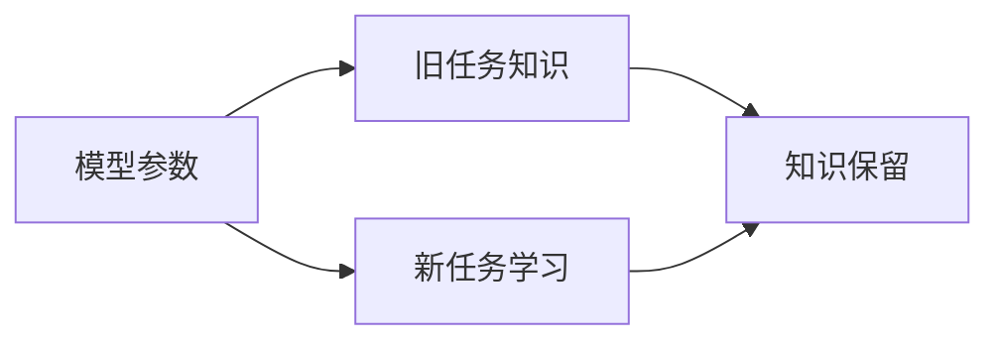

## 1.背景介绍

终身学习，或持续学习，是人工智能中的一个重要研究方向，它的目标是让模型能够在经历一系列的任务后，不仅能记住以前学过的知识，而且能够利用这些知识来帮助学习新的任务。然而，这是一个非常具有挑战性的问题，因为神经网络模型往往在学习新任务时会忘记旧任务的知识，这种现象被称为灾难性遗忘。为了解决这个问题，研究人员提出了许多方法，其中一种被称为持续学习。

## 2.核心概念与联系

持续学习的核心概念是通过动态调整模型的参数，使模型在学习新任务时，能够保留对旧任务的知识。这涉及到两个关键的问题：如何衡量模型对旧任务的知识，以及如何在保留旧任务知识的同时，有效地学习新任务。



## 3.核心算法原理具体操作步骤

持续学习的一种常见方法是通过正则化技术来约束模型参数的更新。具体来说，当我们在学习新任务时，我们不仅要最小化新任务的损失函数，还要最小化模型参数与旧任务最优参数之间的距离。这可以通过添加一个正则化项到损失函数中来实现。

## 4.数学模型和公式详细讲解举例说明

假设我们的模型参数为$\theta$，旧任务的最优参数为$\theta^*$，新任务的损失函数为$L(\theta)$，那么我们的目标函数可以写为：

$$
\min_{\theta} L(\theta) + \lambda ||\theta - \theta^*||^2
$$

其中，$\lambda$是一个超参数，用来控制新任务学习和旧任务知识保留之间的权衡。

## 5.项目实践：代码实例和详细解释说明

下面我们将通过一个简单的例子来演示如何实现持续学习。假设我们有一个二分类任务，我们的模型是一个简单的线性模型，损失函数是交叉熵损失。

```python
import torch
import torch.nn as nn

# 定义模型
class LinearModel(nn.Module):
    def __init__(self, input_size):
        super(LinearModel, self).__init__()
        self.fc = nn.Linear(input_size, 1)

    def forward(self, x):
        return self.fc(x)

# 初始化模型和优化器
model = LinearModel(input_size=10)
optimizer = torch.optim.SGD(model.parameters(), lr=0.01)

# 训练旧任务
for epoch in range(100):
    # 假设我们有一些训练数据
    x, y = ...
    # 计算损失
    y_pred = model(x)
    loss = nn.BCEWithLogitsLoss()(y_pred, y)
    # 反向传播和更新
    optimizer.zero_grad()
    loss.backward()
    optimizer.step()

# 保存旧任务的参数
old_params = {name: param.clone() for name, param in model.named_parameters()}

# 训练新任务
for epoch in range(100):
    # 假设我们有一些新的训练数据
    x, y = ...
    # 计算损失
    y_pred = model(x)
    loss = nn.BCEWithLogitsLoss()(y_pred, y)
    # 添加正则化项
    for name, param in model.named_parameters():
        loss += 0.01 * torch.sum((param - old_params[name]) ** 2)
    # 反向传播和更新
    optimizer.zero_grad()
    loss.backward()
    optimizer.step()
```

## 6.实际应用场景

持续学习在许多实际应用中都有重要的作用，例如自动驾驶、个性化推荐、自然语言处理等。在这些应用中，模型需要在不断变化的环境中进行学习，而持续学习提供了一种有效的方法来处理这种情况。

## 7.工具和资源推荐

对于持续学习的研究，以下是一些有用的工具和资源：

- [PyTorch](https://pytorch.org/)：一个强大的深度学习框架，可以方便地实现各种持续学习算法。
- [Continual AI](https://www.continualai.org/)：一个专注于持续学习研究的社区，提供了许多资源和教程。

## 8.总结：未来发展趋势与挑战

持续学习是一个非常活跃的研究领域，未来有许多值得探索的方向。例如，如何更有效地衡量和保留模型的知识，如何在多任务学习中应用持续学习，以及如何将持续学习与其他机器学习技术（如强化学习、元学习等）结合起来。

同时，持续学习也面临着一些挑战。例如，如何在有限的计算资源下实现有效的持续学习，如何处理任务之间的冲突，以及如何保证模型的稳定性和可解释性。

## 9.附录：常见问题与解答

1. **Q: 持续学习和在线学习有什么区别？**

A: 持续学习和在线学习都是处理模型在时间上的学习问题，但它们的焦点不同。在线学习关注的是如何在每次只看到一个样本的情况下进行学习，而持续学习关注的是如何在经历一系列任务后，保留对旧任务的知识并学习新任务。

2. **Q: 持续学习如何处理任务之间的冲突？**

A: 当任务之间存在冲突时，持续学习需要通过一些策略来平衡不同任务的学习。这可能涉及到权衡新任务学习和旧任务知识保留之间的关系，或者使用一些技术来隔离不同任务的影响。

3. **Q: 持续学习是否需要更多的计算资源？**

A: 相比于一次性学习所有任务，持续学习可能需要更多的计算资源，因为它需要在学习新任务的同时保留旧任务的知识。然而，通过一些技术（如模型压缩、知识蒸馏等），可以在一定程度上减少这种需求。

作者：禅与计算机程序设计艺术 / Zen and the Art of Computer Programming