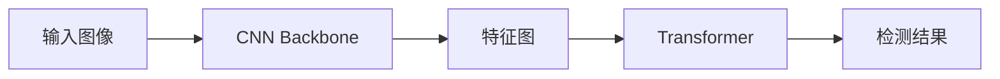

## 1.背景介绍

DETR（Detection Transformer）是Facebook AI研究院于2020年提出的一种全新的目标检测方法。传统的目标检测方法，如Faster R-CNN、YOLO、SSD等，都需要设计复杂的手工特性，如锚框、非极大值抑制（NMS）等。而DETR则摒弃了这些设计，提出了一种全新的、基于Transformer的目标检测框架，大大简化了目标检测的流程。

## 2.核心概念与联系

DETR的主要构成包括两部分：CNN Backbone和Transformer。CNN Backbone用于提取输入图像的特征，Transformer则用于处理这些特征并输出最终的检测结果。



## 3.核心算法原理具体操作步骤

DETR的算法流程可以分为以下几个步骤：

1. **特征提取**：首先，通过CNN Backbone对输入图像进行特征提取，得到特征图。

2. **位置编码**：对特征图进行位置编码（Positional Encoding），以保留空间信息。

3. **Transformer处理**：将位置编码后的特征图输入到Transformer中进行处理。Transformer由Encoder和Decoder两部分组成，Encoder用于处理特征图，Decoder则用于预测目标的类别和位置。

4. **目标检测**：Transformer输出的每个query都对应一个预测的目标。对于每个query，Transformer会预测一个类别和一个位置，从而完成目标检测。

## 4.数学模型和公式详细讲解举例说明

DETR的关键在于其目标检测的方式。对于每个query，DETR会预测一个类别和一个位置。类别的预测是一个分类问题，位置的预测则是一个回归问题。

类别的预测可以用交叉熵损失函数来描述：

$$
L_{cls} = -\sum_i y_i \log(p_i)
$$

其中，$y_i$是第$i$个query的真实类别，$p_i$是预测的概率。

位置的预测则用IoU损失函数来描述：

$$
L_{box} = 1 - IoU(\hat{b}, b)
$$

其中，$\hat{b}$是预测的位置，$b$是真实位置。

## 5.项目实践：代码实例和详细解释说明

下面是一个使用DETR进行目标检测的简单示例：

```python
import torch
from models.detr import DETR

# 初始化模型
model = DETR(num_classes=80, num_queries=100)

# 加载预训练权重
model.load_state_dict(torch.load('detr.pth'))

# 输入图像
image = torch.randn(1, 3, 800, 800)

# 前向传播
outputs = model(image)

# 获取检测结果
pred_logits = outputs['pred_logits']
pred_boxes = outputs['pred_boxes']
```

在这个示例中，我们首先初始化了一个DETR模型，然后加载了预训练的权重。接着，我们输入了一个随机生成的图像，通过模型的前向传播，得到了预测的类别和位置。

## 6.实际应用场景

DETR由于其简洁的设计和强大的性能，已经在许多实际应用场景中得到了应用，包括：

- **无人驾驶**：在无人驾驶的场景中，需要实时检测路面上的行人、车辆等目标。DETR的高效性能使得它非常适合用于这种实时检测的场景。

- **视频监控**：在视频监控的场景中，需要对视频中的人员、车辆等目标进行检测。DETR的高精度使得它非常适合用于这种高精度检测的场景。

- **医疗图像分析**：在医疗图像分析的场景中，需要对CT、MRI等图像中的病灶等目标进行检测。DETR的强大性能使得它非常适合用于这种复杂检测的场景。

## 7.工具和资源推荐

- **DETR的官方实现**：Facebook AI研究院提供了DETR的官方PyTorch实现，包括完整的训练和测试代码。

- **预训练模型**：Facebook AI研究院还提供了在COCO数据集上训练的预训练模型，可以直接用于目标检测任务。

## 8.总结：未来发展趋势与挑战

DETR的出现，无疑为目标检测领域带来了新的思路。它摒弃了传统的手工特性设计，将目标检测问题转化为了一个端到端的学习问题，大大简化了目标检测的流程。然而，DETR也存在一些挑战和问题，比如对小目标的检测性能较差，对训练数据的需求量较大等。未来，如何解决这些问题，进一步提升DETR的性能，将是目标检测领域的一个重要研究方向。

## 9.附录：常见问题与解答

**Q：DETR为什么不需要NMS？**

A：传统的目标检测方法，如Faster R-CNN、YOLO、SSD等，都需要使用NMS来去除重复的检测结果。而DETR则不需要NMS，因为它的每个query都对应一个预测的目标，不存在重复的问题。

**Q：DETR如何处理小目标？**

A：DETR对小目标的处理性能较差，这是因为其使用全局的Transformer进行处理，对局部的小目标的处理能力较弱。对于这个问题，一种可能的解决方向是引入更多的局部信息，比如使用局部的Attention机制。

**Q：DETR的训练速度如何？**

A：由于DETR使用了全局的Transformer，其训练速度相比传统的目标检测方法较慢。但是，由于其简洁的设计，DETR的实现和调试速度相对较快。