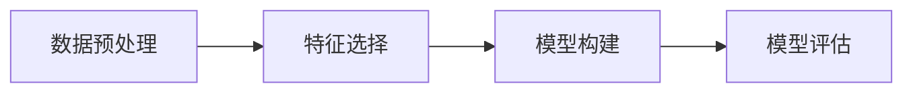

## 1.背景介绍
数据挖掘(Data Mining)作为一种从大量数据中自动搜索隐藏信息的计算过程，已经成为数据科学领域的核心组成部分。在这个信息爆炸的时代，数据挖掘的重要性不言而喻。本文将详细介绍数据挖掘的原理，并通过实际代码案例进行讲解。

## 2.核心概念与联系
数据挖掘的核心概念包括数据预处理、特征选择、模型构建和评估等。这些概念之间的联系可以用下面的Mermaid流程图表示：

## 3.核心算法原理具体操作步骤
数据挖掘的核心算法原理包括分类、聚类、关联规则、序列模式和异常检测等。下面我们以分类算法为例，介绍其具体操作步骤：

1. 数据预处理：清洗数据，处理缺失值，归一化数值；
2. 特征选择：选择有意义的特征输入模型；
3. 模型构建：使用分类算法（如决策树、支持向量机等）构建模型；
4. 模型评估：使用准确率、召回率等指标评估模型。

## 4.数学模型和公式详细讲解举例说明
以决策树为例，其数学模型可以用信息熵来表达。信息熵是度量样本集合纯度的一种指标，假设当前样本集合D中第k类样本所占的比例为$p_k(k=1,2,...,|y|)$,则D的信息熵定义为：

$$ Ent(D) = - \sum_{k=1}^{|y|} p_k \log_2 p_k $$

## 5.项目实践：代码实例和详细解释说明
下面我们以Python的sklearn库为例，展示一个简单的决策树分类案例。首先，我们需要导入所需的库，然后加载数据，接着构建决策树模型，并进行训练，最后对模型进行评估。

```python
from sklearn.datasets import load_iris
from sklearn.model_selection import train_test_split
from sklearn.tree import DecisionTreeClassifier
from sklearn.metrics import accuracy_score

# 加载数据
iris = load_iris()
X = iris.data
y = iris.target

# 划分训练集和测试集
X_train, X_test, y_train, y_test = train_test_split(X, y, test_size=0.2, random_state=42)

# 构建决策树模型
clf = DecisionTreeClassifier()
clf.fit(X_train, y_train)

# 对测试集进行预测
y_pred = clf.predict(X_test)

# 评估模型
print("Accuracy:", accuracy_score(y_test, y_pred))
```

## 6.实际应用场景
数据挖掘在各行各业都有广泛的应用，如金融风控、智能推荐、医疗诊断等。例如，在金融风控中，可以通过挖掘用户的消费习惯、信用记录等数据，预测用户的信用风险；在智能推荐中，可以通过挖掘用户的浏览记录、购买记录等数据，推荐用户可能感兴趣的商品。

## 7.工具和资源推荐
在数据挖掘领域，有很多优秀的工具和资源，如Python的sklearn库、R的rattle包、UCI机器学习库等。这些工具和资源可以帮助我们更好地进行数据挖掘。

## 8.总结：未来发展趋势与挑战
随着大数据和人工智能的发展，数据挖掘的应用将更加广泛。但同时，也面临着数据质量、隐私保护、算法效率等挑战。我们需要不断探索和学习，以应对这些挑战。

## 9.附录：常见问题与解答
1. Q:数据挖掘和机器学习有什么区别？
   A:数据挖掘是从大量数据中发现有用信息的过程，而机器学习是利用数据或历史信息，使计算机程序自我学习和改善的过程。

2. Q:如何选择合适的数据挖掘算法？
   A:选择合适的数据挖掘算法需要考虑问题的需求、数据的特性、算法的性能等因素。

作者：禅与计算机程序设计艺术 / Zen and the Art of Computer Programming