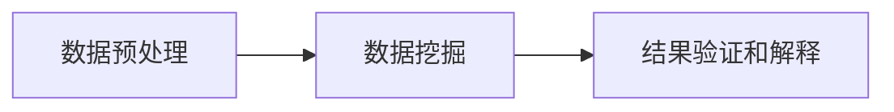

## 1.背景介绍

数据挖掘，也被称为知识发现，是从大量数据中提取或“挖掘”出有意义的信息和知识的过程。这个过程包括了数据预处理、数据挖掘、结果验证和解释等多个步骤。数据挖掘的主要目标是将这些从原始数据中提取出的知识用于决策支持、预测和预测等。

## 2.核心概念与联系

数据挖掘的核心概念主要包括以下几个部分：

- 数据预处理：这是数据挖掘的第一步，包括数据清洗、数据集成、数据变换和数据规约。

- 数据挖掘：这是从预处理过的数据中提取有意义的模式。数据挖掘技术包括分类、聚类、关联规则、序列模式和回归等。

- 结果验证和解释：这是数据挖掘的最后一步，主要是通过各种评价标准来验证和解释挖掘结果的有效性和可靠性。

这三个核心概念之间的联系是：数据预处理为数据挖掘提供了高质量的数据，数据挖掘在这些数据上发现有意义的模式，然后通过结果验证和解释来评价这些模式的有效性和可靠性。



## 3.核心算法原理具体操作步骤

数据挖掘的核心算法主要包括分类、聚类、关联规则、序列模式和回归等。下面以分类算法为例，介绍其具体的操作步骤。

分类算法的主要任务是根据已知的分类进行学习，然后对新的数据进行分类。常用的分类算法有决策树、朴素贝叶斯、支持向量机、K近邻法等。

以决策树为例，其具体的操作步骤如下：

1. 选择最优特征：根据特征的信息增益或者信息增益比来选择最优特征。

2. 构造决策树：根据最优特征将数据集划分为几个子集，然后对每个子集递归地进行步骤1和步骤2，直到满足停止条件。

3. 剪枝：为了防止过拟合，需要对决策树进行剪枝，常用的剪枝方法有预剪枝和后剪枝。

## 4.数学模型和公式详细讲解举例说明

决策树算法中的信息增益是一个重要的概念，它的计算公式如下：

$$
Gain(D, a) = Ent(D) - \sum_{v=1}^{V} \frac{|D^v|}{|D|} Ent(D^v)
$$

其中，$D$表示数据集，$a$表示特征，$D^v$表示数据集$D$中特征$a$取值为$v$的子集，$Ent(D)$表示数据集$D$的熵，$Ent(D^v)$表示子集$D^v$的熵。

熵是一个表示数据集纯度的指标，它的计算公式如下：

$$
Ent(D) = - \sum_{k=1}^{K} p_k log_2 p_k
$$

其中，$p_k$表示数据集$D$中第$k$类样本的比例。

举例来说，假设我们有一个数据集，其中有15个正例和5个负例。那么，这个数据集的熵就是：

$$
Ent(D) = - \frac{15}{20} log_2 \frac{15}{20} - \frac{5}{20} log_2 \frac{5}{20} = 0.81
$$

## 5.项目实践：代码实例和详细解释说明

下面是一个使用Python的sklearn库实现决策树分类的代码示例：

```python
from sklearn.datasets import load_iris
from sklearn.model_selection import train_test_split
from sklearn.tree import DecisionTreeClassifier

# 加载数据集
iris = load_iris()
X = iris.data
y = iris.target

# 划分训练集和测试集
X_train, X_test, y_train, y_test = train_test_split(X, y, test_size=0.2, random_state=42)

# 创建决策树分类器
clf = DecisionTreeClassifier()

# 训练模型
clf.fit(X_train, y_train)

# 预测测试集
y_pred = clf.predict(X_test)

# 打印预测结果
print(y_pred)
```

## 6.实际应用场景

数据挖掘在许多领域都有广泛的应用，如：

- 银行：通过数据挖掘，银行可以预测贷款违约率，从而降低风险。

- 电商：通过数据挖掘，电商可以推荐用户可能感兴趣的商品，从而提高销售额。

- 医疗：通过数据挖掘，医生可以预测疾病的发展趋势，从而制定更有效的治疗方案。

## 7.工具和资源推荐

推荐以下数据挖掘相关的工具和资源：

- 工具：Python的sklearn库、R的rpart包、Weka等。

- 书籍：《数据挖掘：概念与技术》、《数据挖掘导论》等。

- 网站：Kaggle、UCI机器学习库等。

## 8.总结：未来发展趋势与挑战

随着大数据时代的到来，数据挖掘的重要性日益凸显。未来的发展趋势可能会更加注重算法的效率和效果，以及对海量数据的处理能力。同时，也面临着数据安全和隐私保护等挑战。

## 9.附录：常见问题与解答

1. 问题：数据挖掘和机器学习有什么区别？

   答：数据挖掘和机器学习都是从数据中提取知识的过程，但它们的重点不同。数据挖掘更注重的是发现数据中的未知模式，而机器学习更注重的是通过学习已知的模式来预测未来的数据。

2. 问题：数据挖掘有哪些常用的算法？

   答：数据挖掘的常用算法包括分类、聚类、关联规则、序列模式和回归等。

3. 问题：如何评价数据挖掘的结果？

   答：评价数据挖掘结果的方法有很多，常用的有准确率、召回率、F1值、ROC曲线、AUC值等。

作者：禅与计算机程序设计艺术 / Zen and the Art of Computer Programming
