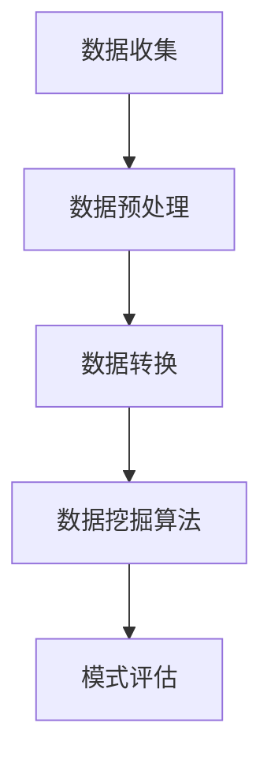

# Data Mining 原理与代码实战案例讲解

## 1. 背景介绍

数据挖掘(Data Mining)是一门跨学科的研究领域,旨在从大量数据中发现有价值的模式和规律。随着信息时代的到来,海量数据的积累为数据挖掘提供了广阔的应用前景。数据挖掘技术已广泛应用于多个领域,如金融风险管理、生物信息学、网络安全、社交网络分析等。

数据挖掘过程通常包括以下步骤:数据收集、数据预处理、数据转换、数据挖掘和模式评估。其中,数据挖掘算法是整个过程的核心,常用算法有分类、聚类、关联规则挖掘、异常检测等。

## 2. 核心概念与联系

### 2.1 数据预处理

数据预处理是数据挖掘过程中的重要环节,旨在提高数据质量,为后续分析做好准备。常见的预处理技术包括:

- 数据清洗:处理缺失值、噪声数据和不一致数据
- 数据集成:合并来自多个数据源的数据
- 数据转换:归一化、离散化等转换操作
- 数据减dimensionality:特征选择和提取,降低数据维度

### 2.2 数据挖掘算法

数据挖掘算法是整个过程的核心,可分为以下几类:

- 分类算法:基于已知样本,构建模型对新数据进行分类,如决策树、支持向量机等
- 聚类算法:根据数据相似性,将数据划分为多个簇,如K-Means、层次聚类等
- 关联规则挖掘:发现数据项集之间的关联关系,如Apriori算法
- 异常检测:识别与大多数模式不同的数据对象,如基于距离、基于密度等方法

### 2.3 模型评估

模型评估是衡量数据挖掘结果质量的重要环节,常用指标包括:

- 分类模型:准确率、精确率、召回率、F1值等
- 聚类模型:簇内相似度、簇间分离度等
- 关联规则:支持度、置信度等

### 2.4 Mermaid流程图



## 3. 核心算法原理具体操作步骤

### 3.1 决策树算法

决策树是一种常用的分类算法,通过构建决策树模型对数据进行分类预测。以下是构建决策树的一般步骤:

1. 选择最优特征作为根节点
2. 根据特征值,将数据集分割为子集
3. 对子集递归构建决策树
4. 直到满足终止条件,将节点标记为叶节点

常用的决策树算法包括ID3、C4.5和CART等。

#### 3.1.1 ID3算法

ID3算法使用信息增益作为选择特征的标准,具体步骤如下:

1. 计算数据集的信息熵
2. 对每个特征计算信息增益
3. 选择信息增益最大的特征作为根节点
4. 根据特征值分割数据集
5. 对子集递归构建决策树

#### 3.1.2 C4.5算法 

C4.5算法是ID3算法的改进版,使用信息增益比作为选择特征的标准,避免了ID3对可取值数目较多的特征的偏好。

#### 3.1.3 CART算法

CART(Classification and Regression Tree)算法不仅可用于分类问题,也可用于回归问题。CART使用基尼指数或均方差作为选择特征的标准。

### 3.2 K-Means聚类

K-Means是一种常用的聚类算法,将数据划分为K个簇,使得簇内数据点相似度较高,簇间相似度较低。算法步骤如下:

1. 随机选择K个初始质心
2. 计算每个数据点到各质心的距离,将其分配到最近的簇
3. 重新计算每个簇的质心
4. 重复步骤2和3,直至质心不再发生变化

K-Means算法的关键是选择合适的K值和初始质心。

### 3.3 Apriori算法

Apriori算法是关联规则挖掘中的经典算法,用于发现数据集中的频繁项集。算法步骤如下:

1. 设置最小支持度阈值
2. 统计数据集中每个项的支持度,构建1-频繁项集
3. 利用k-1频繁项集生成k候选项集
4. 计算k候选项集的支持度,构建k频繁项集
5. 重复步骤3和4,直至无法生成新的频繁项集
6. 根据频繁项集生成关联规则

Apriori算法的优化策略包括哈希技术、划分技术等。

## 4. 数学模型和公式详细讲解举例说明

### 4.1 信息熵

信息熵(Entropy)是信息论中的一个重要概念,用于衡量数据的无序程度。在决策树算法中,信息熵被用于选择最优特征。

对于一个包含k个类别的数据集D,信息熵的计算公式为:

$$
Ent(D) = -\sum_{i=1}^{k}p_ilog_2p_i
$$

其中,$p_i$表示第i个类别的概率。

例如,假设一个数据集D包含6个正例和4个反例,则正例的概率为$\frac{6}{10}$,反例的概率为$\frac{4}{10}$,信息熵为:

$$
Ent(D) = -\frac{6}{10}log_2\frac{6}{10} - \frac{4}{10}log_2\frac{4}{10} \approx 0.971
$$

### 4.2 信息增益

信息增益(Information Gain)用于衡量特征对数据集的分类能力,ID3算法使用信息增益作为选择特征的标准。

对于一个特征A,其信息增益的计算公式为:

$$
Gain(D,A) = Ent(D) - \sum_{v=1}^{V}\frac{|D^v|}{|D|}Ent(D^v)
$$

其中,$D^v$表示按特征A的取值v将数据集D分割得到的子集,$V$是特征A的所有可能取值,$|D^v|$和$|D|$分别表示$D^v$和D的数据量。

例如,对于上述包含10个样本的数据集D,假设有一个特征A,其取值为a1和a2,将D按A的取值分割得到$D^{a1}$和$D^{a2}$,其中$D^{a1}$包含5个正例和2个反例,$D^{a2}$包含1个正例和2个反例,则特征A的信息增益为:

$$
\begin{aligned}
Gain(D,A) &= Ent(D) - \frac{|D^{a1}|}{|D|}Ent(D^{a1}) - \frac{|D^{a2}|}{|D|}Ent(D^{a2})\\
&\approx 0.971 - \frac{7}{10}(0.857) - \frac{3}{10}(0.918)\\
&\approx 0.048
\end{aligned}
$$

### 4.3 基尼指数

基尼指数(Gini Index)是CART算法中用于选择特征的指标,反映了数据集的不纯度。

对于一个包含k个类别的数据集D,基尼指数的计算公式为:

$$
Gini(D) = 1 - \sum_{i=1}^{k}p_i^2
$$

其中,$p_i$表示第i个类别的概率。

例如,对于上述包含6个正例和4个反例的数据集D,基尼指数为:

$$
Gini(D) = 1 - \left(\frac{6}{10}\right)^2 - \left(\frac{4}{10}\right)^2 \approx 0.48
$$

### 4.4 K-Means目标函数

K-Means算法的目标是最小化所有数据点到其所属簇质心的距离平方和,即最小化目标函数:

$$
J = \sum_{i=1}^{k}\sum_{x \in C_i}||x - \mu_i||^2
$$

其中,$k$是簇的数目,$C_i$表示第i个簇,$\mu_i$是第i个簇的质心,$||x - \mu_i||$表示数据点$x$到质心$\mu_i$的距离。

## 5. 项目实践:代码实例和详细解释说明

以下是使用Python实现决策树算法的代码示例:

```python
import numpy as np
from collections import Counter

class DecisionTree:
    def __init__(self, max_depth=None):
        self.max_depth = max_depth
        self.root = None
    
    def entropy(self, y):
        # 计算信息熵
        ...
        
    def info_gain(self, X, y, feature):
        # 计算信息增益
        ...
        
    def build_tree(self, X, y, depth=0):
        # 构建决策树
        ...
        
    def predict(self, X):
        # 对新数据进行预测
        ...
        
# 使用示例
X = np.array([[1, 1], [1, 0], [0, 1], [0, 0]])
y = np.array([1, 1, 0, 0])
dt = DecisionTree(max_depth=2)
dt.build_tree(X, y)
print(dt.predict([[1, 1], [0, 0]]))  # 输出 [1, 0]
```

上述代码实现了一个基本的决策树分类器,包括计算信息熵、信息增益、构建决策树和对新数据进行预测的功能。

其中,`entropy`函数用于计算数据集的信息熵,`info_gain`函数用于计算特征的信息增益,`build_tree`函数递归地构建决策树,`predict`函数对新数据进行预测。

在构建决策树时,算法会选择信息增益最大的特征作为根节点,并根据特征值分割数据集,对子集递归构建子树。为了防止过拟合,可以设置最大深度`max_depth`作为终止条件。

使用示例展示了如何创建一个决策树对象,并使用训练数据构建决策树模型,最后对新数据进行预测。

## 6. 实际应用场景

数据挖掘技术在现实生活中有着广泛的应用,以下是一些典型场景:

### 6.1 金融风险管理

银行和金融机构可以利用数据挖掘技术,分析客户的信用记录、交易行为等数据,评估客户的信用风险,从而做出审慎的贷款决策。同时,数据挖掘还可用于检测金融欺诈行为。

### 6.2 生物信息学

在生物信息学领域,数据挖掘技术可用于基因表达数据分析、蛋白质结构预测、疾病诊断等任务。例如,通过分析基因芯片数据,可以发现与某种疾病相关的基因模式。

### 6.3 网络安全

数据挖掘在网络安全领域也有重要应用,可用于检测网络入侵行为、识别垃圾邮件、发现网络攻击模式等。通过分析大量网络流量数据,可以构建入侵检测模型,提高网络安全性。

### 6.4 社交网络分析

社交网络数据是一种特殊的关系型数据,数据挖掘技术可用于发现社交网络中的社区结构、影响力用户、信息传播模式等,为社交网络营销、舆情监控等提供支持。

### 6.5 推荐系统

推荐系统是数据挖掘技术在电子商务领域的典型应用,通过分析用户的历史行为数据,可以发现用户的兴趣偏好,从而为其推荐感兴趣的商品或内容,提高用户体验和转化率。

## 7. 工具和资源推荐

数据挖掘是一个庞大的领域,涉及多种算法和工具。以下是一些常用的数据挖掘工具和学习资源:

### 7.1 Python库

- Scikit-learn: 机器学习库,提供了多种数据挖掘算法的实现
- Pandas: 数据分析库,方便数据预处理和探索性分析
- NumPy: 科学计算库,提供了高性能的数值计算功能
- Matplotlib: 数据可视化库,可绘制各种图表

### 7.2 大数据工具

- Apache Hadoop: 分布式计算框架,适合处理大规模数据集
- Apache Spark: 快速通用的大数据处理引擎
- Apache Kafka: 分布式流处理平台