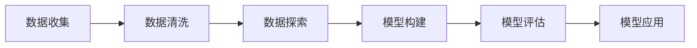

## 1.背景介绍

数据科学是一门跨学科的领域，它使用科学方法、过程、算法和系统来从结构化和非结构化的数据中提取知识和洞察力。这个领域涵盖了统计学、数据挖掘、预测分析、机器学习等多个子领域，为我们提供了一种全面理解数据并从中获取价值的方法。

## 2.核心概念与联系

数据科学的核心概念包括数据收集、数据清洗、数据探索、模型构建、模型评估和模型应用。这些步骤之间的联系可以用以下的Mermaid流程图来表示：



## 3.核心算法原理具体操作步骤

在数据科学中，我们经常使用的核心算法包括线性回归、逻辑回归、决策树、随机森林、支持向量机、K-近邻算法、朴素贝叶斯等。下面我们以线性回归为例，介绍其具体的操作步骤：

1. **数据准备**：收集并清洗数据，确保数据的质量和完整性。
2. **特征选择**：从所有的特征中选择出对目标变量影响最大的特征。
3. **模型构建**：使用选择的特征和目标变量构建线性回归模型。
4. **模型评估**：使用一部分数据对模型进行训练，然后使用剩余的数据对模型进行测试，评估模型的性能。
5. **模型应用**：将模型应用到实际的问题中，进行预测。

## 4.数学模型和公式详细讲解举例说明

线性回归的数学模型可以表示为：$y = \beta_0 + \beta_1x_1 + \beta_2x_2 + ... + \beta_nx_n + \epsilon$，其中，$y$是目标变量，$x_1, x_2, ..., x_n$是特征，$\beta_0, \beta_1, ..., \beta_n$是模型的参数，$\epsilon$是误差项。

我们的目标是找到一组参数$\beta_0, \beta_1, ..., \beta_n$，使得误差项$\epsilon$的平方和最小，这就是最小二乘法的原理。我们可以通过梯度下降法来求解这个问题，具体的公式为：$\beta_j := \beta_j - \alpha \frac{\partial}{\partial \beta_j}J(\beta)$，其中，$\alpha$是学习率，$J(\beta)$是损失函数。

## 5.项目实践：代码实例和详细解释说明

下面我们使用Python的sklearn库来进行线性回归的实战案例。首先，我们需要加载数据并进行预处理：

```python
from sklearn.model_selection import train_test_split
from sklearn.linear_model import LinearRegression
from sklearn import datasets

# 加载数据
boston = datasets.load_boston()
X = boston.data
y = boston.target

# 划分训练集和测试集
X_train, X_test, y_train, y_test = train_test_split(X, y, test_size=0.2, random_state=42)
```

然后，我们可以构建线性回归模型并进行训练：

```python
# 构建模型
model = LinearRegression()

# 训练模型
model.fit(X_train, y_train)
```

最后，我们可以使用测试集对模型进行评估：

```python
# 测试模型
y_pred = model.predict(X_test)
print("模型的R^2得分：", model.score(X_test, y_test))
```

## 6.实际应用场景

数据科学在许多领域都有广泛的应用，例如：

- **电商**：通过用户的购买历史、浏览记录等数据，进行用户行为分析和商品推荐。
- **金融**：通过用户的信用记录、交易记录等数据，进行信用评分和风险控制。
- **医疗**：通过患者的病历、基因数据等，进行疾病预测和个性化治疗。
- **社交媒体**：通过用户的社交网络、行为数据等，进行社区发现和情感分析。

## 7.工具和资源推荐

在数据科学的学习和实践中，以下工具和资源可能会对你有所帮助：

- **Python**：Python是数据科学最常用的编程语言，它有许多强大的库，如numpy、pandas、matplotlib、sklearn等，可以帮助你更高效地进行数据处理和分析。
- **R**：R是一种专门用于统计计算和图形绘制的语言，它有许多专门用于数据科学的包，如dplyr、ggplot2、caret等。
- **Jupyter Notebook**：Jupyter Notebook是一种交互式的编程环境，你可以在其中编写代码、运行代码、查看结果，并添加注释。
- **Kaggle**：Kaggle是一个数据科学竞赛平台，你可以在上面找到许多数据集和案例，进行实战练习。

## 8.总结：未来发展趋势与挑战

随着数据的爆炸性增长和计算能力的提升，数据科学的应用将越来越广泛，其发展趋势主要包括以下几点：

- **自动化**：随着机器学习和人工智能的发展，数据科学的许多任务将被自动化，例如特征选择、模型选择、参数调优等。
- **实时性**：随着大数据技术的发展，数据科学将越来越需要处理实时数据，进行实时分析和预测。
- **隐私保护**：随着对隐私保护意识的提高，如何在保护用户隐私的同时进行数据分析，将成为数据科学面临的一个重要挑战。

## 9.附录：常见问题与解答

1. **问**：数据科学和机器学习有什么区别？

   **答**：数据科学是一个更广泛的领域，它包括数据清洗、数据探索、数据可视化、模型构建、模型评估等多个步骤，而机器学习主要关注模型构建和评估这两个步骤。

2. **问**：我需要学习哪些技能才能成为一名数据科学家？

   **答**：成为一名数据科学家，你需要学习编程（如Python或R）、统计学、线性代数、机器学习等基础知识，同时，你也需要具备一定的业务知识和沟通能力。

3. **问**：我应该如何入门数据科学？

   **答**：你可以从学习Python和基础的统计学开始，然后学习一些机器学习的基本算法，如线性回归、逻辑回归、决策树等。同时，你可以参加一些在线课程，如Coursera的"Data Science"专项课程，或者在Kaggle上参加一些竞赛，进行实战练习。

作者：禅与计算机程序设计艺术 / Zen and the Art of Computer Programming