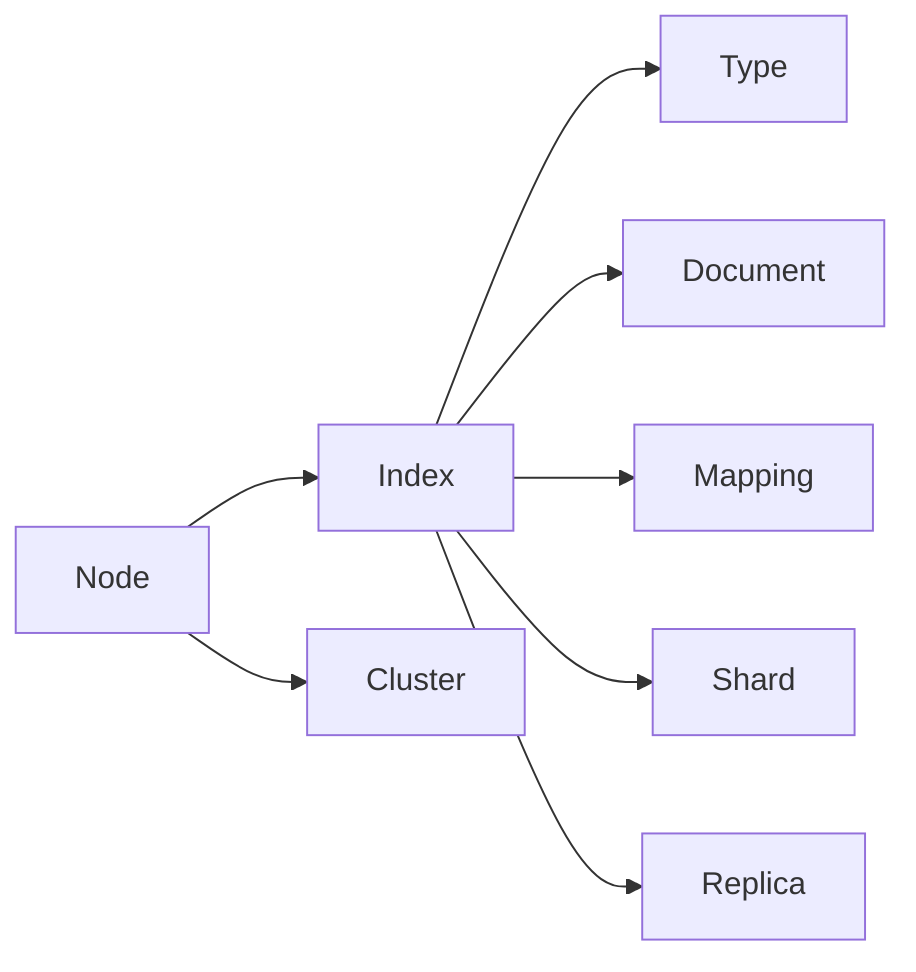

## 1.背景介绍

在信息爆炸的时代，如何从海量的数据中快速、准确地找到所需的信息，已经成为了当下非常重要的问题。搜索引擎作为解决这个问题的关键技术，其重要性不言而喻。ElasticSearch作为一款开源的分布式搜索引擎，凭借其易用性、强大的功能以及良好的扩展性，在全球范围内得到了广泛的应用。

## 2.核心概念与联系

ElasticSearch是基于Lucene构建的开源搜索引擎，它的设计目标是使得全文搜索、结构化搜索以及分析数据变得简单。ElasticSearch不仅仅是一款搜索引擎，更是一个分布式的实时数据分析平台。

ElasticSearch的核心概念包括：节点（Node）、索引（Index）、类型（Type）、文档（Document）、映射（Mapping）、分片（Shard）、副本（Replica）、集群（Cluster）等。



## 3.核心算法原理具体操作步骤

ElasticSearch的核心算法主要包括索引构建、查询处理、分布式搜索以及数据分析。

### 3.1 索引构建

ElasticSearch的索引构建主要包括文档的索引和映射的定义。文档的索引是将数据存储到ElasticSearch中，而映射的定义是定义数据的结构。

### 3.2 查询处理

ElasticSearch的查询处理主要包括全文搜索、结构化搜索以及复合搜索。全文搜索是针对文档内容进行搜索，结构化搜索是针对文档的字段进行搜索，复合搜索是将全文搜索和结构化搜索结合起来。

### 3.3 分布式搜索

ElasticSearch的分布式搜索主要包括分片策略和副本策略。分片策略是将数据分散到多个节点中，副本策略是为了提高数据的可用性和查询性能。

### 3.4 数据分析

ElasticSearch的数据分析主要包括聚合操作和统计操作。聚合操作是对数据进行分组，统计操作是对分组后的数据进行统计。

## 4.数学模型和公式详细讲解举例说明

ElasticSearch的查询评分是基于TF-IDF和BM25模型的。TF-IDF是一种统计方法，用以评估一字词对于一个文件集或一个语料库中的其中一份文件的重要程度。BM25是一种改进的TF-IDF。

TF-IDF的计算公式为：
$$
\text{TF-IDF}(t, d) = \text{TF}(t, d) \times \text{IDF}(t)
$$
其中，$\text{TF}(t, d)$表示词$t$在文档$d$中的频率，$\text{IDF}(t)$表示词$t$的逆文档频率。

BM25的计算公式为：
$$
\text{score}(D,Q) = \sum_{i=1}^{n} \text{IDF}(q_i) \times \frac{f(q_i, D) \times (k1 + 1)}{f(q_i, D) + k1 \times (1 - b + b \times \frac{|D|}{avgdl})}
$$
其中，$f(q_i, D)$表示词$q_i$在文档$D$中的频率，$|D|$表示文档$D$的长度，$avgdl$表示文档的平均长度。

## 5.项目实践：代码实例和详细解释说明

以下是一个使用ElasticSearch进行全文搜索的Python代码示例：

```python
from elasticsearch import Elasticsearch

es = Elasticsearch()

body = {
    "query": {
        "match": {
            "content": "ElasticSearch"
        }
    }
}

res = es.search(index="my_index", body=body)

for hit in res['hits']['hits']:
    print(hit["_source"])
```

这段代码首先创建了一个ElasticSearch的连接，然后定义了一个查询体，查询体中指定了要在content字段中搜索"ElasticSearch"。然后执行了搜索操作，并打印出搜索结果。

## 6.实际应用场景

ElasticSearch广泛应用于各种场景，包括但不限于：

- 全文搜索：如新闻网站、博客站点等
- 日志和事务数据的存储和分析：如系统监控、运营分析等
- 实时数据分析：如用户行为分析、市场趋势预测等

## 7.工具和资源推荐

- ElasticSearch官方文档：提供了详细的API参考和使用指南
- Kibana：ElasticSearch的官方可视化工具，可以方便地对数据进行探索和分析
- Logstash：ElasticSearch的官方数据收集和处理工具，可以方便地从各种数据源收集数据，并将数据发送到ElasticSearch中

## 8.总结：未来发展趋势与挑战

随着数据量的不断增长，搜索引擎的重要性越来越高。ElasticSearch作为一款优秀的搜索引擎，其未来的发展趋势将更加明显。同时，如何处理海量数据、提高查询性能、保证数据的安全性等，也将是ElasticSearch面临的挑战。

## 9.附录：常见问题与解答

- 问题1：ElasticSearch如何处理大数据？
- 答：ElasticSearch通过分片和副本的机制，将数据分散到多个节点中，从而提高处理大数据的能力。

- 问题2：ElasticSearch的性能如何？
- 答：ElasticSearch的性能非常强大，可以在短时间内处理大量的查询请求。同时，通过调整分片和副本的数量，可以进一步提高查询性能。

- 问题3：ElasticSearch的安全性如何？
- 答：ElasticSearch提供了多种安全措施，包括身份验证、权限控制、数据加密等，可以有效保护数据的安全性。

作者：禅与计算机程序设计艺术 / Zen and the Art of Computer Programming
