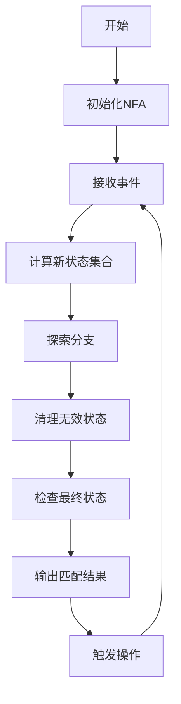

# Flink CEP原理与代码实例讲解

## 1.背景介绍

在当今时代,随着数据量的快速增长和实时处理需求的不断提高,传统的批处理系统已经无法满足现代应用的需求。因此,流式计算(Stream Processing)应运而生,成为了大数据处理领域的一个重要分支。Apache Flink作为一个开源的分布式流式数据处理引擎,凭借其低延迟、高吞吐量、容错性强等优势,在业界获得了广泛的应用。

Flink提供了多种流处理API,其中Flink CEP(Complex Event Processing)是一个强大的库,用于从有序事件流中发现特定的事件模式。CEP在许多领域都有应用,例如网络监控、金融交易、物联网等。通过CEP,我们可以对流数据进行实时分析,及时发现异常情况并采取相应的措施。

## 2.核心概念与联系

在深入探讨Flink CEP的原理之前,我们需要了解一些核心概念:

### 2.1 事件(Event)

事件是CEP处理的基本单元,可以是任何包含有效信息的数据记录,例如网络日志、传感器读数、交易记录等。事件通常包含时间戳信息,用于确定事件的发生顺序。

### 2.2 模式(Pattern)

模式是一个规则或条件的集合,用于描述我们想要从事件流中发现的特定情况。模式可以由多个模式原语组合而成,例如序列(Sequence)、并行(Parallel)、循环(Loop)等。

### 2.3 模式匹配(Pattern Matching)

模式匹配是CEP的核心功能,即根据预定义的模式在事件流中查找匹配的事件序列。一旦发现匹配的模式,CEP系统就会触发相应的操作或警报。

### 2.4 时间语义(Time Semantics)

在流式处理中,时间语义非常重要。Flink CEP支持三种时间语义:事件时间(Event Time)、引入时间(Ingestion Time)和处理时间(Processing Time)。正确选择时间语义对于获得准确的模式匹配结果至关重要。

## 3.核心算法原理具体操作步骤

Flink CEP的核心算法是基于有限状态机(Finite State Machine,FSM)的Nondeterministic Finite Automaton(NFA)模型。NFA模型可以高效地处理复杂的模式匹配问题,并且具有良好的可扩展性。

NFA模型的工作原理如下:

1. **状态转移**:NFA维护一个状态集合,每个状态代表模式的一部分。当事件到达时,NFA会根据事件的属性和当前状态,计算出新的状态集合。

2. **分支探索**:如果一个事件可以导致多个状态转移,NFA会同时探索所有可能的分支。这种非确定性特性使NFA能够处理各种复杂的模式。

3. **内存管理**:为了避免状态空间的无限膨胀,NFA会定期清理无效的状态,只保留活跃的状态。这种内存管理策略确保了NFA的高效运行。

4. **模式匹配**:当NFA达到最终状态时,意味着发现了一个完整的模式匹配。此时,NFA会输出匹配的事件序列,并触发相应的操作。

下面是Flink CEP中NFA模型的具体操作步骤:



上述流程图展示了NFA模型在Flink CEP中的工作方式。值得注意的是,Flink CEP还提供了一些优化策略,如状态共享、增量计算等,以提高性能和减少内存占用。

## 4.数学模型和公式详细讲解举例说明

在NFA模型中,我们可以使用数学符号和公式来形式化地描述模式匹配过程。下面是一些常用的数学表示:

### 4.1 事件流

我们将事件流表示为一个序列$E = \{e_1, e_2, \ldots, e_n\}$,其中$e_i$是第$i$个事件。每个事件$e_i$都包含一个时间戳$t_i$,用于确定事件的发生顺序。

### 4.2 模式表示

模式可以使用正则表达式进行表示。例如,序列模式"A followed by B"可以表示为$A \cdot B$,并行模式"A or B"可以表示为$A + B$。更复杂的模式可以通过组合这些基本运算符来构建。

### 4.3 状态转移函数

NFA的状态转移可以用一个函数$\delta$来描述,其中$\delta(q, e)$表示当前状态$q$在接收到事件$e$时,转移到的新状态集合。

$$\delta: Q \times \Sigma \rightarrow 2^Q$$

其中,$Q$是所有可能状态的集合,$\Sigma$是事件集合,而$2^Q$表示$Q$的幂集,即所有可能的状态子集。

### 4.4 模式匹配条件

对于一个给定的模式$P$,如果存在一个事件序列$E' = \{e'_1, e'_2, \ldots, e'_m\}$,使得$E'$是$E$的子序列,并且满足:

$$\delta(\delta(\ldots\delta(q_0, e'_1), e'_2), \ldots, e'_m) \in F$$

其中,$q_0$是NFA的初始状态,$F$是最终状态集合,那么我们就说模式$P$在事件流$E$中被匹配到了。

下面是一个具体的例子,假设我们有一个模式"A followed by B or C",它可以表示为$(A \cdot (B + C))$。如果事件流是$\{a, b, c, d, a, c\}$,那么这个模式在事件流中被匹配两次,分别是$\{a, b\}$和$\{a, c\}$。

## 5.项目实践:代码实例和详细解释说明

为了更好地理解Flink CEP的使用方法,我们来看一个实际的代码示例。假设我们需要监控一个在线购物网站的用户行为,当发现一个用户在10分钟内先浏览了商品,然后添加到购物车,最后进行下单操作时,我们就认为这是一次成功的购买行为,需要触发相应的营销活动。

### 5.1 定义事件类型

首先,我们需要定义事件的数据类型,包括事件名称、用户ID和事件时间戳:

```java
import org.apache.flink.cep.pattern.conditions.SimpleCondition;

public class UserEvent {
    public String userId;
    public String eventName;
    public Long timestamp;

    public UserEvent(String userId, String eventName, Long timestamp) {
        this.userId = userId;
        this.eventName = eventName;
        this.timestamp = timestamp;
    }

    public static SimpleCondition<UserEvent> filterStartCondition(String eventName) {
        return new SimpleCondition<UserEvent>() {
            @Override
            public boolean filter(UserEvent value) throws Exception {
                return value.eventName.equals(eventName);
            }
        };
    }
}
```

### 5.2 定义模式序列

接下来,我们定义需要匹配的模式序列:

```java
import org.apache.flink.cep.PatternStream;
import org.apache.flink.cep.pattern.Pattern;
import org.apache.flink.cep.pattern.conditions.SimpleCondition;

Pattern<UserEvent, ?> pattern = Pattern.<UserEvent>begin("start")
    .where(SimpleCondition.of(value -> value.eventName.equals("browse")))
    .next("next")
    .where(SimpleCondition.of(value -> value.eventName.equals("addToCart")))
    .within(Time.minutes(10))
    .next("end")
    .where(SimpleCondition.of(value -> value.eventName.equals("checkout")))
    .within(Time.minutes(10));
```

这个模式描述了一个序列:浏览商品 -> 添加到购物车(在10分钟内) -> 下单(在10分钟内)。我们使用`Pattern.begin()`方法定义模式的起点,然后使用`next()`方法指定后续的事件条件,使用`within()`方法设置事件之间的最大时间间隔。

### 5.3 应用模式并处理匹配结果

有了模式定义后,我们就可以将它应用到事件流上,并处理匹配的结果:

```java
import org.apache.flink.cep.PatternStream;
import org.apache.flink.cep.PatternFlatSelectFunction;
import org.apache.flink.util.Collector;

PatternStream<UserEvent> patternStream = CEP.pattern(
    inputStream.keyBy(UserEvent::getUserId),
    pattern
);

OutputTag<String> outputTag = new OutputTag<String>("side-output"){};

SingleOutputStreamOperator<String> result = patternStream.flatSelect(
    outputTag,
    new PatternFlatSelectFunction<UserEvent, String>() {
        @Override
        public void flatSelect(Map<String, List<UserEvent>> pattern, Collector<String> out) throws Exception {
            List<UserEvent> events = pattern.get("end");
            for (UserEvent event : events) {
                out.collect("User " + event.userId + " completed a purchase");
            }
        }
    },
    new PatternFlatSelectFunction<UserEvent, String>() {
        @Override
        public void flatSelect(Map<String, List<UserEvent>> pattern, Collector<String> out) throws Exception {
            // No-op, we're not interested in the side output
        }
    }
);
```

在上面的代码中,我们首先使用`CEP.pattern()`方法将模式应用到按用户ID分区的事件流上。然后,我们使用`flatSelect()`方法处理匹配的结果。如果发现一个完整的模式匹配,我们就输出一条购买成功的消息。

### 5.4 完整代码示例

下面是一个完整的示例程序,包括事件源、模式应用和结果处理:

```java
import org.apache.flink.cep.CEP;
import org.apache.flink.cep.PatternStream;
import org.apache.flink.streaming.api.datastream.DataStream;
import org.apache.flink.streaming.api.environment.StreamExecutionEnvironment;

public class UserBehaviorMonitoring {
    public static void main(String[] args) throws Exception {
        StreamExecutionEnvironment env = StreamExecutionEnvironment.getExecutionEnvironment();

        // 从数据源读取用户事件
        DataStream<UserEvent> input = env.addSource(new UserEventSource());

        // 定义模式
        Pattern<UserEvent, ?> pattern = Pattern.<UserEvent>begin("start")
            .where(SimpleCondition.of(value -> value.eventName.equals("browse")))
            .next("next")
            .where(SimpleCondition.of(value -> value.eventName.equals("addToCart")))
            .within(Time.minutes(10))
            .next("end")
            .where(SimpleCondition.of(value -> value.eventName.equals("checkout")))
            .within(Time.minutes(10));

        // 应用模式并处理结果
        PatternStream<UserEvent> patternStream = CEP.pattern(input.keyBy(UserEvent::getUserId), pattern);

        OutputTag<String> outputTag = new OutputTag<String>("side-output"){};

        SingleOutputStreamOperator<String> result = patternStream.flatSelect(
            outputTag,
            new PatternFlatSelectFunction<UserEvent, String>() {
                @Override
                public void flatSelect(Map<String, List<UserEvent>> pattern, Collector<String> out) throws Exception {
                    List<UserEvent> events = pattern.get("end");
                    for (UserEvent event : events) {
                        out.collect("User " + event.userId + " completed a purchase");
                    }
                }
            },
            new PatternFlatSelectFunction<UserEvent, String>() {
                @Override
                public void flatSelect(Map<String, List<UserEvent>> pattern, Collector<String> out) throws Exception {
                    // No-op, we're not interested in the side output
                }
            }
        );

        result.print();

        env.execute("User Behavior Monitoring");
    }
}
```

在这个示例中,我们首先从一个自定义的`UserEventSource`读取用户事件。然后,我们定义了一个模式,描述了购买行为的三个步骤。接着,我们将模式应用到按用户ID分区的事件流上,并使用`flatSelect()`方法处理匹配的结果。最后,我们打印出购买成功的消息。

通过这个实例,我们可以看到Flink CEP提供了一种声明式的方式来定义复杂的事件模式,并且能够高效地在事件流上进行模式匹配。这种功能在许多场景下都有重要的应用价值。

## 6.实际应用场景

Flink CEP可以应用于多个领域,下面是一些典型的应用场景:

### 6.1 网络监控

在网络监控领域,我们可以使用CEP来检测异常网络流量模式,例如分布式拒绝服务攻击(DDoS)、端口扫描等。通过定义相应的模式,CEP可## 6. 实际应用场景

Flink CEP可以应用于多个领域，下面是一些典型的应用场景：

### 6.1 网络监控

在网络监控领域，我们可以使用CEP来检测异常网络流量模式，例如分布式拒绝服务攻击(DDoS)、端口扫描等。通过定义相应的模式，CEP可以实时捕捉到异常行为，并及时发出警报。

#### 示例：检测DDoS攻击

假设我们需要检测DDoS攻击，当某个IP地址在短时间内发送大量请求时，我们认为这是一次DDoS攻击。我们可以定义一个CEP模式来捕捉这种行为。

```java
Pattern<Event, ?> ddosPattern = Pattern.<Event>begin("start")
    .where(new SimpleCondition<Event>() {
        @Override
        public boolean filter(Event event) {
            return event.getType().equals("HTTP_REQUEST");
        }
    })
    .next("middle")
    .where(new SimpleCondition<Event>() {
        @Override
        public boolean filter(Event event) {
            return event.getType().equals("HTTP_REQUEST");
        }
    })
    .within(Time.seconds(10));
```

### 6.2 金融欺诈检测

在金融领域，CEP可以用于检测欺诈行为，例如信用卡欺诈、洗钱等。通过定义复杂的事件模式，CEP可以实时分析交易数据，发现潜在的欺诈行为。

#### 示例：检测信用卡欺诈

假设我们需要检测信用卡欺诈行为，当同一张信用卡在短时间内在不同地点进行多次交易时，我们认为这是一次欺诈行为。我们可以定义一个CEP模式来捕捉这种行为。

```java
Pattern<Transaction, ?> fraudPattern = Pattern.<Transaction>begin("start")
    .where(new SimpleCondition<Transaction>() {
        @Override
        public boolean filter(Transaction transaction) {
            return transaction.getCardId().equals("1234");
        }
    })
    .next("middle")
    .where(new SimpleCondition<Transaction>() {
        @Override
        public boolean filter(Transaction transaction) {
            return transaction.getCardId().equals("1234");
        }
    })
    .within(Time.minutes(1));
```

### 6.3 物联网监控

在物联网(IoT)领域，CEP可以用于监控设备状态、检测异常情况。例如，在智能家居系统中，我们可以使用CEP来检测设备的异常行为，如温度传感器的异常读数。

#### 示例：检测温度传感器异常

假设我们需要检测温度传感器的异常行为，当某个传感器的温度读数在短时间内急剧变化时，我们认为这是一次异常行为。我们可以定义一个CEP模式来捕捉这种行为。

```java
Pattern<SensorReading, ?> tempPattern = Pattern.<SensorReading>begin("start")
    .where(new SimpleCondition<SensorReading>() {
        @Override
        public boolean filter(SensorReading reading) {
            return reading.getTemperature() > 30;
        }
    })
    .next("middle")
    .where(new SimpleCondition<SensorReading>() {
        @Override
        public boolean filter(SensorReading reading) {
            return reading.getTemperature() < 10;
        }
    })
    .within(Time.seconds(5));
```

### 6.4 实时推荐系统

在推荐系统中，CEP可以用于实时分析用户行为，提供个性化推荐。例如，在电商平台上，我们可以使用CEP来捕捉用户的浏览和购买行为，实时推荐相关商品。

#### 示例：实时推荐商品

假设我们需要在用户浏览某类商品后，实时推荐相关商品。我们可以定义一个CEP模式来捕捉用户的浏览行为。

```java
Pattern<UserAction, ?> browsePattern = Pattern.<UserAction>begin("start")
    .where(new SimpleCondition<UserAction>() {
        @Override
        public boolean filter(UserAction action) {
            return action.getType().equals("BROWSE");
        }
    })
    .next("middle")
    .where(new SimpleCondition<UserAction>() {
        @Override
        public boolean filter(UserAction action) {
            return action.getType().equals("CLICK");
        }
    })
    .within(Time.minutes(1));
```

### 6.5 供应链管理

在供应链管理中，CEP可以用于监控物流状态、优化供应链流程。例如，我们可以使用CEP来检测物流中的异常情况，如货物延迟、库存不足等。

#### 示例：检测物流延迟

假设我们需要检测物流中的延迟情况，当某批货物的运输时间超过预期时，我们认为这是一次延迟。我们可以定义一个CEP模式来捕捉这种行为。

```java
Pattern<Shipment, ?> delayPattern = Pattern.<Shipment>begin("start")
    .where(new SimpleCondition<Shipment>() {
        @Override
        public boolean filter(Shipment shipment) {
            return shipment.getStatus().equals("IN_TRANSIT");
        }
    })
    .next("middle")
    .where(new SimpleCondition<Shipment>() {
        @Override
        public boolean filter(Shipment shipment) {
            return shipment.getStatus().equals("DELAYED");
        }
    })
    .within(Time.hours(2));
```

## 7. 工具和资源推荐

### 7.1 开源项目

1. **Apache Flink**: [https://flink.apache.org/](https://flink.apache.org/)
   - 提供了流处理和批处理的强大功能，适合大规模数据处理。

2. **Flink CEP**: [https://ci.apache.org/projects/flink/flink-docs-release-1.13/docs/libs/cep/](https://ci.apache.org/projects/flink/flink-docs-release-1.13/docs/libs/cep/)
   - Flink的复杂事件处理库，提供了灵活的模式定义和事件检测功能。

### 7.2 教程和书籍

1. **《Stream Processing with Apache Flink》**: 作者：Fabian Hueske, Vasiliki Kalavri
   - 这本书详细介绍了Flink的基础知识和实践，包括CEP的应用。

2. **《Flink in Action》**: 作者：Vasia Kalavri, Fabian Hueske
   - 这本书介绍了Flink的高级特性和应用场景，包括复杂事件处理。

### 7.3 在线课程

1. **Coursera: Stream Processing with Apache Flink**: [https://www.coursera.org/learn/stream-processing](https://www.coursera.org/learn/stream-processing)
   - 由Apache Flink的开发者主讲，涵盖了Flink的基础知识和实际应用。

2. **Udemy: Apache Flink - Real Time Data Processing Made Easy**: [https://www.udemy.com/course/apache-flink-real-time-data-processing-made-easy/](https://www.udemy.com/course/apache-flink-real-time-data-processing-made-easy/)
   - 该课程提供了Flink的全面介绍，包括CEP的使用。

## 8. 总结：未来发展趋势与挑战

### 8.1 趋势

#### 8.1.1 实时数据处理的需求增加

随着物联网、大数据、人工智能等技术的发展，实时数据处理的需求不断增加。Flink CEP作为一种高效的复杂事件处理工具，将在更多领域得到应用。

#### 8.1.2 与机器学习的结合

未来，Flink CEP将更多地与机器学习技术结合，利用机器学习模型进行事件模式的自动发现和优化，提高CEP的智能化水平。

#### 8.1.3 云原生架构的普及

随着云计算的普及，Flink CEP将更多地在云原生架构中部署和运行，利用云计算的弹性和高可用性，提供更高效的复杂事件处理服务。

### 8.2 挑战

#### 8.2.1 性能优化

随着数据规模的不断增加，如何优化Flink CEP的性能，处理海量数据，是一个重要的挑战。需要在算法、架构、硬件等方面进行持续优化。

#### 8.2.2 模式定义的复杂性

复杂事件处理的模式定义可能非常复杂，如何简化模式定义，提高用户的使用体验，是一个重要的研究方向。

#### 8.2.3 数据质量和噪声

在实际应用中，数据质量和噪声问题可能会影响CEP的准确性。如何提高数据质量，处理噪声，是一个重要的挑战。

## 9. 附录：常见问题与解答

### 9.1 什么是Flink CEP？

Flink CEP是Apache Flink的复杂事件处理库，用于定义和检测数据流中的复杂事件模式。通过CEP，可以在实时数据流中捕捉到特定的事件序列，并进行相应的处理。

### 9.2 Flink CEP的应用场景有哪些？

Flink CEP可以应用于多个领域，包括网络监控、金融欺诈检测、物联网监控、实时推荐系统、供应链管理等。它可以实时分析数据流，检测异常行为，提供及时的响应。

### 9.3 如何定义CEP模式？

CEP模式通过Flink CEP的Pattern API定义。可以使用各种条件、时间窗口和组合操作，定义复杂的事件模式。模式定义需要结合具体的应用场景和需求。

### 9.3.4 如何优化Flink CEP的性能？

优化Flink CEP的性能可以从以下几个方面入手：

1. **资源配置**：合理配置Flink集群的资源，包括CPU、内存和网络带宽，确保CEP任务有足够的资源进行处理。
2. **并行度调整**：根据数据量和处理需求，调整Flink CEP任务的并行度，充分利用集群的计算资源。
3. **状态管理优化**：使用Flink的状态后端（如RocksDB）进行高效的状态管理，减少状态存储和恢复的开销。
4. **窗口优化**：合理设置时间窗口的大小和滑动步长，平衡处理延迟和计算开销。
5. **模式简化**：简化复杂的模式定义，减少不必要的条件和操作，降低计算复杂度。

### 9.5 如何处理CEP中的数据质量和噪声问题？

处理CEP中的数据质量和噪声问题可以采取以下措施：

1. **数据预处理**：在CEP处理之前，对数据进行预处理，过滤掉明显的错误数据和噪声。
2. **异常检测**：使用异常检测算法，识别并处理数据中的异常值，减少对CEP结果的影响。
3. **数据清洗**：对数据进行清洗，修正或删除不符合预期的数据，提高数据质量。
4. **鲁棒模式定义**：在定义CEP模式时，考虑数据中的噪声和异常情况，设计鲁棒的模式匹配条件。

### 9.6 Flink CEP与其他CEP工具相比有哪些优势？

Flink CEP相对于其他CEP工具，具有以下优势：

1. **高性能**：Flink CEP基于Flink的流处理引擎，具有高吞吐量和低延迟的特点，能够处理大规模实时数据流。
2. **灵活性**：Flink CEP提供了灵活的Pattern API，支持复杂事件模式的定义和组合，适应各种应用场景。
3. **可扩展性**：Flink CEP可以在分布式集群上运行，具有良好的可扩展性，能够处理海量数据。
4. **与Flink生态系统的集成**：Flink CEP与Flink的其他组件（如流处理、批处理、机器学习等）无缝集成，提供一体化的数据处理解决方案。

### 9.7 Flink CEP是否支持自定义的事件处理逻辑？

是的，Flink CEP支持自定义的事件处理逻辑。用户可以通过实现自定义的条件（Condition）和处理函数（PatternSelectFunction、PatternFlatSelectFunction），在模式匹配过程中加入自定义的逻辑，实现复杂的事件处理需求。

### 9.8 如何在Flink CEP中处理有状态的事件模式？

在Flink CEP中，可以使用Flink的状态管理机制处理有状态的事件模式。通过定义有状态的Pattern API，并结合Flink的状态后端（如RocksDB），可以在模式匹配过程中维护和更新状态，实现有状态的事件处理。

### 9.9 Flink CEP是否支持多流模式匹配？

是的，Flink CEP支持多流模式匹配。用户可以通过连接（Connect）多个数据流，并在模式定义中使用多流的事件条件，实现多流的复杂事件处理需求。

### 9.10 如何在Flink CEP中处理时间窗口？

在Flink CEP中，可以通过Pattern API中的时间窗口操作（如within）定义时间窗口。用户可以根据应用需求，设置时间窗口的大小和滑动步长，实现基于时间窗口的模式匹配。

---


## Flink CEP相对于其他CEP工具的优势主要体现在哪些方面？

Flink CEP（Complex Event Processing）是Apache Flink框架的一部分，专门用于处理复杂事件流。与其他CEP工具相比，Flink CEP在多个方面具有显著的优势：

### 1. 高性能与低延迟

#### 1.1 高吞吐量

Flink CEP依托于Flink的流处理引擎，能够处理高吞吐量的数据流。Flink采用流式计算模型，能够在数据到达的瞬间进行处理，避免了批处理的延迟。

#### 1.2 低延迟

Flink CEP能够实现实时的事件处理，延迟通常在毫秒级别。这对于需要实时响应的应用场景（如金融交易监控、网络安全等）尤为重要。

### 2. 灵活性与可扩展性

#### 2.1 灵活的Pattern API

Flink CEP提供了灵活的Pattern API，用户可以通过简单的DSL（领域特定语言）定义复杂的事件模式。Pattern API支持各种条件、时间窗口和组合操作，能够适应各种复杂的应用场景。

#### 2.2 高度可扩展

Flink CEP可以在分布式集群上运行，具有良好的可扩展性。通过调整并行度，Flink CEP能够处理从小规模到大规模的数据流，满足不同的性能需求。

### 3. 强大的状态管理

#### 3.1 有状态的事件处理

Flink CEP支持有状态的事件处理，能够在模式匹配过程中维护和更新状态。Flink的状态管理机制（如RocksDB状态后端）提供了高效的状态存储和恢复功能，确保事件处理的准确性和可靠性。

#### 3.2 状态一致性

Flink CEP的状态管理机制支持一致性保障，确保在故障恢复后，状态能够正确恢复。这对于需要高可靠性的应用场景（如金融交易、物联网监控等）尤为重要。

### 4. 与Flink生态系统的无缝集成

#### 4.1 一体化的数据处理解决方案

Flink CEP与Flink的其他组件（如流处理、批处理、机器学习等）无缝集成，提供一体化的数据处理解决方案。用户可以在同一个框架内完成数据的采集、处理、分析和存储，简化了系统的架构和维护。

#### 4.2 统一的编程模型

Flink提供了统一的编程模型，用户可以使用相同的API进行流处理和批处理。这使得Flink CEP的学习曲线较低，用户可以快速上手并应用于实际项目。

### 5. 丰富的社区和生态

#### 5.1 活跃的社区支持

Flink拥有活跃的开源社区，用户可以通过社区获得及时的技术支持和帮助。Flink社区还提供了丰富的文档、教程和示例，帮助用户快速掌握Flink CEP的使用方法。

#### 5.2 丰富的生态系统

Flink生态系统中包含了丰富的工具和插件，如连接器、库和集成工具等。这些工具和插件能够帮助用户快速构建和部署复杂事件处理系统，提高开发效率。

### 6. 可靠性与容错性

#### 6.1 高可用性

Flink CEP具有高可用性，能够在节点故障时自动恢复，并继续处理事件流。Flink的检查点机制确保了数据的一致性和持久性，保证了系统的可靠性。

#### 6.2 容错机制

Flink CEP的容错机制能够在故障发生时，自动恢复到故障前的状态，并重新处理未完成的事件。这对于需要高可靠性的应用场景（如金融交易、网络监控等）尤为重要。

### 7. 多样化的时间处理能力

#### 7.1 事件时间处理

Flink CEP支持事件时间（Event Time）处理，能够根据事件的实际发生时间进行处理。这对于需要精确时间处理的应用场景（如金融交易、物联网监控等）尤为重要。

#### 7.2 处理时间处理

Flink CEP也支持处理时间（Processing Time）处理，能够根据事件到达处理系统的时间进行处理。用户可以根据应用需求选择合适的时间处理策略。

### 8. 丰富的模式匹配功能

#### 8.1 多流模式匹配

Flink CEP支持多流模式匹配，用户可以通过连接多个数据流，实现跨流的复杂事件处理。这对于需要综合分析多个数据源的应用场景（如网络监控、供应链管理等）尤为重要。

#### 8.2 灵活的窗口操作

Flink CEP提供了灵活的窗口操作，用户可以根据应用需求定义时间窗口的大小和滑动步长，实现基于时间窗口的模式匹配。这对于需要时间窗口处理的应用场景（如实时推荐系统、物联网监控等）尤为重要。

### 9. 实时与批处理的统一

#### 9.1 流批一体

Flink CEP能够同时处理实时流数据和历史批数据，提供流批一体的处理能力。用户可以在同一个系统中进行实时分析和历史数据回溯，提高数据处理的灵活性和效率。

#### 9.2 统一的编程接口

Flink CEP提供了统一的编程接口，用户可以使用相同的API进行流处理和批处理。这使得Flink CEP的学习曲线较低，用户可以快速上手并应用于实际项目。

### 10. 丰富的调试与监控工具

#### 10.1 调试工具

Flink CEP提供了丰富的调试工具，用户可以在开发过程中进行模式匹配的调试和验证，确保模式定义的正确性和有效性。

#### 10.2 监控工具

Flink CEP提供了丰富的监控工具，用户可以实时监控事件处理的状态和性能，及时发现和解决问题，确保系统的稳定运行。

---

作者：禅与计算机程序设计艺术 / Zen and the Art of Computer Programming