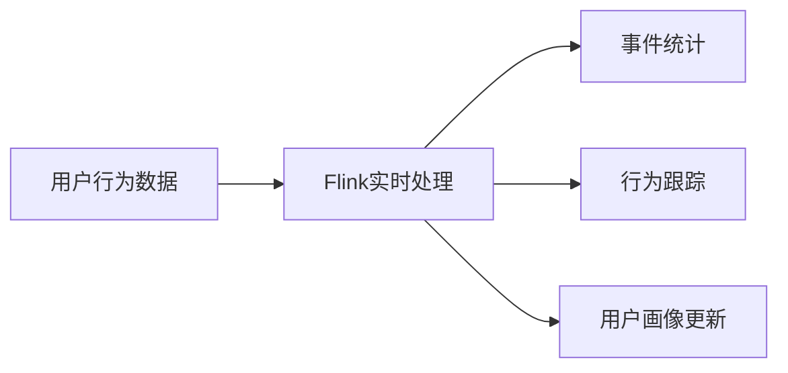

## 1.背景介绍

在当前的数据驱动时代，实时用户行为分析已经成为许多行业，如电商、游戏、金融等领域的关键技术。通过对用户行为的实时分析，企业可以更好地理解用户需求，优化产品设计，提高用户体验，从而实现商业价值。然而，实时用户行为分析面临着数据量大、实时性要求高、处理复杂度高等挑战。为了解决这些问题，Apache Flink作为一个高性能、高可靠性的流处理框架，被广泛应用于实时数据处理和分析。

## 2.核心概念与联系

Apache Flink是一个用于处理无界和有界数据的开源流处理框架。它的核心是一个流处理引擎，支持数据流的分布式处理和高效的内存管理。Flink的主要特点包括：事件时间处理、支持状态和容错、高吞吐和低延迟等。在实时用户行为分析中，Flink可以实现事件的实时统计、行为序列的实时跟踪、用户画像的实时更新等功能。



## 3.核心算法原理具体操作步骤

实时用户行为分析系统的建立主要包括数据采集、数据处理和数据分析三个步骤：

1. 数据采集：通过日志收集系统，收集用户的行为日志，如点击、浏览、购买等行为数据。
2. 数据处理：使用Flink进行实时数据处理。首先，对原始数据进行清洗和格式化，然后根据业务需求，进行事件统计、行为跟踪和用户画像更新等操作。
3. 数据分析：将处理后的数据发送到后端系统，进行实时分析和展示，为业务决策提供支持。


## 4.数学模型和公式详细讲解举例说明

在实时用户行为分析中，我们通常需要进行事件统计，例如计算用户的点击率、转化率等指标。这些指标的计算可以用以下的数学模型表示：

- 点击率（CTR）：表示用户点击广告的概率，计算公式为：

$$
CTR = \frac{点击次数}{展示次数}
$$

- 转化率（CVR）：表示用户从点击到购买的转化概率，计算公式为：

$$
CVR = \frac{购买次数}{点击次数}
$$

在Flink中，我们可以通过滑动窗口或滚动窗口的方式，实现这些指标的实时计算。

## 5.项目实践：代码实例和详细解释说明

下面我们以一个简单的Flink实战项目为例，实现用户点击行为的实时统计。

首先，我们定义了一个`UserBehavior`类，用于表示用户的行为数据：

```java
public class UserBehavior {
    private long userId;     // 用户ID
    private long itemId;     // 商品ID
    private int categoryId;  // 商品类目ID
    private String behavior; // 用户行为类型
    private long timestamp;  // 用户行为发生的时间戳
    // ...省略getter和setter方法...
}
```

然后，我们使用Flink的`DataStream API`进行数据处理：

```java
// 读取数据并转换为UserBehavior类型
DataStream<UserBehavior> dataStream = env.readTextFile(inputPath)
    .map(line -> {
        String[] fields = line.split(",");
        return new UserBehavior(Long.parseLong(fields[0]), Long.parseLong(fields[1]), Integer.parseInt(fields[2]), fields[3], Long.parseLong(fields[4]));
    });

// 过滤出点击行为，按商品ID分组，开窗统计点击量
DataStream<ItemViewCount> windowedStream = dataStream
    .filter(data -> "click".equals(data.getBehavior()))
    .keyBy("itemId")
    .timeWindow(Time.hours(1), Time.minutes(5))
    .aggregate(new CountAgg(), new WindowResultFunction());

// 按窗口结束时间排序，取前N个
DataStream<String> resultStream = windowedStream
    .keyBy("windowEnd")
    .process(new TopNHotItems(topSize));
```

这段代码首先读取用户行为数据，然后过滤出点击行为，按商品ID进行分组，开启一个1小时滑动窗口，每5分钟计算一次，统计窗口内的点击量。最后，按窗口结束时间分组，取出点击量最高的前N个商品。

## 6.实际应用场景

在实际应用中，Flink实时用户行为分析系统可以广泛应用于电商、社交、新闻推荐等领域。例如：

- 在电商领域，通过实时分析用户的浏览、点击、购买等行为，可以实时更新用户画像，提供个性化推荐，提高转化率。
- 在社交领域，通过实时分析用户的点赞、评论、分享等行为，可以实时发现热门话题，提供热门推荐，增加用户粘性。
- 在新闻推荐领域，通过实时分析用户的阅读、收藏、评论等行为，可以实时更新用户兴趣模型，提供个性化新闻推荐，提高用户满意度。

## 7.工具和资源推荐

- Apache Flink：一个高性能、高可靠性的流处理框架，支持事件时间处理、状态和容错、高吞吐和低延迟等特性。
- Apache Kafka：一个分布式流处理平台，常用于实时数据的收集、存储和处理。
- Apache Hadoop：一个分布式计算框架，常用于大数据的存储和分析。
- Elasticsearch：一个分布式搜索和分析引擎，常用于日志和事件数据的搜索、分析和可视化。

## 8.总结：未来发展趋势与挑战

随着数据量的爆发式增长，实时用户行为分析的需求也日益增强。Flink作为流处理的重要工具，其在实时用户行为分析中的应用将更加广泛。然而，随着业务的发展，我们也面临着数据多样性、处理复杂性、实时性要求等挑战。未来，我们需要进一步研究和优化Flink的性能，提高其在实时用户行为分析中的应用效果。

## 9.附录：常见问题与解答

1. 问题：Flink和Storm、Spark Streaming等其他流处理框架有什么区别？
答：Flink、Storm和Spark Streaming都是流处理框架，但各有特点。Flink支持事件时间处理和状态管理，适合处理有状态的复杂事件流；Storm实时性强，适合处理无状态的简单事件流；Spark Streaming是微批处理，适合处理有界数据。

2. 问题：Flink如何保证数据的准确性和完整性？
答：Flink通过Checkpoint机制，定期保存状态数据到远程持久化存储，当作业失败时，可以从最近的Checkpoint恢复，保证数据的准确性和完整性。

3. 问题：Flink如何处理延迟数据？
答：Flink支持事件时间和水位线机制，可以处理乱序数据和延迟数据，通过窗口和触发器，可以灵活地处理各种复杂的时间问题。

作者：禅与计算机程序设计艺术 / Zen and the Art of Computer Programming