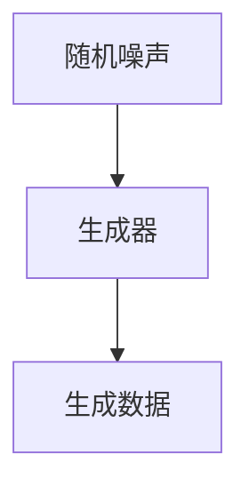
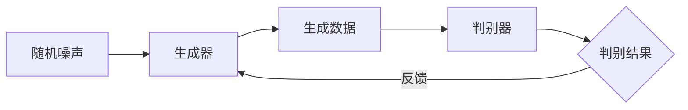

## 1. 背景介绍

生成对抗网络（GANs）自从2014年由Ian Goodfellow和他的同事们首次提出以来，已经在计算机视觉领域引起了广泛的关注和应用。GANs的主要目标是利用两个神经网络——生成器和判别器——进行对抗性训练，以生成与真实数据分布相似的人工数据。今天，我们将重点关注生成器，它是GANs的核心组成部分之一。

## 2. 核心概念与联系

生成对抗网络中的生成器是一个神经网络，其目标是生成与真实数据分布相似的数据。生成器的输入通常是随机噪声，通过神经网络转化为与真实数据相似的输出。



生成器与判别器一起工作，判别器的目标是判断输入的数据是来自真实数据分布还是生成器。这种对抗性的训练过程使得生成器能够不断提升生成数据的质量，以欺骗判别器。

## 3. 核心算法原理具体操作步骤

生成器的训练过程主要包括以下步骤：

1. 首先，生成器接收一个随机噪声作为输入。
2. 然后，生成器通过神经网络将噪声转化为生成的数据。
3. 判别器接收生成的数据，并判断其是否来自真实数据分布。
4. 生成器根据判别器的反馈进行调整，以提升生成数据的质量。

这个过程可以通过以下的Mermaid流程图进行可视化：



## 4. 数学模型和公式详细讲解举例说明

生成对抗网络的训练可以通过最小-最大二人零和游戏来形式化。具体来说，判别器试图最大化其能够正确分类真实数据和生成数据的概率，而生成器试图最小化判别器正确分类的概率。这可以通过以下公式表示：

$$
\min_G \max_D V(D, G) = \mathbb{E}_{x \sim p_{\text{data}}(x)}[\log D(x)] + \mathbb{E}_{z \sim p_z(z)}[\log(1 - D(G(z)))]
$$

其中，$D(x)$表示判别器对真实数据$x$的判断结果，$G(z)$表示生成器对噪声$z$的生成结果。

## 5. 项目实践：代码实例和详细解释说明

接下来，我们将通过一个简单的例子来展示如何在PyTorch中实现一个生成器。首先，我们定义一个生成器类：

```python
import torch
import torch.nn as nn

class Generator(nn.Module):
    def __init__(self, input_dim, output_dim):
        super(Generator, self).__init__()
        self.main = nn.Sequential(
            nn.Linear(input_dim, 128),
            nn.ReLU(),
            nn.Linear(128, output_dim),
            nn.Tanh()
        )

    def forward(self, input):
        return self.main(input)
```

然后，我们可以创建一个生成器实例，并使用随机噪声作为输入来生成数据：

```python
input_dim = 100
output_dim = 28 * 28
generator = Generator(input_dim, output_dim)

# 生成随机噪声
noise = torch.randn(64, input_dim)

# 使用生成器生成数据
generated_data = generator(noise)
```

在这个例子中，我们使用了全连接层和激活函数来构建生成器。输入是一个100维的随机噪声，输出是一个784维的向量，可以被视为一个28x28的图像。

## 6. 实际应用场景

生成对抗网络，特别是生成器，已经在许多领域得到了应用，包括但不限于：

- **图像生成**：生成器可以用于生成新的图像，如人脸、手写数字等。
- **数据增强**：在训练机器学习模型时，生成器可以用于生成额外的训练数据，以提升模型的性能。
- **超分辨率**：生成器可以用于增加图像的分辨率，即所谓的超分辨率。

## 7. 工具和资源推荐

以下是一些学习和使用生成对抗网络的推荐资源：

- **PyTorch**：一个强大的深度学习框架，可以方便地实现生成对抗网络。
- **TensorFlow**：另一个强大的深度学习框架，也支持生成对抗网络。
- **GANs in Action**：一本关于生成对抗网络的书籍，包含了许多实用的示例。

## 8. 总结：未来发展趋势与挑战

生成对抗网络，尤其是生成器，已经取得了显著的进展，但仍面临许多挑战。例如，生成器的训练过程通常需要大量的计算资源和时间。此外，生成器生成的数据质量还有待提高，特别是在生成高分辨率和复杂结构的数据时。尽管如此，我们相信，随着技术的不断发展，生成器将在未来发挥更大的作用。

## 9. 附录：常见问题与解答

**Q: 生成器的输入必须是随机噪声吗？**

A: 不一定。虽然在许多情况下，生成器的输入是随机噪声，但也可以是其他类型的数据。关键是输入数据需要提供足够的多样性，以便生成器可以生成多样的输出。

**Q: 生成器可以用于生成哪些类型的数据？**

A: 理论上，生成器可以用于生成任何类型的数据，包括图像、文本、音频等。实际上，生成器生成的数据类型主要取决于其架构和训练数据。

**Q: 生成器的训练需要多久？**

A: 这主要取决于许多因素，如数据的复杂性、生成器的架构、可用的计算资源等。一般来说，生成器的训练可能需要几个小时到几天，甚至更长。

作者：禅与计算机程序设计艺术 / Zen and the Art of Computer Programming