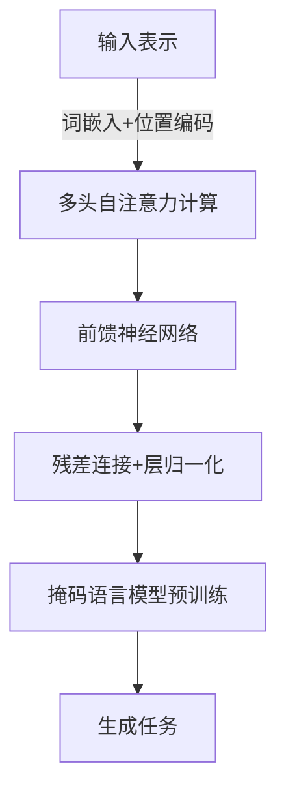

# GPT 原理与代码实例讲解

## 1.背景介绍

在过去几年中,自然语言处理(NLP)领域取得了长足的进步,其中一个重要的推动力就是Transformer模型的出现。Transformer模型最初是在2017年由Google的Vaswani等人提出的,用于机器翻译任务。它利用了自注意力(Self-Attention)机制,可以有效地捕捉序列中任意两个位置之间的依赖关系,从而克服了传统序列模型(如RNN)在长期依赖问题上的缺陷。

GPT(Generative Pre-trained Transformer)是一种基于Transformer模型的大型语言模型,由OpenAI于2018年首次提出。它通过在大量无标注文本数据上进行预训练,学习到了丰富的语言知识,可以生成自然、流畅的文本。GPT的出现为NLP领域带来了新的发展机遇,也推动了大型语言模型在下游任务中的广泛应用。

## 2.核心概念与联系

### 2.1 Transformer模型

Transformer模型是GPT的核心基础,它主要由编码器(Encoder)和解码器(Decoder)两部分组成。编码器负责将输入序列编码为向量表示,解码器则根据编码器的输出和自身的状态生成目标序列。

Transformer模型的核心创新在于引入了自注意力机制,用于捕捉序列中任意两个位置之间的依赖关系。与RNN不同,自注意力机制不需要按序列顺序计算,可以并行处理,从而提高了计算效率。此外,Transformer还引入了位置编码(Positional Encoding)来注入序列的位置信息。

### 2.2 自注意力机制

自注意力机制是Transformer模型的核心,它允许模型在计算目标位置的表示时,关注整个输入序列的所有位置。具体来说,对于每个目标位置,自注意力机制会计算它与输入序列中所有位置的相关性分数,并根据这些分数对所有位置的表示进行加权求和,得到目标位置的最终表示。

自注意力机制可以形式化为:

$$\mathrm{Attention}(Q, K, V) = \mathrm{softmax}(\frac{QK^T}{\sqrt{d_k}})V$$

其中,Q(Query)表示目标位置,K(Key)和V(Value)表示输入序列的键值对。通过计算Q与K的点积,并除以缩放因子$\sqrt{d_k}$,我们可以得到注意力分数。然后,将注意力分数通过softmax函数归一化,并与V相乘,就可以得到目标位置的注意力表示。

### 2.3 GPT模型

GPT(Generative Pre-trained Transformer)是一种基于Transformer解码器的大型语言模型。它在大量无标注文本数据上进行预训练,学习到了丰富的语言知识,可以生成自然、流畅的文本。

GPT的预训练过程采用了掩码语言模型(Masked Language Modeling)的策略,即随机将输入序列中的一部分词替换为特殊的掩码符号[MASK],然后让模型预测这些被掩码的词。通过这种方式,GPT可以学习到上下文语义信息,从而生成更加自然的文本。

预训练完成后,GPT可以被微调(Fine-tuning)到各种下游任务上,如文本生成、机器翻译、问答系统等,展现出了出色的性能。

## 3.核心算法原理具体操作步骤

GPT模型的核心算法原理可以概括为以下几个步骤:

1. **输入表示**:将输入文本序列转换为词嵌入(Word Embedding)向量表示,并加上位置编码,以注入位置信息。

2. **多头自注意力计算**:对输入表示进行多头自注意力计算,捕捉序列中任意两个位置之间的依赖关系。具体操作如下:
   - 将输入表示分别线性映射到Query、Key和Value向量;
   - 计算Query与Key的点积,得到注意力分数矩阵;
   - 对注意力分数矩阵进行softmax归一化;
   - 将归一化后的注意力分数与Value向量相乘,得到注意力表示;
   - 对多个注意力头的结果进行拼接和线性变换,得到最终的自注意力表示。

3. **前馈神经网络**:将自注意力表示输入到前馈神经网络(Feed-Forward Neural Network)中,进行非线性变换,得到更高级的特征表示。

4. **残差连接与层归一化**:在每一层的输出中,加上输入的残差连接,并进行层归一化(Layer Normalization),以保持梯度稳定性。

5. **掩码语言模型预训练**:在大量无标注文本数据上,随机将输入序列中的一部分词替换为特殊的掩码符号[MASK],然后让模型预测这些被掩码的词。通过最小化预测损失函数,GPT可以学习到丰富的语言知识。

6. **生成任务**:在预训练完成后,GPT可以被微调到各种下游任务上,如文本生成、机器翻译、问答系统等。在生成任务中,GPT会根据给定的提示(Prompt),自回归地生成下一个词,直到达到终止条件(如生成特殊结束符号)。

上述算法原理可以用以下Mermaid流程图来直观地表示:



## 4.数学模型和公式详细讲解举例说明

在GPT模型中,自注意力机制扮演着核心角色,它允许模型在计算目标位置的表示时,关注整个输入序列的所有位置。自注意力机制可以形式化为:

$$\mathrm{Attention}(Q, K, V) = \mathrm{softmax}(\frac{QK^T}{\sqrt{d_k}})V$$

其中:

- $Q$表示Query向量,代表我们要计算注意力的目标位置;
- $K$表示Key向量,代表输入序列中的每个位置;
- $V$表示Value向量,代表输入序列中每个位置的值;
- $d_k$是Query和Key向量的维度。

具体来说,自注意力机制的计算过程如下:

1. 首先,我们计算Query向量$Q$与所有Key向量$K$的点积,得到一个注意力分数矩阵$S$:

   $$S = QK^T$$

2. 为了防止较大的值导致softmax函数饱和,我们对分数矩阵$S$进行缩放,将其除以$\sqrt{d_k}$:

   $$S' = \frac{S}{\sqrt{d_k}}$$

3. 然后,我们对缩放后的分数矩阵$S'$应用softmax函数,得到归一化的注意力权重矩阵$A$:

   $$A = \mathrm{softmax}(S')$$

4. 最后,我们将注意力权重矩阵$A$与Value向量$V$相乘,得到目标位置的注意力表示$C$:

   $$C = AV$$

通过上述计算,我们可以获得目标位置的注意力表示$C$,它是输入序列中所有位置的加权和,权重由注意力分数矩阵$A$决定。

让我们用一个具体的例子来说明自注意力机制的计算过程。假设我们有一个长度为4的输入序列$X = (x_1, x_2, x_3, x_4)$,我们要计算第三个位置$x_3$的注意力表示。

首先,我们将输入序列$X$映射为Query、Key和Value向量:

$$\begin{aligned}
Q &= (q_1, q_2, q_3, q_4) \\
K &= (k_1, k_2, k_3, k_4) \\
V &= (v_1, v_2, v_3, v_4)
\end{aligned}$$

其中,每个$q_i$、$k_i$和$v_i$都是向量。

接下来,我们计算Query向量$q_3$与所有Key向量的点积,得到注意力分数向量$s$:

$$s = (q_3 \cdot k_1, q_3 \cdot k_2, q_3 \cdot k_3, q_3 \cdot k_4)$$

然后,我们对分数向量$s$进行缩放和softmax归一化,得到注意力权重向量$a$:

$$a = \mathrm{softmax}(\frac{s}{\sqrt{d_k}})$$

最后,我们将注意力权重向量$a$与Value向量$V$相乘,得到$x_3$的注意力表示$c$:

$$c = a_1 v_1 + a_2 v_2 + a_3 v_3 + a_4 v_4$$

通过这种方式,我们可以计算出输入序列中每个位置的注意力表示,从而捕捉序列中任意两个位置之间的依赖关系。

## 5.项目实践:代码实例和详细解释说明

为了更好地理解GPT模型的原理,我们将使用PyTorch框架实现一个简化版本的GPT模型,并在一个小规模的语料库上进行训练和生成示例。

### 5.1 导入所需库

```python
import torch
import torch.nn as nn
import torch.optim as optim
from torch.utils.data import DataLoader, Dataset
```

### 5.2 定义GPT模型

```python
class GPTModel(nn.Module):
    def __init__(self, vocab_size, embedding_dim, hidden_dim, num_layers, max_len):
        super(GPTModel, self).__init__()
        self.token_embeddings = nn.Embedding(vocab_size, embedding_dim)
        self.position_embeddings = nn.Embedding(max_len, embedding_dim)
        self.transformer = nn.TransformerEncoder(nn.TransformerEncoderLayer(d_model=embedding_dim, nhead=8, dim_feedforward=hidden_dim), num_layers=num_layers)
        self.fc = nn.Linear(embedding_dim, vocab_size)

    def forward(self, x, mask=None):
        token_embeddings = self.token_embeddings(x)
        position_embeddings = self.position_embeddings(torch.arange(x.size(1), device=x.device))
        embeddings = token_embeddings + position_embeddings
        transformer_output = self.transformer(embeddings, src_key_padding_mask=mask)
        output = self.fc(transformer_output)
        return output
```

在这个简化版本的GPT模型中,我们使用PyTorch的`nn.TransformerEncoder`模块来实现Transformer编码器。模型的输入是一个序列的词元(token)索引,我们首先将它们映射为词嵌入向量,并加上位置编码。然后,我们将嵌入向量输入到Transformer编码器中,获得编码后的序列表示。最后,我们使用一个全连接层将序列表示映射回词元空间,得到每个位置的词元预测概率。

### 5.3 定义数据集和数据加载器

```python
class TextDataset(Dataset):
    def __init__(self, text, vocab, max_len):
        self.text = text
        self.vocab = vocab
        self.max_len = max_len

    def __len__(self):
        return len(self.text) - self.max_len

    def __getitem__(self, idx):
        text = self.text[idx:idx+self.max_len]
        x = [self.vocab.stoi.get(token, self.vocab.stoi['<unk>']) for token in text]
        y = [self.vocab.stoi.get(token, self.vocab.stoi['<unk>']) for token in text[1:]]
        x = torch.tensor(x)
        y = torch.tensor(y)
        return x, y

# 加载语料库并构建词表
corpus = open('corpus.txt', 'r').read().split()
vocab = build_vocab(corpus)

# 创建数据集和数据加载器
dataset = TextDataset(corpus, vocab, max_len=64)
dataloader = DataLoader(dataset, batch_size=32, shuffle=True)
```

在这个示例中,我们定义了一个`TextDataset`类,用于从语料库中生成训练样本。每个样本是一个长度为`max_len`的序列,输入`x`是序列的前`max_len`个词元,输出`y`是序列的后`max_len-1`个词元。我们还构建了一个词表`vocab`,用于将词元映射为索引。

### 5.4 训练模型

```python
device = torch.device('cuda' if torch.cuda.is_available() else 'cpu')
model = GPTModel(len(vocab), embedding_dim=256, hidden_dim=512, num_layers=4, max_len=64).to(device)
criterion = nn.CrossEntropyLoss()
optimizer = optim.Adam(model.parameters(), lr=1e-3)

for epoch in range(num_epochs):
    for x, y in dataloader:
        x = x.to(device)
        y = y.to(device