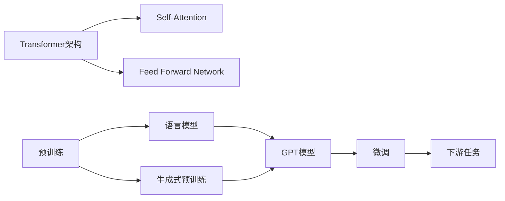

# GPT原理与代码实例讲解

## 1. 背景介绍

### 1.1 GPT的诞生与发展历程

GPT (Generative Pre-trained Transformer) 是由OpenAI开发的一种基于Transformer架构的大型语言模型。它的诞生标志着自然语言处理领域的重大突破。GPT模型通过在大规模无标签文本数据上进行预训练,学习到了丰富的语言知识和生成能力。

GPT模型的发展经历了几个重要的里程碑:

- 2018年6月,GPT-1发布,它在多个自然语言处理任务上取得了当时最先进的结果。
- 2019年2月,GPT-2发布,模型规模进一步扩大,并展示了令人印象深刻的语言生成能力。
- 2020年5月,GPT-3发布,其参数量高达1750亿,再次刷新了语言模型的性能记录。

### 1.2 GPT的应用价值与前景展望

GPT模型强大的语言理解和生成能力,使其在许多领域展现出广阔的应用前景,包括:

- 对话系统:GPT可以作为智能对话系统的核心,生成自然流畅的回复。
- 内容创作:GPT可以辅助创作各种文本内容,如文章、故事、诗歌等。
- 语言翻译:GPT可以作为机器翻译系统的重要组件,提高翻译质量。
- 知识问答:GPT可以用于构建知识库问答系统,根据问题生成准确的答案。

随着模型规模的不断扩大和训练技术的进步,GPT有望在更多领域发挥重要作用,推动人工智能的发展。

## 2. 核心概念与联系

### 2.1 Transformer架构

GPT模型的核心架构是Transformer,它是一种基于自注意力机制的神经网络结构。与传统的循环神经网络(RNN)和卷积神经网络(CNN)不同,Transformer可以并行处理输入序列,大大提高了训练和推理效率。

Transformer的主要组成部分包括:

- Encoder:由多个Encoder Layer组成,对输入序列进行编码。
- Decoder:由多个Decoder Layer组成,根据Encoder的输出生成目标序列。
- Self-Attention:通过计算序列中各个位置之间的注意力权重,捕捉序列的长距离依赖关系。
- Feed Forward Network:对Self-Attention的输出进行非线性变换。

### 2.2 预训练与微调

GPT模型采用了预训练和微调的范式:

- 预训练阶段:在大规模无标签文本数据上进行自监督学习,通过预测下一个词的方式学习语言的通用表示。
- 微调阶段:在特定任务的标注数据上对预训练模型进行微调,使其适应任务的特点。

这种范式使得GPT模型可以在相对较小的标注数据集上取得优异的性能,大大降低了对标注数据的需求。

### 2.3 语言模型与生成式预训练

GPT模型本质上是一种语言模型,它通过估计给定上下文下下一个词出现的概率来建模语言。与传统的n-gram语言模型不同,GPT使用神经网络来参数化这个概率分布。

生成式预训练指的是在预训练阶段,GPT通过生成下一个词的方式来学习语言的统计规律和结构特征。这种自监督的学习方式使得模型能够从海量无标签数据中学习到丰富的语言知识。

下面是GPT核心概念之间的关系示意图:



## 3. 核心算法原理具体操作步骤

### 3.1 Transformer的计算过程

Transformer的计算过程可以分为以下几个步骤:

1. 输入嵌入:将输入序列中的每个词转换为词嵌入向量。
2. 位置编码:为每个词嵌入向量添加位置信息,以区分序列中不同位置的词。
3. Encoder层计算:
   - 计算Self-Attention,得到每个位置与其他位置的注意力权重。
   - 将Self-Attention的输出通过Feed Forward Network进行非线性变换。
   - 通过残差连接和Layer Normalization对Encoder层的输出进行归一化。
4. Decoder层计算:
   - 对目标序列进行自回归,每次预测下一个词。
   - 计算Masked Self-Attention,防止模型看到未来的信息。
   - 计算Encoder-Decoder Attention,将Encoder的输出作为Query,Decoder的输出作为Key和Value。
   - 通过Feed Forward Network、残差连接和Layer Normalization对Decoder层的输出进行处理。
5. 输出层:将Decoder的输出通过线性变换和Softmax函数,得到下一个词的概率分布。

### 3.2 Self-Attention的计算方法

Self-Attention是Transformer的核心组件,其计算方法如下:

1. 将输入序列X通过三个线性变换得到Query矩阵Q、Key矩阵K和Value矩阵V。

$$
Q = XW_Q, K = XW_K, V = XW_V
$$

2. 计算Query和Key的点积,得到注意力分数矩阵。

$$
\text{Attention}(Q, K, V) = \text{softmax}(\frac{QK^T}{\sqrt{d_k}})V
$$

其中,$d_k$是Query和Key的维度,用于缩放点积结果。

3. 将注意力分数矩阵与Value矩阵相乘,得到加权求和的结果。

4. 将多头注意力的结果拼接起来,并通过线性变换得到最终的输出。

$$
\text{MultiHead}(Q, K, V) = \text{Concat}(\text{head}_1, ..., \text{head}_h)W^O
$$

其中,$\text{head}_i = \text{Attention}(QW_i^Q, KW_i^K, VW_i^V)$。

### 3.3 生成式预训练的损失函数

GPT在预训练阶段使用了语言模型的负对数似然损失函数:

$$
L(\theta) = -\sum_{i=1}^{n}\log P(x_i|x_{<i};\theta)
$$

其中,$x_i$是第$i$个词,$x_{<i}$是$x_i$之前的所有词,$\theta$是模型参数。

这个损失函数鼓励模型在给定前面词的情况下,正确预测下一个词。通过最小化这个损失函数,模型可以学习到语言的统计规律和生成能力。

## 4. 数学模型和公式详细讲解举例说明

### 4.1 Transformer的数学表示

Transformer的数学表示可以用以下公式来描述:

1. 输入嵌入:

$$
E = \text{Embedding}(X) + \text{PositionalEncoding}(X)
$$

其中,$X$是输入序列,$\text{Embedding}$将每个词映射为词嵌入向量,$\text{PositionalEncoding}$为每个位置添加位置编码。

2. Encoder层:

$$
\begin{aligned}
A &= \text{MultiHead}(E, E, E) \\
H &= \text{LayerNorm}(E + A) \\
F &= \text{FeedForward}(H) \\
E' &= \text{LayerNorm}(H + F)
\end{aligned}
$$

其中,$A$是Self-Attention的输出,$H$是残差连接和Layer Normalization的输出,$F$是Feed Forward Network的输出,$E'$是Encoder层的最终输出。

3. Decoder层:

$$
\begin{aligned}
A_1 &= \text{MultiHead}(D, D, D) \\
H_1 &= \text{LayerNorm}(D + A_1) \\
A_2 &= \text{MultiHead}(H_1, E', E') \\
H_2 &= \text{LayerNorm}(H_1 + A_2) \\
F &= \text{FeedForward}(H_2) \\
D' &= \text{LayerNorm}(H_2 + F)
\end{aligned}
$$

其中,$D$是目标序列的嵌入,$A_1$是Masked Self-Attention的输出,$A_2$是Encoder-Decoder Attention的输出,$D'$是Decoder层的最终输出。

4. 输出层:

$$
P(x_i|x_{<i}) = \text{softmax}(D'W^V)
$$

其中,$W^V$是输出层的权重矩阵。

### 4.2 示例说明

以一个英文句子"I love natural language processing"为例,说明Transformer的计算过程:

1. 输入嵌入:将每个词转换为词嵌入向量,并添加位置编码。

$$
\begin{aligned}
E_I &= \text{Embedding}(\text{"I"}) + \text{PositionalEncoding}(0) \\
E_{\text{love}} &= \text{Embedding}(\text{"love"}) + \text{PositionalEncoding}(1) \\
E_{\text{natural}} &= \text{Embedding}(\text{"natural"}) + \text{PositionalEncoding}(2) \\
E_{\text{language}} &= \text{Embedding}(\text{"language"}) + \text{PositionalEncoding}(3) \\
E_{\text{processing}} &= \text{Embedding}(\text{"processing"}) + \text{PositionalEncoding}(4)
\end{aligned}
$$

2. Encoder层:对每个词嵌入向量进行Self-Attention、残差连接、Layer Normalization和Feed Forward Network的计算。

$$
\begin{aligned}
A_I &= \text{MultiHead}(E_I, E, E) \\
H_I &= \text{LayerNorm}(E_I + A_I) \\
F_I &= \text{FeedForward}(H_I) \\
E'_I &= \text{LayerNorm}(H_I + F_I) \\
&... \\
E'_{\text{processing}} &= \text{LayerNorm}(H_{\text{processing}} + F_{\text{processing}})
\end{aligned}
$$

3. Decoder层:对目标序列进行自回归,计算Masked Self-Attention、Encoder-Decoder Attention等。

$$
\begin{aligned}
A_{1,\text{I}} &= \text{MultiHead}(D_{\text{<I}}, D_{\text{<I}}, D_{\text{<I}}) \\
H_{1,\text{I}} &= \text{LayerNorm}(D_{\text{I}} + A_{1,\text{I}}) \\
A_{2,\text{I}} &= \text{MultiHead}(H_{1,\text{I}}, E', E') \\
H_{2,\text{I}} &= \text{LayerNorm}(H_{1,\text{I}} + A_{2,\text{I}}) \\
F_{\text{I}} &= \text{FeedForward}(H_{2,\text{I}}) \\
D'_{\text{I}} &= \text{LayerNorm}(H_{2,\text{I}} + F_{\text{I}}) \\
&... \\
D'_{\text{processing}} &= \text{LayerNorm}(H_{2,\text{processing}} + F_{\text{processing}})
\end{aligned}
$$

4. 输出层:将Decoder的输出通过线性变换和Softmax函数,得到下一个词的概率分布。

$$
P(x_i|x_{<i}) = \text{softmax}(D'_iW^V)
$$

其中,$x_i$是目标序列的第$i$个词。

通过这个示例,我们可以看到Transformer是如何逐步处理输入序列,并生成目标序列的。Self-Attention机制使得模型能够捕捉序列中的长距离依赖关系,而残差连接和Layer Normalization则有助于模型的训练和收敛。

## 5. 项目实践:代码实例和详细解释说明

下面是一个使用PyTorch实现GPT模型的简化版代码示例:

```python
import torch
import torch.nn as nn

class SelfAttention(nn.Module):
    def __init__(self, embed_size, num_heads):
        super().__init__()
        self.embed_size = embed_size
        self.num_heads = num_heads
        self.head_dim = embed_size // num_heads

        self.query = nn.Linear(embed_size, embed_size)
        self.key = nn.Linear(embed_size, embed_size)
        self.value = nn.Linear(embed_size, embed_size)
        self.fc = nn.Linear(embed_size, embed_size)

    def forward(self, x):
        batch_size, seq_len, _ = x.size()

        q = self.query(x).view(batch_size, seq_len, self.num_heads, self.head_dim).transpose(1, 2)
        k = self.key(x).view(batch_size, seq_len, self.num_heads, self.head_dim).transpose(1, 2)
        v = self.value(x).view(batch_size, seq_len, self.num_heads, self.head_dim).transpose(1, 2)

        scores = torch.matmul(q, k.transpose(-2, -1))