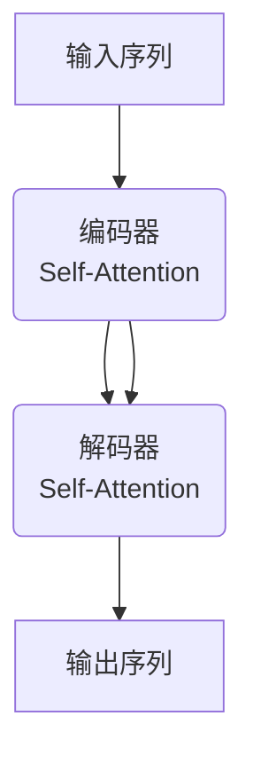

# GPT原理与代码实战案例讲解

## 1.背景介绍

在过去几年中,自然语言处理(NLP)领域取得了长足的进步,其中一个重要的里程碑是Transformer模型的提出。Transformer凭借其强大的并行计算能力和自注意力机制,在机器翻译、文本生成等任务中取得了卓越的成绩。而GPT(Generative Pre-trained Transformer)正是基于Transformer模型,通过自监督的方式在大规模语料库上预训练而得到的通用语言模型。

GPT的核心思想是利用Transformer的解码器(Decoder)部分,以自回归(Autoregressive)的方式对语料库中的文本进行建模。通过这种无监督的预训练方式,GPT能够从海量数据中学习到丰富的语言知识,并将其编码到模型参数中。预训练完成后,GPT可以通过针对性的微调(Fine-tuning),快速转移到各种下游任务上,显著提高了模型的泛化能力。

GPT的出现为NLP领域带来了新的发展机遇,其强大的语言生成能力也推动了诸如对话系统、问答系统、文本续写等应用的发展。随着GPT-2、GPT-3等更大规模的模型不断问世,GPT系列模型正在为人工智能的通用语言理解和生成能力做出重要贡献。

## 2.核心概念与联系

### 2.1 Transformer模型

Transformer模型是GPT的基础,了解Transformer有助于理解GPT的工作原理。Transformer由编码器(Encoder)和解码器(Decoder)两部分组成,其中解码器部分用于生成目标序列。

Transformer最核心的创新是引入了自注意力机制(Self-Attention),它允许模型在计算目标位置的表示时,直接关注整个输入序列的所有位置。这种全局关注机制大大增强了模型的表达能力。此外,Transformer完全基于注意力机制,摒弃了RNN和CNN等结构,因此具有更好的并行计算能力。



### 2.2 自回归语言模型

GPT属于自回归语言模型(Autoregressive Language Model),其目标是最大化语料库中所有文本序列的条件概率:

$$P(x_1, x_2, ..., x_n) = \prod_{t=1}^n P(x_t | x_1, x_2, ..., x_{t-1})$$

其中$x_t$表示序列的第t个token。自回归模型通过预测下一个token的概率分布,从而一步步生成整个序列。这种建模方式使得GPT具有强大的文本生成能力。

### 2.3 自监督预训练

GPT采用了自监督预训练的策略。在预训练阶段,GPT以自回归的方式对大规模语料库中的文本进行建模,目标是最大化语料库中所有文本序列的条件概率。通过这种无监督的方式,GPT可以从海量数据中学习到丰富的语言知识,并将其编码到模型参数中。

预训练完成后,GPT可以通过针对性的微调(Fine-tuning)转移到各种下游任务上,例如文本生成、机器翻译、问答系统等。微调过程中,只需在预训练模型的基础上,利用较少的任务数据对模型进行进一步训练,即可获得良好的性能表现。


## 3.核心算法原理具体操作步骤

GPT的核心算法原理可以分为两个阶段:预训练阶段和微调阶段。

### 3.1 预训练阶段

1. **数据预处理**: 将原始语料库文本转换为模型可以接受的token序列,通常包括分词(Tokenization)、词典构建等步骤。

2. **构建训练样本**: 对于每个长度为n的token序列$[x_1, x_2, ..., x_n]$,构建n个训练样本$([x_1], x_2)$、$([x_1, x_2], x_3)$、...、$([x_1, x_2, ..., x_{n-1}], x_n)$。其中输入是序列的前缀,目标是序列的下一个token。

3. **模型前向计算**: 将输入序列$[x_1, x_2, ..., x_{t-1}]$输入到GPT的Transformer解码器中,计算出每个位置的隐藏状态表示。

4. **计算损失函数**: 将解码器最后一个位置的隐藏状态表示,输入到一个线性+softmax层,得到下一个token的概率分布$P(x_t | x_1, x_2, ..., x_{t-1})$。将其与目标token $x_t$计算交叉熵损失。

5. **反向传播和优化**: 对模型参数进行反向传播,并使用优化器(如Adam)更新模型参数,使损失函数最小化。

6. **重复训练**: 重复3-5步骤,直到模型收敛或达到预设的训练轮数。

### 3.2 微调阶段

1. **准备下游任务数据**: 根据具体任务,构建训练样本和评估集。例如对于文本分类任务,需要将原始文本和对应的类别标签构建为训练样本对。

2. **加载预训练模型**: 加载预训练好的GPT模型参数。

3. **设计任务特定的输入表示**: 根据任务需求,设计将输入数据映射为模型可接受的token序列的方式。例如在文本分类任务中,可以在输入文本前添加"分类:"作为前缀。

4. **微调训练**: 将任务数据输入到预训练模型中,计算损失函数(如交叉熵损失),并对模型参数进行反向传播和优化,使损失函数最小化。

5. **模型评估**: 在评估集上测试模型性能,根据具体任务选择合适的评估指标,如准确率、F1分数等。

6. **模型部署**: 将微调后的模型部署到实际的生产环境中,提供预测服务。

通过上述两个阶段,GPT可以从大规模无标注语料库中学习到有价值的语言知识,并通过少量的任务数据快速转移到各种下游任务上,发挥出强大的泛化能力。

## 4.数学模型和公式详细讲解举例说明

GPT作为一种自回归语言模型,其核心目标是最大化语料库中所有文本序列的条件概率:

$$P(x_1, x_2, ..., x_n) = \prod_{t=1}^n P(x_t | x_1, x_2, ..., x_{t-1})$$

其中$x_t$表示序列的第t个token。该公式表示,生成整个序列的概率,可以分解为生成每个token的条件概率的连乘积。

在预训练阶段,GPT通过最大化语料库中所有序列的对数似然函数,来学习模型参数:

$$\mathcal{L} = \sum_{x \in \mathcal{D}} \log P(x) = \sum_{x \in \mathcal{D}} \sum_{t=1}^{|x|} \log P(x_t | x_1, x_2, ..., x_{t-1})$$

其中$\mathcal{D}$表示语料库,包含了所有的训练序列$x$。对数似然函数的目标是最小化所有序列的负对数似然损失。

在实际计算中,GPT利用Transformer解码器计算每个位置的隐藏状态表示$h_t$:

$$h_t = \text{TransformerDecoder}(x_1, x_2, ..., x_{t-1})$$

然后将$h_t$输入到一个线性+softmax层,得到下一个token的概率分布:

$$P(x_t | x_1, x_2, ..., x_{t-1}) = \text{softmax}(W_o h_t + b_o)$$

其中$W_o$和$b_o$是可训练参数。最后,将预测的概率分布与目标token的one-hot编码计算交叉熵损失,并通过反向传播更新模型参数。

以文本分类任务为例,假设我们需要将一段文本$x$分类到K个类别中的一个。我们可以将文本表示为token序列$[x_1, x_2, ..., x_n]$,并在序列前添加一个特殊token "分类:"作为前缀,构建输入序列$["\text{分类:}", x_1, x_2, ..., x_n]$。

然后,我们将该输入序列输入到GPT模型中,获得最后一个位置的隐藏状态表示$h_n$。将$h_n$输入到一个线性层中,得到K个类别的logits值:

$$\begin{bmatrix}
\text{logit}_1 \\
\text{logit}_2 \\
\vdots \\
\text{logit}_K
\end{bmatrix} = W_c h_n + b_c$$

其中$W_c$和$b_c$是可训练参数。最后,通过softmax函数将logits值转换为类别概率分布:

$$P(y | x) = \text{softmax}\begin{bmatrix}
\text{logit}_1 \\
\text{logit}_2 \\
\vdots \\
\text{logit}_K
\end{bmatrix}$$

在训练阶段,我们将预测的概率分布与真实类别的one-hot编码计算交叉熵损失,并通过反向传播更新模型参数。在预测阶段,我们选择概率最大的类别作为预测结果。

通过上述方式,GPT可以将自回归语言模型的能力迁移到各种序列标注任务上,展现出强大的泛化能力。

## 5.项目实践:代码实例和详细解释说明

为了更好地理解GPT的原理和应用,我们将通过一个实际的代码示例,演示如何使用Python和Hugging Face的Transformers库来构建一个基于GPT的文本生成模型。

### 5.1 安装依赖库

首先,我们需要安装所需的Python库,包括Transformers、Tokenizers和tqdm:

```bash
pip install transformers tokenizers tqdm
```

### 5.2 加载预训练模型和分词器

我们将使用Hugging Face提供的预训练GPT-2模型和分词器:

```python
from transformers import GPT2LMHeadModel, GPT2Tokenizer

model = GPT2LMHeadModel.from_pretrained('gpt2')
tokenizer = GPT2Tokenizer.from_pretrained('gpt2')
```

### 5.3 文本生成函数

接下来,我们定义一个文本生成函数,它将给定的起始文本作为输入,并生成指定长度的续写文本:

```python
import torch

def generate_text(prompt, max_length=100, top_k=50, top_p=0.95, num_return_sequences=1):
    input_ids = tokenizer.encode(prompt, return_tensors='pt')
    
    output = model.generate(input_ids,
                            max_length=max_length,
                            do_sample=True,
                            top_k=top_k,
                            top_p=top_p,
                            num_return_sequences=num_return_sequences)
    
    generated_texts = [tokenizer.decode(output[i], skip_special_tokens=True) for i in range(num_return_sequences)]
    return generated_texts
```

这个函数的参数包括:

- `prompt`: 起始文本
- `max_length`: 生成文本的最大长度
- `top_k`: 在每个解码步骤中,只考虑概率最高的top_k个token
- `top_p`: 在每个解码步骤中,只考虑累积概率达到top_p的token
- `num_return_sequences`: 生成的文本序列数量

函数首先将起始文本编码为token ID序列,然后调用GPT-2模型的`generate`方法进行文本生成。`generate`方法支持多种采样策略,包括top-k采样和top-p采样,用于控制生成文本的多样性。最后,函数将生成的token ID序列解码为文本,并返回结果。

### 5.4 使用示例

现在,我们可以使用上述函数来生成文本续写。例如,给定一个起始文本"人工智能是":

```python
prompt = "人工智能是"
generated_texts = generate_text(prompt, max_length=100, num_return_sequences=3)

for text in generated_texts:
    print(prompt + text)
```

输出可能如下:

```
人工智能是一种能够模仿人类智能行为的计算机系统或机器。它可以通过学习和处理大量数据来执行各种复杂的任务,如自然语言处理、图像识别、决策制定等。人工智能技术已经广泛应用于各个领域