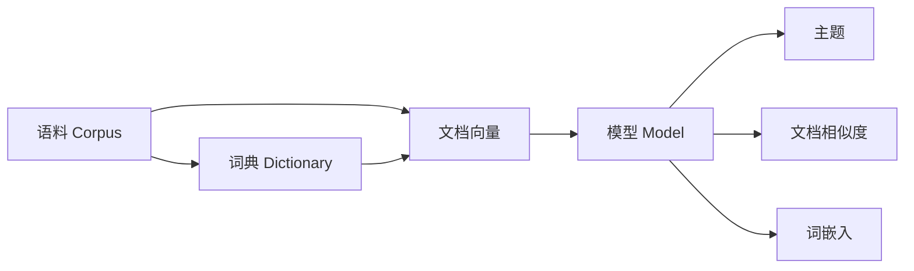

# Gensim 原理与代码实战案例讲解

## 1. 背景介绍
### 1.1 自然语言处理与主题模型
自然语言处理(Natural Language Processing, NLP)是人工智能的一个重要分支,旨在让计算机能够理解、处理和生成人类语言。在NLP领域中,主题模型(Topic Model)是一类非常重要且广泛应用的无监督学习算法,用于从大规模文本语料库中自动提取隐含的主题结构。

### 1.2 Gensim 简介
Gensim 是一个用于主题建模、文档相似度检索以及大规模语义空间向量计算的 Python 库。它基于NumPy、SciPy 和 Cython 实现,专注于处理大规模文本语料,并提供了多种常用的主题模型算法,如潜在语义分析(Latent Semantic Analysis, LSA)、潜在狄利克雷分配(Latent Dirichlet Allocation, LDA)等。

### 1.3 Gensim 的优势
- 高效的内存使用和数据流处理,可以处理海量文本数据
- 丰富的主题模型算法实现
- 简洁易用的 API 接口设计
- 优秀的可扩展性,方便添加自定义的语料和模型

## 2. 核心概念与联系
### 2.1 语料(Corpus)
语料是一系列文档的集合,是主题模型算法的输入。在 Gensim 中,语料通常表示为一个可迭代的对象,每次返回一个稀疏向量,表示文档中每个词的词频或 TF-IDF 值。

### 2.2 词典(Dictionary) 
词典定义了语料的词汇表,将每个唯一词映射为一个唯一的整数 ID。Gensim 中的词典对象还负责过滤、统计词频等预处理操作。

### 2.3 向量(Vector)
在 Gensim 中,文档和词都被表示为向量。文档向量通常是词袋模型(Bag-of-Words)表示,即以词频或 TF-IDF 值为元素的稀疏向量。词向量则是通过词嵌入(Word Embedding)模型学习得到的低维稠密向量。

### 2.4 模型(Model) 
模型是从语料中学习得到的统计模型,如 LSA、LDA 等主题模型。训练好的模型可以将文档映射到一个低维语义空间,用于主题提取、文档相似度计算等任务。

以下是这些核心概念之间的关系图:



## 3. 核心算法原理与具体操作步骤
### 3.1 潜在语义分析(LSA)
LSA 是一种基于奇异值分解(SVD)的主题模型算法,通过矩阵分解将文档映射到一个低维语义空间。

#### 3.1.1 LSA 的主要步骤
1. 构建词-文档矩阵(Term-Document Matrix),每行表示一个词,每列表示一个文档,元素值为词频或 TF-IDF。
2. 对词-文档矩阵进行 SVD 分解,得到左奇异矩阵(词向量)、奇异值矩阵和右奇异矩阵(文档向量)。
3. 选择前 k 个最大奇异值对应的左右奇异向量,得到降维后的词向量和文档向量。
4. 利用降维后的向量进行主题提取、文档相似度计算等任务。

#### 3.1.2 Gensim 中的 LSA 实现
```python
from gensim import corpora, models

# 准备语料
corpus = [
    ['human', 'interface', 'computer'],
    ['survey', 'user', 'computer', 'system', 'response', 'time'],
    ['eps', 'user', 'interface', 'system'],
    ['system', 'human', 'system', 'eps'],
    ['user', 'response', 'time'],
    ['trees'],
    ['graph', 'trees'],
    ['graph', 'minors', 'trees'],
    ['graph', 'minors', 'survey']
]

# 创建词典
dictionary = corpora.Dictionary(corpus)

# 将文档转换为词袋向量
bow_corpus = [dictionary.doc2bow(doc) for doc in corpus]

# 训练 LSA 模型
lsa_model = models.LsiModel(bow_corpus, id2word=dictionary, num_topics=2)

# 输出主题
print(lsa_model.print_topics())

# 计算文档相似度
doc_bow = dictionary.doc2bow(['user', 'computer', 'time'])
doc_lsa = lsa_model[doc_bow]
sims = lsa_model.get_document_topics(doc_lsa, minimum_probability=0)
print(list(enumerate(sims)))
```

### 3.2 潜在狄利克雷分配(LDA)
LDA 是一种生成式概率模型,假设每个文档由多个主题混合生成,每个主题则由词汇表中的词按照某个概率分布生成。

#### 3.2.1 LDA 的生成过程
对于语料库中的每篇文档:
1. 从狄利克雷分布 $Dir(\alpha)$ 中采样出文档的主题分布 $\theta_d$。
2. 对于文档中的每个词 $w_{dn}$:
   - 从多项式分布 $Multi(\theta_d)$ 中采样出该词所属的主题 $z_{dn}$。
   - 从主题 $z_{dn}$ 对应的词分布 $\phi_{z_{dn}}$ 中采样出词 $w_{dn}$。

其中,$\alpha$ 是狄利克雷分布的超参数,$\beta$ 是主题的先验词分布参数。LDA 的目标是学习得到后验主题分布 $\theta_d$ 和词分布 $\phi_k$。

#### 3.2.2 Gensim 中的 LDA 实现
```python
from gensim import corpora, models

# 准备语料
corpus = [
    ['human', 'interface', 'computer'],
    ['survey', 'user', 'computer', 'system', 'response', 'time'],
    ['eps', 'user', 'interface', 'system'],
    ['system', 'human', 'system', 'eps'],
    ['user', 'response', 'time'],
    ['trees'],
    ['graph', 'trees'],
    ['graph', 'minors', 'trees'],
    ['graph', 'minors', 'survey']
]

# 创建词典
dictionary = corpora.Dictionary(corpus)

# 将文档转换为词袋向量 
bow_corpus = [dictionary.doc2bow(doc) for doc in corpus]

# 训练 LDA 模型
lda_model = models.LdaMulticore(bow_corpus, id2word=dictionary, num_topics=3)

# 输出主题
print(lda_model.print_topics())

# 推断新文档的主题分布
doc_bow = dictionary.doc2bow(['user', 'computer', 'time'])
doc_lda = lda_model.get_document_topics(doc_bow)
print(doc_lda)
```

## 4. 数学模型和公式详细讲解举例说明
### 4.1 词袋模型(Bag-of-Words)
词袋模型将文档表示为一个稀疏向量,向量的每个元素对应词汇表中的一个词,元素值为该词在文档中的出现频率。例如,对于词汇表 $V=\{``to", ``be", ``or", ``not", ``to", ``be"\}$,文档 $d_1=$"to be or not to be" 的词袋表示为:

$$\vec{d_1} = (2, 2, 1, 1, 0, 0)$$

### 4.2 TF-IDF
TF-IDF 是一种用于评估词对文档重要性的加权方法。TF(Term Frequency)表示词在文档中的出现频率,IDF(Inverse Document Frequency)表示词在整个语料库中的出现频率的倒数的对数。

$$
\begin{aligned}
TF(t,d) &= \frac{f_{t,d}}{\sum_{t' \in d} f_{t',d}} \\
IDF(t,D) &= \log \frac{|D|}{|\{d \in D: t \in d\}|} \\
TFIDF(t,d,D) &= TF(t,d) \cdot IDF(t,D)
\end{aligned}
$$

其中,$f_{t,d}$ 表示词 $t$ 在文档 $d$ 中的出现频次,$|D|$ 为语料库中文档总数。

### 4.3 奇异值分解(SVD)
SVD 是一种矩阵分解方法,可以将一个矩阵分解为三个矩阵的乘积:

$$A_{m \times n} = U_{m \times m} \Sigma_{m \times n} V^T_{n \times n}$$

其中,$U$ 和 $V$ 是正交矩阵,$\Sigma$ 是对角矩阵,对角线上的元素为奇异值。SVD 常用于降维和提取矩阵的主要特征。

在 LSA 中,对词-文档矩阵进行 SVD 分解,并选取前 $k$ 个最大奇异值对应的左右奇异向量,可以得到词和文档在 $k$ 维语义空间中的低维表示。

### 4.4 狄利克雷分布(Dirichlet Distribution)
狄利克雷分布是一种多元概率分布,常用于表示多项分布的先验分布。对于 $K$ 维随机变量 $\vec{x}=(x_1,\ldots,x_K)$,狄利克雷分布的概率密度函数为:

$$Dir(\vec{x}|\vec{\alpha}) = \frac{1}{B(\vec{\alpha})} \prod_{i=1}^K x_i^{\alpha_i-1}$$

其中,$\vec{\alpha}=(\alpha_1,\ldots,\alpha_K)$ 是狄利克雷分布的参数向量,$B(\vec{\alpha})$ 是归一化常数,称为多元 Beta 函数:

$$B(\vec{\alpha}) = \frac{\prod_{i=1}^K \Gamma(\alpha_i)}{\Gamma(\sum_{i=1}^K \alpha_i)}$$

在 LDA 中,主题分布 $\theta_d$ 和词分布 $\phi_k$ 都服从狄利克雷分布。

## 5. 项目实践：代码实例和详细解释说明
下面以一个完整的 Gensim 项目为例,演示如何使用 Gensim 进行主题建模和文档相似度计算。

### 5.1 数据准备
首先,我们需要准备一个文本语料库。这里使用 20 Newsgroups 数据集,它包含了 20 个不同主题的新闻文章。

```python
from sklearn.datasets import fetch_20newsgroups

# 下载 20 Newsgroups 数据集
dataset = fetch_20newsgroups(shuffle=True, random_state=1, remove=('headers', 'footers', 'quotes'))
documents = dataset.data
```

### 5.2 文本预处理
接下来,对文本数据进行分词、去除停用词等预处理操作。

```python
from nltk.corpus import stopwords
from nltk.stem import WordNetLemmatizer
import string

stop_words = set(stopwords.words('english'))
lemmatizer = WordNetLemmatizer()

def preprocess(text):
    # 转换为小写
    text = text.lower()
    # 去除标点符号
    text = text.translate(str.maketrans('', '', string.punctuation))
    # 分词
    words = text.split()
    # 去除停用词和词形还原
    words = [lemmatizer.lemmatize(word) for word in words if word not in stop_words]
    return words

processed_docs = [preprocess(doc) for doc in documents]
```

### 5.3 创建词典和语料
使用 Gensim 的 Dictionary 类创建词典,并将文档转换为词袋向量。

```python
from gensim import corpora

# 创建词典
dictionary = corpora.Dictionary(processed_docs)

# 过滤出现频率过低或过高的词
dictionary.filter_extremes(no_below=10, no_above=0.5)

# 将文档转换为词袋向量
bow_corpus = [dictionary.doc2bow(doc) for doc in processed_docs]
```

### 5.4 训练 LDA 模型
使用 Gensim 的 LdaMulticore 类训练 LDA 模型。

```python
from gensim import models

# 训练 LDA 模型
lda_model = models.LdaMulticore(bow_corpus, num_topics=20, id2word=dictionary, passes=10, workers=4)

# 输出主题
for idx, topic in lda_model.print_topics(-1):
    print(f'Topic {idx}: {topic}')
```

### 5.5 计算文档相似度
利用训练好的 LDA 模型,计算文档之间的相似度。

```python
from gensim import similarities

# 创建相似度索引
index = similarities.MatrixSimilarity(lda_model[bow_corpus])

# 计算文档相似度
query_doc = processed_docs[0]
query_bow = dictionary.doc2bow(query_doc)
query_lda = lda_model[query_bow