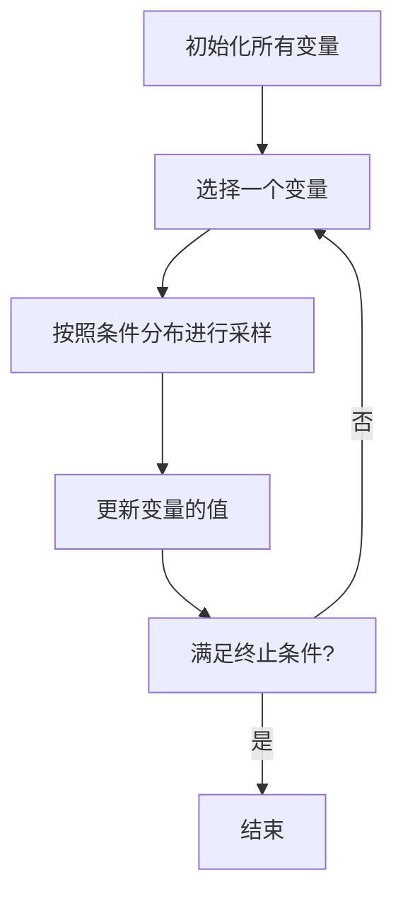

## 1.背景介绍

作为一种广泛应用于统计学和机器学习领域的算法，Gibbs采样为我们提供了一种有效的方式来从联合分布中进行采样。尽管这个算法在理论上看起来相当复杂，但实际上，它的实现和应用都非常直观。在本文中，我们将深入探讨Gibbs采样的原理，并通过实际的代码案例进行讲解。

## 2.核心概念与联系

在深入了解Gibbs采样之前，我们需要先理解一些核心概念，包括马尔科夫链、马尔科夫链蒙特卡罗方法（MCMC）以及Gibbs采样。

### 2.1 马尔科夫链

马尔科夫链是一种随机过程，其特点是下一状态的概率分布只依赖于当前状态，而与过去的状态无关。马尔科夫链的这一特性使得我们可以通过构造一个马尔科夫链来进行概率分布的采样。

### 2.2 马尔科夫链蒙特卡罗方法（MCMC）

MCMC是一种基于马尔科夫链的采样方法。它通过构建一个马尔科夫链，使得该链的平稳分布就是我们希望采样的分布，从而实现从复杂分布的采样。

### 2.3 Gibbs采样

Gibbs采样是MCMC的一种特殊情况，它通过在每一步中按照条件概率分布进行采样，从而避免了接受-拒绝步骤，提高了采样的效率。Gibbs采样的核心思想是，如果我们能够从条件分布中进行采样，那么我们就可以通过交替地从各个变量的条件分布中采样，来实现从联合分布的采样。

## 3.核心算法原理具体操作步骤

Gibbs采样的具体操作步骤如下：

1. 初始化所有的变量。
2. 对于每一个变量，按照其他变量的当前值对应的条件分布进行采样，更新该变量的值。
3. 重复第2步直到满足终止条件。

下面是对应的Mermaid流程图：



## 4.数学模型和公式详细讲解举例说明

Gibbs采样的数学基础是贝叶斯定理和条件概率。我们以一个简单的例子进行说明。

假设我们有两个随机变量$X$和$Y$，我们希望从它们的联合分布$p(X, Y)$中进行采样。Gibbs采样的思路是，我们可以先固定$Y$的值，从条件分布$p(X|Y)$中采样$X$，然后再固定$X$的值，从条件分布$p(Y|X)$中采样$Y$。通过交替地进行这两步，我们可以得到一系列符合联合分布$p(X, Y)$的样本。

具体的，我们可以使用以下的公式进行采样：

$$
X^{(t+1)} \sim p(X|Y=Y^{(t)})
$$

$$
Y^{(t+1)} \sim p(Y|X=X^{(t+1)})
$$

其中，$t$表示采样的步数，$X^{(t)}$和$Y^{(t)}$表示第$t$步的样本。

## 5.项目实践：代码实例和详细解释说明

接下来，我们通过一个简单的代码实例来说明如何实现Gibbs采样。在这个例子中，我们假设$X$和$Y$都服从标准正态分布，且它们之间的相关系数为0.5。

首先，我们需要定义条件分布的采样函数。在这个例子中，我们知道如果$X$和$Y$的相关系数为$\rho$，那么$X|Y=y$和$Y|X=x$都服从均值为$\rho y$或$\rho x$的正态分布。因此，我们可以定义以下的采样函数：

```python
import numpy as np

def sample_x_given_y(y, rho):
    return np.random.normal(loc=rho*y, scale=np.sqrt(1-rho**2))

def sample_y_given_x(x, rho):
    return np.random.normal(loc=rho*x, scale=np.sqrt(1-rho**2))
```

然后，我们可以使用以下的代码来进行Gibbs采样：

```python
def gibbs_sampling(rho, n_samples):
    samples = np.zeros((n_samples, 2))
    y = np.random.normal()
    for t in range(n_samples):
        x = sample_x_given_y(y, rho)
        y = sample_y_given_x(x, rho)
        samples[t, :] = [x, y]
    return samples
```

在这个函数中，我们首先初始化$y$的值，然后在每一步中，先从$p(X|Y=y)$中采样$X$，再从$p(Y|X=x)$中采样$Y$，并将样本保存起来。

## 6.实际应用场景

Gibbs采样在许多实际应用中都发挥了重要的作用。例如，在自然语言处理中，Gibbs采样被用于训练主题模型；在计算生物学中，Gibbs采样被用于基因序列分析；在机器学习中，Gibbs采样被用于训练深度神经网络。

## 7.工具和资源推荐

如果你对Gibbs采样感兴趣，以下是一些推荐的学习资源：

- [Stanford University's CS229 Course Notes](http://cs229.stanford.edu/notes/cs229-notes12.pdf)：这是斯坦福大学的机器学习课程的笔记，其中详细介绍了Gibbs采样和其他MCMC方法。
- [Bishop's "Pattern Recognition and Machine Learning"](https://www.amazon.com/Pattern-Recognition-Learning-Information-Statistics/dp/0387310738)：这本书是机器学习领域的经典教材，其中对Gibbs采样有深入的讲解。

## 8.总结：未来发展趋势与挑战

尽管Gibbs采样已经被广泛应用于各种领域，但它仍然面临着一些挑战。例如，当变量之间的相关性很强时，Gibbs采样可能会遇到难以混合的问题。此外，对于高维空间的采样，Gibbs采样可能会遇到“维度灾难”的问题。为了解决这些问题，研究者们提出了许多改进的Gibbs采样算法，如块Gibbs采样、切断Gibbs采样等。

尽管如此，Gibbs采样仍然是一种非常强大的采样工具，它的简单性和有效性使得它在未来仍然会广泛应用于各种领域。

## 9.附录：常见问题与解答

Q: Gibbs采样和Metropolis-Hastings采样有什么区别？

A: Gibbs采样和Metropolis-Hastings采样都是MCMC的一种，但它们的采样方式有所不同。Gibbs采样在每一步中按照条件分布进行采样，而Metropolis-Hastings采样则需要在每一步中进行接受-拒绝步骤。

Q: Gibbs采样有什么限制？

A: Gibbs采样的一个主要限制是，它需要我们能够从条件分布中进行采样。对于一些复杂的分布，这可能是困难的。此外，当变量之间的相关性很强时，Gibbs采样可能会遇到混合的问题。

Q: 如何判断Gibbs采样是否收敛？

A: 判断Gibbs采样是否收敛通常使用的方法是Gelman-Rubin诊断。这种方法通过比较多个独立链的内部差异和链间差异来判断是否收敛。

作者：禅与计算机程序设计艺术 / Zen and the Art of Computer Programming