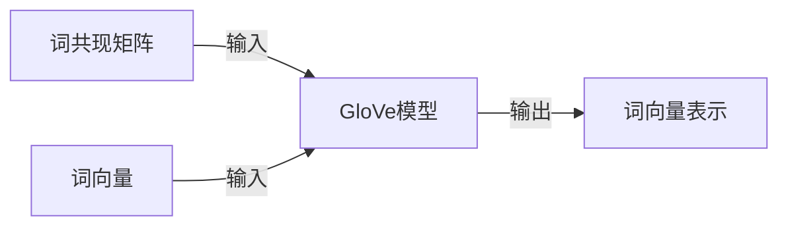

## 1.背景介绍

在自然语言处理（NLP）领域，词向量（Word Embeddings）是一种将词语或短语从词汇表中映射到向量的技术。其中，GloVe（Global Vectors for Word Representation）是一种流行的词向量技术，由斯坦福大学的研究人员于2014年提出。GloVe使用全局的词频统计信息来生成词向量，因此能够捕捉到词语之间的语义和句法关系，被广泛应用在各种NLP任务中。

## 2.核心概念与联系

GloVe模型的核心概念是词共现矩阵（Co-occurrence Matrix）和词向量的点积。词共现矩阵是一个大型矩阵，其中行和列分别代表词汇表中的词，每个元素表示两个词在一定窗口大小内共同出现的次数。而词向量的点积则可以看作是两个词之间的语义相似度。

在GloVe模型中，我们的目标是找到一种词向量表示，使得任意两个词的向量点积等于它们在词共现矩阵中的对应元素的对数。这样就能够将全局的统计信息（词共现矩阵）和局部的表示（词向量）结合起来。



## 3.核心算法原理具体操作步骤

GloVe模型的训练过程可以分为以下几个步骤：

1. 构建词共现矩阵：遍历语料库，对每个词，统计其在窗口大小内与其他词共同出现的次数，填充到词共现矩阵中。

2. 初始化词向量：随机初始化每个词的词向量。

3. 训练词向量：使用随机梯度下降（SGD）方法，最小化词向量的点积和词共现矩阵对应元素的对数之间的平方差。

4. 使用词向量：训练完成后，每个词的词向量就可以用来表示该词的语义信息了。

## 4.数学模型和公式详细讲解举例说明

假设我们有一个词汇表$V$，其大小为$|V|$，词共现矩阵$X$的元素$X_{ij}$表示词$i$和词$j$共同出现的次数。我们的目标是找到每个词$i$的词向量$w_i$和$b_i$，以及每个词$j$的上下文向量$v_j$和$b_j'$，使得它们满足以下等式：

$$
w_i^T v_j + b_i + b_j' = log(X_{ij})
$$

为了解决这个优化问题，我们使用随机梯度下降方法，并添加一个加权函数$f(X_{ij})$来平衡不同频率的词对的贡献。最终的优化目标函数为：

$$
J = \sum_{i,j=1}^{|V|} f(X_{ij}) (w_i^T v_j + b_i + b_j' - log(X_{ij}))^2
$$

其中，加权函数$f(x)$可以定义为：

$$
f(x) = \begin{cases} 
(x/x_{max})^{3/4} & \text{if } x < x_{max} \\
1 & \text{otherwise}
\end{cases}
$$

这个函数的作用是对高频词进行降权，避免它们对模型的影响过大。

## 5.项目实践：代码实例和详细解释说明

在Python环境下，我们可以使用Gensim库来训练GloVe模型。以下是一个简单的示例：

```python
from gensim.models import Word2Vec
from gensim.scripts.glove2word2vec import glove2word2vec

# 转换GloVe模型为Word2Vec格式
glove_input_file = 'glove.txt'
word2vec_output_file = 'word2vec.txt'
glove2word2vec(glove_input_file, word2vec_output_file)

# 加载模型
model = Word2Vec.load(word2vec_output_file)

# 获取词向量
vector = model['computer']
```

这段代码首先将GloVe模型转换为Word2Vec格式，然后加载模型，并获取词“computer”的词向量。

## 6.实际应用场景

GloVe模型在各种NLP任务中都有广泛的应用，包括但不限于：

- 文本分类：使用词向量作为文本的特征输入到分类模型中。

- 语义相似度计算：通过计算两个词的词向量的余弦相似度，来衡量它们的语义相似度。

- 词义消歧：根据上下文的词向量，推断出目标词的正确词义。

- 机器翻译：在神经网络机器翻译模型中，词向量被用作输入的词的表示。

## 7.工具和资源推荐

- Gensim：一个用于处理文本数据，包括词向量训练的Python库。

- GloVe官方网站：提供了预训练的GloVe模型和源代码。

- word2vec：Google开源的一个用于训练词向量的工具。

## 8.总结：未来发展趋势与挑战

尽管GloVe模型在许多NLP任务中表现出色，但它仍然面临一些挑战。例如，GloVe模型不能很好地处理语料库中未出现的词，也不能捕捉到词的多义性。此外，GloVe模型需要大量的计算资源和存储空间来处理大规模的词汇表。

随着深度学习技术的发展，一些新的词向量模型，如BERT和ELMo，已经开始使用上下文信息来生成更丰富的词向量。这些模型不仅能够处理更复杂的语义关系，而且可以通过预训练和微调的方式，适应各种不同的NLP任务。

## 9.附录：常见问题与解答

Q：GloVe模型和Word2Vec模型有什么区别？

A：GloVe模型和Word2Vec模型都是词向量模型，但它们的训练方式不同。Word2Vec模型是基于局部的上下文信息进行训练，而GloVe模型则是基于全局的词频统计信息进行训练。

Q：如何选择GloVe模型的参数，如窗口大小和向量维度？

A：这些参数的选择通常需要根据具体的应用进行调整。一般来说，窗口大小可以根据词语的语义关系的范围来选择，向量维度则可以根据模型的复杂度和可用的计算资源来选择。

Q：GloVe模型可以用于处理非英语的文本吗？

A：是的，GloVe模型可以用于处理任何语言的文本。但需要注意的是，不同语言的词汇表大小和词语的分布可能会对模型的效果产生影响。

作者：禅与计算机程序设计艺术 / Zen and the Art of Computer Programming