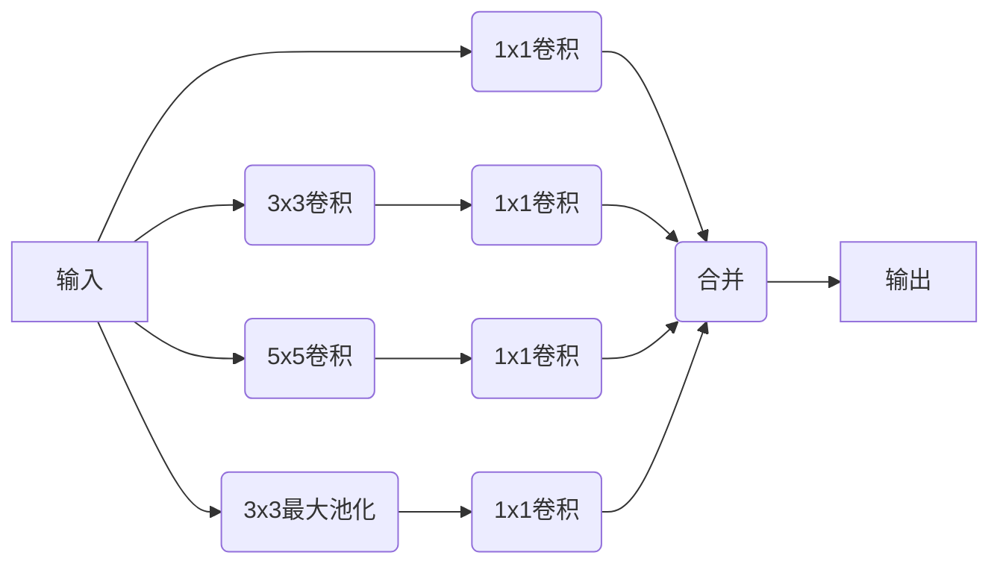

# GoogleNet：Inception模块的创新

## 1.背景介绍

在深度学习领域中,卷积神经网络(CNN)已经成为解决计算机视觉问题的主导模型。随着数据集的不断扩大和硬件计算能力的提升,CNN模型也变得越来越深和复杂。然而,简单地堆叠卷积层并不能有效地提高模型性能,反而可能导致过拟合和梯度消失等问题。为了构建更有效的深度神经网络,Google的研究人员提出了Inception模块,并在此基础上设计了GoogleNet模型。

GoogleNet模型的核心创新之处在于Inception模块的设计,它通过并行组合多种不同尺寸的卷积核,有效地捕获了不同尺度下的特征信息,从而大大提高了模型的表达能力。同时,Inception模块还引入了1x1卷积核,用于降低计算复杂度,使得GoogleNet在保持较高精度的同时,参数量和计算量也得到了有效控制。

## 2.核心概念与联系

### 2.1 Inception模块

Inception模块是GoogleNet模型的核心创新,它的设计灵感来自于视觉信息的多尺度处理特性。在自然场景中,不同的视觉特征往往存在于不同的尺度上。例如,某些特征可能分布在较大的区域内,而另一些特征则局限于较小的区域。因此,为了有效地捕获这些多尺度特征,Inception模块采用了并行的方式,将不同尺寸的卷积核组合在一起。

Inception模块的基本结构如下所示:



在这个结构中,输入特征图经过一个分支节点,分别通过1x1、3x3、5x5卷积核和3x3最大池化层进行处理。其中,1x1卷积核的作用是降低输入通道的维度,从而减少后续卷积层的计算量。3x3和5x5卷积核则用于提取不同尺度下的特征信息。最大池化层则捕获了一种低维度的特征表示。最后,这些不同尺度的特征图被级联在一起,形成了最终的输出。

通过这种并行的设计,Inception模块能够同时捕获多种尺度下的特征信息,从而提高了模型的表达能力。同时,由于引入了1x1卷积核,Inception模块的计算复杂度也得到了有效控制。

### 2.2 GoogleNet模型

GoogleNet模型是基于Inception模块构建的深度卷积神经网络。它的整体架构如下所示:


在GoogleNet模型中,输入图像首先经过一些传统的卷积层和池化层进行初步特征提取。然后,通过多个串联的Inception模块,对不同尺度的特征进行深入挖掘和融合。最后,经过平均池化层和全连接层,输出分类结果。

除了Inception模块的创新设计之外,GoogleNet模型还引入了一些其他技术来提高模型性能,例如:

1. 辅助分类器(Auxiliary Classifier):在中间层引入辅助分类器,用于combating梯度消失问题。
2. 全局平均池化(Global Average Pooling):替代全连接层,减少参数量。
3. 批量归一化(Batch Normalization):加速收敛并提高模型的鲁棒性。

通过这些创新技术的综合运用,GoogleNet模型在ImageNet数据集上取得了当时最好的分类性能,同时参数量和计算复杂度也得到了有效控制。

## 3.核心算法原理具体操作步骤

### 3.1 Inception模块的具体实现

Inception模块的具体实现可以分为以下几个步骤:

1. **定义卷积核尺寸**

   首先,需要确定Inception模块中使用的卷积核尺寸。通常情况下,1x1、3x3和5x5卷积核是最常用的选择,因为它们能够有效捕获不同尺度下的特征信息。同时,也可以根据具体任务和数据集的特点,调整卷积核的尺寸和数量。

2. **构建分支结构**

   接下来,根据选定的卷积核尺寸,构建Inception模块的分支结构。每个分支都包含一个卷积层,用于提取特定尺度下的特征。对于较大尺寸的卷积核(如3x3和5x5),通常需要先经过一个1x1卷积层,以降低输入通道的维度,从而减少后续计算量。

3. **添加最大池化层分支**

   除了卷积层分支之外,Inception模块还需要添加一个最大池化层分支。这个分支通过最大池化操作,捕获了一种低维度的特征表示,有助于提高模型的鲁棒性。

4. **合并分支输出**

   最后,将所有分支的输出沿着通道维度级联在一起,形成Inception模块的最终输出。这个输出特征图包含了多种尺度下的特征信息,能够更好地表示输入数据的特征。

下面是一个简单的Inception模块实现示例(使用PyTorch):

```python
import torch
import torch.nn as nn

class InceptionModule(nn.Module):
    def __init__(self, in_channels, out_channels):
        super(InceptionModule, self).__init__()
        
        self.branch1 = nn.Conv2d(in_channels, out_channels, kernel_size=1)
        
        self.branch2 = nn.Sequential(
            nn.Conv2d(in_channels, out_channels, kernel_size=1),
            nn.Conv2d(out_channels, out_channels, kernel_size=3, padding=1)
        )
        
        self.branch3 = nn.Sequential(
            nn.Conv2d(in_channels, out_channels, kernel_size=1),
            nn.Conv2d(out_channels, out_channels, kernel_size=5, padding=2)
        )
        
        self.branch4 = nn.Sequential(
            nn.MaxPool2d(kernel_size=3, stride=1, padding=1),
            nn.Conv2d(in_channels, out_channels, kernel_size=1)
        )
        
    def forward(self, x):
        output1 = self.branch1(x)
        output2 = self.branch2(x)
        output3 = self.branch3(x)
        output4 = self.branch4(x)
        
        output = torch.cat([output1, output2, output3, output4], dim=1)
        return output
```

在这个示例中,我们定义了一个`InceptionModule`类,它包含四个分支:1x1卷积、3x3卷积、5x5卷积和最大池化层。每个分支都使用相同的输出通道数`out_channels`。在`forward`函数中,我们分别计算每个分支的输出,然后将它们沿着通道维度级联在一起,形成最终的输出特征图。

### 3.2 GoogleNet模型的构建

在了解了Inception模块的实现之后,我们可以继续构建整个GoogleNet模型。GoogleNet模型的构建过程可以分为以下几个步骤:

1. **定义初始卷积层**

   首先,定义一些初始的卷积层和池化层,用于对输入图像进行初步特征提取。这些层的设计通常遵循传统的卷积神经网络结构。

2. **构建Inception模块序列**

   接下来,构建一系列的Inception模块,用于对不同尺度的特征进行深入挖掘和融合。在每个Inception模块之后,可以添加一些辅助分类器,用于combating梯度消失问题。

3. **添加平均池化层和全连接层**

   在Inception模块序列之后,添加一个平均池化层,用于将特征图压缩为一个向量。然后,通过一个或多个全连接层,将这个特征向量映射到最终的分类输出。

4. **引入其他技术**

   除了Inception模块之外,GoogleNet模型还引入了一些其他技术,如全局平均池化、批量归一化等,以进一步提高模型性能。这些技术可以在合适的位置添加到模型中。

下面是一个简化版的GoogleNet模型实现示例(使用PyTorch):

```python
import torch
import torch.nn as nn

class GoogleNet(nn.Module):
    def __init__(self, num_classes):
        super(GoogleNet, self).__init__()
        
        # 初始卷积层
        self.conv1 = nn.Conv2d(3, 64, kernel_size=7, stride=2, padding=3)
        self.maxpool1 = nn.MaxPool2d(kernel_size=3, stride=2, padding=1)
        
        # Inception模块序列
        self.inception1 = InceptionModule(64, 64)
        self.inception2 = InceptionModule(256, 120)
        self.inception3 = InceptionModule(480, 128)
        self.inception4 = InceptionModule(512, 128)
        
        # 辅助分类器
        self.aux1 = AuxiliaryClassifier(512, num_classes)
        self.aux2 = AuxiliaryClassifier(528, num_classes)
        
        # 平均池化层和全连接层
        self.avgpool = nn.AvgPool2d(kernel_size=7, stride=1)
        self.dropout = nn.Dropout(p=0.4)
        self.fc = nn.Linear(1024, num_classes)
        
    def forward(self, x):
        # 初始卷积层
        x = self.conv1(x)
        x = self.maxpool1(x)
        
        # Inception模块序列
        x = self.inception1(x)
        x = self.inception2(x)
        x = self.inception3(x)
        x = self.inception4(x)
        
        # 辅助分类器
        aux1 = self.aux1(x)
        aux2 = self.aux2(x)
        
        # 平均池化层和全连接层
        x = self.avgpool(x)
        x = x.view(x.size(0), -1)
        x = self.dropout(x)
        x = self.fc(x)
        
        return x, aux1, aux2
```

在这个示例中,我们定义了一个`GoogleNet`类,它包含了初始卷积层、Inception模块序列、辅助分类器、平均池化层和全连接层。在`forward`函数中,我们按照GoogleNet模型的结构依次计算每一层的输出,最终得到主分类器的输出以及两个辅助分类器的输出。

需要注意的是,这只是一个简化版的GoogleNet模型实现,实际的GoogleNet模型可能会包含更多的Inception模块、更复杂的结构和更多的技术细节。但是,这个示例能够展示GoogleNet模型的基本构建过程和核心思想。

## 4.数学模型和公式详细讲解举例说明

在GoogleNet模型中,涉及到一些重要的数学模型和公式,下面我们将详细讲解它们的原理和应用。

### 4.1 卷积运算

卷积运算是卷积神经网络的核心操作,它通过滤波器(卷积核)在输入特征图上进行滑动,提取局部特征信息。对于一个二维输入特征图$I$和一个二维卷积核$K$,卷积运算可以表示为:

$$
S(i, j) = (I * K)(i, j) = \sum_{m}\sum_{n}I(i+m, j+n)K(m, n)
$$

其中,$S(i, j)$表示输出特征图在位置$(i, j)$处的值,$I(i+m, j+n)$表示输入特征图在位置$(i+m, j+n)$处的值,$K(m, n)$表示卷积核在位置$(m, n)$处的权重。

在实际应用中,卷积运算通常会在输入特征图的每个通道上分别进行,然后将结果叠加在一起,形成输出特征图。对于一个包含$C_{in}$个通道的输入特征图和一个包含$C_{out}$个卷积核的卷积层,输出特征图的计算公式可以表示为:

$$
S_{out}(x, y, c_{out}) = \sum_{c_{in}=0}^{C_{in}-1}\sum_{m}\sum_{n}I(x+m, y+n, c_{in})K(m, n, c_{in}, c_{out})
$$

其中,$S_{out}(x, y, c_{