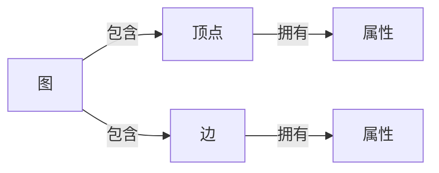

## 1.背景介绍

图计算作为一种独特的数据处理和分析方式，因其在处理复杂网络结构数据方面的优势，已经在社交网络、生物信息学、网络科学等领域取得了广泛的应用。在众多的图计算框架中，GraphX作为Spark生态系统中的一员，凭借其强大的分布式计算能力和灵活的编程模型，成为了图计算领域的重要工具。

## 2.核心概念与联系

GraphX的核心概念包括图(Graph)、顶点(Vertex)、边(Edge)和属性(Property)。顶点和边都可以拥有属性，这些属性可以是任何类型的对象，例如，顶点的属性可以是一个字符串，表示用户的姓名，边的属性可以是一个整数，表示用户之间的关系强度。在GraphX中，图是由顶点和边组成的，顶点和边是通过唯一的长整型ID进行标识的。



## 3.核心算法原理具体操作步骤

GraphX的图计算主要包括三个步骤：图的创建、图的转换和图的计算。

### 3.1 图的创建

图的创建主要包括顶点和边的创建，以及将顶点和边组合成图的过程。在GraphX中，可以通过两种方式创建图，一种是通过已经存在的RDD创建，另一种是通过GraphLoader工具类创建。

### 3.2 图的转换

图的转换主要包括顶点和边的转换，以及整个图的转换。在GraphX中，提供了mapVertices、mapEdges和mapTriplets等方法进行顶点和边的转换，提供了reverse、subgraph和mask等方法进行整个图的转换。

### 3.3 图的计算

图的计算主要包括顶点和边的计算，以及整个图的计算。在GraphX中，提供了pregel算法进行图的计算，pregel算法是一种迭代的图计算算法，每一轮迭代都会更新顶点的属性。

## 4.数学模型和公式详细讲解举例说明

GraphX的图计算基于图的邻接矩阵表示。对于一个图$G=(V,E)$，其中$V$是顶点集，$E$是边集，邻接矩阵$A$的定义如下：

$$
A_{ij} = 
\begin{cases} 
1, & \text{如果存在从顶点$i$到顶点$j$的边} \\
0, & \text{其他情况}
\end{cases}
$$

在GraphX中，图的计算主要基于邻接矩阵的乘法。例如，pregel算法的一轮迭代可以表示为邻接矩阵和顶点属性向量的乘法：

$$
V' = A \times V
$$

其中，$V'$是更新后的顶点属性向量，$A$是邻接矩阵，$V$是原始的顶点属性向量。

## 5.项目实践：代码实例和详细解释说明

下面是一个使用GraphX进行图计算的简单例子，该例子计算了一个社交网络中每个用户的朋友数量。

```scala
import org.apache.spark._
import org.apache.spark.graphx._

// 创建SparkContext
val conf = new SparkConf().setAppName("GraphXExample")
val sc = new SparkContext(conf)

// 创建顶点RDD
val users = sc.parallelize(Array((1L, "Alice"), (2L, "Bob"), (3L, "Charlie"), (4L, "David")))

// 创建边RDD
val relationships = sc.parallelize(Array(Edge(1L, 2L, "friend"), Edge(2L, 3L, "follow"), Edge(3L, 4L, "friend"), Edge(4L, 1L, "follow")))

// 创建图
val graph = Graph(users, relationships)

// 计算每个用户的朋友数量
val numFriends = graph.edges.filter(e => e.attr == "friend").groupBy(_.srcId).mapValues(_.size)

// 输出结果
numFriends.collect().foreach(println)
```

## 6.实际应用场景

GraphX在许多实际应用场景中都发挥了重要的作用。例如，在社交网络分析中，可以使用GraphX计算用户的PageRank值，以评估用户的影响力；在生物信息学中，可以使用GraphX构建基因网络，以研究基因之间的相互作用；在网络科学中，可以使用GraphX进行网络的社区发现，以研究网络的结构特性。

## 7.工具和资源推荐

- [Spark官方文档](https://spark.apache.org/docs/latest/graphx-programming-guide.html)：提供了详细的GraphX编程指南。
- [GraphX源代码](https://github.com/apache/spark/tree/master/graphx)：可以在GitHub上查看GraphX的源代码。
- [GraphFrames](https://graphframes.github.io/)：一个基于DataFrame的图计算库，提供了更高级的查询和分析功能。

## 8.总结：未来发展趋势与挑战

随着图数据的规模和复杂性的增加，图计算面临着许多挑战，例如，如何有效地处理大规模图数据，如何在保证计算精度的同时提高计算效率，如何设计更加灵活和通用的图计算算法。同时，图计算也有着广阔的发展前景，例如，结合机器学习进行图挖掘，利用图神经网络进行图嵌入，利用知识图谱进行智能推荐。

## 9.附录：常见问题与解答

1. **问题：GraphX支持哪些图计算算法？**
   答：GraphX内置了PageRank、ConnectedComponents和TriangleCounting等常用的图计算算法，同时，用户也可以通过Pregel接口实现自定义的图计算算法。

2. **问题：GraphX如何处理大规模图数据？**
   答：GraphX通过将图数据分布在多个计算节点上，并利用Spark的强大的分布式计算能力，可以有效地处理大规模图数据。

作者：禅与计算机程序设计艺术 / Zen and the Art of Computer Programming