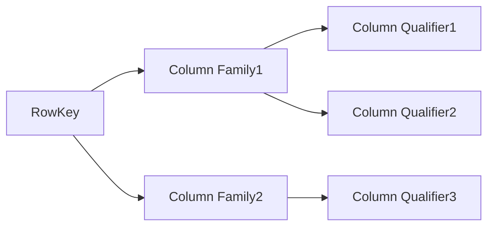
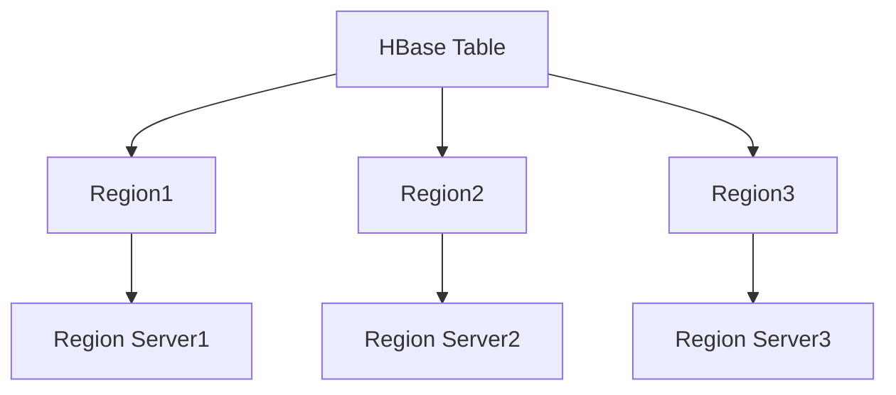

# HBase原理与代码实例讲解

## 1. 背景介绍
### 1.1 大数据时代的数据存储挑战
在当今大数据时代,海量数据的存储和处理已成为各行各业面临的重大挑战。传统的关系型数据库在面对TB、PB级别的数据时,在扩展性、性能和成本方面都难以满足需求。NoSQL数据库应运而生,其中HBase作为一款高可靠、高性能、面向列的分布式数据库,在大数据领域得到了广泛应用。

### 1.2 HBase的诞生与发展历程
HBase起源于Google发表的BigTable论文,是一个开源的、分布式的、版本化的、面向列的数据库。它最初由Powerset公司的Mike Cafarella开发,后来成为Apache Hadoop生态系统的重要组成部分。多年来,HBase在架构设计和性能优化方面不断演进,成为大数据存储领域的佼佼者。

### 1.3 HBase在行业中的应用现状
HBase凭借其优秀的性能表现和可扩展性,在众多互联网公司和传统行业中得到了广泛应用。典型的应用场景包括:
- 社交网络:存储用户信息、社交关系、消息等
- 金融领域:存储交易记录、用户行为等
- 物联网:存储设备数据、日志等
- 广告推荐:存储用户画像、广告点击数据等

可以说,HBase已经成为大数据时代不可或缺的基础设施之一。

## 2. 核心概念与联系
### 2.1 RowKey、Column Family和Column Qualifier
HBase中的每一行数据都由一个RowKey唯一标识。数据在HBase中按照RowKey的字典序排列。

Column Family是HBase表中的一级索引,一个HBase表可以有多个Column Family。每个Column Family可以包含任意数量的Column Qualifier。

Column Qualifier是HBase表中的二级索引,它属于某个特定的Column Family,可以动态增加。



### 2.2 Timestamp和版本
HBase中的每个Cell都包含一个Timestamp,用于标识数据的版本。默认情况下,HBase会保留数据的多个版本,版本数量可以通过配置参数控制。当读取数据时,可以指定要读取的版本数量或时间戳范围。

### 2.3 Region和Region Server
为了实现数据的分布式存储,HBase引入了Region的概念。一个HBase表会被划分成多个Region,每个Region负责存储一定范围内的数据。Region是HBase自动分割和合并的基本单位。

Region Server是HBase集群中的工作节点,负责管理和维护分配给它的Region。Region Server通过Zookeeper进行协调和通信。



### 2.4 Write Ahead Log和MemStore
为了保证数据的持久性和一致性,HBase采用了Write Ahead Log(WAL)机制。所有的写操作在提交之前,都会先写入WAL,然后才会写入内存中的MemStore。这样即使发生宕机,也能通过WAL恢复数据。

MemStore是Region Server中的一块内存缓冲区,用于存储尚未写入磁盘的数据。当MemStore的大小达到一定阈值时,会触发Flush操作,将数据写入磁盘的HFile文件中。

## 3. 核心算法原理具体操作步骤
### 3.1 读写数据流程
#### 3.1.1 写数据流程
1. Client向HBase集群发起写请求
2. Zookeeper将请求路由到对应的Region Server 
3. Region Server将数据写入WAL
4. Region Server将数据写入MemStore
5. 当MemStore达到阈值,触发Flush操作,将数据写入HFile

#### 3.1.2 读数据流程 
1. Client向HBase集群发起读请求
2. Zookeeper将请求路由到对应的Region Server
3. Region Server先在MemStore中查找数据
4. 如果MemStore中没有,则在BlockCache中查找
5. 如果BlockCache中也没有,则从HFile中读取数据

### 3.2 Region分裂与合并
#### 3.2.1 Region分裂
1. 当Region的大小超过阈值(默认10GB)时,触发分裂操作  
2. Region Server将Region一分为二,分裂点通常选择RowKey的中间值
3. 将原Region下线,新分裂出的两个Region上线
4. 更新Meta表,记录新Region的信息

#### 3.2.2 Region合并
1. 当Region的大小小于阈值(默认20MB)时,触发合并操作
2. Region Server将相邻的两个Region合并为一个
3. 将原来的两个Region下线,新合并的Region上线
4. 更新Meta表,删除原来的Region信息

### 3.3 Compaction机制
Compaction是HBase中非常重要的一个操作,用于合并和清理HFile文件,减少文件数量,提高读写效率。

#### 3.3.1 Minor Compaction
1. 当HFile文件数量超过一定阈值时,触发Minor Compaction
2. 将多个小的HFile合并成一个大的HFile
3. 清理掉过期和删除的数据
4. Minor Compaction可以在线进行,不会阻塞读写操作

#### 3.3.2 Major Compaction
1. 当HFile文件数量进一步增加,触发Major Compaction
2. 将所有的HFile合并成一个HFile
3. 清理所有过期和删除的数据,并对数据进行排序
4. Major Compaction非常耗时,通常在业务低峰期进行

## 4. 数学模型和公式详细讲解举例说明
### 4.1 Bloom Filter概率模型
HBase使用Bloom Filter来优化读性能,避免不必要的磁盘I/O。Bloom Filter是一种概率数据结构,它可以快速判断一个元素是否在集合中。但是它有一定的误判率,即可能将不在集合中的元素判断为在集合中。

假设Bloom Filter的长度为 $m$,插入的元素个数为 $n$,使用的哈希函数个数为 $k$。那么,某个元素被误判的概率为:

$P = (1 - e^{-kn/m})^k$

举例说明,假设 $m=1000$, $n=100$, $k=5$,则误判率约为:

$P = (1 - e^{-5*100/1000})^5 \approx 0.0204$

即大约有2%的概率将不在集合中的元素判断为在集合中。

### 4.2 Compact策略的数学模型
HBase中的Compact策略通常基于文件大小和文件数量来触发。例如,可以设置以下参数:

- `hbase.hstore.compaction.min`: Minor Compaction的最小文件数量,默认为3
- `hbase.hstore.compaction.max`: Minor Compaction的最大文件数量,默认为10
- `hbase.hstore.compaction.min.size`: Minor Compaction的最小文件大小,默认为128MB
- `hbase.hstore.compactionThreshold`: Major Compaction的文件数量阈值,默认为3

假设某个Region中有 $n$ 个HFile,它们的大小分别为 $s_1, s_2, ..., s_n$。如果满足以下条件,就会触发Minor Compaction:

$n \ge hbase.hstore.compaction.min \quad and \quad n \le hbase.hstore.compaction.max \quad and \quad \sum_{i=1}^{n} s_i \ge hbase.hstore.compaction.min.size$

如果满足以下条件,就会触发Major Compaction:

$n \ge hbase.hstore.compactionThreshold$

通过调整这些参数,可以控制Compaction的频率和强度,从而在读写性能和资源消耗之间取得平衡。

## 5. 项目实践：代码实例和详细解释说明
下面通过一个简单的Java代码实例,演示如何使用HBase进行数据的增删改查操作。

### 5.1 连接HBase集群

```java
Configuration config = HBaseConfiguration.create();
config.set("hbase.zookeeper.quorum", "localhost");  // 设置Zookeeper地址
config.set("hbase.zookeeper.property.clientPort", "2181");  // 设置Zookeeper端口
Connection connection = ConnectionFactory.createConnection(config);
```

首先创建一个`Configuration`对象,设置Zookeeper的地址和端口,然后通过`ConnectionFactory`创建一个`Connection`对象,用于与HBase集群建立连接。

### 5.2 创建表

```java
Admin admin = connection.getAdmin();
HTableDescriptor tableDesc = new HTableDescriptor(TableName.valueOf("test_table"));
tableDesc.addFamily(new HColumnDescriptor("cf1"));
tableDesc.addFamily(new HColumnDescriptor("cf2"));
admin.createTable(tableDesc);
```

通过`Connection`对象获取一个`Admin`对象,用于执行管理操作。然后创建一个`HTableDescriptor`对象,设置表名为`test_table`,并添加两个Column Family:`cf1`和`cf2`。最后调用`createTable`方法创建表。

### 5.3 插入数据

```java
Table table = connection.getTable(TableName.valueOf("test_table"));
Put put = new Put(Bytes.toBytes("row1"));
put.addColumn(Bytes.toBytes("cf1"), Bytes.toBytes("qual1"), Bytes.toBytes("value1"));
put.addColumn(Bytes.toBytes("cf2"), Bytes.toBytes("qual2"), Bytes.toBytes("value2"));
table.put(put);
```

通过`Connection`对象获取一个`Table`对象,用于执行数据操作。然后创建一个`Put`对象,设置RowKey为`row1`,并添加两个Cell:
- RowKey: `row1`
- Column Family: `cf1`, Column Qualifier: `qual1`, Value: `value1`
- Column Family: `cf2`, Column Qualifier: `qual2`, Value: `value2`

最后调用`put`方法插入数据。

### 5.4 读取数据

```java
Table table = connection.getTable(TableName.valueOf("test_table"));
Get get = new Get(Bytes.toBytes("row1"));
Result result = table.get(get);
byte[] value1 = result.getValue(Bytes.toBytes("cf1"), Bytes.toBytes("qual1"));
byte[] value2 = result.getValue(Bytes.toBytes("cf2"), Bytes.toBytes("qual2"));
System.out.println("Value1: " + Bytes.toString(value1));
System.out.println("Value2: " + Bytes.toString(value2));
```

通过`Connection`对象获取一个`Table`对象。然后创建一个`Get`对象,设置要读取的RowKey为`row1`。调用`get`方法读取数据,返回一个`Result`对象。从`Result`对象中获取指定Column Family和Column Qualifier的值,并打印出来。

### 5.5 删除数据

```java
Table table = connection.getTable(TableName.valueOf("test_table"));
Delete delete = new Delete(Bytes.toBytes("row1"));
delete.addColumn(Bytes.toBytes("cf1"), Bytes.toBytes("qual1"));
table.delete(delete);
```

通过`Connection`对象获取一个`Table`对象。然后创建一个`Delete`对象,设置要删除的RowKey为`row1`,并指定要删除的Column Family和Column Qualifier。最后调用`delete`方法删除数据。

### 5.6 扫描表

```java
Table table = connection.getTable(TableName.valueOf("test_table"));
Scan scan = new Scan();
scan.withStartRow(Bytes.toBytes("row1"));
scan.withStopRow(Bytes.toBytes("row2"));
ResultScanner scanner = table.getScanner(scan);
for (Result result : scanner) {
    System.out.println("Row: " + Bytes.toString(result.getRow()));
    for (Cell cell : result.rawCells()) {
        System.out.println("Column Family: " + Bytes.toString(CellUtil.cloneFamily(cell)));
        System.out.println("Column Qualifier: " + Bytes.toString(CellUtil.cloneQualifier(cell)));
        System.out.println("Value: " + Bytes.toString(CellUtil.cloneValue(cell)));
    }
}
```

通过`Connection`对象获取一个`Table`对象。然后创建一个`Scan`对象,设置扫描的起始RowKey为`row1`,结束RowKey为`row2`。调用`getScanner`方法获取一个`ResultScanner`对象,用于遍历扫描结果。遍历`ResultScanner`,打印每一行的RowKey、Column Family、Column Qualifier和Value。

## 6. 实际应用场景
HBase在实际生产环境中有着广泛的应用,下面列举几个典型的应用场景。

### 6.1 社交网络
社交网络中的用户数据、社交关系、消息等数据量都非常大,且增长迅速。HBase可以很好地满足这种场景的需求:
- 将用户ID作为RowKey,将用户属性(如昵称、头像等)作为不