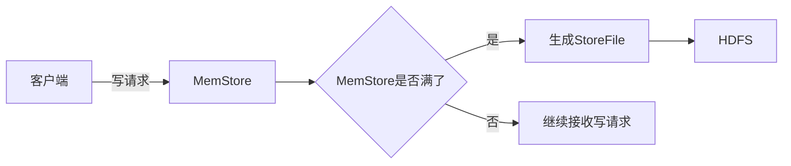

## 1.背景介绍

HBase是Apache Software Foundation的一个开源项目，是一个高可靠、高性能、面向列、可伸缩的分布式存储系统，利用HBase技术可以在廉价PC Server上搭建起大规模结构化存储集群。在本篇文章中，我们将深入探讨HBase的两个核心组件：MemStore和StoreFile。

## 2.核心概念与联系

在HBase中，表被划分为许多区域（Region），每个区域包含表中的一部分行，并且这些行在所有区域中是有序的。每个区域又被分为多个列族（Column Family），每个列族内部包含一组列。HBase通过MemStore和StoreFile来管理和存储这些数据。

- **MemStore**：MemStore是HBase的写缓存，所有对HBase的写操作都首先写入MemStore。当MemStore达到一定大小后，就会将数据刷新到硬盘，生成一个StoreFile。

- **StoreFile**：StoreFile是HBase的持久化存储文件，它存储在Hadoop的分布式文件系统HDFS上。StoreFile是不可变的，一旦被写入就不能修改。每个StoreFile对应一个HFile，HFile是HBase的数据存储格式。

MemStore和StoreFile的关系可以用下面的Mermaid流程图进行表示：



## 3.核心算法原理具体操作步骤

### 3.1 MemStore的写操作

当客户端发起写请求时，HBase首先将数据写入MemStore。MemStore内部使用一个有序的Map结构来存储数据，Key是由行键、列族、列修饰符、时间戳组成，Value是列的值。写操作的步骤如下：

1. 接收到客户端的写请求。
2. 在MemStore中查找对应的Key，如果找到则更新Value，否则插入新的键值对。
3. 如果MemStore的大小超过阈值，则触发刷新操作。

### 3.2 MemStore的刷新操作

当MemStore满了之后，HBase会将MemStore中的数据刷新到硬盘，生成一个新的StoreFile。刷新操作的步骤如下：

1. 将MemStore中的数据写入一个新的HFile。
2. 将新的HFile添加到StoreFile列表中。
3. 清空MemStore。

### 3.3 StoreFile的读操作

当客户端发起读请求时，HBase会从MemStore和StoreFile中查找数据。因为MemStore中存储的是最新的数据，所以首先在MemStore中查找，如果没有找到，再在StoreFile中查找。读操作的步骤如下：

1. 接收到客户端的读请求。
2. 在MemStore中查找数据，如果找到则返回，否则进入下一步。
3. 在StoreFile中查找数据，如果找到则返回，否则返回空。

## 4.数学模型和公式详细讲解举例说明

在理解MemStore和StoreFile的工作原理时，我们可以使用一些简单的数学模型和公式。例如，我们可以用下面的公式来计算MemStore满时的写延迟：

$$
T_{write} = \frac{S_{memstore}}{R_{write}} + \frac{S_{memstore}}{R_{flush}}
$$

其中，$T_{write}$是写延迟，$S_{memstore}$是MemStore的大小，$R_{write}$是写入速率，$R_{flush}$是刷新速率。

我们也可以用下面的公式来计算读请求的平均延迟：

$$
T_{read} = \frac{N_{memstore}*T_{memstore} + N_{storefile}*T_{storefile}}{N_{memstore} + N_{storefile}}
$$

其中，$T_{read}$是读延迟，$N_{memstore}$和$N_{storefile}$分别是在MemStore和StoreFile中查找的次数，$T_{memstore}$和$T_{storefile}$分别是在MemStore和StoreFile中查找的时间。

## 5.项目实践：代码实例和详细解释说明

在HBase的源码中，我们可以找到MemStore和StoreFile的具体实现。下面是一些相关的代码片段和解释：

### 5.1 MemStore的写操作

```java
public void put(KeyValue kv) {
    this.map.put(kv, kv);
    this.size.add(kv.heapSize());
}
```

这段代码是MemStore的put方法，它将一个KeyValue对象添加到内部的Map中，并更新MemStore的大小。

### 5.2 MemStore的刷新操作

```java
public StoreFile flush() {
    StoreFile sf = this.fs.createStoreFile(this.map.getSortedMap());
    this.map.clear();
    this.size.set(0);
    return sf;
}
```

这段代码是MemStore的flush方法，它将内部的Map写入一个新的StoreFile，然后清空Map和重置大小。

### 5.3 StoreFile的读操作

```java
public KeyValue get(KeyValue kv) {
    return this.fileScanner.seek(kv);
}
```

这段代码是StoreFile的get方法，它在StoreFile中查找一个KeyValue对象。

## 6.实际应用场景

HBase被广泛应用于大数据处理和实时数据访问等场景，例如：

- **搜索引擎**：搜索引擎需要处理海量的网页数据，HBase提供了高效的随机读写能力，非常适合作为搜索引擎的存储系统。

- **实时分析**：许多实时分析系统需要在短时间内处理大量数据，HBase的高性能和可扩展性使得它成为实时分析的理想选择。

- **日志处理**：HBase可以用于存储和查询大量的日志数据，例如用户行为日志、系统运行日志等。

## 7.工具和资源推荐

如果你想深入学习和使用HBase，以下是一些推荐的工具和资源：

- **HBase官方网站**：你可以在[HBase官方网站](https://hbase.apache.org/)找到最新的HBase版本、文档和教程。

- **HBase源码**：你可以在[Apache的Github仓库](https://github.com/apache/hbase)找到HBase的源码，通过阅读源码可以更深入地理解HBase的工作原理。

- **HBase书籍**：《HBase权威指南》是一本详细介绍HBase的书籍，包括HBase的架构、API、性能优化等内容。

## 8.总结：未来发展趋势与挑战

随着大数据技术的发展，HBase面临着更大的挑战和机遇。一方面，数据量的持续增长对HBase的性能和可扩展性提出了更高的要求；另一方面，新的技术如AI和区块链等对实时、高效的数据处理有着强烈的需求，这为HBase提供了新的应用场景。未来，HBase需要在保持高性能和可扩展性的同时，不断提高易用性和稳定性，满足更多场景的需求。

## 9.附录：常见问题与解答

1. **Q：HBase的写操作为什么首先写入MemStore？**

   A：写入MemStore是为了提高写操作的性能。因为MemStore是在内存中的，写入速度远快于直接写入硬盘。当MemStore满了后再一次性写入硬盘，可以减少磁盘IO，提高写性能。

2. **Q：HBase如何处理大量的写请求？**

   A：当写请求量很大时，HBase会使用多个MemStore来缓存写请求，每个MemStore对应一个写线程。当一个MemStore满了后，可以刷新到硬盘，而其他的MemStore可以继续接收写请求。这样可以提高写性能，避免因为一个MemStore的刷新而阻塞所有的写请求。

3. **Q：HBase如何保证数据的一致性？**

   A：HBase使用了一种叫做MVCC（多版本并发控制）的机制来保证数据的一致性。每个数据项都有一个版本号，读请求只能读取到小于等于自己版本号的数据，写请求则生成一个新的数据版本。这样可以保证在并发读写的情况下，数据的一致性不会被破坏。

作者：禅与计算机程序设计艺术 / Zen and the Art of Computer Programming