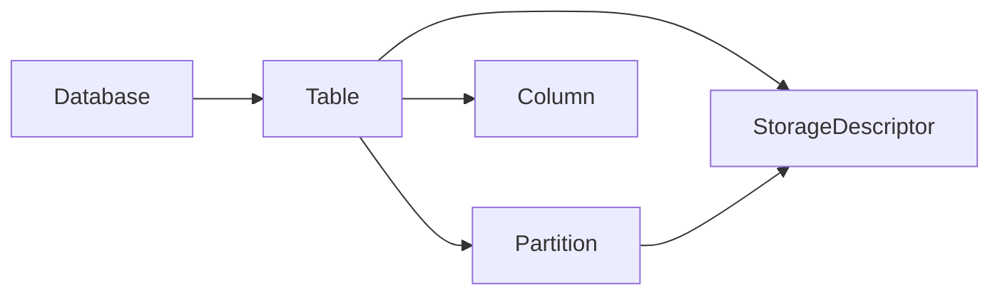

# HCatalog中的元数据管理：全面解析

## 1. 背景介绍

### 1.1 大数据时代的元数据管理挑战

在大数据时代,企业面临着海量、多样化的数据,这些数据分散在不同的系统和存储中。如何有效地管理和利用这些数据,成为企业面临的重大挑战。元数据管理在其中扮演着至关重要的角色。

### 1.2 元数据管理的重要性

元数据是描述数据的数据,它包含了数据的结构、来源、格式、访问方式等关键信息。有效的元数据管理可以帮助企业:

- 提高数据可发现性和可访问性
- 确保数据的一致性和准确性  
- 促进数据共享和重用
- 支持数据治理和合规性要求

### 1.3 HCatalog的引入

Apache HCatalog是一个元数据和表管理服务,它构建在Apache Hadoop之上,旨在简化Hadoop生态系统中的数据共享和互操作。HCatalog提供了一个统一的元数据管理平台,使不同的工具和应用能够轻松地发现、访问和处理Hadoop上的数据。

## 2. 核心概念与关联

### 2.1 HCatalog的架构

HCatalog主要由以下组件构成:

- **HCatalog Server**: 提供REST API接口,用于管理元数据。
- **HCatalog CLI**: 命令行工具,用于与HCatalog Server交互。  
- **WebHCat**: HCatalog的Web服务接口,支持HTTP协议。
- **HCatalog Core**: HCatalog的核心库,提供了元数据管理的基础功能。

### 2.2 表(Table)

在HCatalog中,表是数据存储的基本单位。一个表包含行(Row)和列(Column),类似于关系型数据库中的表。HCatalog支持多种数据格式,如TextFile、SequenceFile、RCFile、ORC等。

### 2.3 分区(Partition)  

HCatalog引入了分区的概念,可以在表中定义一个或多个分区键。这使得数据可以按照分区键进行组织和优化存储,提高查询性能。例如,可以按天期对数据进行分区。

### 2.4 存储描述符(Storage Descriptor)

存储描述符定义了表或分区的物理存储信息,包括数据格式、压缩编码、存储路径等。通过存储描述符,HCatalog可以支持多种底层存储系统,如HDFS、HBase等。

## 3. 核心功能与操作步骤

### 3.1 表管理

#### 3.1.1 创建表

使用HCatalog CLI或API创建表,需要指定表名、列定义、数据格式等信息。例如:

```sql
CREATE TABLE mytable (id INT, name STRING, age INT) 
STORED AS ORC;
```

#### 3.1.2 修改表

可以修改表的属性,如添加/删除/修改列、更改存储格式等。例如:

```sql  
ALTER TABLE mytable ADD COLUMNS (email STRING);
```

#### 3.1.3 删除表

删除表会移除元数据和底层数据文件。例如:

```sql
DROP TABLE mytable;  
```

### 3.2 分区管理

#### 3.2.1 创建分区表

在创建表时,可以定义一个或多个分区键。例如:

```sql
CREATE TABLE mytable (id INT, name STRING, age INT)
PARTITIONED BY (dt STRING)
STORED AS ORC;  
```

#### 3.2.2 添加/删除分区

可以动态地添加或删除分区。添加分区时,需要指定分区键值。例如:

```sql
ALTER TABLE mytable ADD PARTITION (dt='2022-01-01');

ALTER TABLE mytable DROP PARTITION (dt='2022-01-01');
```

#### 3.2.3 修改分区

与修改表类似,可以修改分区的属性。例如:

```sql
ALTER TABLE mytable PARTITION (dt='2022-01-01')
SET FILEFORMAT=TEXTFILE; 
```

### 3.3 数据操作

#### 3.3.1 加载数据

可以使用Hive、Pig、MapReduce等工具将数据加载到HCatalog表中。例如,使用Hive:

```sql
LOAD DATA INPATH '/user/data/input/' 
INTO TABLE mytable PARTITION (dt='2022-01-01');
```

#### 3.3.2 查询数据  

HCatalog与Hive元数据兼容,因此可以使用HiveQL进行数据查询。例如:

```sql
SELECT * FROM mytable 
WHERE dt='2022-01-01' AND age > 30;
```

#### 3.3.3 导出数据

可以使用Hive、Pig等工具从HCatalog表中导出数据。例如,使用Hive:  

```sql
INSERT OVERWRITE DIRECTORY '/user/data/output/'
SELECT * FROM mytable WHERE dt='2022-01-01';  
```

## 4. HCatalog元数据模型

### 4.1 元数据对象

HCatalog使用对象模型来表示元数据,主要包括:

- Database: 数据库,表的容器。
- Table: 表,数据存储的基本单位。
- Partition: 分区,表的子集。 
- Column: 列,表的字段。
- StorageDescriptor: 存储描述符,定义物理存储。

### 4.2 元数据对象关系

下图展示了HCatalog中元数据对象之间的关系:



- 一个Database包含多个Table。
- 一个Table包含多个Partition、Column和一个StorageDescriptor。
- 一个Partition对应一个StorageDescriptor,定义了该分区的物理存储。

## 5. HCatalog API实践

### 5.1 Java API示例

使用HCatalog Java API可以方便地管理元数据。以下是一些示例代码:

#### 5.1.1 创建表

```java
String tableName = "mytable";
List<FieldSchema> cols = new ArrayList<FieldSchema>();
cols.add(new FieldSchema("id", "int", ""));
cols.add(new FieldSchema("name", "string", ""));

List<FieldSchema> partCols = new ArrayList<FieldSchema>();
partCols.add(new FieldSchema("dt", "string", ""));

StorageDescriptor sd = new StorageDescriptor();
sd.setSerdeInfo(new SerDeInfo());
sd.getSerdeInfo().setName(tableName);
sd.getSerdeInfo().setParameters(new HashMap<String, String>());
sd.setInputFormat(OrcInputFormat.class.getName());
sd.setOutputFormat(OrcOutputFormat.class.getName());

Table tbl = new Table();
tbl.setDbName("default");
tbl.setTableName(tableName);
tbl.setSd(sd);
tbl.setPartitionKeys(partCols);

client.createTable(tbl);
```

#### 5.1.2 添加分区

```java
String tableName = "mytable";
String partitionName = "dt=2022-01-01";

List<String> values = new ArrayList<String>();
values.add("2022-01-01");

Partition partition = new Partition();
partition.setDbName("default");
partition.setTableName(tableName);
partition.setValues(values);

client.add_partition(partition);
```

### 5.2 HCatalog CLI示例

HCatalog提供了命令行工具,可以直接执行DDL和DML操作。例如:

#### 5.2.1 创建表

```bash
hcat -e "CREATE TABLE mytable (id INT, name STRING) STORED AS ORC"
```

#### 5.2.2 添加分区

```bash  
hcat -e "ALTER TABLE mytable ADD PARTITION (dt='2022-01-01')"
```

## 6. HCatalog应用场景

### 6.1 数据仓库

HCatalog可以作为Hadoop数据仓库的元数据管理服务,为Hive、Impala等查询引擎提供统一的元数据视图。这简化了不同工具之间的数据共享和交互。

### 6.2 数据集成

HCatalog提供了REST API,可以与外部系统集成。例如,可以使用HCatalog将RDBMS中的数据导入到Hadoop,或将Hadoop处理结果导出到RDBMS。

### 6.3 数据治理

HCatalog提供了元数据的版本管理和审计功能,可以追踪元数据的变更历史。这有助于实现数据治理,确保元数据的一致性和可追溯性。

## 7. HCatalog生态工具

### 7.1 Apache Hive

Hive是基于Hadoop的数据仓库工具,HCatalog与Hive元数据完全兼容。Hive可以直接访问HCatalog管理的表。

### 7.2 Apache Pig

Pig是一种大规模数据处理平台,HCatalog为Pig提供了读写数据的接口。Pig可以使用HCatLoader和HCatStorer与HCatalog集成。

### 7.3 Apache Oozie 

Oozie是Hadoop的工作流调度系统,HCatalog为Oozie提供了数据依赖管理功能。Oozie可以使用HCatalog URI来指定数据依赖。

## 8. 总结与展望

### 8.1 HCatalog的价值

HCatalog为Hadoop生态系统提供了统一的元数据管理服务,简化了不同工具之间的数据共享和互操作。它提高了数据的可发现性和可访问性,促进了数据的重用和集成。

### 8.2 未来发展方向

随着Hadoop生态系统的不断发展,HCatalog也在持续演进:

- 与新兴计算框架(如Spark、Flink)的集成。
- 支持更多的数据源和数据格式。
- 增强数据安全和权限管理。
- 提供更丰富的元数据管理功能,如数据血缘、影响分析等。

### 8.3 挑战与机遇

元数据管理在大数据时代面临着新的挑战,如元数据的规模、多样性、实时性等。同时,元数据管理也带来了新的机遇,如数据资产化、数据智能化等。HCatalog将在其中扮演重要角色。

## 9. 附录

### 9.1 HCatalog常见问题

#### 9.1.1 HCatalog与Hive Metastore的区别?

HCatalog是构建在Hive Metastore之上的一个抽象层,提供了更通用的元数据接口。Hive Metastore主要服务于Hive,而HCatalog可以为Pig、MapReduce等多种计算框架提供元数据服务。

#### 9.1.2 HCatalog是否支持事务?

HCatalog本身不提供事务支持,但它与Hive事务表(ACID表)兼容。可以在HCatalog中创建和管理Hive事务表。

#### 9.1.3 HCatalog是否支持实时数据?

HCatalog主要用于管理批处理数据,对实时数据的支持有限。如果需要处理实时数据,可以考虑使用HBase、Kudu等专门的实时数据存储系统。

### 9.2 更多资源

- HCatalog官方文档: https://cwiki.apache.org/confluence/display/Hive/HCatalog
- HCatalog Github仓库: https://github.com/apache/hive/tree/master/hcatalog
- Hive官方网站: https://hive.apache.org/
- Hadoop官方网站: https://hadoop.apache.org/

作者：禅与计算机程序设计艺术 / Zen and the Art of Computer Programming