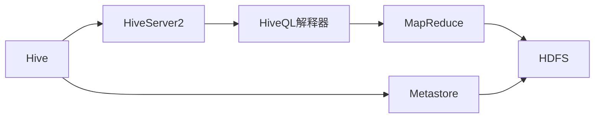

# Hive原理与代码实例讲解

## 1. 背景介绍

### 1.1 大数据处理的挑战
在当今大数据时代,企业每天都会产生海量的数据。如何高效地存储、处理和分析这些海量数据,已经成为企业面临的重大挑战。传统的关系型数据库已经无法满足大数据处理的需求,因此,大数据技术应运而生。

### 1.2 Hadoop生态系统
Hadoop是目前最流行的大数据处理平台之一。它由HDFS(Hadoop Distributed File System)和MapReduce两大核心组件组成。HDFS提供了可靠的分布式存储,而MapReduce则提供了并行计算框架。围绕Hadoop,形成了一个庞大的生态系统,包括Hive、Pig、HBase、Spark等各种工具和框架。

### 1.3 Hive的诞生
Hive最初由Facebook开发,后来成为Apache的顶级开源项目。它为Hadoop提供了一种类SQL的查询语言HiveQL,使得开发人员可以使用类似SQL的语法来查询和分析存储在HDFS中的大规模数据集。Hive将HiveQL查询转换为MapReduce作业,提供了一种更加友好和高效的大数据处理方式。

## 2. 核心概念与联系

### 2.1 Hive架构
Hive的架构主要包括以下几个组件:  
- 用户接口:包括CLI、JDBC/ODBC、WebUI等
- Thrift Server:提供了一种基于Thrift的服务,使得不同语言编写的程序也可以操作Hive 
- 元数据存储:存储Hive的元数据,如数据库、表、分区等信息
- HiveQL解释器:将HiveQL查询转换为MapReduce作业
- 执行引擎:调度MapReduce作业在Hadoop集群上执行

### 2.2 Hive与Hadoop的关系
Hive是构建在Hadoop之上的数据仓库工具。它依赖于HDFS进行数据存储,依赖于MapReduce进行查询执行。同时,Hive也为其他Hadoop生态系统工具如Pig、Spark提供了数据支持。

### 2.3 HiveQL与SQL的异同
HiveQL是Hive提供的类SQL查询语言。它支持大多数标准SQL语法,如SELECT、JOIN、GROUP BY、ORDER BY等。但是,由于Hive是为海量数据设计的,因此也有一些自己的特点:
- HiveQL支持自定义函数(UDF)和自定义聚合函数(UDAF)
- 不支持行级别的增删改操作,只支持覆盖重写整个表
- 不支持事务和索引

### 2.4 Hive数据模型
Hive使用表来组织数据,每个表对应HDFS上的一个目录。表可以分为内部表和外部表两种类型:
- 内部表:删除表时,表数据和元数据一起删除
- 外部表:删除表时,只删除元数据,表数据还在HDFS上

表可以进一步组织成分区,每个分区对应表目录下的一个子目录。分区可以提高查询效率。

Hive还支持分桶表,可以将表数据按照某列属性值哈希到不同的桶中存储,加快抽样查询。

下图展示了Hive的核心概念之间的关系:



## 3. 核心算法原理具体操作步骤

Hive最核心的功能是将HiveQL查询转换为MapReduce作业。这个过程主要分为以下几个步骤:

### 3.1 语法解析
Hive使用Antlr对输入的HiveQL进行词法和语法分析,生成抽象语法树AST。

### 3.2 语义分析
在AST上进行语义分析,如表是否存在,字段是否存在等。

### 3.3 逻辑计划生成
将AST转换为逻辑执行计划。逻辑计划由一系列操作符(Operator)组成,主要包括:
- TableScanOperator:从表中读取数据 
- SelectOperator:选取列
- FilterOperator:过滤数据
- JoinOperator:连接多个表
- GroupByOperator:分组聚合
- ReduceSinkOperator:将数据按key分发给Reducer

### 3.4 物理计划生成  
将逻辑计划转换为物理计划,即MapReduce任务。Hive会对逻辑计划进行优化,如谓词下推、分区裁剪等。

### 3.5 任务执行
将优化后的物理计划提交给Hadoop集群执行。执行结果可以保存到HDFS或者直接返回给客户端。

## 4. 数学模型和公式详细讲解举例说明

Hive中用到的主要数学模型是关系代数。每个SQL操作符都对应一个关系代数运算:
- 选择(Selection):对应SQL中的WHERE语句,用$\sigma$表示。例如:

$$
\sigma_{age>18}(Person)
$$

表示选择Person表中age大于18的记录。

- 投影(Projection):对应SQL中的SELECT语句,用$\Pi$表示。例如:  

$$
\Pi_{name,age}(Person) 
$$

表示仅选取Person表的name和age两列。

- 笛卡尔积(Cartesian Product):对应SQL中的JOIN语句,用$\times$表示。例如:

$$
Person \times Order
$$

表示Person表和Order表的笛卡尔积连接。

- 并(Union):对应SQL中的UNION语句,用$\cup$表示。例如:  

$$
Student \cup Teacher
$$

表示Student表和Teacher表的并集。

- 交(Intersection):对应SQL中的INTERSECT语句,用$\cap$表示。例如:

$$
ChineseStudent \cap AmericanStudent  
$$

表示中国学生和美国学生的交集。

- 差(Difference):对应SQL中的EXCEPT语句,用$-$表示。例如:  

$$
Student - Graduate
$$

表示学生表中除去毕业生的记录。

Hive正是利用这些关系代数运算,将SQL查询转换为MapReduce任务。

## 5. 项目实践：代码实例和详细解释说明

下面通过一个具体的代码实例,演示如何使用Hive进行数据分析。

### 5.1 创建表
首先,我们创建一个学生成绩表:

```sql
CREATE TABLE IF NOT EXISTS scores(
    name STRING,
    subject STRING, 
    score INT
)
ROW FORMAT DELIMITED
FIELDS TERMINATED BY '\t';
```

这里我们使用ROW FORMAT DELIMITED指定列分隔符为制表符\t。

### 5.2 加载数据
接着,我们从本地文件scores.txt中加载数据到scores表:

```sql
LOAD DATA LOCAL INPATH '/path/to/scores.txt' OVERWRITE INTO TABLE scores;
```

scores.txt的内容如下:

```
张三    语文    90
张三    数学    80
李四    语文    85
李四    数学    90
李四    英语    95
王五    语文    80
王五    数学    85
王五    英语    90
```

### 5.3 查询分析
现在,我们可以使用HiveQL进行各种查询分析了。

#### 5.3.1 统计每个学生的总分

```sql
SELECT name, SUM(score) AS total_score 
FROM scores
GROUP BY name;
```

输出结果:

```
张三    170
李四    270
王五    255
```

#### 5.3.2 查询每个学生最擅长的科目

```sql
SELECT name, subject, score
FROM (
    SELECT name, subject, score,
        ROW_NUMBER() OVER (PARTITION BY name ORDER BY score DESC) AS rank
    FROM scores
) t
WHERE rank = 1;
```

这里我们使用了窗口函数ROW_NUMBER,按照name分组,score降序排列,为每条记录生成一个组内编号。然后通过子查询取出每组编号为1的记录,即每个学生分数最高的科目。

输出结果:

```
张三    语文    90    
李四    英语    95
王五    英语    90
```

#### 5.3.3 查询每个科目的平均分

```sql
SELECT subject, AVG(score) AS avg_score
FROM scores  
GROUP BY subject;
```

输出结果:

```
语文    85.0
数学    85.0
英语    92.5
```

### 5.4 代码解释
以上代码展示了Hive的基本用法,包括:
- 创建表:使用CREATE TABLE语句创建表,指定列名和数据类型
- 加载数据:使用LOAD DATA语句从本地或HDFS加载数据到表中 
- 查询分析:使用SELECT语句进行查询,支持GROUP BY、ORDER BY、JOIN等各种语法
- 使用内置函数:如SUM、AVG等聚合函数,ROW_NUMBER等窗口函数

通过Hive,我们可以用类SQL的语法方便地操作和分析海量数据。

## 6. 实际应用场景

Hive在各行各业都有广泛应用,下面列举几个典型场景。

### 6.1 日志分析
互联网公司每天会产生海量的用户行为日志,如网页浏览、广告点击等。将这些日志导入Hive中,可以进行用户行为分析、流量统计等。

### 6.2 用户特征提取
电商网站、社交网络等拥有海量用户数据。使用Hive可以对用户的基本属性、消费记录、社交关系等进行分析,构建用户画像,进而开展个性化推荐等服务。

### 6.3 海量数据ETL
Hive可以作为一个ETL(Extract-Transform-Load)工具,将原始数据经过清洗、转换、汇总,最终导入数据仓库或数据集市,供后续数据挖掘和商业智能分析使用。

## 7. 工具和资源推荐

### 7.1 Hive官方文档
Hive的官方网站 https://hive.apache.org/ 提供了详尽的用户和开发文档,是学习和使用Hive的权威资料。

### 7.2 HUE
HUE(Hadoop User Experience)是一个开源的Hadoop UI系统,它提供了友好的Web界面,可以在浏览器中进行Hive数据查询、作业提交等操作,降低了使用门槛。

### 7.3 Hive on Spark
Hive on Spark是一个将Hive的执行引擎从MapReduce替换为Spark的项目。Spark基于内存计算,可以大幅提高Hive查询的性能。

### 7.4 《Programming Hive》
本书由Hive的核心开发人员编写,系统讲解了Hive的架构、原理和使用方法,附有大量代码实例,是Hive学习的经典图书。

## 8. 总结：未来发展趋势与挑战

### 8.1 SQL on Hadoop的融合 
Hive是Hadoop生态圈中SQL on Hadoop的代表项目。但同时还有Impala、Presto、Drill等SQL on Hadoop引擎。未来Hive有望与这些项目进一步整合,实现优势互补。

### 8.2 Hive 3.0
Hive当前的稳定版本是2.3.x,而Hive 3.0也已经进入alpha阶段。Hive 3.0将带来更多新特性,如更完善的SQL支持、更好的性能和可扩展性、更易用的用户接口等。

### 8.3 云原生
云计算已经成为大数据处理的主流方式。Hive未来将更好地融入云原生架构,提供基于Kubernetes和Docker的部署方案,实现弹性伸缩和高可用。

### 8.4 机器学习
Hive不仅可以进行数据ETL和分析,还可以为机器学习提供数据支持。未来Hive将与TensorFlow、PyTorch等机器学习框架进一步整合,让数据科学家可以更方便地进行特征工程和模型训练。

## 9. 附录：常见问题与解答

### 9.1 Hive与关系型数据库的区别是什么?
Hive是基于Hadoop的数据仓库工具,适合离线批处理;而关系型数据库适合在线事务处理(OLTP)。Hive不支持行级别的增删改操作,也不支持完整的SQL语法和索引。

### 9.2 Hive与Spark SQL的区别是什么?
Spark SQL是Spark的一个模块,Hive可以作为Spark SQL的元数据存储。两者的主要区别在于:
- Spark SQL是基于内存的分布式SQL引擎,Hive基于磁盘的MapReduce引擎(Hive on Spark除外)
- Spark SQL支持交互式查询,Hive主要用于批处理
- Spark SQL支持更多数据源,如Parquet、Avro、HBase等

### 9.3 Hive的数据存储格式有哪些?
Hive支持多种数据存储格式,主要